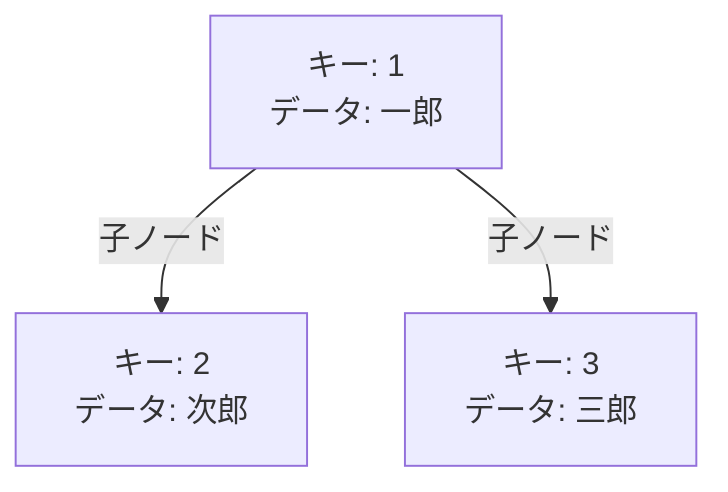
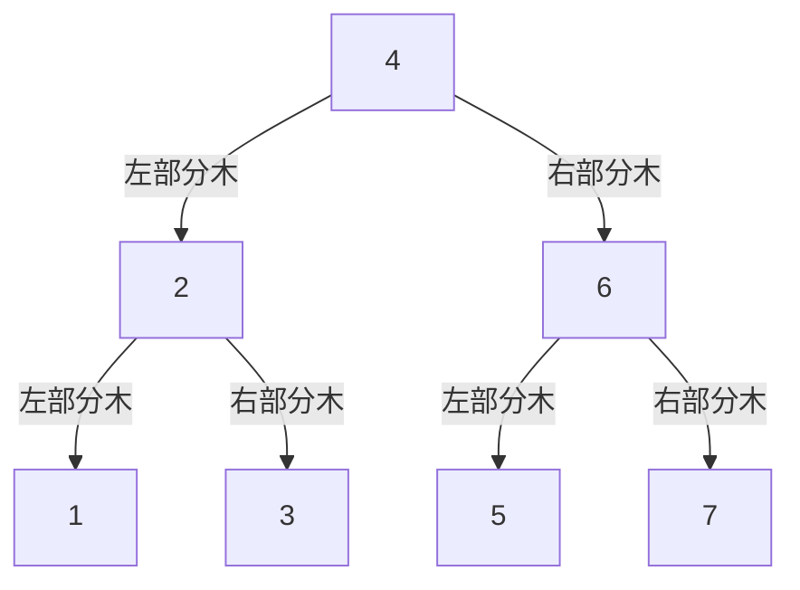
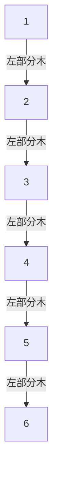
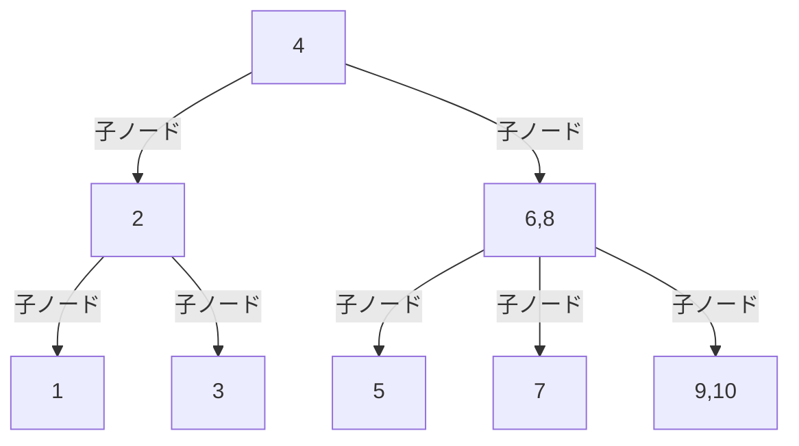
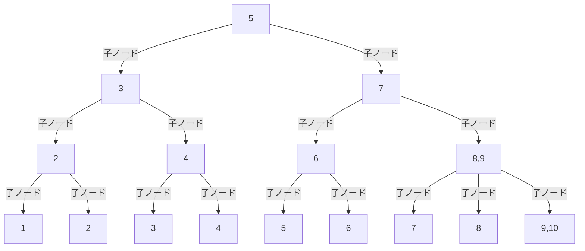
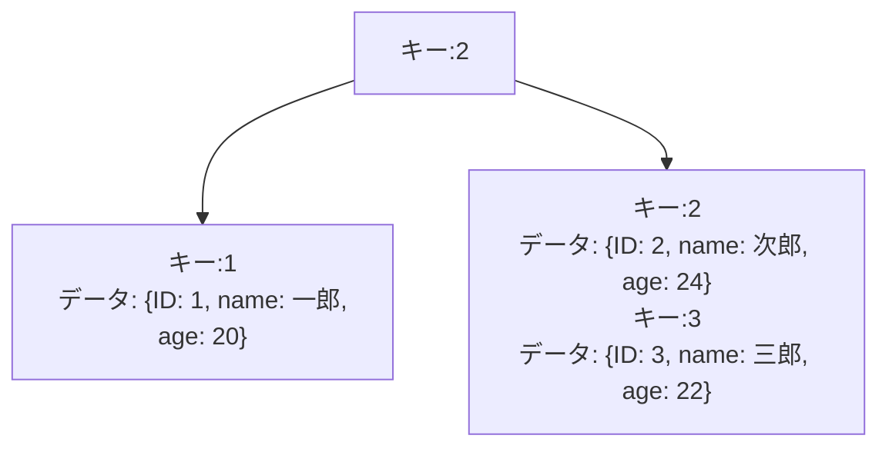
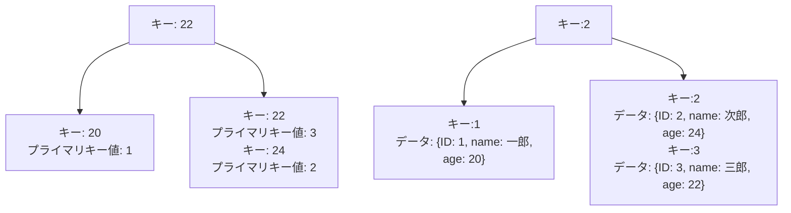
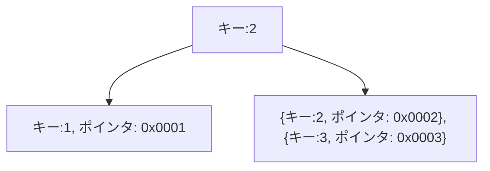
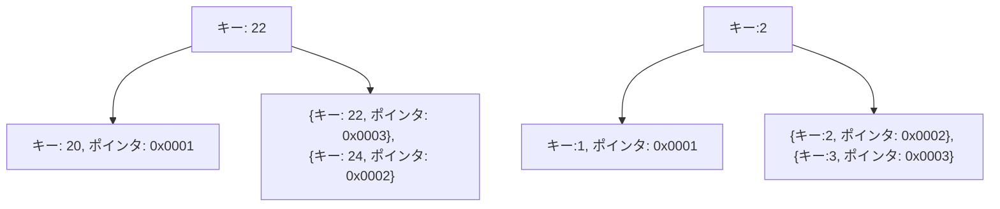

# はじめに

こんにちは。calloc134 です。

前のハッカソンイベントで、UUID をプライマリキーに利用するかどうかの議論がありました。
結果的にはあまりパフォーマンス要件の高くないアプリケーションであったため、プライマリキーとして UUID を採用することにしたのですが、イベント終了後に気になったため、調査を行いました。

今回は、この調査の結果を元に、MySQL と PostgreSQL におけるインデックスの内部構造の違いと、UUID をプライマリキーにする際の問題についてまとめてみたいと思います。

# インデックスの概要

## インデックスとは

インデックスとは、データベースのテーブルに対して、アクセスを高速に行うための指標となる構造のことです。
インデックスとは日本語で索引ですが、まさに辞書の索引のように、アクセスにおいての手助けをしてくれます。

https://ja.wikipedia.org/wiki/%E7%B4%A2%E5%BC%95_(%E3%83%87%E3%83%BC%E3%82%BF%E3%83%99%E3%83%BC%E3%82%B9)

より具体的に解説すると、データベースにおけるテーブルの行をすべて検索せずとも、データを高速に取得できるようにしてくれるものです。

## インデックスの種類

インデックスには、以下のような種類があります。

- B-Tree インデックス(B+Tree インデックス)
- ハッシュインデックス
- ビットマップインデックス

MySQL(InnoDB)と PostgreSQL では、B-Tree インデックス(B+Tree インデックス)が採用されています。

今回の記事では主に B-Tree インデックスについて解説します。
B-Tree インデックス以外のインデックスについてはここでは解説しませんが、以下の記事が参考になります。
https://zenn.dev/suzuki_hoge/books/2022-12-database-index-9520da88d02c4f/viewer/6-others

## B-Tree(B+Tree) インデックスの仕組み

B-Tree インデックスの解説を行う前に、二分探索木・平衡二分木についての知識があると理解が深まります。

### 木構造

木構造とは、以下の特徴を持つデータ構造です。

- あるノードが複数の子ノードを持つ
- すべてのノードに対して、親ノードが存在する

また、ノードとは、データ構造の要素のことを指します。
このノードは、以下を持っています。

- キー: データを識別するための値
- データ: キーに対応するデータ
- 参照: 子ノードへの参照

また、ノードについて以下のような呼称を行います。

- ルートノード: 木構造の最上位にあるノード
- 葉ノード: 子ノードを持たない底辺のノード
- 内部ノード: ルートノードと葉ノード以外のノード

### 二分探索木

二分探索木とは、以下の特徴を持つデータ構造です。

- あるノードの値が
  - そのノードの左部分木のすべてのノードの値よりも大きい
  - そのノードの右部分木のすべてのノードの値よりも小さい
- すべてのノードに対して、上記の特徴が成り立つ

このようなデータ構造を持つことで、データのアクセスがどれだけ簡単になるか考えてみましょう。
なお、これ以降はみやすさのため、キーのみを示すこととします。

例えば`5`というキーの付いているノードにアクセスしたい場合、以下のような探索を行います。

1. ルートノードから探索を開始
2. `5`はルートノードの値`4`よりも大きいため、右部分木に進む
3. `5`は`6`よりも小さいため、左部分木に進む
4. `5`は`5`と一致したため、探索終了

ここで、値の判定処理は 3 回です。
逆に、この二分木の構造がない場合、すべてのノードについて判定処理を行う必要があり、最悪の場合だとノード数と同じ回数の判定処理を行う必要があります。

二分木の構造を上手く利用することで、データのアクセスを高速化することができます。

:::message
計算量という表記を用いると、理想的な二分木の場合、データのアクセスの回数は O(logN) に収まると考えることができます。ここで、N はノードの数を表します。
ただし、二分木の構造が偏っている場合、計算量は O(N) になることがあります。
理想的な二分木では、木の高さも O(logN) になります。
:::

参考資料
https://ja.wikipedia.org/wiki/%E4%BA%8C%E5%88%86%E6%8E%A2%E7%B4%A2%E6%9C%A8

### 平衡二分木

先程の二分木の構造では、データの挿入や削除によって、木の形が偏ってしまうことがあります。
例えば以下の構造では、二分木を利用していない場合と同じような状態になってしまっています。

_引用元 URL: https://qiita.com/kiyodori/items/f66a545a47dc59dd8839_

こうなると、二分木の強みを活かすことができなくなってしまいます。
ここで、以下の制約を追加した二分木を平衡二分木と呼びます。

- すべてのノードに対して、左部分木と右部分木の高さの差が 1 以下である

この制約を持つことで、データの挿入や削除によって、木の形が偏ることがなくなります。
具体的な実装は難しいため、ここでは「木の高さが偏らないように工夫した二分木なんだな」という理解で十分です。

参考資料
https://ja.wikipedia.org/wiki/%E5%B9%B3%E8%A1%A1%E4%BA%8C%E5%88%86%E6%8E%A2%E7%B4%A2%E6%9C%A8

### B-Tree

B-Tree は、平衡二分木の概念を拡張したデータ構造です。

B-Tree は以下の特徴を持ちます。
なお、K という数値は、ノードが持つキーとデータの最大数を表します。

- ノードがキーを一つだけでなく、1 つ以上・K 以下持つ
- ノードが子ノードを(キー・データの個数 + 1)だけ持つ
- キー・データは左から小さい順に並べられている
- すべての葉ノードが同じ深さを持つ

キーを複数持つため、平衡二分木では不可能だった「すべての葉ノードが同じ深さを持つ」という特徴を達成できています。

B-Tree の例を示します。 1 から 10 までの数値を持つノードを持つ B-Tree です。

データにアクセスする際は、キーの値を比較し、適切な区間の子ノードにアクセスするようにします。

例えば一番右側のノードについては、`8`より小さい値であれば左側の子ノードにアクセスし、`8`以上かつ`9`未満であれば真ん中の子ノードにアクセス、`9`以上であれば右側の子ノードにアクセスするようにします。

参考資料
https://ja.wikipedia.org/wiki/B%E6%9C%A8
https://planetscale.com/blog/btrees-and-database-indexes

### B+Tree

多くの DB では、B-Tree の構造をそのまま採用するのではなく、B+Tree という構造を採用しています。
MySQL の InnoDB エンジンや PostgreSQL のインデックスは、B+Tree が採用されています。

B+Tree は、B-Tree に対し、以下の変更を加えたデータ構造です。

- 葉ノードが連結リストでつながっている
- 中間のノードにはキーだけを持ち、データは葉ノードにのみ存在する
  - 葉ノードにデータを持つため、中間ノードと葉ノードで同じキーを持つことがある

B+Tree の例を示します。 1 から 10 までの数値を持つノードを持つ B+Tree です。

この図では、葉ノードの連結リストをうまく描画できなかったので、脳内で補完してください・・・。

このような構造を持つメリットとして、以下のメリットがあります。

- データを葉ノードにのみ持つため、データをまとめて取得する際にアクセス範囲を絞ることが出来る
- 葉ノードが連結リストでつながっているため、近しいデータを取得する際に効率的

一番下の葉ノードだけみると、小さい順に並べられている連結リストとしてもみることが出来ますね。

この 2 つの特性が DB のインデックス構造において適しているため、多くの DB で採用されているというわけです。

参考資料
https://ja.wikipedia.org/wiki/B%2B%E6%9C%A8
https://www.cs.usfca.edu/~galles/visualization/BPlusTree.html
https://christina04.hatenablog.com/entry/2017/05/17/190000
https://qiita.com/kiyodori/items/f66a545a47dc59dd8839#b-tree%E3%82%A4%E3%83%B3%E3%83%87%E3%83%83%E3%82%AF%E3%82%B9%E3%81%AE%E6%A7%8B%E9%80%A0
↑B-Tree の解説とありますが、B+Tree の解説です。

### インデックスのまとめ

- 二分探索木は、データのアクセスを高速化するためのデータ構造
- 平衡二分木は、二分探索木の形が偏らないように工夫したデータ構造
- B-Tree は、平衡二分木の概念を拡張し、子ノードが複数あるデータ構造
- B+Tree は、B-Tree に対し、葉ノードが連結リストでつながっているデータ構造

以上の知識を持っていると、B-Tree インデックスの理解が深まります。

Web 上で簡単に B-Tree インデックスを使って遊べるサイトを、DBaaS を提供していることで有名な`PlanetScale`が提供しています。

https://planetscale.com/blog/btrees-and-database-indexes

是非試してみてください。

# DB での内部構造の違い

では、ここからは MySQL と PostgreSQL が、B+Tree をどのように応用しているかについて解説していきます。

# クラスタ化インデックスと非クラスタ化インデックス

先程のインデックスの概要で述べた通り、MySQL と PostgreSQL では B+Tree インデックスが採用されています。

B+Tree の解説の中で、ノードにはキーとデータが存在すると述べました。
先程の解説ではキーに注目していましたが、データにも注目すると、クラスタ化インデックスと非クラスタ化インデックスの違いが見えてきます。

## MySQL: クラスタ化インデックス

MySQL はクラスタ化インデックスを採用しています。

クラスタ化インデックスとは、インデックスの木構造にデータベースのデータが含まれているインデックスのことです。

インデックスの木構造の中に、データが含まれていることがわかります。

なお、キーに当たるものは、テーブル設計におけるプライマリキーとなります。
プライマリキーに対応するインデックスのことをプライマリインデックスと呼びます。
このプライマリインデックスが、MySQL においてクラスタ化インデックスとなるという形です。

では、プライマリキー以外のインデックスはどのようになるのでしょうか？

MySQL では、プライマリキー以外のインデックスは、非クラスタ化インデックスとなります。そして、非クラスタ化インデックスのデータには、プライマリキーの値が格納されています。
わかりやすく言えば、プライマリキー以外のインデックスは、プライマリキーのインデックスを参照する形になります。

左側のツリーは、プライマリキーでないインデックスのツリーです。ここでプライマリキーの値を得た後、右側のインデックス構造でまたデータを取得することになります。
このように、インデックスを用いてプライマリキー以外を参照すると、プライマリキーを参照する場合より一段階多くのアクセスが必要になります。

_引用元 URL: https://zenn.dev/team_soda/articles/mysql-innodb-sql-perfomance-tuning-essentials_

参考資料
https://cosol.jp/techdb/2023/12/rdbms_compare_index_structure/
https://dev.mysql.com/doc/refman/8.0/ja/innodb-index-types.html
https://techlife.cookpad.com/entry/2017/04/18/092524

## PostgreSQL: 非クラスタ化インデックス

PostgreSQL はクラスタ化インデックスを採用していません。

非クラスタ化インデックスとは、インデックスの木構造にデータベースのデータが含まれていないインデックスのことです。

| ポインタ | データ                       |
| -------- | ---------------------------- |
| 0x0001   | {ID: 1, name: 一郎, age: 20} |
| 0x0002   | {ID: 2, name: 次郎, age: 24} |
| 0x0003   | {ID: 3, name: 三郎, age: 22} |

データについてはインデックスとは別の場所に格納されており、インデックスのキーにはデータのポインタが格納されています。

この場合、プライマリキー以外のインデックスも同じく別の箇所のデータを参照してくる形となります。

プライマリインデックスとプライマリでないインデックスが、同じような構造になっていることがわかります。

参考資料
https://www.techscore.com/blog/2019/12/25/performance_index/
https://www.ashisuto.co.jp/pr_blog/article/20121101_db.html

プライマリキーにアクセスする際のアクセス方法の比較について、わかりやすい図があったため、引用という形で共有します。

_引用元 URL: https://www.ashisuto.co.jp/pr_blog/article/20121101_db.html_

## 手法の比較

クラスタ化インデックスを用いることによるメリットとデメリットを以下に示します。

- メリット

  - プライマリキーによる検索が高速
  - 範囲検索が高速
  - キャッシュ効率が高い

### プライマリキーによる検索が高速

まず初めに、プライマリキーによる検索はクラスタ化インデックスが高速です。
インデックスと同じ場所にデータが格納されているため、データの取得が高速に行えます。
非クラスタ化インデックスの場合は、インデックスを参照してからデータを取得するため、一段階多くのアクセスが必要になります。

### 範囲検索が高速

B+Tree の特徴である葉ノード同士の参照と、クラスタ化インデックスの特徴であるデータの連続性が相まって、範囲検索が高速に行えます。

### キャッシュ効率が高い

更に、クラスタ化インデックスではキャッシュ効率が高いことが挙げられます。
プライマリキーの値の近いデータが連続して格納されているところがポイントです。
例えば、データを新たに書き込む際、新しいデータに近い領域に頻繁にアクセスされるという特徴があります。また、データの参照も、新しいデータであったり、最近アクセスされたデータに近い領域であれば、頻繁にアクセスされるという特徴があります。
つまり、同じデータであってもアクセスされやすいエリアとされにくいエリアがあるということです。
このことを「参照の局所性が高い」と言います。
https://ja.wikipedia.org/wiki/%E5%8F%82%E7%85%A7%E3%81%AE%E5%B1%80%E6%89%80%E6%80%A7

参照の局所性が高いと、キャッシュは効力を発揮します。
たくさんアクセスされるエリアに絞ってキャッシュを行うことで、少ない出費で高速なアクセスを実現できるのです。よりローリスク・ハイリターンなキャッシュ効果が得られるというわけです。

- デメリット
  - プライマリキー以外のインデックスを用いた検索が遅い
  - データ挿入時のコストが高い

### プライマリキー以外のインデックスを用いた検索が遅い

当然、プライマリキー以外のインデックスを用いた検索は遅くなります。
二段階のアクセスが必要になるためです。

### データ挿入時のコストが高い

クラスタ化インデックスを採用している場合、クラスタ化インデックスの構造を維持しなければならないため、データの挿入時のコストが高くなります。

インデックスはデータの挿入・更新・削除の際に更新される必要があります。このとき、大規模な構造の変更が必要になることもあります。
非クラスタ化インデックスであればキーとポインタの情報を更新するだけで済むため、データの挿入時のコストが低くなります。
しかし、クラスタ化インデックスの場合、データも含めた構造更新の必要があり、データの挿入時のコストが高くなります。

参考資料
https://knkomko.hatenablog.com/entry/2020/04/12/012019
https://www.ashisuto.co.jp/pr_blog/article/20121101_db.html

# UUID をプライマリキーにする際の問題

おまけとして、UUID をプライマリキーにした際の、クラスタ化インデックスを採用している MySQL と非クラスタ化インデックスを採用している PostgreSQL でのパフォーマンスの影響について考察してみます。

## 概要

UUID は、一意な値を生成するための仕組みです。

UUID にはバージョンが存在し、バージョン 4 と呼ばれるものが一般的です。

バージョン 4 はランダムな値を生成するため、一意性が保証されます。しかし、完全にランダムであるため、ソートを行うことができません。
UUID にはタイムスタンプを含んだ改良版である UUIDv7 というものが存在しますが、今回は簡単のため、UUIDv4 について考えます。

この問題は UUID の問題というより、プライマリキーにランダム値を採用する際の問題と言えます。

## 読み込みについて

まず読み込みについて考えます。

連番を採用している際、単純に考えると以下の法則があると考えられます。

- 連番の大きいデータほど、よくアクセスされる

連番の大きいデータは最近追加されたデータであるため、データの参照もそれに伴って頻繁に行われると考えられます。

B+Tree の構造上、連番をプライマリキーに採用することで、右側のノードに新しいデータが集中します。そのため、右側のエリアだけ優先的にキャッシュを行うことで、キャッシュ効率が高まります。

では、ランダム値をプライマリキーに採用する際はどうでしょうか？
ランダム値をプライマリキーに採用する場合、先程の法則を活かすことが出来ません。
ランダム値となるため、新しいデータはツリーにおいてまんべんなく分散されます。そのため、特定の一部分だけキャッシュを優先的に行うことが出来ず、キャッシュ効率が低下します。

ここについては、クラスタ化インデックスを採用している MySQL と非クラスタ化インデックスを採用している PostgreSQL での違いはないと思われます。

## 書き込みについて

次に書き込みについて考えます。

データを挿入する際、データの挿入を行う前に、データ構造がどうなっているかを確認するために関連するエリアのデータを読み込む必要があります。

ここで、先程の読み込みと同じ問題が発生します。

しかし、書き込みについては、クラスタ化インデックスを採用している MySQL と非クラスタ化インデックスを採用している PostgreSQL での違いが出てきます。

クラスタ化インデックスを採用している MySQL では、データの挿入時にデータも含めて構造を更新する必要があるため、データの挿入時のコストが高くなります。
しかし、非クラスタ化インデックスを採用している PostgreSQL では、キーとポインタの情報を更新するだけで済むため、データの挿入時のコストが低くなります。

これにより、PostgreSQL ではプライマリキーにランダム値を採用しても、データの挿入時のコストが低くなるため、パフォーマンスの影響が少なくなります。

・・・と思うんだけど、合ってるんかなあ・・・

一応以下の資料では、PostgreSQL の場合 INSERT 実行時間が連番とランダムで変わらないと書かれていました。
でも自信ないです、ごめんなさい
https://qiita.com/jnchito/items/3ea13928d6aeb732bae2

参考資料
https://techblog.raccoon.ne.jp/archives/1627262796.html

# まとめ

以上、MySQL と PostgreSQL におけるインデックスの内部構造の違いと、UUID をプライマリキーにする際の問題についてまとめてみました。

MySQL のインデックスの構造については資料がたくさんありましたが、PostgreSQL の資料の少なさに驚きました。

ちゃんと正しい理解が出来ているか少し不安ですが、今回の記事が少しでも参考になれば幸いです。

パフォーマンスチューニング、できるようになりたい・・・。
