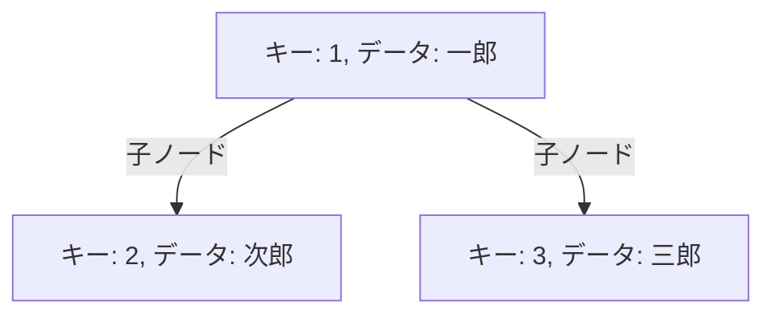
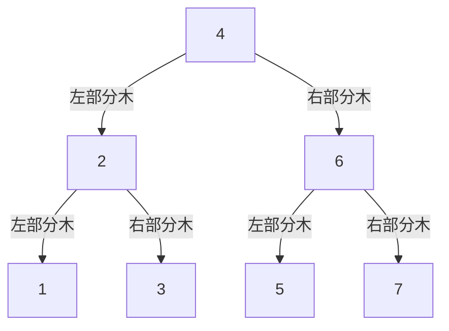
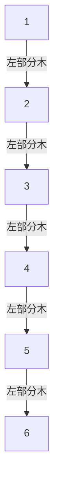
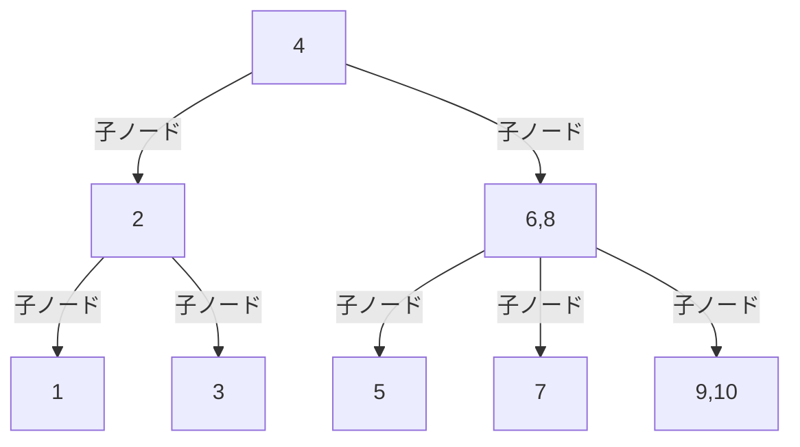

# はじめに

こんにちは。calloc134 です。

前のハッカソンイベントで、UUID をプライマリキーに利用するかどうかの議論がありました。
結果的にはあまりパフォーマンス要件の高くないアプリケーションであったため、プライマリキーとして UUID を採用することにしたのですが、イベント終了後に気になったため、調査を行いました。

今回は、この調査の結果を元に、MySQL と PostgreSQL におけるインデックスの内部構造の違いと、UUID をプライマリキーにする際の問題についてまとめてみたいと思います。

# インデックスの概要

## インデックスとは

インデックスとは、データベースのテーブルに対して、アクセスを高速に行うための指標となる構造のことです。
インデックスとは日本語で索引ですが、まさに辞書の索引のように、アクセスにおいての手助けをしてくれます。

https://ja.wikipedia.org/wiki/%E7%B4%A2%E5%BC%95_(%E3%83%87%E3%83%BC%E3%82%BF%E3%83%99%E3%83%BC%E3%82%B9)

インデックスは、データベースにおけるテーブルの行をすべて検索せずとも、データを高速に取得できるようにしてくれます。

インデックスの入門として、以下の記事が参考になります。
https://zenn.dev/suzuki_hoge/books/2022-12-database-index-9520da88d02c4f/viewer/4-feature

## インデックスの種類

インデックスには、以下のような種類があります。

- B-Tree インデックス(B+Tree インデックス)
- ハッシュインデックス
- ビットマップインデックス

今回の記事では主に B-Tree インデックスについて解説します。
B-Tree インデックス以外のインデックスについては、ここでは解説しませんが、以下の記事が参考になります。
https://zenn.dev/suzuki_hoge/books/2022-12-database-index-9520da88d02c4f/viewer/6-others

## B-Tree(B+Tree) インデックス

B-Tree インデックスの解説を行う前に、二分探索木・平衡二分木についての知識があると理解が深まります。

### 木構造

木構造とは、以下の特徴を持つデータ構造です。

- あるノードが複数の子ノードを持つ
- すべてのノードに対して、親ノードが存在する

また、ノードとは、データ構造の要素のことを指します。
このノードは、キーと呼ばれる値と子ノードへの参照、実際のデータを持っていることがあります。

### 二分探索木

二分探索木とは、以下の特徴を持つデータ構造です。

- あるノードの値が
  - そのノードの左部分木のすべてのノードの値よりも大きい
  - そのノードの右部分木のすべてのノードの値よりも小さい
- すべてのノードに対して、上記の特徴が成り立つ

このようなデータ構造を持つことで、データのアクセスがどれだけ簡単になるか考えてみましょう。
なお、ここではみやすさのため、キーのみを示すこととします。

例えば`5`というキーの付いているノードにアクセスしたい場合、以下のような探索を行います。

1. ルートノードから探索を開始
2. `5`はルートノードの値`4`よりも大きいため、右部分木に進む
3. `5`は`6`よりも小さいため、左部分木に進む
4. `5`は`5`と一致したため、探索終了

ここで、値の判定処理は 3 回です。
逆に、この二分木の構造がない場合、すべてのノードについて判定処理を行う必要があり、最悪の場合だとノード数と同じ回数の判定処理を行う必要があります。

二分木の構造を上手く利用することで、データのアクセスを高速化することができます。

:::message
計算量という表記を用いると、理想的な二分木の場合、データのアクセスの回数は O(logN) に収まると考えることができます。ここで、N はノードの数を表します。
ただし、二分木の構造が偏っている場合、計算量は O(N) になることがあります。
理想的な二分木では、木の高さも O(logN) になります。
:::

参考資料
https://ja.wikipedia.org/wiki/%E4%BA%8C%E5%88%86%E6%8E%A2%E7%B4%A2%E6%9C%A8

### 平衡二分木

先程の二分木の構造では、データの挿入や削除によって、木の形が偏ってしまうことがあります。
例えば以下の構造では、二分木を利用していない場合と同じような状態になってしまっています。

こうなると、二分木の強みを活かすことができなくなってしまいます。
ここで、以下の制約を追加した二分木を平衡二分木と呼びます。

- すべてのノードに対して、左部分木と右部分木の高さの差が 1 以下である

この制約を持つことで、データの挿入や削除によって、木の形が偏ることがなくなります。
具体的な実装は難しいため、ここでは「木の高さが偏らないように工夫した二分木なんだな」という理解で十分です。

参考資料
https://ja.wikipedia.org/wiki/%E5%B9%B3%E8%A1%A1%E4%BA%8C%E5%88%86%E6%8E%A2%E7%B4%A2%E6%9C%A8

### B-Tree

B-Tree は、平衡二分木の概念を拡張したデータ構造です。

B-Tree は以下の特徴を持ちます。
なお、K という数値は、ノードが持つキーの最大数を表します。

- ノードがキーを一つだけでなく、1 つ以上・K 以下持つ
- ノードが子ノードを(キーの個数 + 1)だけ持つ
- キーは左から小さい順に並べられている
- すべての葉ノードが同じ深さを持つ

キーを複数持つため、平衡二分木では不可能だった「すべての葉ノードが同じ深さを持つ」という特徴を達成できています。

B-Tree の例を示します。 1 から 10 までの数値を持つノードを持つ B-Tree です。

データにアクセスする際は、キーの値を比較し、適切な区間の子ノードにアクセスするようにします。

参考資料
https://ja.wikipedia.org/wiki/B%E6%9C%A8

### B+Tree

多くの DB では、B-Tree の構造をそのまま採用するのではなく、B+Tree という構造を採用しています。
MySQL の InnoDB エンジンや PostgreSQL のインデックスは、B+Tree が採用されています。

B+Treeは、B-Tree と同じく以下の特徴を持ちます。

- 

https://qiita.com/kiyodori/items/f66a545a47dc59dd8839

### まとめ

- 二分探索木は、データのアクセスを高速化するためのデータ構造
- 平衡二分木は、二分探索木の形が偏らないように工夫したデータ構造
- B-Tree は、平衡二分木の概念を拡張し、子ノードが複数あるデータ構造

以上の知識を持っていると、B-Tree インデックスの理解が深まります。

Web 上で簡単に B-Tree インデックスを使って遊べるサイトを、DBaaS を提供していることで有名な`PlanetScale`が提供しています。

https://planetscale.com/blog/btrees-and-database-indexes

是非試してみてください。

## クラスタ化インデックスと非クラスタ化インデックス

# インデックス構造の違い

## MySQL

## PostgreSQL

# データアクセスのされ方

## MySQL

## PostgreSQL

# キャッシュの仕組み

## MySQL

## PostgreSQL

# UUID をプライマリキーにする際の問題

## 概要

## MySQL

## PostgreSQL
