# 注意

:::message alert
この記事は下書き段階です。記事の執筆途中であるため、内容が不完全である可能性があります。
最後まで執筆が完了していないため、内容が変更される可能性があります。また、誤りを含んでいる可能性がありますので、ご了承ください。
すべての執筆が終わった後、内容の正しさを確認した上で、別の記事として公開する予定です。
:::

# はじめに

こんにちは。calloc134 です。 ~~就活シーズン真っ最中。つらみ。~~
執筆が終わる前に就活が終わりました ・・・笑

ここ最近、OAuth と OIDC について調べていました。
その際、なかなか躓くところが多く、学習に苦労したため、個人的に疑問に思ったことをベースに、OAuth と OIDC のフローについて解説していきたいと思います。

この記事を書くにあたり、ritou さん・Auth 屋さんの記事や書籍を参考にさせていただきました。
また、この記事を書くにあたり、ritou さん・Auth 屋さんに加え、Yuki Watanabe さん、pilcrow さんに疑問点を解決していただき、レビューをしていただきました。
この場を借りて感謝申し上げます。

# 進め方のおことわり

この記事では、OAuth と OIDC に関連する多くの概念を解説していきます。
また、自分が実際に疑問に思ったことについて、その都度質問と解答の形式で解説していきます。しかし、疑問に思ったことの内容は最初に読むには少し難しいかもしれません。
初回の読み方としては、まずスキップマーク ⏭️ をつけた章を読み飛ばしながら一通り読んでみることをおすすめします。
その後、スキップした箇所もすべて通して読み直すことで、より理解が深まるかと思います。

解説の途中で、適時 RFC や仕様書を引用しながら解説していきます。また、参考にしたリンクを章の終わりに記載していますので、必要に応じて参照してみてください。

なお、以下のリンクより、OAuth/OIDC の関連仕様についてまとまったリンク集を参照することができます。
https://qiita.com/TakahikoKawasaki/items/185d34814eb9f7ac7ef3#2-bearer-token-usage-rfc-6750
https://qiita.com/ritou/items/bbf7ffd001f30ec6facc
https://zenn.dev/ritou/articles/4bd45dee71b731
https://qiita.com/kkoiwai/items/c46bca6234f9a5aa548d

OAuth/OIDC には、非常に多くの仕様が存在します。
この記事で解説する内容も十分ではなく、今後学習を深めていくにつれ、仕様を一つ一つ読んでいくことが必要になるかと思います。


:::message alert
OIDC の実装などで Auth0 などの IDaaS を利用することが良くあると思います。
しかし、IDaaS の実装はベンターによって独自性が強く、その認識が学習の妨げとなる場合もあります。ここではとりあえず既存の IDaaS の仕様を一旦忘れてから、この記事を読んでみることをおすすめします。
:::

# ざっくりとした OAuth と OIDC の違い

## OAuth とは

OAuth は、リソースの所有者が、リソースへのアクセスを第三者に許可するための仕組みです。

例えば、自分の所持している写真を、Google Photo のようなオンラインアルバムサービスで管理していたとします。
このアルバムサービスとは関係ない印刷サービスに自分の写真を印刷してもらいたい場合、「印刷サービスにだけ、特別に、自分の写真を見る権限を与える」ということを実現するための仕組みが OAuth です。
具体的には、アクセストークンと呼ばれる鍵を利用することで、リソースへのアクセスができるようになります。先程の例で言うと、自分の写真を見る権限を持つアクセストークンを印刷サービスに渡すことで、印刷サービスは自分の写真を見ることができるようになります。

移譲できる権限についてはシステムの実装に左右されますが、アルバムサービスの写真というリソースに対しての場合、以下のような権限が考えられます。

- すべての画像の読み取り権限
- 限定された画像の読み取り権限
- アップロードを行う権限
- 画像を削除できる権限

これらの権限の違いはスコープと呼ばれるもので表現されますが、詳細は後述します。

## OIDC とは

OIDC は、ユーザが、第三者に対して自分がどのような人物であるかを示し、これを用いて認証を行うための仕組みです。

例えば、Google のアカウントを持っているユーザが、Zenn のような他のサービスにログインする場合、Google のアカウント情報を使ってログインすることができます。
具体的には、 ID トークンと呼ばれるプロフィール証明書のようなトークンを利用することで、ユーザのプロフィールを提示し、これを第三者が信頼することで、ログインを行うことができます。先程の例で言うと、Google のアカウントの簡単な情報が ID のトークンに格納され、これを使ってログインを行うことができます。

OIDC は、OAuth 2.0 を拡張して構築されたプロトコルです。そのため、ある程度同じ仕組みが存在します。しかし、それぞれの目的が異なることに注意が必要です。

## OAuth と OIDC の違い

OAuth と OIDC について、以下のようにざっくりとした違いを理解しておきましょう。

- OAuth は、ユーザが、所有するリソースへのアクセスを第三者に許可するための仕組み
- OIDC は、ユーザが、第三者に対して自分がどのような人物であるかを示し、これを用いて認証を行うための仕組み


OAuth は、ユーザが持っているリソースを第三者に認可するための仕組みです。したがって、認可の仕組みとみなされます。
OIDC は、ユーザの識別情報(ユーザがどのような人物であるかを示す情報、つまりプロフィール)を第三者に信頼してもらい、その情報をもって認証とする仕組みです。したがって、認証の仕組みとみなされます。

つまり、OAuth と OIDC のユースケースは全く別物なのです。

> OAuth 2.0 は, サードパーティーアプリケーションによる HTTP サービスへの限定的なアクセスを可能にする認可フレームワークである^[https://openid-foundation-japan.github.io/rfc6749.ja.html#toc].

> OpenID Connect 1.0 は, OAuth 2.0 [RFC6749] プロトコルの上にシンプルなアイデンティティレイヤーを付与したものである^[https://openid-foundation-japan.github.io/rfc6749.ja.html#toc].

OAuth は、RFC6749 で定義されています^[https://openid-foundation-japan.github.io/rfc6749.ja.html]。また、OIDC についても仕様が定義されています^[http://openid-foundation-japan.github.io/openid-connect-core-1_0.ja.html]。
それぞれ、日本語訳が存在しているので、必要に応じて参照してみてください。

:::message
余談ですが、OAuth は色々なリソースの認可に関連するため、仕様としてはふんわりとした特色があります。
それに対し、OIDC は認証のユースケースに特化しており、実装者の独自実装が入りうる余地は比較的少ないです。
:::

参考リンク
https://ritou.hatenablog.com/entry/2020/12/01/000000
https://booth.pm/ja/items/1550861
_(P. 10)_

## OIDC は OAuth に機能を付け足したものなんじゃないの？<br>なんで認証が実現できるの？⏩

では、OIDC の産まれる前の話から掘り下げていきましょう。

OAuth はリソースへのアクセスを第三者に許可するための仕組みです。
しかし、OAuth の仕組みを用いることで、認証用途にも転用できることが、OAuth ユーザによって発見されました。

まず、ユーザのプロフィールをリソースとして考えます。次に、第三者にプロフィールへのアクセスを許可すれば、そのプロフィールで身分証明ができます。そして、これを認証用途に使うことができるという形です。


OAuth を認証用途として利用できるというのは、いわば発明だったと言えるでしょう。
プロフィールをリソースとして提供する API はプロフィール API と呼ばれ、このような実装を OAuth + プロフィール API と呼びます。

:::message alert
この仕組みについて、俗に「OAuth 認証」と呼ばれることがありますが、あまり適切な表現ではないので、避けるようにしましょう。

OAuth は認可の仕組みであり、識別情報を用いた認証への応用は規格として定義されていません。そのため、実装者が独自に拡張しているということになります。
実装者が独自に拡張している実装なので、もちろん実装方法もバラバラで統一されていません。万が一「OAuth 認証」のような言葉を議論に用いてしまうと、そういう実装が明確に存在すると誤解した認識が開発者の間に広まってしまいます。結果的に、勘違いした開発者によってバラバラな実装が更に広まることになりかねません。
そのため、OAuth + プロフィール API のような実装を、「OAuth 認証」と呼ぶのは避けるようにしましょう。
:::

OAuth + プロフィール API の実装について、実装者が独自実装を行うことが多かったため、このような認証の仕組みを規格として定義することが自然と求められました。そこで誕生したものが OIDC です。OIDC では、プロフィール API に当たるものを専用のトークンとして定義し、それを用いて認証を行う仕組みを提供しています。「OIDC は OAuth にアイデンティティレイヤーを載せたものである」と言われるのは、このような理由からです。

> OpenID Connect 1.0 は, OAuth 2.0 プロトコルの上にシンプルなアイデンティティレイヤーを付与したものである^[http://openid-foundation-japan.github.io/openid-connect-core-1_0.ja.html#Introduction].


:::message
**歴史的な経緯**
OAuth が登場する以前から、OIDC のベースとなる識別情報認証の仕組みとして OpenID というものが存在していました。

しかし OAuth を認証用途として利用する広まりを受け、OAuth2.0 という規格でまず土台を整えつつ 、OpenID の要素を統合することにより認証用途としての仕組みを追加した仕様として、OIDC が誕生しました。
この経緯についてはわかりやすさのための少し省略されています。Auth 屋さんの本に詳しい解説があるので、そちらを参照いただけると幸いです。
:::


参考リンク
https://ritou.hatenablog.com/entry/2020/12/01/000000
https://ritou.hatenablog.com/entry/2024/02/11/153633
https://booth.pm/ja/items/1550861
(P. 86)

# OAuth の登場人物

前述の通り、OAuth はリソースへのアクセスを第三者に許可するための仕組みです。
リソースのアクセスを許可するという行為には、以下のような登場人物が関連してくると考えられるでしょう。

- リソースにアクセスしたい第三者のアプリケーション
- リソースを保管しているサーバ
- リソースへのアクセスを認可し
  アクセス権の鍵(アクセストークン)を発行するサーバ
- リソースの所有者(ユーザ)

OAuth の仕様である RFC6749 には、以下のように説明されています。

> 例えば, あるユーザー (リソースオーナー) が, 印刷サービス (クライアント) に対して, 写真共有サービス上 (リソースサーバー) に保管されている彼女の保護された写真へのアクセス権を与えることを考える.
> OAuth では, その際彼女のユーザー名とパスワードを印刷サービスに与える必要はない. そのかわり, 彼女は写真共有サービスの信任を得たサービス (認可サーバー) に対して認証を行い, 印刷サービスへのアクセス権限委譲用クレデンシャル (アクセストークン) を発行させる^[https://openid-foundation-japan.github.io/rfc6749.ja.html#anchor1].

この例に沿って、OAuth における登場人物について解説していきます。
画像を印刷するためのアプリケーションが、Google Photo にアクセスする場合を例に考えてみます。


## クライアント: リソースにアクセスしたい第三者のアプリケーション

OAuth におけるクライアントは、リソースにアクセスしたい第三者のアプリケーションを指します。
例として、画像を入力してその画像を印刷するアプリケーションが考えられます。

## リソースサーバ: リソースを保管しているサーバ

OAuth におけるリソースサーバは、実際にユーザの所有するリソースを保管しているサーバを指します。
アクセストークンを受取り、それを検証し、成功すればリソースを返します。
例として、Google Photo で画像を保管しているサーバがリソースサーバに相当します。

## 認可サーバ: リソースへのアクセスを認可し、アクセス権を発行するサーバ

OAuth における認可サーバは、リソースへのアクセスを認可するサーバを指します。
このサーバはリソースを持っていませんが、リソースへアクセスすることを認め、アクセス権の鍵であるアクセストークンや、アクセストークンの引き換えることの出来る認可コードを発行する役割を担います。
例として、Google Photo にアクセスするための認可を行う Google OAuth サーバが認可サーバに相当します。

:::message

リソースサーバと認可サーバは比較的近い位置にあることが多く、同じサーバであることも多いです。

> 認可サーバーとリソースサーバー間のやりとりについては本仕様書の範囲外である. 認可サーバーはリソースサーバーと同一のサーバーでも異なるサーバーでもよい. 単一の認可サーバーが複数のリソースサーバーにアクセス可能なアクセストークンを発行してもよい^[https://openid-foundation-japan.github.io/rfc6749.ja.html#client-authentication].

:::

## リソースオーナー: リソースの所有者(ユーザ)

OAuth におけるリソースオーナーは、リソースの所有者を指します。
サービスの利用者がリソースの所有者となります。
例として、Google Photo に画像をアップロードしているユーザがリソースオーナーに相当します。サービスのお客さんですね。

ここまでで、OAuth における登場人物について解説してきました。

ここからは、よくある疑問について解説していきます。

## クライアントって、スマホとかパソコンで動作するもの？

OAuth では、クライアントという言葉が登場します。
しかし、クライアントというのは OAuth におけるクライアントのことで、サーバ・クライアントモデルにおけるクライアントのことではありません。
この 2 つは異なる概念であることに注意しましょう。


## クライアントには タイプがあるらしいけど、どう違うの？⏩

クライアントには、`Confidential Client` と `Public Client` という 2 つの種類が存在します。

この 2 つの違いの判断基準を一言で伝えると、

「アクセストークン引き換えのリクエストを行う際に、クライアントがユーザのフロントエンド側で動作するかどうか」であると考えていいと思われます。

OAuth の RFC である RFC6749 にクライアントタイプの解説があります。
RFC によると、以下のように定義されています^[https://openid-foundation-japan.github.io/rfc6749.ja.html#client-types]。

Confidential Client:

> クレデンシャルの機密性を維持することができるクライアント

Public Client:

> クライアントクレデンシャルの機密性を維持することができず,
> かつ他の手段を使用したセキュアなクライアント認証もできないクライアント

しかし、クライアント認証とクライアントクレデンシャルについてはまだ学習していません。これらの概念を利用せずに、クライアントタイプを判断する方法を考えてみましょう。
クライアントクレデンシャルというのは、クライアント ID とクライアントシークレットのことを指します。こちらは後述の章で解説しますが、クライアントが認可サーバとやり取りするときに「自分はこのクライアントである」と証明するための情報です。つまり、第三者がクライアントのソースコードを解析して、内部に埋め込まれているクライアント証明のための機密情報を不正に取り出すことができるかどうかが、この 2 つの違いの判断基準となります。
このようなことが出来るかどうかはすなわち、クライアントがアクセストークン引換時にユーザのフロントエンド側で動作しているか、それともバックエンド側で動作しているかによって決まります。

したがって、クライアントが認可サーバにアクセストークン引き換えのリクエストを行う際、ユーザのフロントエンド側で動作するかどうかが、この 2 つの違いの判断基準となると解釈して良いと思われます。


参考リンク
https://zenn.dev/ritou/articles/d26c7861047a2d

## フロント/バックエンドによってクライアントタイプは左右されるの？⏩

先程の解説では足りない人のために、クライアントアプリがどのようなアプリであるかによって、クライアントタイプがどのように異なってくるかを考えてみましょう。

以下の 3 つについて考察していきます。

| アプリの種類                                                    | 詳細                                                                                                                                                                     |
| --------------------------------------------------------------- | ------------------------------------------------------------------------------------------------------------------------------------------------------------------------ |
| バックエンドで動作し、HTML まで含めて返却する Web アプリ        | いわゆる MPA。JavaScript が含まれないサイト。PHP や Ruby on Rails などのサーバーサイド言語で 書かれるもの。                                                              |
| フロントエンドで動作する Web アプリやモバイルアプリ             | Web アプリの場合、JavaScript で動作する SPA。モバイルアプリの場合、iOS や Android のアプリ。バックエンドサーバは全く利用しておらず、フロントエンドですべての処理を行う。 |
| サーバサイドの API サーバと、それを利用するフロントエンドアプリ | バックエンドの API は、クライアントからのリクエストに対して JSON を返却するだけの API サーバ。フロントエンドは、この API を利用して画面を構築する。                      |

それぞれのクライアントアプリの特性によって、クライアントタイプがどのように異なってくるかを考えてみましょう。

### バックエンドで動作し、HTML まで含めて返却する Web アプリ

この場合は `Confidential Client` になります。
クライアントがバックエンドで動作するため、認可サーバからアクセストークンを受け取る際に、ユーザのフロントエンド側で動作することはありません。バックエンドで動作するため、クライアントクレデンシャルは機密性を維持することができます。したがって、`Confidential Client` になります。

### フロントエンドで動作する Web アプリやモバイルアプリ

この場合は `Public Client` になります。
フロントエンドで動作するため、認可サーバからアクセストークンを受け取る際に、ユーザのフロントエンド側で動作することになります。よって、ユーザが開発者ツールやデバッグ機能を用いることで、アクセストークンを閲覧できてしまいます。また、ソースコードの解析によって、クライアントクレデンシャルの情報を取得できてしまう可能性があります。したがって、`Public Client` になります。

### サーバサイドの API サーバと、それを利用するフロントエンドアプリ

このケースが難しいです。以下のブログにおいては、以下のように定義しています。

フロントエンドが認可サーバからアクセストークンを受け取り、それをバックエンドサーバに渡す場合は、フロントエンドの処理をクライアントとしてみなし、`Public Client` になります^[https://zenn.dev/ritou/articles/d26c7861047a2d#%22%E5%8F%96%E5%BE%97%E3%81%97%E3%81%9F%E3%83%88%E3%83%BC%E3%82%AF%E3%83%B3%E3%82%92%E6%B8%A1%E3%81%99%22-%E3%81%AA%E3%82%89-%22public%22-%E3%81%AE%E3%81%BE%E3%81%BE]。

しかし、フロントエンドが認可コードをバックエンドサーバに渡し、バックエンドサーバが認可サーバからアクセストークンを受け取る場合は、バックエンドサーバをクライアントとしてみなし、`Confidential Client` になります^[https://zenn.dev/ritou/articles/d26c7861047a2d#%22backend-server%E3%81%AB%E4%BB%BB%E3%81%9B%E3%82%8B%22-%E3%81%AA%E3%82%89%E3%83%A2%E3%83%90%E3%82%A4%E3%83%AB%E3%82%A2%E3%83%97%E3%83%AA%E3%82%84spa%E3%81%AF-%22user-agent%22-%E7%9B%B8%E5%BD%93%E3%81%A8%E3%81%AA%E3%82%8A%E3%80%81%E5%85%A8%E4%BD%93%E3%81%A8%E3%81%97%E3%81%A6%E3%81%AF-%22confidential%22-%E3%81%A8%E3%81%AA%E3%82%8B]。

アクセストークンを受け取る処理がフロントエンドかバックエンドサーバのどちらで動作するかによって、`Public Client` か `Confidential Client` かが決まるということを覚えておきましょう。

参考リンク(引用元)
https://zenn.dev/ritou/articles/d26c7861047a2d

# OAuth のフロー

## フローについていくつか種類があるけど、どう違うの？

OAuth には、フローの種類がいくつか存在します。この種類のことを、グラントタイプと呼びます。
最も有名なものとして、認可コードフローがあります。このフローが最も一般的であり、推奨されています。
他のフローとしてインプリシットフローというものが存在します。こちらは認可コードフローを単純にしたものなのですが、原理的にセキュリティ上の問題があります。現在ではこのフローを採用するメリットが存在しないため、非推奨とされています。どのように非推奨とされているかについて、後ほど解説します。

残りの 2 つのフローについては、ほぼ使われていないため、解説を省略します。

## フロー開始前の下準備 ⏩

OAuth のフローを開始する前に、クライアントが認可サーバに登録されている必要があります。つまり、事前に認可サーバに対して、「私はこういうクライアントです」という情報を登録しておく必要があります。


クライアントタイプとリダイレクト URI(後述)を登録し、あとはおまけでアプリ名やアイコンなどを登録しておくと、ユーザにとって使いやすい認可画面が表示されます。
クライアントの登録が済むと、認可サーバはクライアントに対して、クライアント ID というものを発行します。クライアント ID はクライアントを識別するための情報であり、いわゆるクライアントのためのマイナンバーのようなものです。


> クライアントを登録する場合, クライアント開発者は以下を満たすものとする (SHALL).
> Section 2.1 で説明されているようなクライアントタイプを指定し,
> Section 3.1.2 で説明されているようなリダイレクト URI を提供し,
> 認可サーバーが要求するその他の情報 (例えばアプリケーション名, Web サイト, 説明, ロゴイメージ, 利用規則など) を提供する.

> 認可サーバーは登録済みのクライアントにクライアント識別子 (クライアントが提供した登録情報を表すユニーク文字列) を発行する

なお、Confidential Client の場合、クライアント ID に加えてクライアントシークレットも発行されます。クライアントシークレットについては後ほど解説しますが、クライアントが認可サーバに対して「自分はこのクライアントである」と証明するための情報です。

参考リンク
https://openid-foundation-japan.github.io/rfc6749.ja.html#anchor13
https://openid-foundation-japan.github.io/rfc6749.ja.html#client-identifier

では、下ごしらえも終わったところで、実際の OAuth フローについて解説していきます。

## ざっくりとしたフロー

まずはざっくりとした解説です。
クライアントが Confidential か Public かについては、ひとまず考えずにざっくりと見てみます。

OAuth の認可コードフローは、以下のような流れで行われます^[http://openid-foundation-japan.github.io/rfc6749.ja.html#grant-code]。

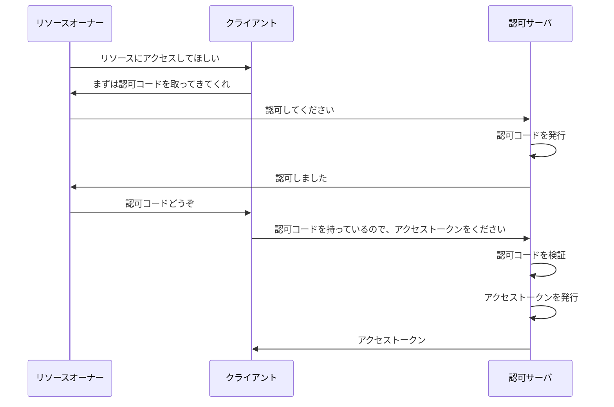

1. リソースオーナーがクライアントに対し、「リソースにアクセスしてほしい」とリクエストする
2. クライアントがリソースオーナーに対し、「まずは認可コードを取ってきてくれ」と言ってリソースオーナーをリダイレクトさせる
3. リソースオーナーが認可サーバにアクセスし、認可サーバに対して「認可してください」とリクエストする
4. 認可サーバがリソースオーナーに対して「認可しました」と言って認可コードをもたせ、リソースオーナーをクライアントにリダイレクトさせる
5. リソースオーナーはクライアントに対して認可コードを渡す
6. クライアントが認可コードを持って認可サーバにアクセスし、「認可コードを持っているので、アクセストークンをください」とリクエストを送る
7. 認可サーバが認可コードを検証し、成功すればアクセストークンを発行
8. 認可サーバがクライアントに対してアクセストークンを返す

最終的にクライアントがアクセストークンを取得して、フローは終了します。

アクセストークンというのは、リソースにアクセスするための鍵のようなものです。アクセストークンを持っていると、リソースサーバにアクセスすることができます。
認可コードというのは、言ってみれば一時トークンのようなものです。アクセストークンと引き換えするための一時的なトークンであり、有効期限は短く、一度使うと無効になります。直接アクセストークンを受け取るのではなく、認可コードを経由してアクセストークンを受け取ることで、セキュリティを向上させることができます。詳細は後ほど解説します。

フローについて、いまいちピンとこないかもしれないですね。では、例え話をしましょう。

登場人物を、以下のように例えてみましょう。

エルフの魔法使いであるフリーレンは、強い魔法使いです。
人間の魔法使いフェルンは、フリーレンの弟子であり、フリーレンに日々魔法を教わりながら、魔法使いとしての道を歩んでいます。

フリーレンは、魔法の使い方の書いてある本である魔導書を集めることが趣味です。自分のカバンに魔導書を入れています。しかし、セキュリティのため、自分以外の人間がカバンを開けるときは、特別な印をつけた鍵を使う必要があるようにしています。
そしてフリーレンは更に、セキュリティの万全を期すため、カバンを開ける様子を見張る門番として、精霊を雇っています。この精霊が、特別な印をつけた鍵を作ってくれます。また、鍵を作る際に必要な引き換え書も精霊が作ってくれます。


ある時、フリーレンは「フェルンに、私の魔導書を読ませたい」と思います。しかし、フェルンは鍵を持っていないため、カバンを開けることができません。

まずフリーレンが、精霊に頼みます。「私の許可を元に、鍵の引き換え書を作ってくれ」と。
精霊は、フリーレンの許可を元に、鍵の引き換え書を作ってフリーレンに手渡します。

フリーレンは、引き換え書を持ってフェルンに渡します。
フェルンは、引き換え書を持って精霊に行き、鍵を受け取ります。
フェルンは、鍵を持ってフリーレンのカバンを開け、魔導書を取り出すことに成功しました。
フェルンはこの魔導書を読み、魔法の使い方を学びます。


このような流れで、OAuth の認可コードフローが行われます。

以上の登場人物は、それぞれ以下のように対応します。

- フリーレン: リソースオーナー
- フェルン: クライアント
- 魔導書: リソース
- カバン: リソースサーバ
- 特別な印をつけた鍵: アクセストークン
- 鍵を作る精霊: 認可サーバ
- 引き換え書: 認可コード

認可コードフローに沿って、できるだけ適切に例え話をしてみました。上手く理解していただけると幸いです。

参考リンク:
https://openid-foundation-japan.github.io/rfc6749.ja.html#grant-code
https://booth.pm/ja/items/1550861
(p.10)

## 認可コードは必要？<br>最初から認可サーバがアクセストークンを渡してくれればいいのでは？⏩

おっしゃるとおり、認可コードフローについては、少しステップが多いように感じるかもしれません。
認可コードは一時トークンのようなものですが、認可コードを経由することでステップが増えてしまいますね。認可コードを使わずにアクセストークンを直接渡してもらえれば、スムーズにアクセストークンを取得できるのではないかと思われるかもしれません。


実は、いきなりアクセストークンを渡してもらうフローを、インプリシットフローと呼びます。
認可コードフローよりも単純化されたフローですが、前述の通りセキュリティ上の問題があるため、現在は非推奨とされています。

OAuth のインプリシットフローの場合、以下のような流れで行われます。

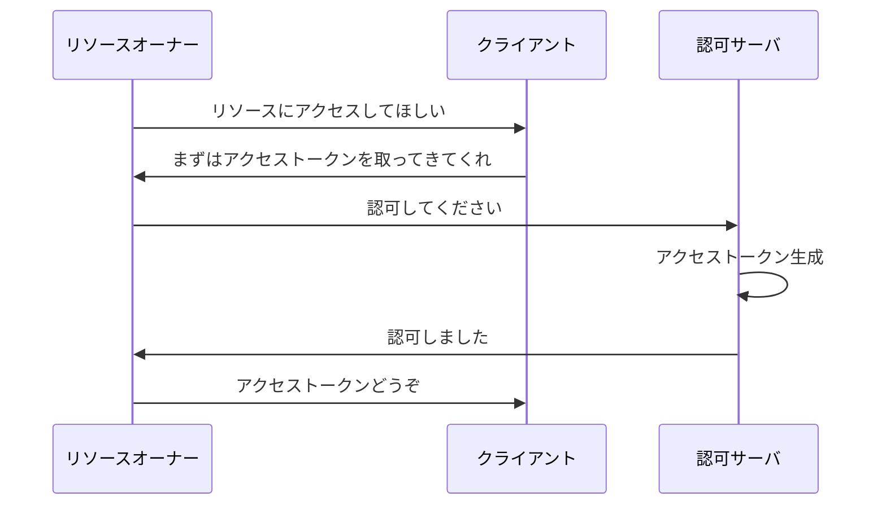

1. リソースオーナーがクライアントに対し、「リソースにアクセスしてほしい」とリクエストする
2. クライアントがリソースオーナーに対し、「まずはアクセストークンを取ってきてくれ」と言ってリソースオーナーをリダイレクトさせる
3. リソースオーナーが認可サーバにアクセスし、認可サーバに対して「認可してください」とリクエストする
4. 認可サーバがリソースオーナーに対して「認可しました」と言ってアクセストークンをもたせ、リソースオーナーをクライアントにリダイレクトさせる
5. リソースオーナーはクライアントに対してアクセストークンを渡す

先程の例え話でこれを例えてみましょう。

1. フリーレンは、フェルンに「私の魔導書を読ませたい」と思います。しかし、フェルンは鍵を持っていないため、カバンを開けることができません。
2. フリーレンが、精霊に頼みます。「私の許可を元に、鍵を作ってくれ」と。
3. 精霊は、フリーレンの許可を元に、鍵を作ってフリーレンに手渡します。
4. フリーレンは、鍵を持ってフェルンに渡します。
5. フェルンは、鍵を持ってフリーレンのカバンを開け、魔導書を取り出すことに成功しました。
6. フェルンはこの魔導書を読み、魔法の使い方を学びます。

このように、認可コードフローとインプリシットフローの違いがわかります。
インプリシットフローの場合、フリーレンが鍵を所持するシーンがあるのに対し、認可コードフローの場合、フリーレンが鍵を所持するシーンがないという点に注目しておきましょう。

「なぜインプリシットフローは非推奨なのか？」という疑問に関しては、次の質問で解説していきます。

## わざわざインプリシットフローではなく<br>認可コードフローを使う理由は何ですか？

これまでの知識を総動員して、考えてみましょう。
認可コードフローをあえて利用する理由は何でしょうか？ここでは攻撃者の存在を想定します。

まず考えやすくするため、Confidential Client を前提として考えましょう。
Confidential Client というのは、クライアントがバックエンドサーバで動作し、認可サーバとやりとりしてアクセストークンを取得するタイプのクライアントでしたね。

OAuth のフローは、クライアントがアクセストークンを取得し、アクセストークンを使ってリソースにアクセスできるようにすることを目的としています。
したがって、それぞれのフローは以下のようにまとめることができます。

インプリシットフローは、簡略化すると以下のようになります。

1. リソースオーナーがアクセストークンを取得
2. リソースオーナーがアクセストークンをクライアントに渡す

認可コードフローは、簡略化すると以下のようになります。

1. リソースオーナーが認可コードを取得
2. リソースオーナーが認可コードをクライアントに渡す
3. クライアントが認可コードを使ってアクセストークンを取得


次に、攻撃者の目線に立って考えてみましょう。
攻撃者は、被害者のアクセストークンを奪取し、被害者のリソースにアクセスすることが目的です。

インプリシットフローかつ Confidential Client の場合、攻撃者がアクセストークンを奪取するためのステップは 1 つです。
すなわち以下の攻撃を行えば、アクセストークンを奪取することができます。

- リソースオーナーから、アクセストークンを盗む

攻撃者はリソースオーナーを攻撃し、何らかの手法でアクセストークンを盗むことができれば、そのアクセストークンを使ってリソースにアクセスすることができてしまいます。

一方、認可コードフローかつ Confidential Client の場合、リソースオーナーにアクセストークンはわたりません。言葉を変えると、アクセストークンのやり取りはリソースオーナーや攻撃者から見えないところで行われるということです。そのため、攻撃者はアクセストークンを直接盗む攻撃手段を持ちません。

攻撃者がアクセストークンを奪取するためには、以下の 2 つのステップを踏む必要があります。

1. リソースオーナーから、認可コードを奪取(認可コードの取得)
2. 盗んだ認可コードを使って、アクセストークンを取得する(認可コードの引き換え)

しかし、仮に認可コードの奪取に成功しても、認可コードをアクセストークンに引き換える際にまた一つ制約があります。後述しますが、自身が正しいクライアントであるという証明のため、クライアント認証というものを行う必要があります。


クライアント認証に成功して正当性を証明しなければ、アクセストークンへの引き換えは認められません。
しかし攻撃者は、自身が正規のクライアントであるという証明を行うことができないため、認可コードを手に入れてもアクセストークンを取得することができないのです。


認可コードフローの「アクセストークンとは別に一時的なコードとして認可コードを利用する」という特性と、Confidential Client の「アクセストークンが見えないところでやり取りされる」という特性がマッチし、攻撃者によるアクセストークンの盗難の難しさを生んでいるのです。
Confidential Client の場合、認可コードフローにしない理由はないと言えるでしょう。

では次に、Public Client を前提として考えてみましょう。

Public Client というのは、クライアントがフロントエンドで動作するタイプのクライアントでしたね。
クライアントがフロントエンドで動作するため、どうしてもアクセストークンがフロントエンドに露呈してしまうという問題があります。


まず OAuth のセキュリティを議論するにあたり、フローが終わった後にアクセストークンをどう保管するかという問題は別問題であることを明確にしておきましょう。Public Client である以上、アクセストークンをフロントエンドで保管するのは原理上やむを得ません。これを防ぐための機構は OAuth のフローの範疇外として考えるべきです。

では、Public Client かつ認可コードフローを採用しており、かつ認可コードフローの途中で攻撃者が認可コードを盗んだ場合を考えてみましょう。このケースでは、インプリシットフローを採用している場合に比べてセキュリティが向上しているのでしょうか？

結論から言うと、何も対策をしていない場合は、攻撃者は認可コードからアクセストークンを取得することができてしまいます。
しかし、PKCE という仕組みを導入することで、認可コードが盗まれた場合でもアクセストークンが取得されることを防ぐことができます。

PKCE とは、リソースオーナーにフローを開始するよう指示したクライアントと、アクセストークンの引き換えリクエストを行うクライアントが同一であることを保証するための仕組みです。
つまり、フロー開始を指示していないクライアントの場合は、アクセストークンの取得を拒否することができるのです。


この特性により、攻撃者が被害者から認可コードを盗み出しても、被害者のクライアントと攻撃者のクライアントが違うため、認可コードからアクセストークンを取得することができないのです。

認可コードフローであっても PKCE を導入することで、Public Client でも少し安全にアクセストークンを取得することができるようになります。
PKCE の技術的詳細については、後ほどの質問で解説します。

認可コードであれば PKCE のようなセキュリティ防御策を入れ込む余地がある一方で、インプリシットフローではリソースオーナーがアクセストークンをそのまま手にしてしまうため、PKCE のような拡張を導入する余地がありません。
そのため、PKCE のようなセキュリティ防御策を入れ込むことができる認可コードフローを採用することが強く推奨されているのです。

結論として、Confidential Client と Public Client で、どちらにおいてもわざわざインプリシットフローを採用する必要がなくなったため、現在は非推奨となっているのです。

最後に、OAuth 2.0 Security Best Current Practice という仕様と、OAuth2.1 のドラフト(下書き段階)の 2 つを引用して解説したいと思います。

OAuth 2.0 Security Best Current Practice という RFC には、以下のように記載されています。

> インプリシットグラントおよび、認可サーバに認可レスポンスにおいてアクセストークンを発行させるレスポンスタイプは、アクセストークンの漏洩とアクセストークンのリプレイ攻撃に対して脆弱です。
> 更に、アクセストークンが認可レスポンスで発行されるときに、アクセストークンを特定のクライアントにバインドする Sender-Constrained な方法は存在しません。
> これはつまり、攻撃者が漏洩したアクセストークンをリソースエンドポイント(リソースサーバのエンドポイント)で利用できるということです。
> これらの問題を回避するため、クライアントはインプリシットフローまたは認可サーバに認可レスポンスにおいてアクセストークンを発行させるレスポンスタイプを使用しないでください。…
> 引用元: https://datatracker.ietf.org/doc/html/draft-ietf-oauth-security-topics#name-implicit-grant

この RFC によると、インプリシットフローは、アクセストークンの漏洩やリプレイ攻撃に対して脆弱であり、アクセストークンを特定のクライアントにバインドする Sender-Constrained な方法が存在しないため、攻撃者が漏洩したアクセストークンをリソースエンドポイントで利用できるという問題があるとされています。

また、OAuth 2.1 のドラフト(下書き段階)において、インプリシットフローが削除されるということが方針として示されています。

> インプリシットグラントを削除する意図は、認可のレスポンスにおいてアクセストークンを発行しないようにすることです。というのも、そのようなトークンは漏洩やインジェクションに脆弱であり、クライアントにとって sender-constrained になることができないので。
> この動作(認可のレスポンスでアクセストークンを発行する動作)は、`response_type=token`パラメータを用いて示されます。しかし、そのパラメータは、OAuth2.1 では定義されなくなりました。
> 引用元: https://datatracker.ietf.org/doc/draft-ietf-oauth-v2-1/

この RFC によると、インプリシットフローは、アクセストークンを認可のレスポンスに含めることができるため、漏洩やインジェクションに脆弱であり、クライアントにとって sender-constrained になることができないため、削除されるとされています。

内容としては先程の RFC と同じですが、OAuth2.1 では、`response_type=token`パラメータが定義されなくなるため、インプリシットフローが削除されるということが示されています。

では、Sender-Constrained とは何でしょうか？
Sender-Constrained とは一般的に、送信者が制限されていることを指します。
ここでの Sender-Constrained とは、アクセストークンを特定のクライアントに制限することを指します。つまり、PKCE で説明した「リソースオーナーに認可コードを取得しろと指示したクライアントに限り、アクセストークンを取得できる」という制限が Sender-Constrained ということになります。

長くなりましたが、認可コードフローはアクセストークンの盗難を極力防ぐため、様々な工夫がされているフローであるために、インプリシットよりも推奨されていると言えるでしょう。

なお余談ですが、認可コードフローでは認可コードの有効期限をできるだけ短く設定しましょう。
アクセストークンに引き換えられる有効期限を短くすることで、認可コードの盗難による被害を最小限に抑えることができます。
参考リンク
https://valinux.hatenablog.com/entry/20220526
https://ritou.hatenablog.com/entry/2018/11/12/110613

## アクセストークンってランダムな文字列？<br>それとも何かの情報？

「アクセストークンって、JWT 形式になってて、アクセストークンを解読すれば色々な情報が見れるようになってるんだよね？」といった理解の方もいらっしゃるかもしれません。
しかし、OAuth の RFC では、アクセストークンの形式を特に規定していません。

> トークンは認可情報を取り出すための識別子を表したり, 検証可能な方法でそれ自身に認可情報を含んでもよい (データと署名を含むトークン文字列など). クライアントがトークンを使用するために, 本仕様で定めていない追加の認証クレデンシャルを要求することもできる^[https://openid-foundation-japan.github.io/rfc6749.ja.html#anchor8].

つまり、JWT のようにアクセストークンに認可情報を含めることもできますし、ランダムな文字列であっても構いません。

OAuth2.0 に関連し、脅威モデルとセキュリティについて解説している RFC である RFC6819 には、アクセストークンの形式を以下のように分類しています^[https://openid-foundation-japan.github.io/rfc6819.ja.html#section_tokens]。

| トークンの形式 | 特徴                                                                                           |
| -------------- | ---------------------------------------------------------------------------------------------- |
| Handle         | ランダム文字列からなるトークンであり、認可サーバ内部のデータを参照するキーとして使用されるもの |
| Assertion      | 解析可能なトークンであり、電子署名を持ち、内部に情報を含むもの                                 |

> "handle" ("artifact" とも呼ばれる) とは, 認可サーバー内部のデータ構造に対するある種の参照である
> assertion とはパース可能なトークンである. assertion は典型的には有効期間, 発行対象 (audience) を持ち, 改竄防止および発行者認証のため電子署名が付けられる. -->


前者はランダムな文字列であり、後者はまさに JWT ですね。後者だと情報を持たせられる以上に有効期限や発行者認証ができるため、セキュリティ的にも有利です。しかし、情報が変更されたときに、その変更をリアルタイムに反映することが難しいというデメリットもあります。
OAuth 自体はアクセストークンの形式については特に規定していないため、どちらを使うかは実装者の自由ということを覚えておきましょう。

なお、以下の記事では、これらの形式についてより詳しく解説しています。
Handle を識別子型、Assertion を内包型という表現で分類していますが、内容としては同じです。
https://qiita.com/TakahikoKawasaki/items/970548727761f9e02bcd

:::details 更に踏み込んだ特性
更に踏み込んで解説してみます。
それぞれのトークン形式の特性を考えると、以下の結論が導かれます。

- Handle 型のトークンは、認可サーバ内部のデータを参照するポインタとして使用される

  - トークンの情報が古くなることがない
  - 認可サーバとリソースサーバが同一のサーバの場合はデータベースを共有できるためアクセスコストが低い
  - 認可サーバとリソースサーバが分離している場合は
    リソースサーバが認可サーバに問い合わせる必要があるため、通信コストがかかり、利点が薄れる^[https://qiita.com/TakahikoKawasaki/items/970548727761f9e02bcd#21-%E8%AD%98%E5%88%A5%E5%AD%90%E5%9E%8B%E3%82%A2%E3%82%AF%E3%82%BB%E3%82%B9%E3%83%88%E3%83%BC%E3%82%AF%E3%83%B3%E3%81%AE%E6%83%85%E5%A0%B1%E5%8F%96%E5%BE%97%E6%96%B9%E6%B3%95]。

- Assertion 型のトークンは情報をもたせることができ、発行者認証やデータの埋め込みが可能
  - わざわざ認可サーバに問い合わせる必要がないため、扱いやすくて便利
  - しかし、情報が変更されたときに、その変更をリアルタイムに反映することが難しい
  - トークンの失効は非常に難しい^[https://qiita.com/TakahikoKawasaki/items/970548727761f9e02bcd#44-%E3%82%A2%E3%82%AF%E3%82%BB%E3%82%B9%E3%83%88%E3%83%BC%E3%82%AF%E3%83%B3%E5%A4%B1%E5%8A%B9]

Handle 型トークンを採用する場合は、リソースサーバがアクセストークンの詳細を知る目的で、認可サーバに問い合わせるための API が必要です。これはイントロスペクション API と呼ばれます。この API についても仕様で規定されており、RFC7662 で定義されています^[https://tex2e.github.io/rfc-translater/html/rfc7662.html]。

Assertion 型トークンは扱いやすいですが、データが古くなりやすく、失効の実装が大変です。失効という実装自体を完全に諦め、利便性の保てる範囲内でアクセストークンの期限を出来るだけ短くすることで対処を行うというのが現実的な着地点であると言えるでしょう。

ここ以降は OAuth の枠を超え、JWT のセキュリティ問題についての話になってしまいます。そのため、ここでは詳細な解説は省略します。

:::message
この議論を見ていると、セッション(ステートフル)と JWT (ステートレス)の対立の議論と本質的に同じような気がしますね・・・。
:::

余談ですが、OIDC の ID トークンの場合は、仕様がしっかりと定義されています。後ほどの章で解説します。

参考リンク
https://openid-foundation-japan.github.io/rfc6819.ja.html#section_tokens
https://qiita.com/TakahikoKawasaki/items/970548727761f9e02bcd
https://kiririmode.hatenablog.jp/entry/20170205/1486287614

## 許可する権限はどうやって指定するの？

OAuth は、リソースの所有者が、リソースへのアクセスを第三者に許可するための仕組みです。
このとき、どのようなアクセスを許可するのかを指定するために存在するのがスコープです。

どのようなスコープが存在するかについては、それぞれの認可サーバの仕様によって異なります。
例として、Google の OAuth におけるスコープの一例を挙げてみます。

https://developers.google.com/photos/overview/authorization?hl=ja

| スコープ                                                 | 説明                                            |
| -------------------------------------------------------- | ----------------------------------------------- |
| https://www.googleapis.com/auth/photoslibrary.readonly   | Google フォトの読み取り専用アクセス             |
| https://www.googleapis.com/auth/photoslibrary.appendonly | Google フォトへの新しいメディアの追加のみを許可 |
| https://www.googleapis.com/auth/photoslibrary.sharing    | Google フォトの共有設定の変更を許可             |

このように、スコープは、リソースへのアクセスを許可する際に、どのようなアクセスを許可するのかを指定するためのものです。
フローの中では、これらのスコープをスペース区切りの形式でリクエストに含めることで、リソースへのアクセスを許可する際に、どのようなアクセスを許可するのかを指定することができます。

# OAuth におけるセキュリティ

## クライアント認証とはなんですか？<br>どうすれば適切にクライアント認証を行えますか？

前述で何度か名前が出ていましたが、クライアント認証とは何でしょうか？
クライアント認証とは、クライアントが自身を正しいクライアントであることを認可サーバに証明することです。


まず、なぜクライアント認証が必要なのかについて解説します。

認可コードをリソースオーナから受け取ったクライアントは、認可サーバに対してアクセストークンとの交換をリクエストします。
この時クライアントは、自身が正しいクライアントであることを認可サーバに証明する必要があります。
この証明がない場合、クライアントがなりすまされ、意図していないクライアントにアクセストークンを取得されてしまう可能性があるため、この仕様は必要事項となっています。


クライアント認証を行うには、クライアントが自身を正しいクライアントであることを証明するための情報が必要です。そのため、クライアントしか知り得ない情報を用いることで、認証が行えると考えられます。

しかし、クライアントの認証を考える前に、前提として考えないといけないことがあります。
Public Client の場合、クライアントしか知り得ない情報を安全に保存できないため、クライアント認証を原理上安全に行うことができないということです。
リバースエンジニアリングでクライアントを解析し、クライアントしか知り得ないはずの情報を解析してしまえば、なりすましが簡単に行えてしまいます。


Public Client の場合はそもそもクライアント認証の信用性がなく意味がないので、クライアント認証を行わないことが一般的です。
その代わり PKCE を用いることで、ある程度ではありますが、脅威への対処が可能です。

Confidential Client の場合は、クライアントが秘密情報を安全に保管できるため、クライアント認証を行うことが可能です。

クライアント認証についての仕様は、RFC7591 で定義されています^[https://datatracker.ietf.org/doc/html/rfc7591#section-2.3.1]。クライアント認証は、大きく以下の 2 つの方法が存在します。

- シークレットを用いた認証
- 署名を用いた認証

署名を用いた認証については、応用編で解説します。

### シークレットを用いた認証

多くの OAuth 実装では、シークレットを用いた認証が採用されています。
シークレットとは、クライアントのみが知り得る情報のことです。クライアントシークレットと呼ばれ、クライアント登録時に認可サーバが生成し、クライアントに伝えます。
このクライアントシークレットを認可サーバに伝えることで、自分が正規のクライアントであることを証明しています。
クライアントは、シークレットが漏洩しないように注意する必要があります。もしクライアントシークレットが漏洩してしまうと、悪意ある攻撃者によって正規のクライアントになりすまされる可能性があります。

シークレットを用いた認証については、OAuth 大元の RFC である RFC6749 にも記載されています^[https://tools.ietf.org/html/rfc6749#section-2.3.1]。この記述を元に、RFC7591 でより詳しい仕様が定義されています。
有名なものに、以下の二つが存在します。

- client_secret_basic
- client_secret_post

では、それぞれの認証方法について説明します。

#### client_secret_basic

client_secret_basic は、クライアント認証のために、クライアントがリクエストヘッダにシークレットを含める方法です。
まずクライアントは、`client_id`と`client_secret`をコロンで連結し、Base64 エンコードします。その後、リクエストの`Authorization`ヘッダに`Basic {Base64エンコードしたclient_idとclient_secret}`を含めることで、認可サーバにクライアントのシークレットを伝え、クライアント認証を行います。


このようにすることで、クライアントが自身を正しいクライアントであることを認可サーバに証明することができます。しかし、この方法は、シークレットが漏洩すると、クライアントがなりすまされる可能性があるため、シークレットの管理には十分注意する必要があります。

基本的には、こちらの方法が推奨されています。また、認可サーバはこの方式をサポートしないといけないことが規定されています。

> 認可サーバーは, クライアントパスワードを発行されたクライアントの認証の為に HTTP Basic 認証スキームをサポートしなければならない (MUST). ^[http://openid-foundation-japan.github.io/rfc6749.ja.html#client-password]

#### client_secret_post

client_secret_post は、クライアント認証のために、クライアントがリクエストにシークレットを含める方法です。
アクセストークンをリクエストする際に、リクエストパラメータに`client_id`と`client_secret`を含めることで、認可サーバにクライアントのシークレットを伝え、クライアント認証を行います。

こちらの方法は非推奨となっており、HTTP Basic 認証が利用できないクライアントである場合に限り使用することができると規定されています。

> 2 つのパラメーターを使ってクライアントクレデンシャルをリクエストボディーに含めることは推奨されていない (NOT RECOMMENDED). この方法は HTTP Basic 認証スキーム (もしくは他のパスワードベースの HTTP 認証スキーム) が直接利用できないクライアントに限定すべきある (SHOULD). これらのパラメーターはリクエストボディー経由でのみ送信可能であり, リクエスト URI 経由で送信してはならない (MUST NOT). ^[http://openid-foundation-japan.github.io/rfc6749.ja.html#client-password]

参考リンク
https://qiita.com/TakahikoKawasaki/items/63ed4a9d8d6e5109e401

## Public Client の場合は<br>どのようにクライアントの安全性を保証しているのでしょうか？⏩

先ほど言及した Public Client の場合は、どのようにクライアントの安全性を保証しているのでしょうか？

クライアント認証を行う目的としては、意図しないクライアントからのアクセストークン引き換えリクエストを防ぐことが挙げられます。
しかし、Public Client では原理上それが不可能であるため、クライアント認証を行うことができません。
意図しないクライアントからのリクエストを防ぎたいが、クライアントの正しさは保証できない。この板挟みの状況をどう解決しているのでしょうか？

その解決策として、PKCE (Proof Key for Code Exchange) が存在します。インプリシットフローのセキュリティ問題について述べた時にも登場しましたね。
PKCE とは、リソースオーナーにフローを開始するよう指示したクライアントと、アクセストークンの引き換えリクエストを行うクライアントが同一であることを保証するための仕組みです。これを導入することで、フロー開始を指示したクライアントでない場合、アクセストークンの引き換えリクエストを拒否することができます。

具体的な内容について解説します。

クライアントがフローを開始する際、ランダム文字列を生成し、その値をセッションに保存します。そして、そのランダム文字列をハッシュ化した値を code_challenge としてリソースオーナーに返却します。
リソースオーナーは認可コードを取得する際、先程の code_challenge を認可サーバに渡します。認可サーバは認可コードを発行しますが、この時、発行した認可コードと同じ場所に code_challenge を紐付けて保存します。
そして、クライアントがアクセストークン引き換えリクエストを行う際、クライアントはセッションから code_verifier を取り出し、認可コードと一緒に認可サーバに渡します。認可サーバは認可コードに紐付けられた code_challenge と、クライアントから渡された code_verifier を比較し、一致を検証します。
一致した場合、アクセストークンを発行します。一致しない場合、アクセストークンの発行を拒否します。
:::message alert

PKCE の仕様では、基本的にハッシュ化を行うことを推奨しています。平文の利用も考慮されていますが、非推奨とされています。また、ハッシュ化アルゴリズムとしては、SHA-256 が推奨されています。

:::

:::message
ここでのセッションとは OAuth 特有の概念ではなく、Web 技術における一般的なセッションのことを指します。
具体的な実装は、Confidential Client であれば Redis のような外部ストレージを持ち、接続しているユーザ端末ごとにセッションを管理する構造が一般的でしょう。Public Client の場合はクライアントの保存領域(sessionStorage)などに保存することになると思われます。
:::

code_challenge のハッシュ化前である code_verifier を知っているのはクライアントだけなので、ハッシュの一致を検証することにより、アクセストークン引き換えリクエストを行なったクライアント=フロー開始を指示したクライアントであることを保証することができるのです。

フローを振り返りつつ、PKCE がどのように組み込まれるかを見ていきましょう。

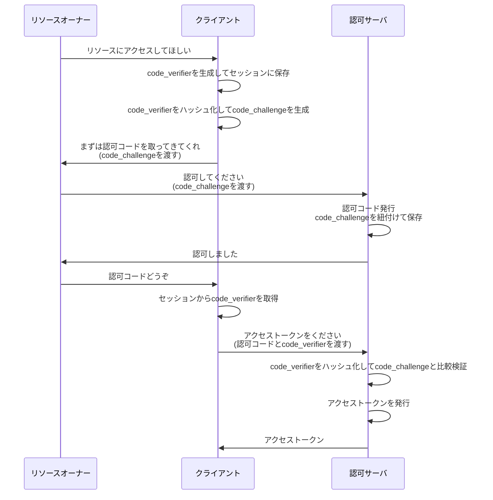

1. リソースオーナーがクライアントに対し、「リソースにアクセスしてほしい」とリクエストする
2. クライアントが code_verifier を生成してセッションに保存する
3. クライアントが code_verifier をハッシュ化して code_challenge を生成する
4. クライアントがリソースオーナーに対し、「まずは認可コードを取ってきてくれ」とリソースオーナーをリダイレクトさせる。このとき、先程の code_challenge を渡す
5. リソースオーナーが認可サーバにアクセスし、認可サーバに対して「認可してください」とリクエストする。このとき、先程の code_challenge も渡す
6. 認可サーバが認可コードを生成し、先程の code_challenge と紐付けて保存
7. 認可サーバがリソースオーナーに対して「認可しました」と認可コードを返す
8. リソースオーナーがクライアントに対し、「認可コードどうぞ」とリクエストする
9. クライアントがセッションから code_verifier を取り出す
10. クライアントが認可サーバに対してアクセストークンを取得するリクエストを行う。このとき、認可コードと code_verifier を渡す
11. 認可サーバは code_verifier をハッシュ化し、認可コード生成時に保存した code_challenge と比較検証
12. 先程の検証が一致した場合、アクセストークンを発行
13. 認可サーバがクライアントに対してアクセストークンを返す

このようにして、PKCE によりフロー開始時のクライアントとアクセストークン取得時のクライアントが同一であることを証明することができます。

注意すべき点として、PKCE はクライアントが正当であることを保証するものではなく、クライアントの一致のみを保証するものであるということです。そのため、PKCE を導入することで、クライアントの正当性を保証することはできません。

参考リンク
https://qiita.com/TakahikoKawasaki/items/63ed4a9d8d6e5109e401

## 認可コードはどのように奪われるんでしょうか？ ⏩

認可コードが奪われる攻撃について、いくつか想定されます。

以下に提示してみます。

- リダイレクト URI の悪用 (Web アプリケーションの場合)
- カスタム URI スキームの悪用 (Public Client かつネイティブアプリの場合)

認可コードが奪われると、アクセストークンが取得され、ユーザのリソースが不正にアクセスされる可能性があります。
なお、認可コードが奪われるだけでは、アクセストークンが取得されるわけではありません。認可コードをアクセストークンに引き換えるための攻撃については、次の質問にて解説します。

それでは、それぞれの攻撃について、具体的な攻撃手法を見ていきましょう。

### リダイレクト URI の悪用 (Web アプリケーションの場合)

OAuth においてリソースオーナーが認可コードを取得したあと、リソースオーナーはクライアントにリダイレクトし、認可コードを渡します。
このときのリダイレクト先は、フロー開始時にクライアントが指示したリダイレクト URI です。
しかし、リダイレクト URI の値自体はクライアントと認可サーバは直接やり取りせず、リソースオーナーのブラウザを通じてパラメータが渡されます。
そのため、リダイレクト URI の値を変更することで、任意のサイトにリダイレクトを行い、結果的に認可コードを奪う攻撃が考えられます。

:::message
この攻撃は、オープンリダイレクト攻撃とも呼ばれます。
:::
詳しく見ていきましょう。

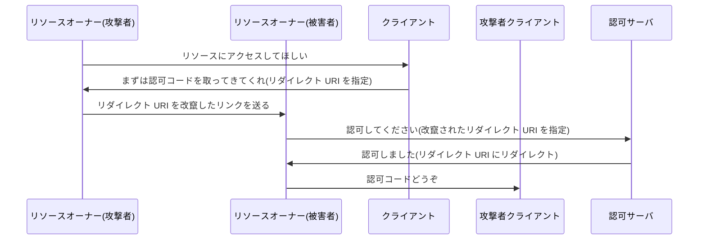

1. リソースオーナー(攻撃者)がクライアントに対し、「リソースにアクセスしてほしい」とリクエストする
2. クライアントがリソースオーナー(攻撃者)に対し、「まずは認可コードを取ってきてくれ」と言ってリソースオーナーをリダイレクトさせる

ここまでは通常のフローと同じです。しかし、攻撃者ユーザはここで、リダイレクトをあえてストップし、リダイレクト URI を改竄したリンクを被害者ユーザに送ります。

3. リソースオーナー(被害者)が認可サーバにアクセスし、認可サーバに対して「認可してください」とリクエストする
4. 認可サーバがリソースオーナー(被害者)に対して「認可しました」と言ってリダイレクト URI にリダイレクト
5. リソースオーナー(被害者)はここで、正規のクライアントではなく、攻撃者の用意したクライアントに認可コードを渡してしまう

このようにして、攻撃者は被害者の認可コードを取得することができます。
認可コードが奪取されたあとは、攻撃者はなんらかの方法で認可コードをアクセストークンに引き換えますが、ここでは解説しません。

では、これに対策を施すためにはどうすればいいでしょうか？
リダイレクト URI の悪用を防ぐためには、リダイレクト先を信頼できる Web サイトに限定することが有効です。つまり、認可サーバがリダイレクト指示を行う前に、リソースオーナーから指定されたリダイレクト URI が、適切なリダイレクト先であるかどうかを確認することが重要です。
このためには、指定されたリダイレクト URI が、クライアント登録の際に登録されたリダイレクト URI と完全に一致しているかどうかを確認することが有効です。
ここで、前方一致などの部分一致ではなく、完全一致であることが重要です。

https://qiita.com/TakahikoKawasaki/items/9f284b7bc05734ec8cca#%E3%82%BB%E3%82%AD%E3%83%A5%E3%83%AA%E3%83%86%E3%82%A3%E5%B0%82%E9%96%80%E5%AE%B6%E3%81%AE%E6%84%8F%E8%A6%8B

これにより、リダイレクト URI の悪用攻撃が防げるかを確認しましょう。

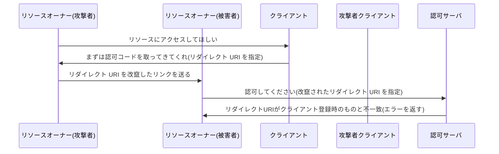

1. リソースオーナー(攻撃者)がクライアントに対し、「リソースにアクセスしてほしい」とリクエストする
2. クライアントがリソースオーナー(攻撃者)に対し、「まずは認可コードを取ってきてくれ」と言ってリソースオーナーをリダイレクトさせる
3. 攻撃者はリダイレクト URI を改竄したリンクを被害者ユーザに送る
4. リソースオーナー(被害者)が認可サーバにアクセスし、認可サーバに対して「認可してください」とリクエストする
5. 認可サーバはリダイレクト URI がクライアント登録時のものと不一致しているため、エラーを返す
6. 攻撃者の用意したクライアントは、認可コードを取得できない

このように、リダイレクト URI の悪用攻撃を防ぐことができています。

参考リンク
https://webapppentestguidelines.github.io/newtechtestdoc/docs/oauth/#%e3%82%aa%e3%83%bc%e3%83%97%e3%83%b3%e3%83%aa%e3%83%80%e3%82%a4%e3%83%ac%e3%82%af%e3%82%bf
https://zenn.dev/ksrnnb/articles/697b34703a36a1#redirect_uri
https://qiita.com/TakahikoKawasaki/items/9f284b7bc05734ec8cca
https://zenn.dev/inabajunmr/articles/c46104af0ee253

### カスタム URL スキームの悪用 (Public Client かつネイティブアプリの場合)

先程の攻撃手法では、Web アプリケーションのリダイレクト URI を悪用することで、リソースオーナーに踏ませ、認可コードを奪っていました。
対策としては、リダイレクト先を信頼できる Web サイトに限定することで対処していました。

しかし、ネイティブアプリがクライアントの場合、リダイレクト後に開かれるアプリが複数存在する可能性が考えられます。
詳しく見ていきましょう。

Android や iOS のアプリ開発者に提供されている機能として、カスタム URL スキームがあります。
https://zenn.dev/quicksilversel/articles/7062da63e549fd

みなさんも、ブラウザの特定の URL をクリックした際にアラートが表示され、許可をすると Web サイトではなくアプリが起動したという経験があるかもしれません。
これに利用されている機能がカスタム URL スキームです。

ネイティブアプリの存在するスマホ端末の環境では、カスタム URL スキームを開くことにより、そのカスタム URL スキームの起動に対応しているアプリが起動します。Android であれば、開くアプリを選択することが可能です。iOS であればデフォルトで対応付けられているアプリが起動します。
この仕組みは非常に便利なのですが、一方で同じ URL であっても開くアプリが一意に決まらないという特徴があります。
そのため、カスタム URL スキームをリダイレクト先の URL として設定していた場合、本来意図していないアプリをクライアントとして指定してしまう可能性があります。

更にこれを攻撃者が悪用した場合、以下のような攻撃が考えられます。

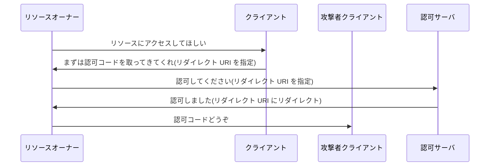

1. 攻撃者が、被害者のスマホ端末にアプリをインストールさせる
2. リソースオーナー(被害者)がクライアントに対し、「リソースにアクセスしてほしい」とリクエストする
3. クライアントがリソースオーナーに対し、「まずは認可コードを取ってきてくれ」と言ってリソースオーナーをリダイレクトさせる
4. リソースオーナーが認可サーバにアクセスし、認可サーバに対して「認可してください」とリクエストする
5. 認可サーバがリソースオーナーに対して「認可しました」と言ってリダイレクト URI にリダイレクト
6. リソースオーナー(被害者)はここで、正規のクライアントではなく、攻撃者の用意したクライアントアプリを起動してしまう
7. 攻撃者の用意したクライアントアプリが起動し、認可コードを取得する

このようにして、認可コードが奪われる可能性があります。
認可コードが奪取されたあとは、攻撃者はなんらかの方法で認可コードをアクセストークンに引き換えますが、ここでは解説しません。

:::message
マジレスすると「ユーザのスマホにやばいアプリをインストールさせられている時点で、かなり詰み」なのですが・・・
悪意あるアプリをインストールすると、こんなことも可能ですよ、という思考実験としては面白いと思います。
:::

では、対策はどうすればいいのでしょうか？

根本的な対策として、HTTP URL スキームを利用することが挙げられます。
HTTP URL スキームを用いることで、アプリと Web サイトの対応が一対一となり、リンクを開くアプリを一つに限定することができます。
しかし、この対策は OAuth の範囲外となります。なぜなら、この機能は OS の提供する機能であり、OAuth の仕様では対応しきれない部分であるためです。
そのため、参考リンクからより詳しい詳細を確認いただけると幸いです。

参考リンク
https://akaki.io/2021/authz_code_interception

## 奪われた認可コードはどのように使われるんでしょうか？⏩

先程確認した攻撃手法で認可コードを奪取したあと、攻撃者がリソースにアクセスするためには、その認可コードをアクセストークンに引き換える必要があります。
奪った認可コードをアクセストークンと引き換える攻撃について、いくつか手法が想定されます。

- クライアントの偽装 (Public Client の場合)
- 正規クライアントに対する認可コードインジェクション攻撃 (Public/Cofidential Client の場合)
  それでは、それぞれの攻撃について、具体的な攻撃手法を見ていきましょう。

### クライアントの偽装 (Public Client の場合)

認可コードを奪取した攻撃者は、その認可コードをアクセストークンに引き換えるために、認可サーバに対してアクセストークンの取得リクエストを行います。Public Client の場合はクライアント認証が存在せず、認可コードとクライアント ID のみでアクセストークンを取得することができます。

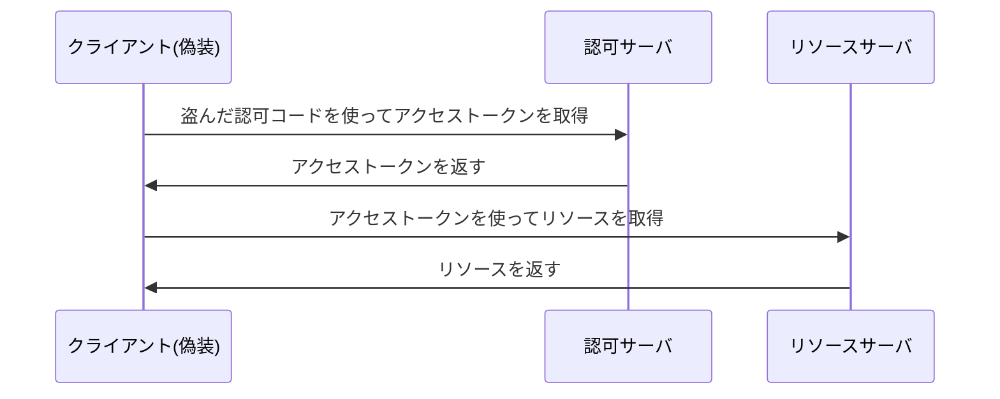

正規のクライアントを詐称してアクセストークンを取得するだけの攻撃です。
詐称しているため、認可サーバからは正規のクライアントのように見えています。

### 正規クライアントに対する認可コードインジェクション攻撃 (Public/Cofidential Client の場合)

クライアントを模倣するのではなく、途中まで正規のクライアントでフローを進め、正規のクライアントでアクセストークンを取得する際に認可コードを奪取したコードに差し替える攻撃です。

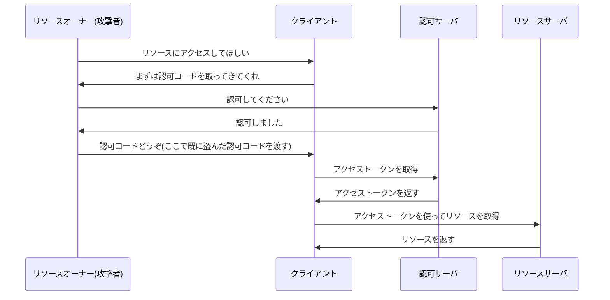

正規のクライアントで途中まで進め、認可コードを渡す段階で差し替える(コードをインジェクションする)攻撃といえます。

### 対策: PKCE の導入

これらの攻撃の対策として、PKCE (Proof Key for Code Exchange) の導入が挙げられます。

PKCE とは前述の通り、フローを開始したクライアントが、アクセストークンを取得しようとするクライアントと同一であることを証明するための仕組みです。
PKCE を導入することで、攻撃者が認可コードを奪取しても、その認可コードをアクセストークンに引き換えることができないようになります。

### PKCE によるクライアント偽装攻撃の対策

では、PKCE を利用することにより、クライアントの偽装を防ぐことができるかを確認しましょう。

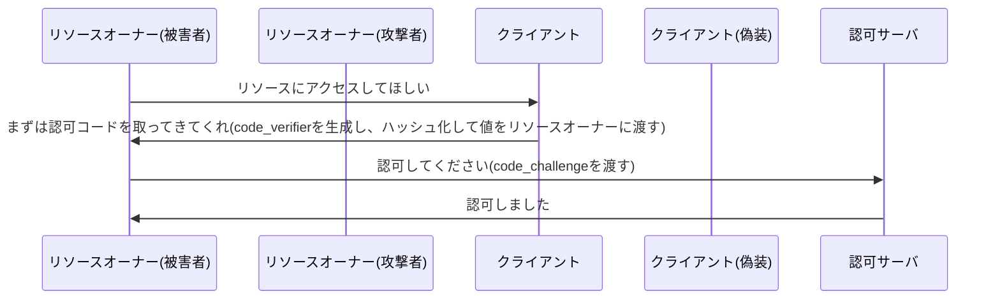

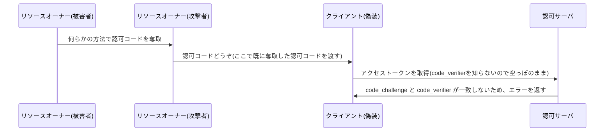

1. リソースオーナー(被害者)がクライアントに対し、「リソースにアクセスしてほしい」とリクエストする
2. クライアントがリソースオーナー(被害者)に対し、「まずは認可コードを取ってきてくれ」と言ってリソースオーナー(被害者)をリダイレクトさせる。このとき、code_verifier を生成してセッションに保存。かつ、SHA-256 でハッシュ化して code_challenge とし、リソースオーナー(被害者)に渡す
3. リソースオーナー(被害者)が認可サーバにアクセスし、認可サーバに対して「認可してください」とリクエストする。このとき、先程の code_challenge も渡す
4. 認可サーバがリソースオーナー(被害者)に対して「認可しました」と言ってリダイレクト URI にリダイレクト。このとき、生成した認可コードに対し、code_challenge を紐付けて保存
5. ここで、何らかの方法で、リソースオーナー(被害者)が認可コードを奪取される
6. リソースオーナー(攻撃者)がクライアント(偽装)に対し、「認可コードどうぞ」とリクエストする。しかし、ここで適切な code_verifier が必要だが、攻撃者はハッシュ化前のランダム文字列を知らないので空っぽのまま
7. クライアントが認可サーバに対してアクセストークンを取得するリクエストを行う。このときセッションから code_verifier を取得し、認可サーバに渡す
8. 認可サーバは、code_verifier を同じように SHA-256 でハッシュ化し、認可コード生成時に保存した code_challenge と比較。一致しないため、エラーを返す

このように、クライアントの偽装を防ぐことができます。

### PKCE による認可コードインジェクション攻撃の対策

では、認可コードインジェクション攻撃に対して PKCE がどのように機能するかを確認しましょう。
ここで、リソースオーナー(被害者)の認可コードを hoge、リソースオーナー(攻撃者)の認可コードを fuga とします。

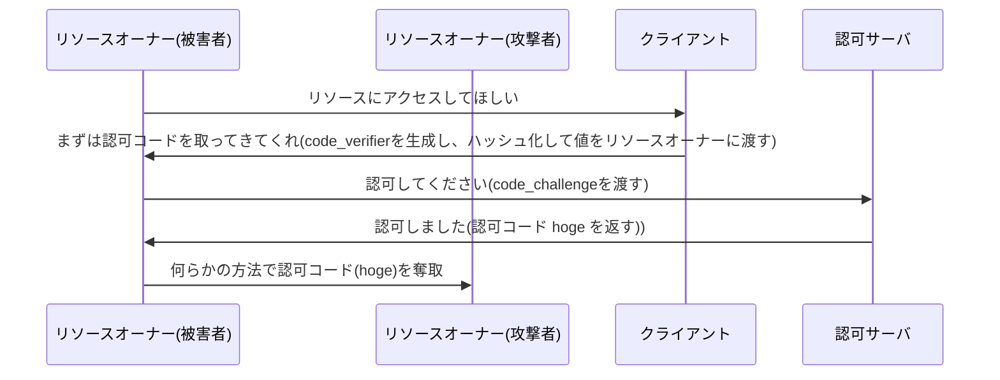

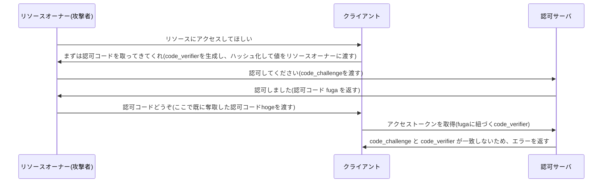

1. リソースオーナー(被害者)がクライアントに対し、「リソースにアクセスしてほしい」とリクエストする
2. クライアントがリソースオーナー(被害者)に対し、「まずは認可コードを取ってきてくれ」と言ってリソースオーナー(被害者)をリダイレクトさせる。このとき、code_verifier を生成してセッションに保存。かつ、SHA-256 でハッシュ化して code_challenge とし、リソースオーナー(被害者)に渡す
3. リソースオーナー(被害者)が認可サーバにアクセスし、認可サーバに対して「認可してください」とリクエストする。このとき、先程の code_challenge も渡す
4. 認可サーバがリソースオーナー(被害者)に対して「認可しました」と言って認可コード hoge を返し、リダイレクト URI にリダイレクト。このとき、生成した認可コードに対し、code_challenge を紐付けて保存
5. ここで、何らかの方法で、リソースオーナー(被害者)が認可コードを奪取され、リソースオーナー(攻撃者)が認可コード hoge を取得
6. リソースオーナー(攻撃者)がクライアントに対し、「リソースにアクセスしてほしい」とリクエストする
7. クライアントがリソースオーナー(攻撃者)に対し、「まずは認可コードを取ってきてくれ」と言ってリソースオーナー(攻撃者)をリダイレクトさせる。このとき、code_verifier を生成してセッションに保存。かつ、SHA-256 でハッシュ化して code_challenge とし、リソースオーナー(攻撃者)に渡す
8. リソースオーナー(攻撃者)が認可サーバにアクセスし、認可サーバに対して「認可してください」とリクエストする。このとき、先程の code_challenge も渡す
9. 認可サーバがリソースオーナー(攻撃者)に対して「認可しました」と言って認可コード fuga を返し、リダイレクト URI にリダイレクト。このとき、生成した認可コードに対し、code_challenge を紐付けて保存
10. リソースオーナー(攻撃者)がクライアントに対し、認可コードを fuga から hoge に差し替えて渡す。
11. クライアントが認可サーバに対してアクセストークンを取得するリクエストを行う。このときセッションから fuga に紐づく code_verifier を取得し、認可サーバに渡す
12. 認可サーバは、code_verifier を同じように SHA-256 でハッシュ化し、認可コード生成時に保存した code_challenge と比較

最後の検証において、認可サーバは以下の 2 つの値の一致を検証します。

- 渡された code_verifier(認可コード fuga に紐づく)のハッシュ
- 保存されている code_challenge(認可コード hoge に紐づく)

ここで、異なる認可コードに紐づく code_challenge と code_verifier が渡され、ハッシュが一致しないため、エラーを返すことができます。

このように、PKCE を利用することで、クライアントの偽装や認可コードインジェクション攻撃を防ぐことができます。

## OAuth における CSRF 攻撃はどのようなものですか？⏩

まず初めに、一般的な CSRF 攻撃について解説をします。

https://owasp.org/www-community/attacks/csrf

CSRF 攻撃とは、攻撃者ユーザが被害者のユーザを騙し、被害者ユーザに対して当人の意図しない操作をさせる攻撃手法です。
攻撃の手法としては、URL を踏ませる、JavaScript で自動送信される隠しフォームを設置する、などがあります。

次に、OAuth における CSRF 攻撃について解説します。
OAuth における CSRF は、一言で言うと「リソース押し付け攻撃」です。
攻撃者が被害者に対して、攻撃者のリソースにアクセスさせることが目的となります。

では、被害者が攻撃者のリソースにアクセスすることの何が問題なのでしょうか？
被害者は攻撃者にリンクを踏まされたことに気が付かないため、攻撃者のリソースを自分のリソースだと勘違いしている可能性があります。
そのため、攻撃者のリソースに対して、攻撃者のリソースであると知らないまま、被害者の機密情報をアップロードしてしまうでしょう。
もし知られたくない免許証の写真やクレジットカード情報などを間違えて攻撃者のドライブにアップロードしてしまったら・・・と考えると、被害の大きさが実感できるかと思います。

このように、OAuth における CSRF は、リソース押し付け攻撃として、攻撃者のリソースにアクセスさせることが目的となります。

攻撃の流れは以下のとおりです。

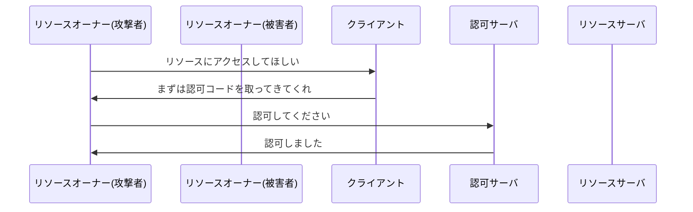

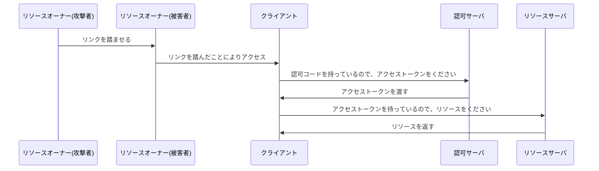

1. 攻撃者は、既に攻撃者のリソースを持っているものとする。
   攻撃者は OAuth で連携をはじめ、フローを開始
2. リソースオーナー(攻撃者)がクライアントに対し、「リソースにアクセスしてほしい」とリクエストする
3. クライアントがリソースオーナー(攻撃者)に対し、「まずは認可コードを取ってきてくれ」と言ってリソースオーナー(攻撃者)をリダイレクトさせる
4. リソースオーナー(攻撃者)が認可サーバにアクセスし、認可サーバに対して「認可してください」とリクエストする
5. 認可サーバがリソースオーナー(攻撃者)に対して「認可しました」と言って認可コードをもたせ、リソースオーナー(攻撃者)をクライアントにリダイレクトさせようとする

ここまでは通常のフローと同じです。しかし、攻撃者ユーザはここで、リダイレクトをあえてストップし、リダイレクト URI を被害者ユーザに送ります。

ここで、被害者が URI を踏んでしまった場合、どのように処理が進むでしょうか？

6. リソースオーナー(被害者)はクライアントに対して攻撃者の認可コードを渡す
7. クライアントが認可コードを持って認可サーバにアクセスし、「認可コードを持っているので、アクセストークンをください」とリクエストを送る
8. 認可サーバがクライアントに対してアクセストークンを返す
9. クライアントはアクセストークンが手に入ったので、リソースサーバにアクセスし、リソースサーバに対してアクセストークンを渡す
10. リソースサーバはアクセストークンを受け取り、何らかの手段で検証し、成功すればリソースを返す

このように、被害者は攻撃者の認可コードでアクセストークンを取得してしまい、攻撃者のリソースにアクセスしてしまうことになります。

では、これに対策を施すためにはどうすればよいでしょうか？
それには、まず通常の CSRF 攻撃ではどのような対策をしているかを振り返る必要があります。

OAuth に関係ない一般的な Web アプリケーションにおける CSRF 攻撃の対策は、CSRF トークンというものを利用することが一般的です。
参考資料として、OWASP が公開している「Cross-Site Request Forgery (CSRF) Prevention Cheat Sheet」を挙げておきます。

https://cheatsheetseries.owasp.org/cheatsheets/Cross-Site_Request_Forgery_Prevention_Cheat_Sheet.html#synchronizer-token-pattern

CSRF トークンとは、以下の仕様であることが一般的です。

- サーバに接続しているユーザのセッションに保存されている
- 接続ユーザごと(セッションごと)に一意である
- 十分に大きくてランダムな文字列であり、推測されにくい

最初にユーザが Web ページにアクセスした際、サーバはユーザのセッションを生成します。
(そして、セッション ID をクッキーに保存してユーザに返却します。ユーザはクッキーを保持しており、次回以降のリクエストにもセッション ID が送信されます。)
次に、フォームの含まれる Web ページにユーザがアクセスした場合、サーバは CSRF トークンを生成し、セッションに保存します。また、フォームにも CSRF トークンを埋め込みます。
最後に、ユーザがフォームを送信する際、フォーム内容とともに CSRF トークンも送信されます。そして、サーバは送信された CSRF トークンとセッションに保存されている CSRF トークンの一致を検証し、一致すればリクエストを受け付けます。
また、これが一致していなかった場合、違うユーザからのリクエストであると判断し、リクエストを拒否します。

このようにすることで、第三者ユーザによる意図しない操作をさせられる攻撃を防ぐことができます。

OAuth における CSRF 攻撃に対しても、同様の対策を施すことができます。

つまり、クライアントがフローを開始する際に CSRF トークンのようなものを生成してセッションに保存し、リソースオーナーが認可コードをクライアントに返す際に CSRF トークンの一致を検証することで、攻撃者による CSRF 攻撃を防ぐことができます。
OAuth における CSRF トークンのようなものを、state と呼びます。

:::message
ここでのセッションとは OAuth 特有の概念ではなく、Web 技術における一般的なセッションのことを指します。
具体的な実装は、Confidential Client であれば Redis のような外部ストレージを持ち、接続しているユーザ端末ごとにセッションを管理する構造が一般的でしょう。Public Client の場合はクライアントの保存領域(sessionStorage)などに保存することになると思われます。
:::

具体的な利用方法について解説します。
まずフローの開始時に、クライアントは state を生成しセッションに保存します。そしてリソースオーナーに対してリダイレクトさせる際に、state をリクエストパラメータとして付与します。
次に、リソースオーナーが一通り認可の処理を済ませてクライアントに認可コードを返す際、state も一緒に渡してもらいます。
クライアントは、セッションから取り出した state と、リソースオーナーから渡された state の一致を検証し、一致すれば state をセッションから削除し、アクセストークンの取得処理を続行します。
また、一致しない場合はエラーを返し、処理を中断します。

一般的な CSRF トークンと比較してみましょう。

| 項目          | 生成タイミング | 保存先     | 検証タイミング   | 検証内容                                                         |
| ------------- | -------------- | ---------- | ---------------- | ---------------------------------------------------------------- |
| CSRF トークン | フォーム表示時 | セッション | フォーム送信時   | フォームにアクセスしたユーザとフォーム送信したユーザの一致       |
| state         | フロー開始時   | セッション | 認可コード取得時 | フローを開始しようとしたユーザと認可コードを返却したユーザの一致 |

これにより、CSRF 攻撃が防げるかを確認しましょう。

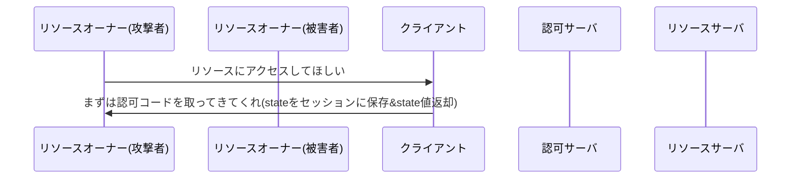

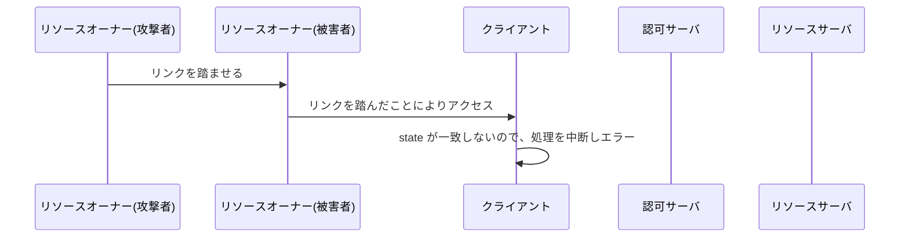

1. 攻撃者は、既に攻撃者のリソースを持っているものとする。
   攻撃者は OAuth で連携をはじめ、フローを開始
2. リソースオーナー(攻撃者)がクライアントに対し、「リソースにアクセスしてほしい」とリクエストする
3. クライアントがリソースオーナー(攻撃者)に対し、「まずは認可コードを取ってきてくれ」と言ってリソースオーナー(攻撃者)をリダイレクトさせる
   このとき、クライアントは state を生成し、セッションに保存。かつ、リクエストパラメータに state を付与してリソースオーナーに state を渡す
4. リソースオーナー(攻撃者)が認可サーバにアクセスし、認可サーバに対して「認可してください」とリクエストする
5. 認可サーバがリソースオーナー(攻撃者)に対して「認可しました」と言って認可コードをもたせ、リソースオーナー(攻撃者)をクライアントにリダイレクトさせようとする
   このとき、state もリクエストパラメータに付いてきている
   ここで、攻撃者は、クライアントに認可コードを送信する通信をあえて遮断し、先程のように被害者にリダイレクト先 URI(URL) を踏ませようとします。

では、続きを見ていきましょう。

6. リソースオーナー(被害者)はクライアントに対して認可コードを渡す
   このとき、state も一緒に渡す
7. クライアントはアクセストークンの引き換えを行う前に、セッションから取り出した state と、リソースオーナーから渡された state が一致するかどうかを確認
   一致しない場合は処理を中断
   この場合は、被害者のセッションに state が存在せず、被害者のセッション内部の state と被害者から渡された state が一致せずエラー。そのため、CSRF 攻撃が行われていると判断し、処理を中断

このように、state を用いることで、CSRF 攻撃を防ぐことができています。

余談として、PKCE と state の違いを表としてまとめておきましょう。

| 項目  | 用途                                 | 生成・検証する登場人物                 | 一致検証する対象                                                                |
| ----- | ------------------------------------ | -------------------------------------- | ------------------------------------------------------------------------------- |
| PKCE  | 認可コードインジェクション攻撃を防ぐ | クライアントが生成・認可サーバが検証   | 認可コードリクエストしたクライアント=アクセストークンリクエストしたクライアント |
| state | CSRF 攻撃を防ぐ                      | クライアントが生成・クライアントが検証 | フローを開始しようとしたユーザ=認可コードを返却したユーザ                       |

それぞれの責務を混同しないように注意しましょう。

参考リンク
https://openid-foundation-japan.github.io/rfc6819.ja.html#section_csrf
https://booth.pm/ja/items/1877818
(p.20)

## 総まとめ: 具体的な OAuth フロー

では、具体的に Condifential Client でどのようなパラメータを用いたフローが行われるのかを見ていきましょう。

- フレームワーク: OAuth2.0
- グラントタイプ: 認可コードフロー
- クライアントタイプ: Confidential
- セキュリティ機構: PKCE, state

上記のフロー解説で述べた順序に従って、具体的なパラメータを見ていきます。

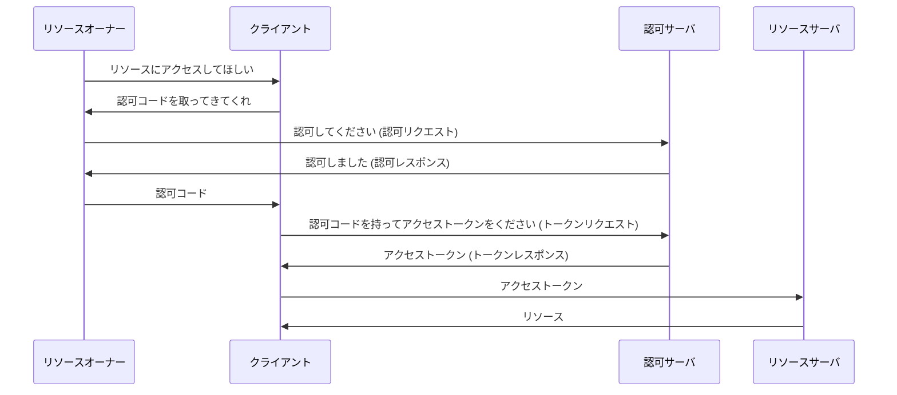

1. リソースオーナーがクライアントに対し、「リソースにアクセスしてほしい」とリクエストする

ここについては、クライアントアプリケーションの仕様によります。
基本的には、リソース連携を行うボタンをクリックすることで、リソースオーナーがクライアントに対してリクエストを行い、次のステップに進みます。

2. クライアントがリソースオーナーに対し、「まずは認可コードを取ってきてくれ」と言ってリソースオーナーをリダイレクトさせる

以下は、クライアントがリソースオーナーをリダイレクトさせる際のレスポンス例です。

```
302 Found
Location: (認可サーバの認可エンドポイント)?code_challenge=(PKCE 用のランダムな文字列のハッシュ)&code_challenge_method=S256&client_id=(クライアント識別子)&redirect_uri=(リダイレクト先 URI)&response_type=code&scope=(リソースへのアクセス範囲)&state=(CSRF 対策のためのランダムな文字列)
```

認可サーバの認可エンドポイントとしては、`(認可サーバのホスト)/oauth2/authorize` などが考えられます。

付随するパラメータは以下の通りです。

- response_type: code (認可コードを取得するためのリクエスト)
- client_id: (クライアント識別子)
- redirect_uri: (リダイレクト先 URI。認可コードはこの URI に渡されることになる)
- scope: (リソースへのアクセス範囲)
- state: (CSRF 対策のためのランダムな文字列)
- code_challenge: (PKCE 用のランダムな文字列のハッシュ)
- code_challenge_method: S256 (PKCE 用のランダムな文字列のハッシュ化方法)

これに沿って、次のステップでリソースオーナーは認可サーバにアクセスします。

なお、リダイレクトの仕組みは 302 Found で行わず、JavaScript で行う実装の場合もあります。

3. リソースオーナーが認可サーバにアクセスし、認可サーバに対して「認可してください」とリクエストする

先程のリダイレクト指示で、リソースオーナーは認可サーバにアクセスします。

```
GET (認可エンドポイント)?response_type=...
```

(パラメータは先程と同じ)

その後、アクセス権を認めるかどうかを選択する画面が表示されます。

ここについては、認可サーバの仕様によります。
アクセスを許可すると、次のステップに進みます。

参考リンク
http://openid-foundation-japan.github.io/rfc6749.ja.html#code-authz-req

4. 認可サーバがリソースオーナーに対して「認可しました」と言って認可コードをもたせ、リソースオーナーをクライアントにリダイレクトさせる

```
302 Found
GET (リダイレクト先 URI)?code=(認可コード)&state=(CSRF 対策のためのランダムな文字列)
```

リダイレクト先 URI は、クライアントがリソースオーナーに指定した URI です。認可サーバのトークンエンドポイントとなります。

付随するパラメータは以下の通りです。

- code: (認可コード)
- state: (CSRF 対策のためのランダムな文字列)

ここでは、PKCE に関するパラメータは入ってこないことに注意してください。
state については含まれます。

参考リンク
http://openid-foundation-japan.github.io/rfc6749.ja.html#code-authz-resp

5. リソースオーナーはクライアントに対して認可コードを渡す

4 のリダイレクトにより、自動的にクライアントに認可コードが渡されます。

6. クライアントが認可コードを持って認可サーバにアクセスし、「認可コードを持っているので、アクセストークンをください」とリクエストを送る

以下は、クライアントが認可コードを持ってアクセストークンを取得する際のリクエスト例です。

```
POST (認可サーバのトークンエンドポイント)
```

認可サーバのトークンエンドポイントとしては、`(認可サーバのホスト)/oauth2/token` などが考えられます。

付随するパラメータは以下の通りです。

- grant_type: authorization_code (認可コードフローを使うことを示す)
- code: (認可コード)
- redirect_uri: (リダイレクト先 URI。認可コード取得時のパラメータの値と同じ)
- code_verifier: (PKCE 用のランダムな文字列)
- client_id: (クライアント識別子)

また Confidential Client の場合、クライアント認証が必要です。
クライアント認証として client_secret_basic 方式を利用しているため、Authorization ヘッダにクライアント ID とクライアントシークレットを Base64 エンコードした値を設定します。

```http
Authorization: Basic (Base64エンコードされたクライアントIDとクライアントシークレット)
```

参考リンク
http://openid-foundation-japan.github.io/rfc6749.ja.html#token-req

7. 認可サーバがクライアントに対してアクセストークンを返す

以下は、認可サーバがクライアントに対してアクセストークンを返す際のレスポンス例です。

```
200 OK
Content-Type: application/json

{
  "access_token": (アクセストークン),
  "token_type": "Bearer",
  "expires_in": (アクセストークンの有効期限),
  "refresh_token": (リフレッシュトークン),
  "scope": (リソースへのアクセス範囲)
}
```

このようにして、クライアントはアクセストークンを取得できました。
お疲れ様でした！

リフレッシュトークンやスコープについては、応用編で解説します。

参考リンク
http://openid-foundation-japan.github.io/rfc6749.ja.html#anchor25

章の参考リンク
https://qiita.com/TakahikoKawasaki/items/200951e5b5929f840a1f#1-%E8%AA%8D%E5%8F%AF%E3%82%B3%E3%83%BC%E3%83%89%E3%83%95%E3%83%AD%E3%83%BC
https://moneyforward-dev.jp/entry/2022/12/01/authorization-code-grant-flow/
https://booth.pm/ja/items/1877818
(p.12)

## 余談: 「なぜ我々は鍵を落としてはいけないのか」

ここまで、アクセストークンの漏洩の危険性について、何度も触れてきました。
その解像度を更に上げるため、鍵という概念について考えてみましょう。

鍵という概念を皆さんは知っていますか？鍵の仕組みではなく、鍵という抽象化された概念についてです。

例えば、自分の家の鍵を持っているとします。この鍵は、自分の家のドアを開けるために使うものです。この鍵があれば、自分の家に入ることができます。
では、この鍵を落としてしまった場合、なぜあなたは「不味いことになった」と感じるのでしょうか？それは、他人があなたに代わって、あなたの家に入ることができるからです。

このように鍵は、それを手に入れた時点で持ち主に関係なく、リソースにアクセスできる権限を利用者に与えてしまうものです。使っている人間がどのような人間かということを、リソース側は何も気にしません。

アクセストークンも同様です。アクセストークンは、リソースに対する鍵です。
アクセストークンを持っている人間がどのような人間かということを、リソース側は何も気にしません。
そのため、アクセストークンを落としてしまった場合、他人があなたに代わって、リソースにアクセスできる可能性があるのです。

:::details 応用の話

実は、RFC6819 では、利用主が認められた者でないと利用できないアクセストークンについても言及されています。

ここでは、利用主を判断するかどうかという軸で、アクセストークンを 2 つに分類しています。

> bearer token
> bearer token とは, それを受け取ったいかなるクライアントにも利用可能なトークンである ([RFC6750]).
> トークンを所有していることのみがその利用条件であるため, エンドポイント間での通信がセキュアに保たれ, 許可されたエンドポイントのみがそのトークンにアクセスできる状態を担保することが重要である

> proof token
> proof token は特定のクライアントにのみ利用可能なトークンである.
> クライアントは, トークン利用に際して毎回自身がトークン利用可能な主体であることを証明するために何らかの処理を行う必要がある.
> クライアントにリクエスト内容に対して特定のトークンと紐づいた秘密鍵を用いて電子署名を要求する, MAC タイプのアクセストークン ([OAuth‑HTTP‑MAC]) などがその例である.

https://openid-foundation-japan.github.io/rfc6819.ja.html#section_tokens

あれ、これってクライアント認証の話と似ていませんか？と思った方、正解です。
proof token に関しては、応用編で解説していきます。
とりあえずアクセストークンに関しては、Bearer Token を主体として解説を進めていきます。

なお、以下の記事では proof token について、「Sender Constrained Tokens」という名称で解説されています。

https://ritou.hatenablog.com/entry/2018/09/20/111009
:::

## 余談: OAuth で認証を実装した場合

OIDC が登場する以前は、OAuth にプロフィール API をリソースとして認可させ、認証の仕組みが実装されていました。では、OAuth とプロフィール API を用いて、どのように認証が実装できるのでしょうか？

実際の流れは以下の通りです。ここでは、認可コードフローを用いた例を示します。

1. リソースオーナーがクライアントに対し、「リソースにアクセスしてほしい」とリクエストする
2. クライアントがリソースオーナーに対し、「まずは認可コードを取ってきてくれ」と言ってリソースオーナーをリダイレクトさせる
3. リソースオーナーが認可サーバにアクセスし、認可サーバに対して「認可してください」とリクエストする
4. 認可サーバがリソースオーナーに対して「認可しました」と言って認可コードをもたせ、リソースオーナーをクライアントにリダイレクトさせる
5. リソースオーナーはクライアントに対して認可コードを渡す
6. クライアントが認可コードを持って認可サーバにアクセスし、「認可コードを持っているので、アクセストークンをください」とリクエストを送る
7. 認可サーバがクライアントに対してアクセストークンを返す
8. クライアントはアクセストークンが手に入ったので、リソースサーバにアクセスし、リソースサーバに対してアクセストークンを渡してユーザのプロフィール情報をリクエストする
9. リソースサーバはアクセストークンを受け取り、何らかの手段で検証し、成功すればプロフィール情報を返す

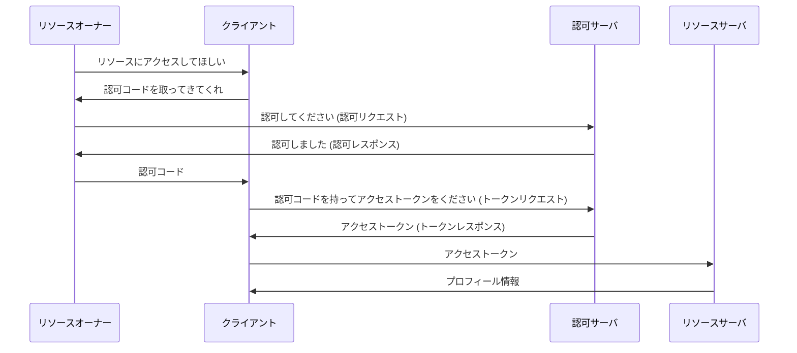

### どのような問題があるの？

この実装には、以下の問題点があります。

- 攻撃者のリソースオーナーが盗んだアクセストークンをクライアントに渡して
  なりすましログインが可能になる
- プロフィール API を実装する方法が標準化されておらず、独自実装になってしまう

二つ目については明らかなので簡単に説明します。OAuth は基本的にリソース認可の仕組みであり、プロフィール API を認証に利用することは本来の目的から外れています。
認証用途として利用する場合、規定されていない独自実装が増えてしまいます。
これに対処するために、認証の仕組みとして標準化されている OIDC を利用することが推奨されています。

一つ目については、今までの事前知識も含め、確認していきましょう。この問題は、「単なる OAuth 2.0 を認証に使うと、車が通れるほどのどでかい穴があく」というワードでよく知られているものです。

まずこの問題は、以下の条件を満たす場合に発生します。

- フロントエンドからアクセストークンをクライアントに渡すことができる
  - つまり以下の場合が該当
    - ユーザがフロントエンドから
      アクセストークンを渡すことができる(インプリシットフロー)
    - クライアントが Public Client であり
      フロントエンドでアクセストークンを保管している
- リソースオーナーから渡されたアクセストークンを検証しない
  - 渡されたアクセストークンが自身向けに発行されたものであるかどうかを
    クライアントが検証していない

ここで、Public Client であればアクセストークンをフロントエンドで保管しているケースについてはフロー終了後の話であるため、OAuth の管轄外として今回は無視します。
この攻撃の危険性が一番わかり易い状況設定として、Confidential Client でインプリシットフローを使った場合を考えてみましょう。
この攻撃は、いわゆるトークンインジェクション攻撃とも呼ばれます。先程の認可コードインジェクション攻撃と似ていますが、こちらはアクセストークンを利用することで他人のユーザになりすます攻撃です。

まず攻撃者は、攻撃者のクライアントを作成します。この攻撃者クライアントはアクセストークンを盗むことが役目です。

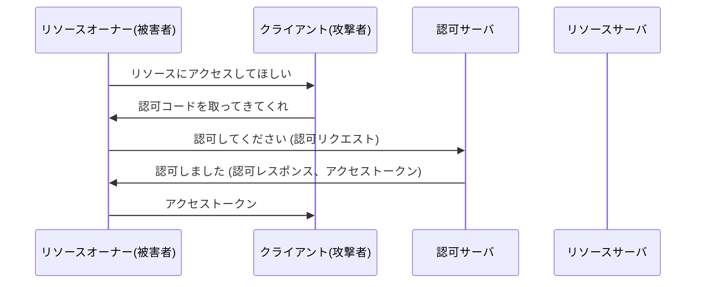

1. リソースオーナー(被害者)がクライアント(攻撃者)に対し、「リソースにアクセスしてほしい」とリクエストする
2. クライアント(攻撃者)がリソースオーナー(被害者)に対し、「まずは**アクセストークン**を取ってきてくれ」と言ってリソースオーナー(被害者)をリダイレクトさせる
3. リソースオーナー(被害者)が認可サーバにアクセスし、認可サーバに対して「認可してください」とリクエストする
4. 認可サーバがリソースオーナー(被害者)に対して「認可しました」と言って**アクセストークン**をもたせ、リソースオーナー(被害者)をクライアント(攻撃者)にリダイレクトさせる
5. リソースオーナー(被害者)はクライアント(攻撃者)に対して**アクセストークン**を渡す

ここで、攻撃者は被害者から渡されたアクセストークンを得ることができます。

このアクセストークンの詳細は以下のとおりです。

- 発行元: 認可サーバ
- 発行対象: 攻撃者クライアント
- 何ができるか: 認可サーバが許可したプロフィール API へのアクセス

攻撃者はこのアクセストークンを利用し、他のクライアントであってもリソースオーナー(被害者)としてログインすることができます。

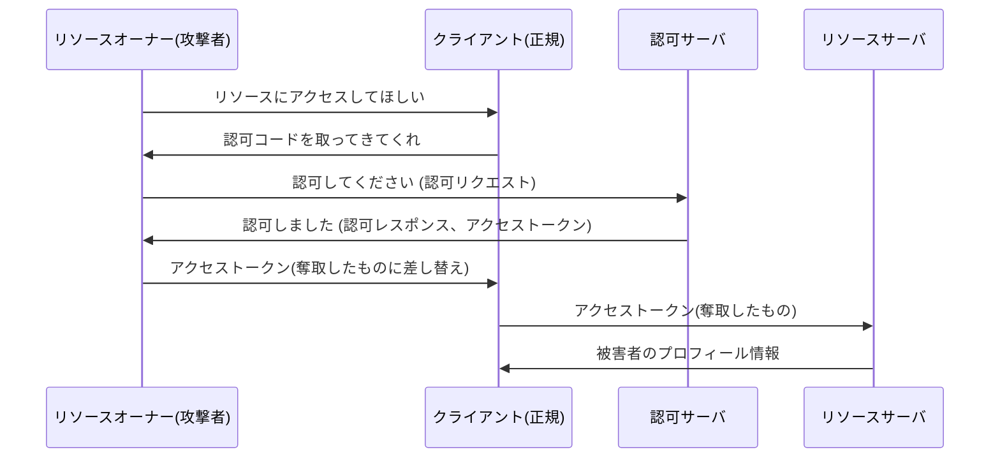

6. リソースオーナー(攻撃者)がクライアント(正規)に対し、「リソースにアクセスしてほしい」とリクエストする
7. クライアント(正規)がリソースオーナー(攻撃者)に対し、「まずは**アクセストークン**を取ってきてくれ」と言ってリソースオーナー(攻撃者)をリダイレクトさせる
8. リソースオーナー(攻撃者)が認可サーバにアクセスし、認可サーバに対して「認可してください」とリクエストする
9. 認可サーバがリソースオーナー(攻撃者)に対して「認可しました」と言って**アクセストークン**をもたせ、リソースオーナー(攻撃者)をクライアント(正規)にリダイレクトさせる
10. ここで攻撃者はアクセストークンを先程奪取した被害者のトークンに差し替え、リソースオーナー(攻撃者)はクライアント(正規)に対してアクセストークンを渡す
11. クライアント(正規)はアクセストークンが手に入ったので、リソースサーバにアクセスし、リソースサーバに対してアクセストークンを渡してユーザのプロフィール情報をリクエストする 12.リソースサーバはアクセストークンを受け取り、何らかの手段で検証し、成功すればプロフィール情報を返す
12. クライアントはそのプロフィール情報を信用し、認証とする

この問題は、以下のような 3 つの問題がつながることで発生する問題です。複数の問題がチェーン状につながった時、コンボが発生し、それが脆弱性となります。

- クライアントが、リソースオーナーからアクセストークンを受け取る仕組みとなっている
- クライアントが、リソースオーナーから受け取ったアクセストークンを検証しない
- クライアントが、プロフィールの中身を信用して認証を行ってしまう

信用できない情報をクライアントから受け取り、それを信用してしまうことが、この問題の根本的な原因です。
上の 2 つの問題だけの場合、「他ユーザのアクセストークンを盗んだ攻撃者が、正規のクライアントで他ユーザのリソースにアクセスできる」という問題となります。これ自体でも問題ですが、アクセストークンが盗まれればどのクライアントでもリソースにアクセスできるという性質上、正規クライアントにわざわざアクセストークンを渡す攻撃は意味がないでしょう。

ところが第三の問題で「クライアントがプロフィールの中身を信用して認証を行なってしまう」という問題が加わることで、「正規のクライアントに奪取したアクセストークンを読み込ませ、リソースのプロフィール情報を信用させて認証ができる。この際、アクセストークンは正規のクライアントから盗んだものじゃなくても通用する」という攻撃を行うことが可能になります。

この攻撃手法があれば、以下のように攻撃が可能です。

1. 攻撃者が怪しいアプリ(クライアント)を作る
2. 被害者が怪しいアプリにユーザ連携(認証)を行なってしまう
3. 攻撃者が被害者のアクセストークンを盗む
4. 攻撃者が正規のアプリに被害者のアクセストークンを読み込ませる
5. 攻撃者が正規のアプリで、被害者の情報としてユーザ連携(認証)を行い、ログインする

この問題を防ぐためには、攻撃のチェーンを断ち切る必要があります。以下のような対策で、この問題を解決することができます。

- インプリシットフローの使用を避ける
- 渡されたトークンを、クライアントが検証する

しかし、アクセストークンを検証することは、OAuth 2.0 では規定されていません。そのため、アクセストークンを検証するための仕組みを自前で実装する必要があります。
以後解説する OIDC を利用せず、現在でも OAuth とプロフィール API を利用して認証を実装しているサービスは、このようなアクセストークンを検証する仕組みを持っています(Facebook など)。

OIDC では、この問題に対してアクセストークンを認証に利用せず、身分証明のために用いられるまた別のトークンである ID トークンを導入し、この問題を解決しています。
具体的には、トークン内部に「そのトークンがどのクライアントに対して発行されたものか」という情報を持たせ、クライアントがアクセストークンを受け取った際にその情報を検証するようにすることで、この問題を解決しています。

では準備もできたところで、OIDC について見ていきましょう。

# OIDC の登場人物

前述の通り、OIDC は OAuth を拡張して、アイデンティティレイヤーを載せたものであると言われています。
そのため、OIDC における登場人物は、OAuth の登場人物と名称こそ違うものの、同じような役割を担っているものとなります。

OIDC は、第三者に対して自分がどのような人物であるかを示し、これを用いて認証を行うための仕組みです。
以下のような登場人物が関連してくると考えられるでしょう。

- プロフィールを確認したい第三者のアプリケーション
- プロフィール情報の詳細を提供するサーバ
- ユーザのクレデンシャルから認証を行い
  身分証明(ID トークン)とアクセストークンを発行するサーバ
- 認証をするユーザ

では、それぞれの役割を詳しく見ていきましょう。

ここで、Google のアカウントを持っているユーザが、A アプリに Google アカウントでログインする場合を例に考えてみます。

### リライングパーティ: プロフィールを確認したい第三者のアプリケーション

OAuth での対応: クライアント
OIDC におけるリライングパーティは、プロフィールを確認したい第三者のアプリケーションを指します。
例として、A アプリが Google アカウントでログインするためのアプリケーションがリライングパーティに相当します。

### UserInfo エンドポイント: プロフィール情報の詳細を提供するサーバ

OAuth での対応: リソースサーバ
OIDC における UserInfo エンドポイントは、プロフィール情報の詳細を提供するサーバを指します。
OAuth におけるリソースサーバに相当しますが、OIDC においてはあまり活躍することがない存在です。
アクセストークンを受取り、それを検証し、成功すればプロフィール情報を返します。
大抵は、次に説明する ID プロバイダの一機能として提供されることが多いです。

### ID プロバイダ: ユーザのクレデンシャルから認証を行い、身分証明を発行するサーバ

OAuth での対応: 認可サーバ
OIDC における ID プロバイダは、ユーザのクレデンシャルから認証を行い、アクセストークンと ID トークンを発行するサーバを指します。
アクセストークンについては OAuth で定義されているものであるため、ID トークンの存在が OAuth との違いとなります。
前述の Userinfo エンドポイントにアクセスする際などに、アクセストークンを利用します。
例として、Google アカウントでログインするための Google ID プロバイダが ID プロバイダに相当します。

パスワード認証の場合、ユーザからユーザ名とパスワードを受取り、ユーザ名とパスワードが正しいかどうかを確認し、正しい場合は プロフィール情報の証明書のようなものを発行します。

### エンドユーザー: 認証をするユーザ

OAuth での対応: リソースオーナー
OIDC におけるエンドユーザーは、認証をするユーザを指します。

例として、Google のアカウントを持っているユーザがエンドユーザーに相当します。

# ID トークンの仕様

OIDC で新しく登場する ID トークンについて、その仕様を見ていきましょう。

# OIDC のフロー

## フローについていくつか種類があるけど、どう違うの？

ここについては、OAuth と同様の説明となるため、省略します。

## フロー開始前の下準備 ⏩

## ざっくりとしたフロー

## 具体的な OIDC フロー

# 応用

## リフレッシュトークン

## Sender Constrained なトークンの話
