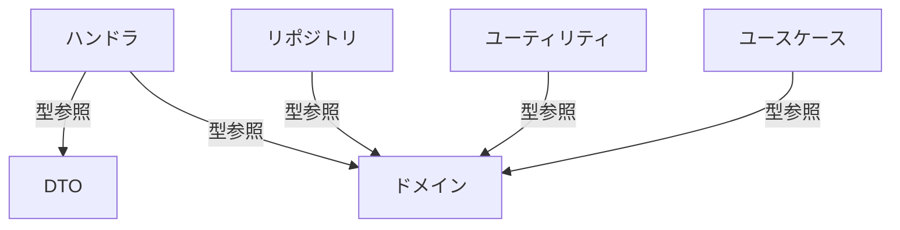
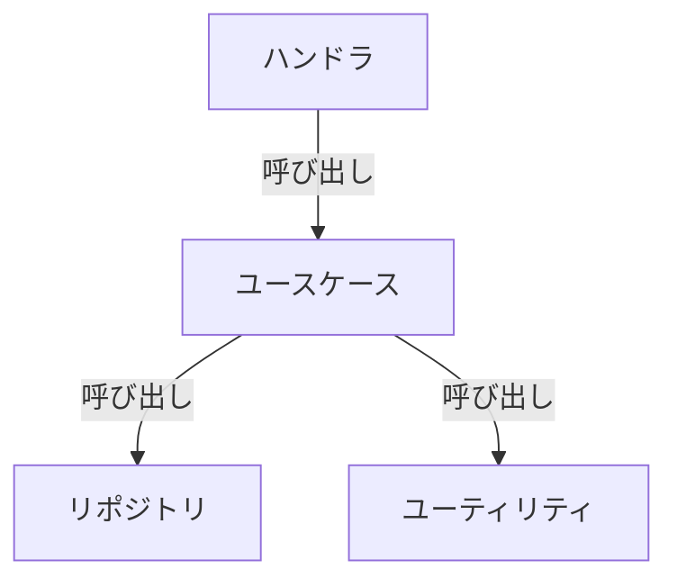
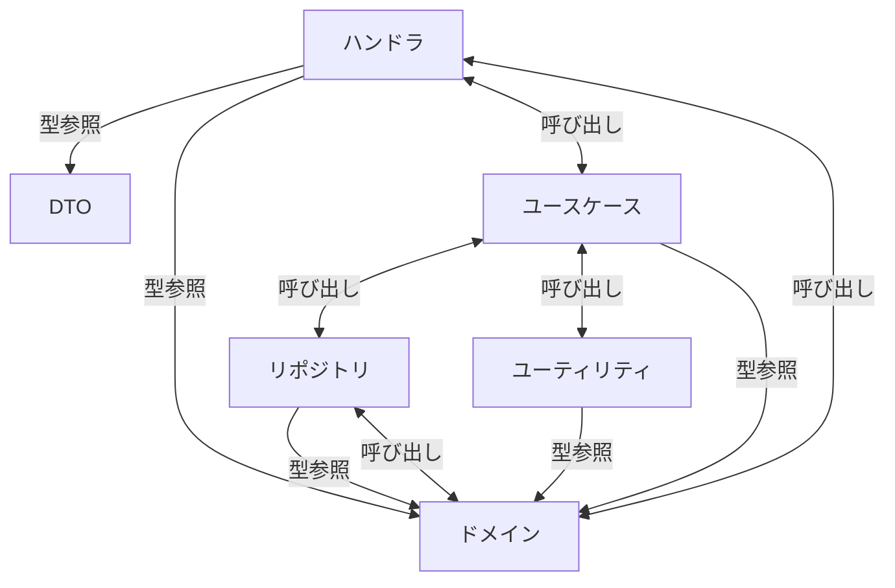

## はじめに

こんにちは。calloc134 です。
以前、授業内開発で部室予約システムを作成した記事を書きました。
https://zenn.dev/calloc134/articles/c24167f2fb6921

このプロダクトについて実際に大学の軽音楽部に働きかけたところ、採用していただけることになりました。
しかし、コードの流れが追いづらく、メンテナンス性や拡張性が低かったため、一週間かけてリファクタリングを行いました。
今回はそのリファクタリングについて書いていきます。

## リファクタリング前

### バックエンド

以下の URL から、当時のバックエンドのコードを確認できます。
https://github.com/calloc134/reserv-backend-lab/tree/8db7d41ce6c0485b32f2f6dcf4c9e6fd34342cd8

バックエンドには Hono というフレームワークを使用しています。
なんと、すべての処理を単一のファイルに書いてしまっています。そのため、行数は 1000 行を超えており、コードを修正したい場合であっても、どこを修正すればいいのかが分かりにくい状態でした。

一応このコードでは値オブジェクトパターンを利用しており、ここで値のオブジェクトのロジックを表現しています。

https://github.com/calloc134/reserv-backend-lab/blob/8db7d41ce6c0485b32f2f6dcf4c9e6fd34342cd8/src/index.ts#L22-L95

しかし、レイヤ区分などはされておらず、コードの流れが追いづらい状態でした。

### フロントエンド

以下の URL から、当時のフロントエンドのコードを確認できます。
https://github.com/calloc134/reserv-frontend-lab/tree/d52f43403a59f36e11d2756ee2d4f102b20f60a5

フロントエンドには React を使用しています。
バックエンドに比べると、比較的ファイル分割ができています。
しかし、ページ内部に大量のステートが存在しており、また同じ見た目であってもコンポーネントで共通化を行っていないため、コードの重複が多くなってしまっていました。

https://github.com/calloc134/reserv-frontend-lab/blob/d52f43403a59f36e11d2756ee2d4f102b20f60a5/src/pages/WeeklyReservations.tsx#L27-L60

以上のような状態で導入するのは今後の継続的な開発に支障をきたすため、リファクタリングを行うことにしました。

## リファクタリングの進行: 全体の方針

リファクタリングを開始するにあたって、以下のような方針を立てました。

- Notion で自分のコードの現状を整理し、処理の流れを把握
- アーキテクチャに分割した際の構造を設計

いきなり手を動かすのではなく、現在記述されているコードを慎重にリバースエンジニアリングしてから検証を行う流れを意識しました。

## リファクタリングの進行: バックエンド

### Notion でのコードリーディング

まずは現在定義されているエンドポイントを整理し、どのようなエンドポイントがどのようなユースケースで呼び出しされているかを把握しました。


_他にも多数のエンドポイントが存在しています_

ここで、少しでも気になったことはここにメモを残しています。
考えたことが無駄にならないよう、メモを残すことは非常に重要だと感じました。

:::message
ここでは、リポジトリを集約ルートに厳密に一致させるかどうかについて悩んでいます。
:::

現在のアプリケーションで必要ないエンドポイントが見つかった場合は、積極的に削除を行いました。
またエンドポイント以外にも、現在利用されている値オブジェクトやユーティリティ関数を整理していきました。


ここの段階で背景のロジックに必要ない処理をユーティリティ関数に記述していたことを発見し、その部分のコードを削除しました。

### アーキテクチャの設計

ここから、アーキテクチャの設計とレイヤの分離を行いました。
今回のアプリケーションは、SQL によるロジックの表現が多い性質を持っています。

予約管理システムにおいて、以下のようなロジックが必要となります。

- 既に同じ日付と時限で予約が入っているかどうか
- 一週間以内に自分が予約した予約がないかどうか

このような特性のアプリケーションでは、ドメイン層(エンティティ内部)でロジックを表現できない形となります。
そのため、ドメイン層ではエンティティをクラスとして表現するのではなく、単純な型として表現し、リポジトリ層にロジックの実装を許容することにしています。

:::message
なお、リポジトリにロジックの実装を許容しているといっても、命名はロジックに立つスタンスではなく、物理的に行う事柄を表現するよう心がけています。
:::

また、今回実装するリポジトリについては考えるところがありました。
ドメイン駆動設計の戦術部分実装において、リポジトリというものはエンティティの集約ルートと一致させる必要があるとされています。

以下の記事より引用します。
https://zenn.dev/kohii/articles/e4f325ed011db8#%E9%9B%86%E7%B4%84

> エンティティは必ずしもフラットなデータクラスではなく、ネストしたバリューオブジェクトや子エンティティを持っている場合があります。このエンティティを起点とするオブジェクトのまとまりを「集約 (Aggregate)」と呼び、起点となるエンティティを「集約ルート (Aggregate Root)」と呼びます。

また、以下の記事からも引用します(以下の記事は Eric Evans のドメイン駆動設計からの引用を行なっているため、間接的な引用とさせていただきます)。
https://qiita.com/ROPITAL/items/2298abf06b92914ee35b#%E9%9B%86%E7%B4%84%E3%81%A8%E3%81%AF

> 「集約」とは、関連するオブジェクトの集まりのことで、データ変更の目的で 1 つの単位として扱います。" - Evans 126

つまり、集約とは関連するオブジェクトの集まりであり、データ変更の目的で 1 つの単位として扱うものであるとされています。その集約において一番根本となるエンティティを集約ルートと呼びます。
この集約ルートエンティティを受け取るようにリポジトリを実装するのが、ドメイン駆動設計の戦術部分において推奨されている方法です。
しかし今回は利便性を踏まえ、おおむねこのパターンを踏襲しつつ、一部のリポジトリにおいては集約外のデータも取得することを許容することにしました。

具体的には、予約エンティティを取得するときに、部屋の情報も同時に取得するようなリポジトリ実装を行なっています。

:::message
このパターンについて、CQRS パターンを採用すればより適切な実装が出来ると考えられます。

CQRS パターンを簡単に説明すると、クエリとコマンドの責務を分離し、それぞれの責務に適したアーキテクチャを採用するというものです。
https://little-hands.hatenablog.com/entry/2019/12/02/cqrs
こうすることでリード用のエンティティとライト用のエンティティを分離することができ、より柔軟なアーキテクチャを実現できます。
ただし、今回は CQRS を採用するコストが高いと判断し、採用を見送りました。
以後、クエリ要件が複雑化した場合は、CQRS パターンを採用することを検討していきたいと考えています。
:::

リファクタリングは、以下の流れで進行しました。

1. 値オブジェクトをファイルに切り出し
2. ユーティリティ関数をファイルに切り出し
3. ハンドラを確認して DB アクセスのロジックをリポジトリに切り出し
4. リポジトリの返却する型をエンティティとして定義・切り出し
5. リポジトリのロジックをユースケースに切り出し

今回のアーキテクチャはクリーンアーキテクチャです・・・と言いたいところですが、クリーンアーキテクチャを厳密に適用することは難しいです。
アーキテクチャの本質とはコードの流れを追いやすくすることです。そのため、アーキテクチャのルールを厳密に適用する必要はありません。

今回採用したアーキテクチャは、構造で考えるとヘキサゴナルに近いかなと思います。アーキテクチャでおなじみの成瀬さんが提唱している ADOP というアーキテクチャを参考にしています。

https://nrslib.com/adop/

では、アーキテクチャの依存関係を図にしてみます。
型の依存関係は以下のとおりです。



呼び出しに伴うロジックの依存関係は以下のとおりです。



:::details まとめると



:::

### 最終的な実装

ディレクトリ構造は以下のとおりです。


- domain: エンティティと値オブジェクトを定義
- repository: DB アクセスを行うリポジトリを定義
- types/dto: ハンドラ層で使用する DTO を定義
- usecase: ユースケース層を定義
- utils: ユーティリティ関数を定義

ハンドラ層(index.ts)では DTO 型をとるユーザのリクエストを受け取り、値オブジェクトやエンティティに変換してユースケース層に渡します。
ハンドラ層以外では基本的にドメイン層の型を使用しているため、ハンドラ層でのみ DTO を使用しています。
https://github.com/calloc134/reserv-backend-lab/blob/master/src/index.ts#L362-L427

ユースケース層では、エンドポイント毎のロジックを記述しています。


https://github.com/calloc134/reserv-backend-lab/blob/master/src/usecase/reservation_or_disabled/postReservation.ts#L13-L75

ユースケース層では、リポジトリ層のロジックを呼び出しています。
リポジトリ層では DB (ユーザ集約については外部サービス)へのアクセスを行い、エンティティに変換して返却しています。


また必要に応じて、ユースケース層はユーティリティ層のロジックを呼び出すことができます。

今回はドメイン層・ユーティリティ層・ユースケース層の全てで neverthrow を利用し、エラー処理を明示的に扱えるようにしています。
これによりコード量は増えますが、エラー処理の流れが明確になり、エラーハンドリングの漏れを防ぐことができます。
また、DTO からエンティティの変換をハンドラ層、DB からエンティティの変換をリポジトリ層で行うことで、ユースケース層でロジックの実装に専念できるようになりました。

## リファクタリングの進行: フロントエンド

フロントエンドのリファクタリングについても、同様の流れで進めました。

### Notion でのコードリーディング

まずはフロントエンドも同様に Notion でコードリーディングを行いました。


フロントエンドはファイル分割についてはそれほど気になる点はありませんでしたが、以下の点を問題点として洗い出しました。

- ページを遅延読み込みしていないため対応したい
- string と Date の変換をコンポーネント側で行なっているため
  ルータ側でバリデーションを行いたい
- ページ内部でコンポーネントの共通化が行われていないため
  コンポーネントを共通化したい
- ステートの管理をコンポーネント側で行なっておりロジックが散逸しているため
  カスタムフックにロジックを切り出したい
- 出来るだけメモ化を行いたい

### 最終的な実装

ページの遅延読み込みについては、フロントエンドが採用している TanStack Router に対応する機能が存在しているため、これを利用しました。
https://tanstack.com/router/v1/docs/framework/react/guide/code-splitting

また、string と Date の変換について、TanStack Router の validateSearch 関数を利用し、ルータ側でバリデーションを行うことにしました。また、バリデーションを行う関数をユーティリティとして切り出しています。
https://tanstack.com/router/v1/docs/framework/react/guide/search-params#validating-search-params

作業後のルーティングファイルは以下のとおりです。
https://github.com/calloc134/reserv-frontend-lab/blob/main/src/route.tsx#L29-L40
ページのコンポーネントのみ遅延読み込みを行うことで、ページの読み込み速度を向上しています。


カスタムフックの設計とコンポーネントの共通化は、同時並行で進めました。

まず、コンポーネントとカスタムフックの設計について Notion に原案を書き出しました。

_予約アラートのカスタムフック原案_

_予約取り消しアラートのコンポーネント原案_

最終的に、以下のような実装を行いました。

https://github.com/calloc134/reserv-frontend-lab/blob/main/src/pages/WeeklyReservations.tsx#L42-L64
https://github.com/calloc134/reserv-frontend-lab/blob/main/src/pages/WeeklyReservations.tsx#L111-L128
関連してくる要素が以下のとおりになります。

- ページコンポーネント
- カードコンポーネント(予約を表示する)
- 予約アラートコンポーネント
- 予約アラート用カスタムフック

実装の詳細を以下に示します。

1. ページコンポーネントは予約アラート用カスタムフックを呼び出す

```tsx
const { isOpened, openModal, onClickCancel, onClickAccept, availableRooms } =
  useCreateReservationModal();
```

2. 予約アラートコンポーネントは、予約アラート用カスタムフックから受け取った値を表示する

```tsx
<CreateReservationModal
  isOpened={isOpened}
  availableRooms={availableRooms}
  onClickCancel={onClickCancel}
  onClickAccept={onClickAccept}
/>
```

予約アラートコンポーネントは、基本的に予約アラート用カスタムフックから受け取った値を表示するだけのコンポーネントです。

3. ページコンポーネントはカードコンポーネントを呼び出し、イベントハンドラを渡す

```tsx
<div className="grid grid-cols-1 sm:grid-cols-1 md:grid-cols-4 lg:grid-cols-8 xl:grid-cols-10 gap-4 w-full justify-center">
  {tables_data.map((table_data) => (
    <ReservationCard
      key={table_data.date.toString()}
      table_data={table_data}
      my_user_id={userId ? userId : undefined}
      onClickReservationSlotArg={onClickReservationSlot}
    />
  ))}
</div>
```

イベントハンドラの内容については次の項目で説明します。

4. ページコンポーネントは予約作成のイベントを受け取るためのイベントハンドラを定義

```tsx
const { mutateAsync } = usePostReservation();
const onClickReservationSlot = useCallback(
  async (date: Date, slot: Slot) => {
    const alert_result = await openModal({ date, slot });
    if (alert_result.isErr()) {
      return;
    }
    const room_uuid = alert_result.value;
    try {
      await mutateAsync({
        date,
        slot,
        room_uuid,
      });
      toast.success("予約が完了しました");
    } catch (error) {
      toast.error(`予約に失敗しました。\n${(error as Error).message}`);
    }
  },
  [mutateAsync, openModal]
);
```

イベントハンドラは、ユーザによって要求された日付と時限を受け取ることができるよう、型による制約を設けています。

イベントハンドラ内部でミューテーションを呼び出し、成功時にはトーストを表示します。
ここで、先程の予約アラート用カスタムフックから返却された Promise である`openModal`を呼び出し、Result 型で成功か失敗を判断しています。
つまり、Promise を用いてアラートを関数の様に呼び出し、処理をより直感的に記述できるということです。

これにより、ページコンポーネントから処理を追いやすい構造となっています。
https://github.com/calloc134/reserv-frontend-lab/blob/main/src/pages/WeeklyReservations.tsx

フックの実装は以下のとおりです。
https://github.com/calloc134/reserv-frontend-lab/blob/main/src/hooks/useCreateReservationModal.tsx
onClickCancel や onClickAccept といった関数に Promise の reolve を入れ込み、これをステートで管理しフックで返却します。これにより、ユーザがボタンを押下した瞬間に Promise が解決され、イベントハンドラ内の処理が進行するようになります。

また、予約取り消しアラート・予約取り消しアラート用カスタムフックも同様の構造で実装しています。

https://github.com/calloc134/reserv-frontend-lab/blob/main/src/hooks/useDeleteReservationModal.tsx

この実装は、以下の記事を参考にしました。
https://qiita.com/pino2/items/ff203e97bda44c128103

その他、以下のような実装を行いました。

- 日付を移動するためのコンポーネントの分離
- 一部要素のディレクトリ移動
- Suspense を利用せず、TanStack Router の pendingComponent を利用
- イベントハンドラのメモ化・テーブル生成処理のメモ化

最終的なディレクトリ構造は以下のようになりました。


- components: コンポーネントを定義
- hooks: カスタムフックを定義
- pages: ページコンポーネントを定義
- routes: ルーティングを定義
- types/dto: データフェッチで使用する型を定義
- utils: ユーティリティ関数を定義

## 考えたこと

今回は、個人開発予約システムのリファクタリングについて書きました。個人的な備忘録も兼ねています。
真面目にリファクタリングを行う機会は、個人的にも久しぶりだったなと感じました。また、設計について考えながらコードを書く体験ができたことは非常に有意義でした。

以前の自分は、最初からいきなり完璧な設計を書こうと思い、なかなかうまくいかないことがありました。しかし今回のリファクタリングを通して、まずべた書きでも良いから要件を満たすコードを書き、それを調査しながら設計を行う方法も良いのではないか？と感じました。

良い設計を作ることに必要なことは、自分の作りたいものに対する解像度の高さ、理解の深さです。しかし、これを底上げするために一番良い方法はとりあえず実際に要件を満たすコードを書いてみることだと思います。
ある程度汚くても良いので動作するコードを実装する作業と、自分の書いたコードに対する考察・分析を行う作業を通すことで、自分の実装したいロジックに対する理解が十分に深まります。その後に行う設計は、いきなり考える設計よりも遥かに具体的で有効な設計になり得るのではないかと感じました。

## まとめ

今回のリファクタリングが完璧なものになったかどうかはわかりませんが、今後の開発においては、このリファクタリングを通して得た知見を活かしていきたいと思います。
また、このプロダクトについて、今後も改善を続けていきたいと考えています。
では、最後まで読んでいただき、ありがとうございました。
