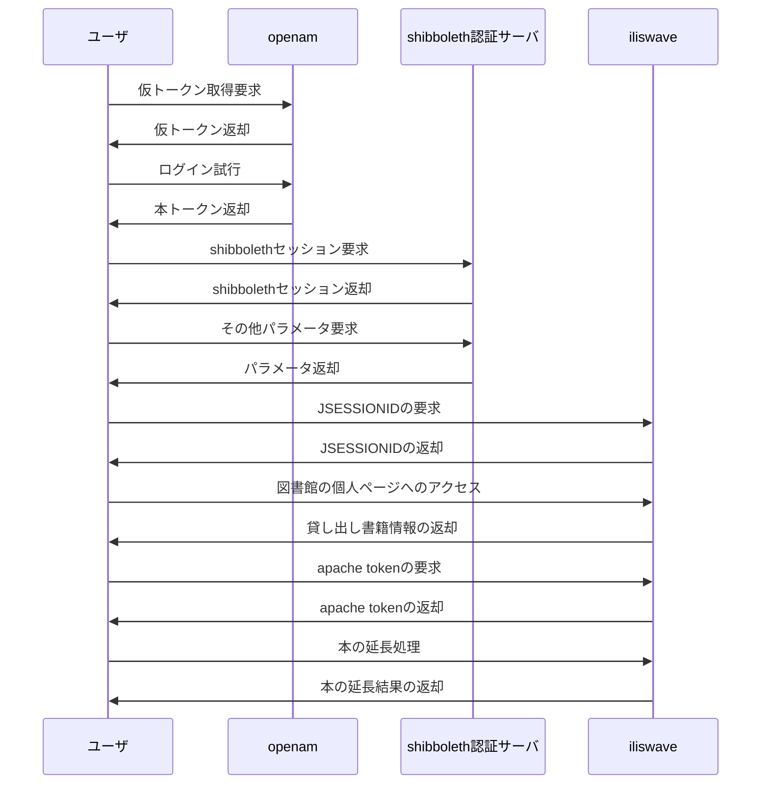

皆さん、こんにちは。かろっくです。
現在は情報系の大学に通っています。

さて、大学生といったら、趣味に時間を費やしてなんぼです。
自分は大学の図書館を本当に頻繁に利用しています。


見ての通り図書館のヘビーユーザなのですが、そうなってくるとやはり図書館の操作の自動化をしてしまいたいという欲求が出てきます。
というわけで、今回は大学のシステムを解析して自動化した話をしたいと思います。

# ひとまず完成形

先に、実装したコードのリポジトリを掲載します。
https://github.com/calloc134/opac-automation

動作例として、discord にメッセージを送信している様子を以下に示します。


現在は延長する書籍が存在していないため終了していますが、延長の必要な書籍が存在する場合は、延長を行います。


# 方針

大学のシステムを自動化するにあたって、単に Selenium 等のブラウザを使うのは少し癪です。出来ることならば、ブラウザ等を利用せず、HTTP リクエストから解析を行いたいところです。
おおよそ一週間ほどかけて、大学のシステムを解析してみました。以下にその結果を示します。

## OpenAM: シングルサインオンを実装するためのソフトウェア

LDAP や Active Directory 等のデータベースに登録されたユーザー情報を利用して、Web サービスやクラウドサービス等の認証を行うためのソフトウェアです。 IdP (Identity Provider) として動作し、SP (Service Provider) として動作するサービスに対して、シングルサインオンを実現します。

大学のシステムは LDAP サーバに学生の情報を登録し、OpenAM で認証を行っていると考えられます。

https://www.designet.co.jp/ossinfo/openam/

なお、OpenAM のソースコードは Github で公開されています。
https://github.com/openam-jp/openam

## Shibboleth: シングルサインオンを実装するための基盤

こちらも、OpenAM と同様にシングルサインオンを実現するための基盤です。
OpenAM が組織内の認証に特化しているのに対し、Shibboleth は組織外部での認証に特化しています。
また、Shibboleth は SAML 認証をおこなうため、XML 形式での認証情報のやり取りを行います。

https://www.gakunin.jp/sites/default/files/2019-10/camp-otani%20%281%29.pdf

OpenAM と Shibboleth サーバは、どちらも大学のシステムにおいて導入されることの多いソフトウェアです。
それぞれを併用して運用する事例も多いと考えられます。

https://www.osstech.co.jp/_media/techinfo/seminar/openam-shibboleth.pdf

## iLisWave: 図書館システム

https://www.fujitsu.com/jp/solutions/industry/education/campus/library/

iLisWave は、富士通の開発する図書館システムの一つです。
Shibboleth 認証に対応しています。

# 検討

これらのシステムがどのような通信をしているのかを調査しました。

以下に、簡単な認証フローについて示します。

- OpenAM にログインしトークンの取得
- Shibboleth にトークンを提示し、Shibboleth セッションとその他パラメータを取得
- iLisWave に Shibboleth セッションとその他パラメータを提示し、JSESSIONID を取得して図書館システムへログイン
- 図書館システムで貸し出し中の図書を取得
- 図書館システムで延長が必要な図書を延長



# 実装

自動化スクリプトにおいては、TypeScript で記述し、Bun で実行することにしました。

メインのコードを以下に示します。

https://github.com/calloc134/opac-automation/blob/master/src/index.ts

図書館システムのクライアントは、ユーザ名とパスワードを与えることで、メソッドによる操作を行うことができます。

```typescript
// 図書館システムにログインする
const OpacClientMaybe = await initOpacClient({
  user_id: user_id,
  password: password,
});
```

```typescript
const lental_list_maybe = await OpacClient.get_lental_list();

if (lental_list_maybe.isErr()) {
  console.error("[!] エラーが発生しました");
  await MessageClient.send(
    `:warning: │ エラーが発生しました: ${lental_list_maybe.error.statusText}`
  );
  console.error("[*] レスポンスのテキストを表示します");
  console.error(lental_list_maybe.error.statusText);
  console.error("[*] プログラムを終了します");
  return;
}
```

```typescript
const result = await OpacClient.extend_book({ book_id: book_id });

if (result.isErr()) {
  console.error("[!] エラーが発生しました");
  console.error("[*] プログラムを終了します");
  await MessageClient.send(
    ":warning: │ エラーが発生しました。プログラムを終了します"
  );
  return;
}
```

プログラムロジックとは関係がありませんが、今回は例外処理に neverthrow ライブラリを利用しています。
Rust の Result 型によく似たエラーハンドリングを行います。

https://github.com/supermacro/neverthrow

# コードの流れ

具体的なコードの流れを示します。

### OpenAM にログインしトークンの取得

https://github.com/calloc134/opac-automation/blob/master/src/utils/getTokenId.ts

`getTokenId` 関数で、OpenAM にログインし、トークンを取得します。

まずログイン試行に利用できる仮トークンを取得し、その後に学籍番号とパスワードを用いてログインを行います。
ログインに成功すると、本トークンが取得できます。
OpenAM のデータは JSON 形式であるため、簡単に解析できます。

### Shibboleth にトークンを提示し、Shibboleth セッションとその他パラメータを取得

https://github.com/calloc134/opac-automation/blob/master/src/utils/getShibboleth.ts

`getShibboleth` 関数で、Shibboleth にトークンを提示し、Shibboleth セッションとその他パラメータを取得します。

Shibboleth は SAML 認証を行うため、XML 形式での認証情報のやり取りを行います。
Shibboleth セッションを取得するためには、トークンを提示し、その結果として得られる XML を解析する必要があります。
これを正規表現を用いて行います。

### iLisWave に Shibboleth セッションとその他パラメータを提示し、図書館システムへログイン

https://github.com/calloc134/opac-automation/blob/master/src/utils/getJSESSIONID.ts

`getJSESSIONID` 関数で、iLisWave に Shibboleth セッションとその他パラメータを提示し、図書館システムへログインします。

この段階までに取得したパラメータを付与してログインエンドポイントにアクセスすることで、図書館システムへのログインが可能です。

### 図書館システムで貸し出し中の図書を取得

https://github.com/calloc134/opac-automation/blob/master/src/class/OpacClient.ts

OpacClient の`get_lental_books` 関数で、図書館システムで貸し出し中の図書を取得します。

図書館システムの html を解析し、貸し出し中の図書の情報を取得します。
html の解析には node-html-parser を利用しています。

### 図書館システムで延長が必要な図書を延長

https://github.com/calloc134/opac-automation/blob/master/src/class/OpacClient.ts

OpacClient の`extend_book` 関数で、図書館システムで延長が必要な図書を延長します。

この関数を呼び出す前に、`_get_apache_token` 関数を呼び出し、Apache のトークンを取得しておく必要があります。

このような流れで、図書館システムの自動化を行うことができます。

# まとめ

無事大学システムの自動化を行うことができました。

大学内部のシステムでは、一般に仕様が公開されていないことも多く、また仕様が公開されていても挙動が異なる場合もあります。
解析しながら自動化する段階では、多くの時間を要しました。

最終的に無事に動作したことについて、非常に満足しています。

また、今までのコードと比較して、今回のコードを綺麗に記述できたこともよかったです。

# 今後の展望

この自動化システムを応用して、今まで貸し出しを行った本を記録する機能や、得られた情報をポートフォリオとして公開する機能の追加も視野に入れています。
いい感じの応用がないかと考えているところです。

お読みいただき、ありがとうございました。
