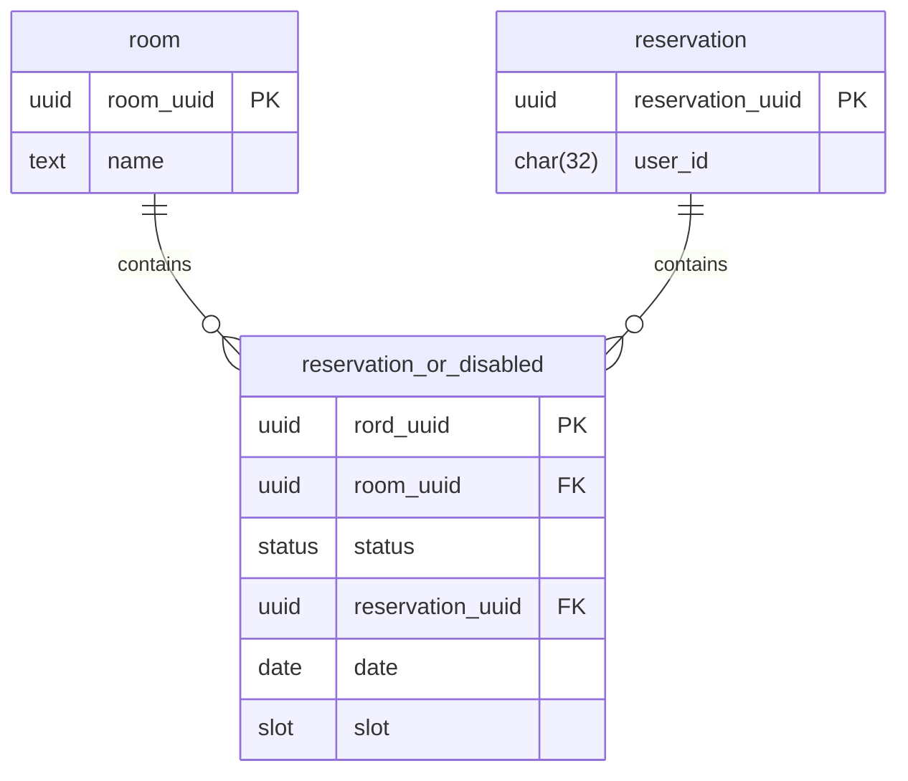

# はじめに

こんにちは。calloc134 です。

前回の授業内ハッカソン記事において、200 いいねを頂きました。ありがとうございます！
https://zenn.dev/calloc134/articles/c5ae165b16b969

自分の大学では、これ以外にも授業内で開発を行う実践的な授業がいくつか存在します。
前回の授業とは別に授業内開発を行う機会があったため、半年ぶりに大学の授業として開発を行いました。

# 簡単な概要

この授業では、チームで開発の分担を行いながら決められた期限までにコンテンツを制作していきます。自分は後輩とチームを組み、開発を行いました。
本来であればここで開発する内容は静的サイトで十分なのですが、せっかくなので動的サイトを作ることにしました。
後輩に聞いてみたところ、
「自分は軽音楽部に所属しているので、練習室の予約システムを作りたい」とのことでした。
丁度いい機会だと思い、自分の気になっている技術を利用しながら開発を行っていくことを決めました。

# 全体像

まずはじめに、最終的に完成したサービスの全体像を示します。

ログイン画面は以下のとおりです。


ここからアカウント作成・ログインを行います。
なお、認証サービスの機能により、以下の外部連携が可能となっています。

- Google
- Discord
- LINE

ログインが完了すると、以下のような画面が表示されます。


ログインユーザの確認が可能です。


存在するページは、予約一覧確認画面と自分の予約一覧確認画面の 2 つです。

予約一覧画面では、すべてのユーザの予約の一覧を表示し、予約を作成することができます。


自分の予約一覧確認画面では、自分の予約の確認とともに、予約の取り消しが可能です。


制約として、過去や当日の予約は禁止されています。
また、一週間以内にすでに予約がある場合も予約を行うことができません。


加えて、予約の取り消しは 3 日前までとなっています。


レスポンシブ対応も行い、スマホからの表示にも対応しています。


# 仕様

部室予約システムは、以下の機能を持つことにしました。

## 機能要件

- ユーザは部室の予約を行うことができる
- ユーザは部室の予約をキャンセルすることができる
- 管理者が部屋の利用禁止枠を設定できる

詳細は以下のとおりです。

- 予約の出来る日時は平日のみ
- 予約は大学の授業の単位と同じ(四時限目まで・一日 4 コマ)
- 過去・当日の予約は禁止
- 一週間以内に予約がある場合は予約できない
- 予約の取り消しは 3 日前まで

## 非機能要件

- レスポンシブデザインに対応
- 認証に対応
  - パスワード認証だけではなく、SNS 連携も可能

この条件に沿って、技術選定を行いました。

## 技術選定

ここで、それぞれの要件を達成するため、以下のような技術選定を行いました。

- バックエンドインフラ
  - Cloudflare Workers
- バックエンド FW
  - Hono
- バックエンド データベースクエリビルダ
  - safeql
- 認証サービス
  - Clerk
- データベース
  - Neon Database
- フロントエンド FW
  - React
- フロントエンド ルーティング
  - Tanstack Router
- フロントエンド サーバサイドキャッシュ
  - Tanstack Query (React Query)
- フロントエンド UI
  - Tailwind CSS
  - shadcn
- フロントエンド ビルドツール
  - Vite
- フロントエンド ライブラリ
  - react-hot-toast
  - react-spinners

では、それぞれの技術について解説します。

## バックエンド

### Cloudflare Workers

https://workers.cloudflare.com/

Cloudflare が提供する、TypeScript のサーバレスアプリケーションをホストするための環境です。無料で提供されており、エッジで動作するため、レイテンシが低いことがメリットの一つです。リソース制限は比較的厳しいため、効率的なコードを書く必要があります。

### Hono

https://hono.dev/

TypeScript のバックエンドアプリケーションを記述するためのフレームワークです。Express に似た API を持っており、簡単に API を記述することができます。また、Zod や Valibot のようなバリデーションライブラリや、後述する Clerk をはじめとする IDaaS の認証を判定するようなミドルウェアを多く提供しており、サポートが手厚いことが特徴です。

### safeql

https://safeql.dev/

TypeScript で動作する PostgreSQL 用のクエリビルダ・SQL 構文バリデータです。eslint ルールで記述が行われており、sql タグで囲まれた SQL 文を PostgreSQL で検証し、SQL 文が正常に動作するかを保証します。また、ジェネリクスに対し SQL の結果を解析して型を生成します。これにより、SQL の実行結果に型が付与され、TypeScript の型安全性を保証します。

ORM に対してこれを選んだ理由としては、SQL を直接書きながら型の安全性を保証することができる oss として使ってみたい気持ちがあったためです。
TypeScript では Prisma ORM や Drizzle ORM が有名ですが、ORM を利用しているとどうしても表現力に限界が生じます。また、普段の開発で ORM を利用しているため、本来の SQL を十分に学習できていないと感じていたからです。
前回の授業内ハッカソンでは Drizzle ORM を利用していたのですが、以上の理由により、今回は ORM を使わずに SQL を直接書くことにしました。

### Neon Database

https://neon.tech/

サーバレスで動作するデータベースであり、SaaS として提供されています。PostgreSQL と互換性があり、SQL を利用してデータベースを操作することができます。また、色々な機能が提供されており、SQL の実行計画を確認することができるなど、開発効率を向上させるための機能が多く提供されています。
safeql を利用するため PostgreSQL を利用する必要があり、このサービスを選択しました。
本当は PlanetScale を利用してみたいと思っていたのですが、Hobby Plan が終了してしまったため、こちらを選択しました。

### Clerk

https://clerk.dev/

IDaaS の認証サービスです。ユーザの管理や操作が簡単にでき、また他サービスとの連携も容易です。また、Hono との連携が可能です。
自分は以前 Auth0 を利用していたのですが、一度 Clerk を利用してみようと思い、今回はこちらを選択しました。
前回の授業内ハッカソンでは自前で認証を実装していましたが、今回は Clerk を利用することで、認証周りの実装を比較的簡単に行うことができました。

## フロントエンド

### React

https://react.dev/

使い慣れているため、今回も React を利用しました。

### Tanstack Router

https://tanstack.com/router/latest

前回と同じく、Tanstack Router を利用しました。React のルーティングを行うためのライブラリであり、型安全にルーティングを行うことができます。

### Tanstack Query (React Query)

https://tanstack.com/query/latest

前回と同じく、Tanstack Query を利用しました。React のサーバサイドキャッシュを行うためのライブラリであり、効率化されたデータの取得を行うことができます。

### Tailwind CSS

https://tailwindcss.com/

Tailwind CSS を利用してデザインを行いました。

### shadcn/ui

https://ui.shadcn.com/

Tailwind CSS を利用してデザインを行うことの出来る UI コンポーネントライブラリです。内部では Radix UI と呼ばれるヘッドレスコンポーネントライブラリを利用しており、デザインに Tailwind CSS を利用することができます。

### react-hot-toast

https://react-hot-toast.com/

通知を表示するためのライブラリです。今回は予約作成・削除の際に通知を表示するために利用しました。

### react-spinners

https://www.davidhu.io/react-spinners/

ローディングアニメーションを表示するためのライブラリです。

# データベース設計

データベース設計は以下のような構造になっています。

https://github.com/calloc134/reserv-backend-lab/tree/master/db/migrations

テーブル設計を ER 図にすると以下のようになります。



ここで、ユーザの内容については IDaaS である Clerk が管理しているため、ここには含まれていません。
ユーザに返却する段階で、Clerk から取得したユーザ情報を付与して返却します。

このテーブル設計について解説します、

- room テーブル
  - 部屋の情報を保持するテーブル
- reservation_or_disabled
  - 予約情報を保持するテーブル
  - status が `disabled` の場合、その日時は予約不可
  - status が `reservation` の場合、その日時は予約状態
- reservation
  - 予約情報を保持するテーブル

ここで、予約状態と予約不可状態をまとめた設計は、以下の記事を参考にしています。

https://qiita.com/nunukim/items/49ad482544da0f622ec4

このようにして、データベース設計を行いました。
また、このデータベース設計では、インデックスを以下の四箇所に新規で設定しています。

- user_id (reservation テーブル)
- room_uuid (reservation_or_disabled テーブル)
- reservation_uuid (reservation_or_disabled テーブル)
- date, slot (reservation_or_disabled テーブル)

これを行うことで、データベースのパフォーマンスを向上させることが期待できます(なお、実際はあんまりうまく行っていません・・・後述します)。

なお、当該 SQL は dbmate を用いてマイグレーションを行っています。
.env に DATABASE_URL を設定し、以下のコマンドを実行することでマイグレーションを行うことができます。

```bash
dbmate -e DATABASE_URL up
```

# safeql ルールのセットアップ

今回 safeql を利用するにあたって、下準備をする必要があります。

safeql はローカル環境にテスト用のデータベースをインストールする必要があります。自分の環境は Manjaro Linux を利用しているため、以下のコマンドでインストールを行いました。

```bash
sudo pacman -S postgresql
```

次に、PostgreSQL のサービスを起動します。

```bash
sudo systemctl start postgresql
```

次に、データベースへマイグレーションを行います。

```bash
pnpm dbmate --url "postgresql://postgres@localhost:5432/reserv-keion?sslmode=disable" up
```

このデータベースを利用して、safeql のルールをセットアップします。

eslint.config.mjs に対して、以下のルールを追加します。

```javascript
// @ts-check

import safeql from "@ts-safeql/eslint-plugin/config";
import tseslint from "typescript-eslint";

export default tseslint.config(
  ...tseslint.configs.recommendedTypeCheckedOnly,
  safeql.configs.connections({
    databaseUrl:
      "postgresql://postgres@localhost:5432/reserv-keion?sslmode=disable",
    targets: [{ wrapper: "pool.query" }],
  })
);
```

このルールでは、pool.query に対して SQL 文を渡すことができるようになります。
例えば、以下のようなコードを書くことができます。

```typescript
const result = await pool.query<{ name: string }>(
  sql`SELECT name FROM room WHERE uuid = ${room_uuid}`
);
```

正常にデータベースに接続できている場合、ジェネリクスに赤線が引かれ、型が提案されることがわかります。
例えば、このようになります。


# コーディング

## バックエンド

バックエンドののコーディングは以下のリポジトリにて公開しています。

https://github.com/calloc134/reserv-backend-lab

ソースコードは以下の通りです。

https://github.com/calloc134/reserv-backend-lab/blob/master/src/index.ts

今回は短い期間での開発であったため、レイヤーを分割せず、ハンドラにすべて処理を記述しています。
ただし、値オブジェクトパターンを利用するようにし、適切なバリデーションが行えるようにしています。

### 値オブジェクトの表現

今回作成した値オブジェクトは以下のとおりです。

- NameValue
- UserIdValue
- UuidValue
- SlotValue

それぞれ、名前、ユーザ ID、UUID、スロットを表現するための値オブジェクトです。

:::details 値オブジェクトの表現

```typescript
type NameValue = {
  name: string;
};

function newNameValue(name: string): Result<NameValue, Error> {
  if (name.length < 3) {
    return err(new Error("Name must be at least 3 characters long"));
  }

  if (name.length > 20) {
    return err(new Error("Name must be at most 20 characters long"));
  }

  return ok({ name });
}

type UserIdValue = {
  user_id: string;
};

function newUserIdValue(user_id: string): Result<UserIdValue, Error> {
  const userIdRegex = new RegExp(/^user_[A-Za-z0-9]+$/);
  if (!userIdRegex.test(user_id)) {
    return err(new Error("Invalid user id"));
  }
  return ok({ user_id });
}

type UuidValue = {
  uuid: string;
};

function createUuidValue(): UuidValue {
  const id = uuidv7();
  return { uuid: id };
}

function newUuidValue(uuid: string): Result<UuidValue, Error> {
  const uuidRegex = new RegExp(
    /^([0-9a-f]{8})-([0-9a-f]{4})-7[0-9a-f]{3}-[89ab][0-9a-f]{3}-[0-9a-f]{12}$/i
  );
  if (!uuidRegex.test(uuid)) {
    return err(new Error("Invalid UUID"));
  }
  return ok({ uuid });
}

function convertToDate(date: string): Result<Date, Error> {
  // YYYY/MM/DD
  const [year, month, day] = date.split("-").map((x) => parseInt(x, 10));
  if (isNaN(year) || isNaN(month) || isNaN(day)) {
    return err(new Error("Invalid date"));
  }
  return ok(new Date(year, month - 1, day));
}

function convertFromDate(date: Date): string {
  const year = date.getFullYear();
  const month = date.getMonth() + 1;
  const day = date.getDate();
  return `${year}-${month}-${day}`;
}

type slot = "first" | "second" | "third" | "fourth";

type SlotValue = {
  slot: slot;
};

// DateはDate型でなければエラーになるので一旦定義しないことに

function newSlotValue(slot: slot): Result<SlotValue, Error> {
  if (
    slot !== "first" &&
    slot !== "second" &&
    slot !== "third" &&
    slot !== "fourth"
  ) {
    return err(new Error("Slot must be first, second, third or fourth"));
  }
  return ok({ slot });
}
```

:::

### Hono の初期化

初期化処理は以下のとおりです。

```typescript
type Variables = {
  pool: Pool;
};

type Bindings = {
  DATABASE_URL: string;
  CLERK_SECRET_KEY: string;
  CLERK_PUBLISHABLE_KEY: string;
};

const app = new Hono<{
  Bindings: Bindings;
  Variables: Variables;
}>();
```

Variables 型と Bindings 型を定義し、それを利用して Hono を初期化しています。このようにすることで、env 変数に型を定義し、型安全に利用することができます。

以下の処理でコネクションプールを作成しています。

```typescript
app.use("*", async (ctx, next) => {
  const pool = new Pool({
    connectionString: ctx.env.DATABASE_URL,
  });

  ctx.set("pool", pool);

  await next();
});
```

この処理では、Neon Database の提供するバックエンド用ライブラリからコネクションプールを作成し、これをコンテキストにセットしています。これによってデータベースを接続することができます。

### Clerk ミドルウェアの設定

以下のコードで、Clerk のミドルウェアを設定しています。

```typescript
app.use("*", async (ctx, next) => {
  const { CLERK_SECRET_KEY, CLERK_PUBLISHABLE_KEY } = ctx.env;

  await clerkMiddleware({
    secretKey: CLERK_SECRET_KEY,
    publishableKey: CLERK_PUBLISHABLE_KEY,
  })(ctx, async () => {});

  const clerk_user = getAuth(ctx);
  if (!clerk_user || !clerk_user.userId) {
    console.debug("Unauthorized");
    return ctx.json({ message: "ログインしていません。" }, 401);
  }

  await next();
});
```

Clerk のミドルウェア単体では、ユーザ認証に失敗した場合でもリクエストが続行されてしまいます。そのためこれを拡張し、認証に失敗した場合はログインしていない旨のエラーを返却するようにしています。

### レスポンス用スキーマの定義

以下の様にレスポンス時のスキーマを定義しています。

```typescript
type RoomResponse = {
  room_uuid: string;
  name: string;
};

type ReservationResponse = {
  rord_uuid: string;
  user: {
    user_id: string;
    name: string;
  } | null;
  room: {
    room_uuid: string;
    name: string;
  };
  slot: slot;
  date: string;
};
```

### 変換ユーティリティの実装

今回のシステムでは、一週間以内に該当する予約があるかを判定するため、以下のようなユーティリティを実装しています。

```typescript
function getMondayOfThisWeek(today: Date = new Date()): Date {
  // まず本日の曜日を取得
  // 今日が平日であれば、前の月曜日から次の金曜日までの予約を取得
  // 今日が休日であれば、次の月曜日から金曜日までの予約を取得
  // 月曜さえ取得できれば、あとは+4日すれば金曜日になる

  const day = today.getDay();

  let start_date: Date;

  if (day === 0) {
    // 日曜日
    start_date = new Date(
      today.getFullYear(),
      today.getMonth(),
      today.getDate() + 1
    );
  } else if (day === 6) {
    // 土曜日
    start_date = new Date(
      today.getFullYear(),
      today.getMonth(),
      today.getDate() + 2
    );
  } else {
    // 平日であるため、月曜日を取得
    start_date = new Date(
      today.getFullYear(),
      today.getMonth(),
      today.getDate() - day + 1
    );
  }

  return start_date;
}
```

この関数を利用して、該当する月曜日の日付を取得し、それを基準に予約の取得を行っています。
(なお、この関数はバックエンドではあまり利用していませんでした。同じ内容の関数をフロントエンドに記述しており、そちらで主に利用しています。)

### ハンドラへの処理実装

ここでは色々なハンドラを実装しましたが、特に予約の取得・作成・削除について解説します。

#### 予約の取得

予約の取得では、開始日と終了日をパラメータとして受け取り、その範囲内の予約を取得します。
コードを以下に示します。

:::details 予約の取得

```typescript
app.get(
  "/reservations/start_date/:start_date/end_date/:end_date/",
  vValidator(
    "param",
    object({ start_date: string(), end_date: string() }),
    (result, ctx) => {
      if (!result.success) {
        return ctx.json({ message: "Invalid request" }, 400);
      }
    }
  ),

  async (ctx) => {
    const pool = ctx.get("pool");

    const clerkClient = createClerkClient({
      secretKey: ctx.env.CLERK_SECRET_KEY,
      publishableKey: ctx.env.CLERK_PUBLISHABLE_KEY,
    });

    const start_date_result = convertToDate(ctx.req.valid("param").start_date);
    const end_date_result = convertToDate(ctx.req.valid("param").end_date);

    if (start_date_result.isErr() || end_date_result.isErr()) {
      return ctx.json({ message: "Invalid date" }, 400);
    }

    const start_date = start_date_result.value;
    const end_date = end_date_result.value;

    // room_nameがnullになる場合があるのなんでだろう
    const result = await pool.query<{
      rord_uuid: string;
      room_uuid: string;
      room_name: string;
      status: "reserved" | "disabled";
      date: Date;
      slot: "first" | "second" | "third" | "fourth";
      user_id: string | null;
    }>(
      sql`
			SELECT 
				rod.rord_uuid,
				rod.room_uuid,
				room.name as room_name,
				rod.status,
				rod.date,
				rod.slot,
				CASE 
					WHEN rod.status = 'reserved' THEN res.user_id
					ELSE NULL
				END AS user_id
			FROM 
				reservation_or_disabled rod
			INNER JOIN
				room
			ON
				rod.room_uuid = room.room_uuid
			LEFT JOIN 
				reservation res 
			ON 
				rod.reservation_uuid = res.reservation_uuid
			WHERE 
				rod.date >= ${start_date} AND rod.date <= ${end_date}
			ORDER BY 
				rod.date, 
				rod.slot;
	`
    );

    // if (result.rows.length === 0) {
    // 	return ctx.json({ message: 'No reservations' }, 404);
    // }

    const response: ReservationResponse[] = [];

    const users = await clerkClient.users.getUserList({
      userId: result.rows
        .map((row) => row.user_id)
        .filter((x): x is string => x !== null),
    });

    for (const row of result.rows) {
      const rord_uuid_result = newUuidValue(row.rord_uuid);
      if (rord_uuid_result.isErr()) {
        throw new Error("Invalid UUID");
      }

      const room_uuid_result = newUuidValue(row.room_uuid);
      if (room_uuid_result.isErr()) {
        throw new Error("Invalid UUID");
      }

      const slot_result = newSlotValue(row.slot as slot);
      if (slot_result.isErr()) {
        throw new Error("Invalid slot");
      }

      const date = row.date;

      const user =
        row.user_id === null
          ? null
          : users.data.find((user) => user.id === row.user_id);

      response.push({
        rord_uuid: rord_uuid_result.value.uuid,
        room: {
          room_uuid: room_uuid_result.value.uuid,
          name: row.room_name,
        },
        slot: slot_result.value.slot,
        date: convertFromDate(date),
        user:
          user === null
            ? null
            : {
                user_id: user?.id ?? "",
                name:
                  user?.firstName || user?.lastName
                    ? `${user?.firstName} ${user?.lastName}`
                    : "",
              },
      });
    }
    return ctx.json({
      start_date: convertFromDate(start_date),
      end_date: convertFromDate(end_date),
      reservations: response,
    });
  }
);
```

:::

まず最初に、Hono が提供している valibot のミドルウェアを利用して、パラメータのバリデーションを行っています。これにより、型安全にパラメータを取得することができます。

次に、値オブジェクトとして日時を取得し、その日時を基準に SQL 文を実行しています。
SQL については以下のとおりです。

```sql

SELECT
      rod.rord_uuid,
      rod.room_uuid,
      room.name as room_name,
      rod.status,
      rod.date,
      rod.slot,
      CASE
        WHEN rod.status = 'reserved' THEN res.user_id
        ELSE NULL
      END AS user_id
    FROM
      reservation_or_disabled rod
    INNER JOIN
      room
    ON
      rod.room_uuid = room.room_uuid
    LEFT JOIN
      reservation res
    ON
      rod.reservation_uuid = res.reservation_uuid
    WHERE
      rod.date >= ${start_date} AND rod.date <= ${end_date}
    ORDER BY
      rod.date,
      rod.slot;
```

この SQL 文では、予約もしくは予約不可テーブルから、指定された日時の範囲内の予約を取得しています。
その後、もし予約状態が予約であれば、予約テーブルと LEFT JOIN で結合し、ユーザ情報を取得しています。
また、部屋についてはかならず存在することが保証されているため、INNER JOIN で結合しています。
なお、この結果は日時とスロットでソートされています。

これに対し、safeql が生成した型は以下のとおりです。

```typescript
{
  rord_uuid: string;
  room_uuid: string;
  room_name: string;
  status: "reserved" | "disabled";
  date: Date;
  slot: "first" | "second" | "third" | "fourth";
  user_id: string | null;
}
```

このように、LEFT JOIN で結合した部分は null を許容し、INNER JOIN で結合した部分は null を許容しないようになっており、適切に型が生成されていることがわかります。

また、user_id について、Clerk のユーザ情報と結合させるため、Clerk のバックエンド用ライブラリを利用してユーザ情報を取得しています。

```typescript
const users = await clerkClient.users.getUserList({
  userId: result.rows
    .map((row) => row.user_id)
    .filter((x): x is string => x !== null),
});
```

このようにして、ユーザ情報を取得し、それを元にレスポンスを生成しています。

### 予約の作成

予約の作成では、部屋の UUID、日時、スロットをパラメータとして受け取り、その予約を作成します。

:::details 予約の作成

```typescript
app.post(
  "/reservations/",
  vValidator(
    "json",
    object({
      room_uuid: string(),
      slot: string(),
      date: string(),
      // user_id: string(),
    }),
    (result, ctx) => {
      if (!result.success) {
        return ctx.json({ message: "Invalid request" }, 400);
      }
    }
  ),

  async (ctx) => {
    const pool = ctx.get("pool");

    const {
      room_uuid: raw_room_uuid,
      slot: raw_slot,
      date: raw_date,
    } = ctx.req.valid("json");

    const room_uuid_result = newUuidValue(raw_room_uuid);
    if (room_uuid_result.isErr()) {
      return ctx.json({ message: "Invalid room_uuid" }, 400);
    }

    const slot_result = newSlotValue(raw_slot as slot);
    if (slot_result.isErr()) {
      return ctx.json({ message: "Invalid slot" }, 400);
    }

    // 該当する日にちの一週間について取得
    const date = new Date(raw_date);

    // まず、本日より前の日付であればエラー
    if (date < new Date()) {
      return ctx.json({ message: "過去・当日の日付は予約できません。" }, 400);
    }

    // 念の為、平日であることを確認
    if (date.getDay() === 0 || date.getDay() === 6) {
      return ctx.json({ message: "Invalid date" }, 400);
    }

    const start_date = getMondayOfThisWeek(date);
    const end_date = new Date(
      start_date.getFullYear(),
      start_date.getMonth(),
      start_date.getDate() + 4
    );

    // 予約が埋まっているか確認
    const result = await pool.query<{ count: number }>(
      sql`
				SELECT count(*)::int FROM reservation_or_disabled WHERE room_uuid = ${room_uuid_result.value.uuid}::uuid AND date = ${date} AND slot = ${slot_result.value.slot}::slot;
			`
    );

    if (result.rows[0].count !== 0) {
      return ctx.json({ message: "すでに予約が埋まっています。" }, 400);
    }

    // 自分が一週間以内に予約しているか確認
    // const user_id = 'user_2cSSCzV7948rhPJMsY601tXsEU4';
    const clerk_user = getAuth(ctx);

    if (!clerk_user || !clerk_user.userId) {
      return ctx.json({ message: "ログインしていません。" }, 401);
    }

    const user_id_result = newUserIdValue(clerk_user.userId);

    if (user_id_result.isErr()) {
      return ctx.json({ message: "Invalid user_id" }, 400);
    }

    const result_2 = await pool.query<{ count: number }>(
      sql`
				SELECT count(*)::int FROM reservation_or_disabled rod
				LEFT JOIN reservation res ON rod.reservation_uuid = res.reservation_uuid
				WHERE res.user_id = ${user_id_result.value.user_id}::text AND rod.date >= ${start_date} AND rod.date <= ${end_date};
			`
    );

    if (result_2.rows[0].count !== 0) {
      return ctx.json({ message: "一週間以内に予約しています。" }, 400);
    }

    const reservation_or_disabled_uuid = createUuidValue();
    const reservation_uuid = createUuidValue();

    const result_3 = await pool.query<{ reservation_uuid: string }>(
      sql`
				INSERT INTO reservation (reservation_uuid, user_id) VALUES (${reservation_uuid.uuid}::uuid, ${user_id_result.value.user_id}::text) RETURNING reservation_uuid;
			`
    );

    if (result_3.rows.length !== 1) {
      return ctx.json({ message: "Failed to insert" }, 500);
    }

    const result_4 = await pool.query<{ rord_uuid: string }>(
      sql`
				INSERT INTO reservation_or_disabled (rord_uuid, room_uuid, date, slot, status, reservation_uuid) VALUES
				(${reservation_or_disabled_uuid.uuid}::uuid, ${room_uuid_result.value.uuid}::uuid, ${date}, ${slot_result.value.slot}::slot, 'reserved', ${reservation_uuid.uuid}::uuid) RETURNING rord_uuid;
			`
    );

    if (result_4.rows.length !== 1) {
      return ctx.json({ message: "Failed to insert" }, 500);
    }

    return ctx.json({ message: "予約が完了しました。" });
  }
);
```

:::

まず、パラメータのバリデーションを行い、その後、部屋の UUID とスロットを取得しています。

次に、以下のような制約に違反していないかを順次確認していきます。

- 過去・当日の日付でないこと
- 平日であること
- 予約が埋まっていないこと
- 自分が一週間以内に予約していないこと

これらの条件に違反していない場合、予約を作成します。

ここで呼び出されている SQL 文を以下に示します。

```sql
SELECT count(*)::int FROM reservation_or_disabled rod
LEFT JOIN reservation res ON rod.reservation_uuid = res.reservation_uuid
WHERE res.user_id = ${user_id_result.value.user_id}::text AND rod.date >= ${start_date} AND rod.date <= ${end_date};
```

```sql
INSERT INTO reservation (reservation_uuid, user_id) VALUES (${reservation_uuid.uuid}::uuid, ${user_id_result.value.user_id}::text) RETURNING reservation_uuid;
INSERT INTO reservation_or_disabled (rord_uuid, room_uuid, date, slot, status, reservation_uuid) VALUES
(${reservation_or_disabled_uuid.uuid}::uuid, ${room_uuid_result.value.uuid}::uuid, ${date}, ${slot_result.value.slot}::slot, 'reserved', ${reservation_uuid.uuid}::uuid) RETURNING rord_uuid;
```

このようにして、予約を作成しています。

### 予約の削除

予約の削除では、予約の UUID をパラメータとして受け取り、その予約を削除します。

:::details 予約の削除

```typescript
app.delete(
  "/reservations/:rord_uuid/",
  vValidator("param", object({ rord_uuid: string() }), (result, ctx) => {
    if (!result.success) {
      return ctx.json({ message: "Invalid request" }, 400);
    }
  }),

  async (ctx) => {
    const pool = ctx.get("pool");

    const rord_uuid_result = newUuidValue(ctx.req.valid("param").rord_uuid);

    if (rord_uuid_result.isErr()) {
      return ctx.json({ message: "Invalid rord_uuid" }, 400);
    }

    const result = await pool.query<{
      status: "reserved" | "disabled";
      date: Date;
      user_id: string | null;
    }>(
      sql`
				SELECT rod.status, rod.date, res.user_id FROM reservation_or_disabled rod LEFT JOIN reservation res ON rod.reservation_uuid = res.reservation_uuid WHERE rod.rord_uuid = ${rord_uuid_result.value.uuid}::uuid;
			`
    );

    if (result.rows.length !== 1) {
      return ctx.json({ message: "対応する予約が見つかりません。" }, 404);
    }

    if (
      result.rows[0].status !== "reserved" ||
      result.rows[0].user_id === null
    ) {
      return ctx.json({ message: "予約ではなく、利用禁止の日時です。" }, 400);
    }

    const clerk_user = getAuth(ctx);

    if (!clerk_user || !clerk_user.userId) {
      return ctx.json({ message: "ログインしていません。" }, 401);
    }

    const clerk_user_id_result = newUserIdValue(clerk_user.userId);

    if (clerk_user_id_result.isErr()) {
      return ctx.json({ message: "Invalid user_id" }, 400);
    }

    if (result.rows[0].user_id !== clerk_user_id_result.value.user_id) {
      return ctx.json(
        { message: "他のユーザの予約はキャンセルできません。" },
        403
      );
    }

    if (result.rows[0].date === null) {
      return ctx.json({ message: "Invalid date" }, 400);
    }

    const date = result.rows[0].date;

    const now = new Date();

    if (date.getTime() - now.getTime() < 3 * 24 * 60 * 60 * 1000) {
      return ctx.json(
        { message: "キャンセルは3日以上先の予約のみ可能です。" },
        400
      );
    }

    const result_2 = await pool.query<{ rord_uuid: string }>(
      // sql`
      // 	DELETE FROM reservation_or_disabled WHERE rord_uuid = ${rord_uuid_result.value.uuid}::uuid RETURNING rord_uuid;
      // `
      sql` DELETE FROM reservation USING reservation_or_disabled WHERE reservation.reservation_uuid = reservation_or_disabled.reservation_uuid AND reservation_or_disabled.rord_uuid = ${rord_uuid_result.value.uuid}::uuid RETURNING rord_uuid;`
    );

    // cascadeなのでreservationも消える
    // このやり方が好ましいかはわからない。ビジネスロジックがRDBMSに依存しているということになるが、そもそもこういう需要があるために追加された機能である気もする。

    if (result_2.rows.length !== 1) {
      return ctx.json({ message: "Failed to delete" }, 500);
    }

    return ctx.json({ message: "予約をキャンセルしました。" });
  }
);
```

:::

まず、パラメータのバリデーションを行い、その後、予約の UUID を取得しています。

次に、以下のような制約に違反していないかを順次確認していきます。

- 予約が存在すること
- 予約であること
- 自分の予約であること
- 3 日以上先の予約であること

これらの条件に違反していない場合、予約を削除します。

ここで呼び出されている SQL 文を以下に示します。

```sql
SELECT rod.status, rod.date, res.user_id FROM reservation_or_disabled rod LEFT JOIN reservation res ON rod.reservation_uuid = res.reservation_uuid WHERE rod.rord_uuid = ${rord_uuid_result.value.uuid}::uuid;
```

```sql
DELETE FROM reservation USING reservation_or_disabled WHERE reservation.reservation_uuid = reservation_or_disabled.reservation_uuid AND reservation_or_disabled.rord_uuid = ${rord_uuid_result.value.uuid}::uuid RETURNING rord_uuid;
```

このようにして、予約を削除しています。

なお、予約不可設定については実装を行いましたが、admin ユーザの処理についてはまだ実装が出来ていません。これは今後の課題としています。

バックエンドの実装は以上です。

## フロントエンド

フロントエンドは以下のリポジトリにて公開しています。

https://github.com/calloc134/reserv-frontend-lab

ディレクトリ分割を行い、記述を行っています。

```
src
├── components
├── pages
├── hooks
├── utils
├── types
├── main.tsx
└── route.tsx
```

### ルーティング

まず、route.tsx でルーティングを定義しています。

https://github.com/calloc134/reserv-frontend-lab/blob/main/src/route.tsx

認証が必要なルートには useEffect で認証を行い、認証がされていない場合はログインページにリダイレクトするようにしています。

また、Tanstack Query で Suspense を利用することを想定し、Suspense コンポーネントで境界を設定し、フォールバックとしてローディング画面を表示しています。

:::message
思ったこと

- ローディングコンポーネントを切り出しても良かったかも？
  :::

```typescript
const home_route = createRoute({
  getParentRoute: () => rootRoute,
  path: "/home",
  component: () => {
    const { isSignedIn, isLoaded } = useAuth();

    const navigate = useNavigate();

    // 認証の判定
    useEffect(() => {
      if (!isSignedIn && isLoaded) {
        toast.error("ログインしてください");
        // リダイレクト
        navigate({
          to: "/",
        });
      }
    }, [isSignedIn, navigate]);

    return (
      <HomeLayout>
        <Suspense
          fallback={
            <div className="flex h-screen justify-top items-center flex-col gap-4">
              <div className="flex w-1/2  flex-row gap-4 justify-center">
                <div className="p-2 rounded-lg border-2 border-black w-1/2 text-center bg-gray-200">
                  予約一覧(週)
                </div>
                <div className="p-2 rounded-lg border-2 border-black w-1/2 text-center bg-gray-200">
                  自分の予約一覧(週)
                </div>
              </div>
              <div className="p-16 bg-white rounded-lg col-span-1 sm:col-span-2 md:col-span-2 border-2 border-black">
                <ClipLoader color="#000" loading={true} size={50} />
              </div>
            </div>
          }
        >
          <Outlet />
        </Suspense>
      </HomeLayout>
    );
  },
});
```

### ページ

今回実装したページは、

- ログインページ
- すべての予約を表示するページ
- 自分の予約を確認するページ
  の 3 つです。

#### ログインページ

Clerk は SignIn コンポーネントを提供しており、これを利用することでログインフォームを埋め込むことが可能です。

```typescript
import { SignIn } from "@clerk/clerk-react";

export const LoginPage = () => {
  return (
    <div className="flex flex-col items-center justify-center h-screen p-4">
      <SignIn
        fallbackRedirectUrl={
          import.meta.env.VITE_APP_PATH
            ? import.meta.env.VITE_APP_PATH + "/home"
            : "/home"
        }
      />
    </div>
  );
};
```

ここで、将来的に相対パスとして実行することを考慮し、 import.meta.env.VITE_APP_PATH を読み込んでパスを結合しています。

#### 予約一覧ページ

https://github.com/calloc134/reserv-frontend-lab/blob/main/src/pages/WeeklyReservations.tsx

#### 自分の予約一覧ページ

https://github.com/calloc134/reserv-frontend-lab/blob/main/src/pages/WeeklyMyReservations.tsx

それぞれ、予約一覧を表示するページと、自分の予約一覧を表示するページです。

サーバのデータの取得のためのカスタムフックを作成し、データを読み込んでいます。カスタムフックは suspense モード有効で動作するため、ローディング中は先程のローディング画面が表示されます。
ここで、サーバのデータはカレンダー形式ではないため、見た目を整えるためのユーティリティ関数を作成し、利用しています。

https://github.com/calloc134/reserv-frontend-lab/blob/main/src/utils/createTable.ts

また、予約一覧ページでは予約の削除、自分の予約一覧ページでは自分の予約削除を呼び出せるように実装しています。

正直、pages コンポーネントはかなり大規模なコンポーネントになってしまいました。今後継続的に開発する場合、コンポーネントを適切に分割することを検討しています。

:::message
思ったこと

- データの整形をバックエンド側で最初からやればよかったかも・・・
- mutateAsync で Promise 実行するのであれば最初から useMutation じゃなくていいかも
  :::

それぞれのページでは Tanstack Router のパラメータ機能を利用し、参照している週が共有されるようにしています。これにより、ユーザビリティが向上しています。

フロントエンドの実装は以上です。

# 感想と印象に残ったこと

## safeql の使い勝手が良かった

アプリケーションの開発では、ORM 派と SQL 直接記述派の間で議論があると思います。

ORM 派は SQL を記述することなく、オブジェクトとして記述できること・TypeScript であれば型安全に記述できることを重視します。反面、SQL の表現力を十分に利用できないことや、SQL を直接記述できないことによるパフォーマンスの問題が付随し、何より SQL の知識がおろそかになり、パフォーマンスの問題が発生した際に対処できないことがあります。

SQL 直接記述派は、SQL の表現力を最大限に活かすことができること、パフォーマンスの問題に対処できること、SQL の知識があればどのような問題にも対処できることを重視します。反面、SQL の記述をバックエンドで記述する際に型安全があまり保証されず、開発者体験が悪いことが考えられます。

バックエンドの世界では両者ともに近年では歩み寄りが見られます。例を上げると、Drizzle ORM のようによりクエリビルダに近い ORM が登場してきたり、sqlc のように記述した SQL から型を生成するツールが登場してきたりしています。

https://qiita.com/tsukasaI/items/bbfac8f4319981d2bcaf
https://future-architect.github.io/articles/20210804a/

safeql は、SQL 直接記述のアプローチをとりながら、コード生成に依存するのではなく、バックエンドの SQL を記述しながら型を生成できるといった点が非常に新しく、魅力的であると感じました。このようにすることで、SQL への理解を深めながら型安全で開発者体験の良い開発をやり遂げることが出来ました。

## Clerk の使い勝手が良かった

Clerk については初めて利用しました。使い勝手としては Auth0 の場合と同じ様に利用できました。Cloudflare Workers から呼び出しができるか最初不安でしたが、公式の Middleware がちゃんと動くようで、開発者体験も非常に良かったです。
また、ログイン画面がコンポーネントとして埋め込みが出来る点も良かったです。

## Neon Database が便利

Neon Database についても初めて利用しました。管理画面のモニタリング画面も整っており、SQL の実行計画もビジュアルで確認できるのは非常に便利だと感じました。

## インデックスを貼ってみたけどあまり効率的にならなかった

今回は SQL でスキーマを定義したため、せっかくなのでインデックスを適切に貼り高速化を考えました。貼った箇所については前述のとおりなのですが、実際にはあまり効果がなかったように感じました。

```sql
explain ANALYZE SELECT rod.status, rod.date, res.user_id FROM reservation_or_disabled rod LEFT JOIN reservation res ON rod.reservation_uuid = res.reservation_uuid WHERE rod.reservation_uuid = 'xxxxxxxx-258b-7b82-a30b-fd2056ffa49d'::uuid;
```

```
Nested Loop Left Join  (cost=0.00..2.40 rows=1 width=140) (actual time=0.015..0.017 rows=1 loops=1)
  ->  Seq Scan on reservation_or_disabled rod  (cost=0.00..1.21 rows=1 width=24) (actual time=0.009..0.011 rows=1 loops=1)
        Filter: (reservation_uuid = '01909c95-258b-7b82-a30b-fd2056ffa49d'::uuid)
        Rows Removed by Filter: 16
  ->  Seq Scan on reservation res  (cost=0.00..1.18 rows=1 width=148) (actual time=0.004..0.004 rows=1 loops=1)
        Filter: (reservation_uuid = '01909c95-258b-7b82-a30b-fd2056ffa49d'::uuid)
Planning Time: 0.308 ms
Execution Time: 0.038 ms
```

適当なクエリを一つ試してみたのですが、シーケンシャルスキャンになってしまいました。
RDBMS 何もわからん・・・

# まとめ

今回は、バックエンドとフロントエンドの両方を実装し、システムを構築しました。
初めて利用する技術も多かったため、挑戦する箇所も多かったですが、良い経験となりました。
今後継続開発していく際には、コンポーネントの分割や、インデックスの最適化、バックエンドの機能追加などを行っていきたいと考えています。

最後まで読んでいただき、ありがとうございました。
