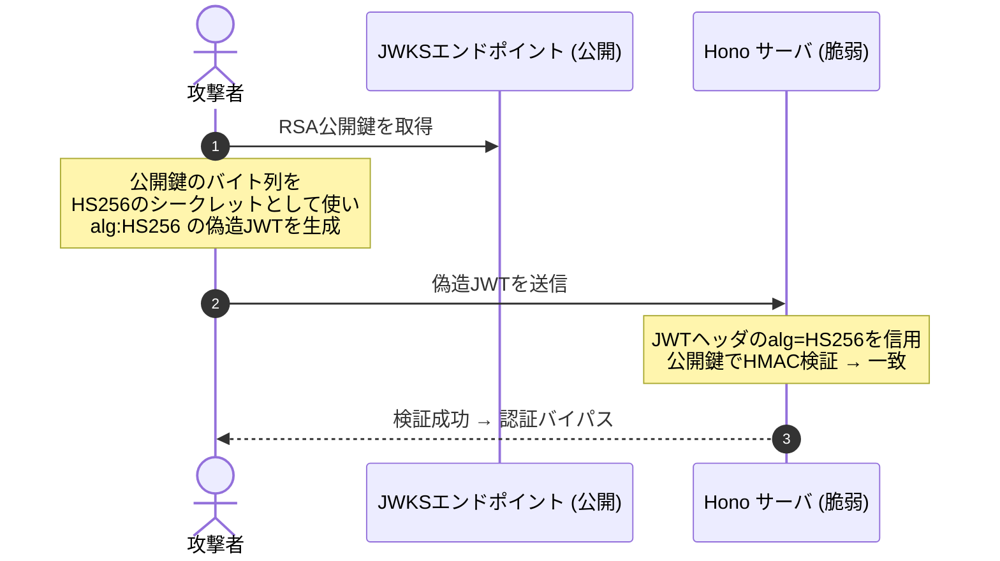

# はじめに

こんにちは。calloc134 です。
最近技術記事書けてなかったのでリハビリがてら書いております〜〜〜

実は昨年12月から1月にかけて、Honoの脆弱性を修正していました。

今回は、自分が調査・修正検討に携わった HonoのJWT/JWKミドルウェアの脆弱性について、
どのように修正したか、どのようなことに気をつけたかを含めながら解説していきたいと思います。

:::message
現時点の最新バージョンでは両脆弱性とも修正済みです。影響を受けるバージョンをお使いの場合は速やかにアップデートしてください。
:::

# 脆弱性の概要

該当の脆弱性は、
2026 年 1 月に公開されたセキュリティアドバイザリ
GHSA-f67f-6cw9-8mq4 (JWT Middleware) と
GHSA-3vhc-576x-3qv4 (JWK Middleware) の 2 件です。

https://github.com/honojs/hono/security/advisories/GHSA-f67f-6cw9-8mq4
https://github.com/honojs/hono/security/advisories/GHSA-3vhc-576x-3qv4

どちらも「アルゴリズム混同攻撃 (Algorithm Confusion Attack)」に起因するもので、
CVSS スコアはともに 8.2 (High) と評価されています。

この２つの脆弱性はどちらも、


**攻撃者が JWT ヘッダの `alg` フィールドを操作することで、**
**署名検証アルゴリズムを意図せず切り替えさせられる**という根本的な問題に起因しています。

では、それぞれについてもう少し詳しく見ていきましょう。

## GHSA-f67f-6cw9-8mq4: JWT ミドルウェア

`hono/jwt` において`alg` オプションが省略された場合、
`HS256` がデフォルトで使用される実装になっていました。

非対称鍵 (RS256 など) を使うつもりで公開鍵を公開しているにもかかわらず `alg` を指定しない場合、
攻撃者はその公開鍵を HS256 の HMAC シークレットとして流用することで、
JWT を偽造して検証を通過できてしまいます。

## GHSA-3vhc-576x-3qv4: JWK ミドルウェア

`hono/jwk` において取得した JWK に `alg` フィールドが存在しない場合、
JWT ヘッダに存在する `alg` をそのまま検証アルゴリズムとして使用する実装になっていました。

JWK の `alg` フィールドは RFC 上 Optional (任意) であるため、
実際の JWKS には `alg` がないキーも多く存在します。

そのため、攻撃者は JWT ヘッダに `HS256` を書き込むことで、
公開鍵を HMAC シークレットとして流用する攻撃が可能でした。

これら２つの問題は、攻撃者が`alg` を指定することで
攻撃者の意図どおりに署名検証アルゴリズムを切り替えられる、という点で共通しています。

# JWT/JWK の基本知識

では、この脆弱性を更に詳しく理解するために、
JWT と JWK の基本的な構造、および `alg` フィールドの意味について解説していきます。

## JWT の構造

JWT (JSON Web Token) は3つの部分から構成されるトークンで、
ドット (`.`) で区切られた文字列形式で表現されます。

```
Base64URL(Header).Base64URL(Payload).Base64URL(Signature)
```

ヘッダは JWT のメタデータを含む JSON オブジェクトです。
Base64URL エンコードされてトークンの最初の部分になります。

```json
{
  "alg": "RS256",
  "typ": "JWT",
  "kid": "key-id-1"
}
```

このJSONのうち、`alg` フィールドは署名アルゴリズムを指定します。
例えば `RS256` は RSA 署名 + SHA-256 を意味します。

具体的なアルゴリズムの種類と特徴は次の表の通りです。

| アルゴリズム | 種別 | 概要 |
| --- | --- | --- |
| HS256 / HS384 / HS512 | 対称鍵 | HMAC-SHA。秘密鍵と検証鍵が同一 |
| RS256 / RS384 / RS512 | 非対称鍵 | RSASSA-PKCS1-v1_5 + SHA |
| PS256 / PS384 / PS512 | 非対称鍵 | RSASSA-PSS + SHA |
| ES256 / ES384 / ES512 | 非対称鍵 | ECDSA + SHA |
| EdDSA | 非対称鍵 | Ed25519 |

この中で、
**対称鍵アルゴリズム (HS256 など) は、署名と検証で同じシークレットを使う**のに対し、
**非対称鍵アルゴリズム (RS256 など) は、署名に秘密鍵、検証に公開鍵を使う**
という大きな違いがあります。

## `alg` フィールドを信用してはいけない

ここから、今回の脆弱性の前提となる
`alg` フィールド信用を起点としたアルゴリズム混同攻撃の話に入ります。

:::message

今回のHonoの脆弱性はこの脆弱性そのものではありませんでしたが、
外部入力である `alg` を信用してしまうという根本的な問題は同じです。

:::

JWTの処理を実装するにあたり、気をつけなければいけないことがあります。
それは、**JWT ヘッダの `alg` フィールドを信用してはいけない**ということです。

RFC 7515 (JWS) には次のように記されています。

> Producers and consumers need to agree on what algorithms are permitted to be used.

検証側は事前に「このシステムで許可するアルゴリズム」の集合を定義し、
JWT ヘッダの `alg` がその集合に含まれているかを確認してからJWTの検証を行う必要があります。

JWT ヘッダは攻撃者が書き換え可能な外部入力であり、
その値をそのまま信用して検証アルゴリズムを選択することは、
攻撃者に検証アルゴリズムの選択権を与えることになり、アルゴリズム混同攻撃のリスクを生みます。


:::message

ここで、「アルゴリズムを選択できるとはいえ、攻撃者が`alg`を書き換えるためには JWTを偽造する必要があるのでは？」と思う方もいるかもしれません。

確かに、攻撃者が JWT を完全に偽造するためには、正しい署名を生成する必要があります。

しかし、脆弱な実装では

1. JWT ヘッダから `alg` フィールドを読み取る
2. その `alg` を検証アルゴリズムとして使用し、JWTを検証する

という流れになります。

`alg` フィールドが読み取られるのはJWTの検証前であり、
そこからアルゴリズムの選択が行われ、JWTの検証が始まります。

その後のJWT検証は攻撃者が選択したアルゴリズムで行われるため、
攻撃者はそのアルゴリズムに合わせた署名が生成できてしまえば、
JWTの完全な偽造が可能になります。

:::

## アルゴリズム混同攻撃とは

アルゴリズム混同攻撃とは、
対称鍵アルゴリズム (HS256) と非対称鍵アルゴリズム (RS256) の
**「鍵」の役割の違いを悪用した**攻撃です。

- **RS256**: 署名には **秘密鍵**、検証には **公開鍵** を利用
- **HS256**: 署名にも検証にも **同じシークレット** を利用


先ほどの解説のとおり、JWT ヘッダの `alg` を信用して検証アルゴリズムを選択する実装では、
公開されている RSA 公開鍵を「HS256 のシークレット」として使うことで、
有効な HS256 署名、つまり偽造 JWT を生成することが可能になります。

したがって、悪意のある攻撃者は、JWT ヘッダに `HS256` を書き込み、
更に公開されている RSA 公開鍵を HMAC シークレットとして流用してJWTを偽造することで、
認証バイパスを達成できてしまいます。



RSA 公開鍵は文字通り「公開」情報です。
攻撃者が必要なものはその公開鍵だけで、特別な権限や知識は不要です。

なお、Honoの今回の脆弱性は「JWT ヘッダの `alg` を信用してしまう」という問題こそありませんでしたが、
似たような問題が原因で `HS256` へのフォールバックが起こってしまう実装になっていました。
詳細は後述します。

## JWK の構造と `alg` フィールド

JWK (JSON Web Key) は公開鍵を JSON で表現するための仕様 (RFC 7517) です。

```json
{
  "kty": "RSA",
  "use": "sig",
  "kid": "key-id-1",
  "alg": "RS256",
  "n": "...",
  "e": "AQAB"
}
```

各フィールドの意味は次の通りです。

| フィールド | 必須/任意 | 説明 |
| --- | --- | --- |
| `kty` | 必須 | 鍵の種類 (RSA, EC, OKP, oct) |
| `use` | 任意 | 用途 (sig: 署名, enc: 暗号化) |
| `key_ops` | 任意 | 操作 (sign, verify など) |
| `kid` | 任意 | 鍵の識別子 |
| `alg` | 任意 | 使用アルゴリズム |

ここで重要なのが、**`alg` フィールドが任意 (OPTIONAL) である**ことです。RFC 7517 には次のように記されています。

> Use of this member is OPTIONAL.

実際、Auth0 や Microsoft Entra ID などの JWKS エンドポイントでも、`alg` が含まれないキーが存在します。「JWK に `alg` がなければ JWT ヘッダの `alg` を使う」という実装は、攻撃者に検証アルゴリズムを選ばせる隙を生みます。

## `kty` フィールドによるアルゴリズム推測

`alg` がない場合でも、`kty` フィールドや鍵パラメータからアルゴリズムファミリーをある程度推測できます。

| `kty` | 対応アルゴリズム |
| --- | --- |
| `RSA` | RS256, RS384, RS512, PS256, PS384, PS512 |
| `EC` | ES256, ES384, ES512 |
| `OKP` | EdDSA |
| `oct` | HS256, HS384, HS512 |

ただし、`kty: RSA` の場合でも RS256 なのか PS256 なのかまでは確定できません。あくまでファミリーの確認に留まります。また、`kty: oct` (対称鍵) が JWKS に含まれること自体、セキュリティ上の問題があります。

## `use` と `key_ops` フィールド

JWK の `use` フィールドは鍵の利用目的 (`sig` or `enc`) を示します。`key_ops` は操作の種類 (`sign`, `verify` など) を示します。

これらのフィールドが存在する場合、署名検証に使えない鍵を早期に拒否できます。例えば `use: enc` の鍵は暗号化用であり、署名検証に使うべきではありません。

## 対策の選択肢

修正の方針として、主に 2 つのアプローチがあります。

### ① alg ホワイトリスト方式

検証側で事前に「許可するアルゴリズムの集合」を定義し、JWT ヘッダの `alg` がその集合に含まれるかを確認する方式です。

根本的な解決策であり、ライブラリ利用者が明示的にアルゴリズムを選択することを強制できます。ただし、ライブラリ側からするとオプション追加が必須になるため、破壊的変更を伴います。

### ② 鍵とアルゴリズムの厳密な紐づけ

鍵の形状からアルゴリズムを推測し、JWT ヘッダの `alg` と照合する方式です。JWK なら `kty` や `alg` フィールドを参照します。JWT ミドルウェアであれば、シークレットが公開鍵としてパース可能かどうかを確認することで、RS256 と HS256 の混同を検出できます。

対処療法的であり、ケースの網羅が困難な面もありますが、ライブラリ利用者の変更を最小限にできます。

Hono の今回の修正では、**① ホワイトリスト方式を主軸**に、② の要素も加える形を採用しています。

## 他のフレームワーク・ライブラリの対応

### `jsonwebtoken` (Node.js)

Node.js で最も広く使われている JWT ライブラリです。`verify()` には `algorithms` オプションがあり、許可するアルゴリズムをホワイトリスト形式で渡すことが推奨されています。

```typescript
jwt.verify(token, publicKey, { algorithms: ['RS256'] }, callback)
```

実は `jsonwebtoken` も過去に同様の問題を経験しています。バージョン 8.5.1 以前では、`algorithms` 未指定かつ秘密鍵が falsy な場合に `none` アルゴリズムにフォールバックし、署名検証をバイパスできてしまう脆弱性が存在していました (GHSA-qwph-4952-7xr6)。v9.0.0 でデフォルトの `none` サポートが除去されています。

### `@fastify/jwt`

Fastify の JWT プラグインは `algorithms` オプションで許可アルゴリズムの一覧を指定できます。内部で `fast-jwt` を使用しており、アルゴリズムの明示的な指定を設計の中心に据えています。

### `elysia-jwt`

Elysia の JWT プラグインは内部で `jose` ライブラリを使用しています。`alg` オプションでアルゴリズムを指定する設計になっており、`jose` 自体が明示的なアルゴリズム指定を API の前提としています。

いずれのライブラリも、「アルゴリズムは呼び出し側が意識的に選択する」という設計になっています。これは偶然ではなく、アルゴリズム混同攻撃への対策が業界標準として浸透してきた結果です。

# この脆弱性が発生した流れ

## JWT ミドルウェアの経緯

`src/utils/jwt/jwt.ts` の `verify` 関数は次のような実装でした。

```typescript
// 修正前
export const verify = async (
  token: string,
  publicKey: SignatureKey,
  algOrOptions?: SignatureAlgorithm | VerifyOptionsWithAlg  // オプショナル
): Promise<JWTPayload> => {
  const {
    alg = 'HS256',  // ← alg 未指定時は HS256 にフォールバック
    iss,
    nbf = true,
    exp = true,
    iat = true,
    aud,
  } = typeof algOrOptions === 'string'
    ? { alg: algOrOptions }
    : algOrOptions || {}
  // ...
}
```

`alg` はオプショナルで、省略すると `HS256` がデフォルトになります。ミドルウェアでも同様でした。

```typescript
// jwt ミドルウェアのオプション (修正前)
export const jwt = (options: {
  secret: SignatureKey
  cookie?: ...
  alg?: SignatureAlgorithm  // ← オプショナル
  headerName?: string
  verification?: VerifyOptions
}): MiddlewareHandler => {
  // ...
  payload = await Jwt.verify(token, options.secret, {
    alg: options.alg,  // undefined なら verify 内で HS256 にフォールバック
    ...verifyOpts,
  })
}
```

よく見られるシンプルな使い方として、`jwt({ secret: 'my-secret' })` のように `alg` を省略するケースがあります。RS256 を想定して公開鍵を設定していたとしても、内部では HS256 が使われていた可能性があります。

## JWK ミドルウェアの経緯

`verifyWithJwks` 関数内の問題個所は次の箇所です。

```typescript
// 修正前
return await verify(token, matchingKey, {
  alg: (matchingKey.alg as SignatureAlgorithm) || header.alg,
  // ↑ JWK に alg がなければ JWT ヘッダの alg をそのまま信用する
  ...verifyOpts,
})
```

`matchingKey.alg` が undefined であれば `header.alg` が使われます。これを利用して攻撃者は JWT ヘッダに `HS256` を書き込み、公開鍵を HMAC シークレットとして流用することで検証を突破できます。

対称鍵アルゴリズム (HS256/HS384/HS512) を明示的に禁止する処理も存在しなかったため、`kty: oct` のような不自然な JWK でも動作してしまっていました。

# 想定される攻撃のリスクの大きさ

CVSS v3.1 スコアは両脆弱性とも **8.2 (High)** です。

```
CVSS:3.1/AV:N/AC:L/PR:N/UI:N/S:U/C:L/I:H/A:N
```

- **AV:N** — ネットワーク越しに攻撃できる
- **AC:L** — 攻撃の難易度は低い
- **PR:N** — 事前の認証が不要
- **UI:N** — 被害者の操作が不要
- **I:H** — 完全性への影響が大きい (認可バイパス)

攻撃に必要なものは、公開されている JWKS エンドポイントの URL と RSA 公開鍵のバイト列だけです。特別なツールも複雑な手順も不要で、ネットワーク越しに完全な認証バイパスが成立します。

**影響を受けるアプリケーションの条件**

- `hono/jwt` を使用し、`alg` を明示指定していない
- `hono/jwk` を使用し、JWKS のキーに `alg` フィールドが含まれていない
- JWT の検証結果に基づいて認証・認可の判断を行っている

逆に、以下のいずれかに該当するアプリへの影響はありません。

- `alg` を明示的に指定していた
- JWT/JWK ミドルウェアを使っていない
- JWT を認証・認可の判断に使っていない

# 修正までの流れ

## GitHub の Private Vulnerability Reporting

Hono は GitHub の Private Vulnerability Reporting 機能を利用しています。セキュリティ上の問題はリポジトリの Security タブから非公開で報告でき、メンテナが確認・検証した後、修正版のリリースと GHSA の公開が同時に行われます。

両アドバイザリは 2026 年 1 月 13 日に公開されました。

## JWT ミドルウェアの修正内容

修正の核心は `alg` の必須化です。

```typescript
// 修正後: alg が必須パラメータに変更
export const verify = async (
  token: string,
  publicKey: SignatureKey,
  algOrOptions: SignatureAlgorithm | VerifyOptionsWithAlg  // 必須に
): Promise<JWTPayload> => {
  const {
    alg,  // デフォルト値なし
    // ...
  } = typeof algOrOptions === 'string'
    ? { alg: algOrOptions }
    : algOrOptions

  if (!alg) {
    throw new Error('JWT verification requires "alg" to be specified')
  }
  // ...
}
```

ミドルウェア側でも同様に `alg` が必須になりました。

```typescript
// 修正後
export const jwt = (options: {
  secret: SignatureKey
  alg: SignatureAlgorithm  // 必須に変更
  // ...
}): MiddlewareHandler => {
  if (!options.alg) {
    throw new Error(
      'JWT auth middleware requires options for "alg". ' +
      'Please specify the algorithm explicitly to prevent algorithm confusion attacks.'
    )
  }
  // ...
}
```

これにより、**アルゴリズムを意識しないまま使うことが構造的にできなくなりました**。

```typescript
// 修正前 (動いたが脆弱)
app.use('/api/*', jwt({ secret: 'my-secret' }))

// 修正後 (alg 必須)
app.use('/api/*', jwt({ secret: 'my-secret', alg: 'HS256' }))
```

## JWK ミドルウェアの修正内容

JWK 側の修正はより多層的です。

### アルゴリズム分類の型定義

まず、対称鍵と非対称鍵を分類する定数が追加されました。

```typescript
// src/utils/jwt/jwa.ts に追加
export const SymmetricAlgorithms = new Set<SignatureAlgorithm>(['HS256', 'HS384', 'HS512'])

export const AsymmetricAlgorithms = new Set<SignatureAlgorithm>([
  'RS256', 'RS384', 'RS512',
  'PS256', 'PS384', 'PS512',
  'ES256', 'ES384', 'ES512',
  'EdDSA',
])

// kty とアルゴリズムの対応マップ
export const KtyToAlgorithms: Record<string, Set<SignatureAlgorithm>> = {
  RSA: new Set(['RS256', 'RS384', 'RS512', 'PS256', 'PS384', 'PS512']),
  EC: new Set(['ES256', 'ES384', 'ES512']),
  OKP: new Set(['EdDSA']),
}
```

### 検証フローの改善

`verifyWithJwks` の検証フローは次のように整理されました。

```typescript
// 修正後のフロー (概要)
const allowedAlgs = options.allowedAlgorithms
  ? new Set(options.allowedAlgorithms)
  : AsymmetricAlgorithms  // デフォルトは非対称鍵のみ

// 1. ホワイトリストチェック
if (!allowedAlgs.has(header.alg)) {
  throw new JwtAlgorithmNotAllowed(header.alg, Array.from(allowedAlgs))
}

// 2. 対称鍵アルゴリズムを拒否
if (SymmetricAlgorithms.has(header.alg)) {
  throw new JwtSymmetricAlgorithmNotAllowed(header.alg)
}

// 3. kid で JWK を検索 (既存処理)

// 4. JWK の use / key_ops / alg フィールドを検証
validateJwkForVerification(matchingKey, header.alg)

// 5. 検証実行 (header.alg を使用、フォールバックなし)
return await verify(token, matchingKey, { alg: header.alg, ...verifyOpts })
```

### `validateJwkForVerification` による多層チェック

```typescript
function validateJwkForVerification(jwk: HonoJsonWebKey, headerAlg: SignatureAlgorithm): void {
  // use フィールドが "sig" 以外なら拒否
  if (jwk.use !== undefined && jwk.use !== 'sig') {
    throw new JwtKeyUsageInvalid(...)
  }

  // key_ops フィールドが "verify" を含まなければ拒否
  if (jwk.key_ops !== undefined && !jwk.key_ops.includes('verify')) {
    throw new JwtKeyUsageInvalid(...)
  }

  // JWK の alg が JWT ヘッダの alg と不一致なら拒否
  if (jwk.alg !== undefined) {
    if (jwk.alg !== headerAlg) {
      throw new JwtAlgorithmMismatch(jwk.alg, headerAlg)
    }
  } else {
    // alg がない場合は kty で互換性を確認
    if (jwk.kty !== undefined) {
      const compatibleAlgs = KtyToAlgorithms[jwk.kty]
      if (compatibleAlgs && !compatibleAlgs.has(headerAlg)) {
        throw new JwtKtyAlgorithmMismatch(jwk.kty, headerAlg)
      }
    }
  }
}
```

JWK の `alg` フィールドがない場合でも、`kty` から互換アルゴリズムの集合を取得し、JWT ヘッダの `alg` がそのファミリーに属するかを確認しています。鍵のアルゴリズムを確定はできないが、少なくともファミリーの整合性は担保するという考え方です。

### ミドルウェアの変更

```typescript
// 修正前 (alg 未指定で動作)
app.use('/auth/*', jwk({ jwks_uri: 'https://example.com/.well-known/jwks.json' }))

// 修正後 (allowedAlgorithms で制御)
app.use('/auth/*', jwk({
  jwks_uri: 'https://example.com/.well-known/jwks.json',
  allowedAlgorithms: ['RS256'],  // 明示的に指定
}))
```

なお、`allowedAlgorithms` を省略した場合はデフォルトで `AsymmetricAlgorithms` (非対称鍵アルゴリズム全体) が適用されます。未指定でも対称鍵は拒否される設計になっています。

# 自分で実装するときに気をつけるマインド

## アルゴリズムは必ず明示する

最大の教訓はここに尽きます。「デフォルトに任せる」実装は、デフォルト値が何かを知らないまま使うことと同じです。

```typescript
// 良くない: デフォルトに任せている
const payload = await verify(token, secret)

// 良い: 使うアルゴリズムを明示している
const payload = await verify(token, secret, 'RS256')
```

JWT 検証に関わるコードを書くときは、「自分が今どのアルゴリズムを使っているか」を常に意識してください。

## 外部入力は信用しない

JWT ヘッダは攻撃者が書き換えられる外部入力です。`alg` フィールドも例外ではありません。「ヘッダに書いてある通りのアルゴリズムで検証する」という実装は、検証アルゴリズムの選択権を攻撃者に渡しているのと同じです。

アルゴリズムの決定は、コード内やサーバ設定など攻撃者が操作できない箇所で行うべきです。

## ホワイトリストで考える

「HS256 以外は拒否する」ではなく「RS256 のみ受け付ける」という考え方が基本です。将来追加されるアルゴリズムを意図せず許可してしまうリスクを排除できます。

## JWK の `alg` フィールドを過信しない

JWK に `alg` が含まれていても、それを持ってアルゴリズムの妥当性が保証されるわけではありません。`alg` がない JWK も多く存在します。自分のアプリが受け付けるアルゴリズムは、自分のコードで決めてください。

## 対称鍵と非対称鍵を混同しない

JWKS は公開鍵を配布する仕組みです。JWKS で対称鍵 (`kty: oct`) を公開することはセキュリティ上の矛盾です。JWK ミドルウェアを使う場合は非対称鍵アルゴリズムのみを許可するのが正しい設計です。

## ライブラリのデフォルト動作を理解する

セキュリティライブラリを使っていても、設定が不適切であれば意味がありません。今回の Hono の修正はまさにこの点を突いています。「デフォルト値で動く」ことと「安全に動く」ことは別の話です。

ライブラリの主要な設定項目と、各設定が何を意味するかを把握した上で使うようにしてください。また、セキュリティアドバイザリは定期的に確認する習慣をつけると良いと思います。

# 終わりに

JWT の `alg` フィールドが外部から操作できるという構造的な問題は、実装者が意識的に対処しない限り容易にすり抜けてしまいます。Hono に限った話ではなく、`jsonwebtoken` や他のフレームワークでも過去に同種の問題が繰り返されてきた経緯があります。

今回の修正後の Hono では、`alg` の明示が必須となり、JWK ミドルウェアでは対称鍵が拒否され、`kty` と `alg` の整合性チェックが加わりました。「動くけど安全ではない」コードを書けてしまう設計から、「安全でないと動かない」設計へのシフトです。

修正内容が何を防いでいるかを理解することが、次の問題を未然に防ぐことにつながります。

参考リンクを置いておきます。

https://github.com/honojs/hono/security/advisories/GHSA-f67f-6cw9-8mq4

https://github.com/honojs/hono/security/advisories/GHSA-3vhc-576x-3qv4

https://auth0.com/blog/critical-vulnerabilities-in-json-web-token-libraries/

影響を受けるバージョンを使っている方は、アップデートと設定の見直しをぜひ行ってみてください。
