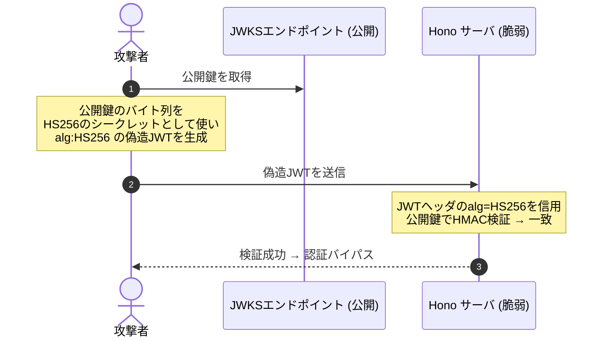
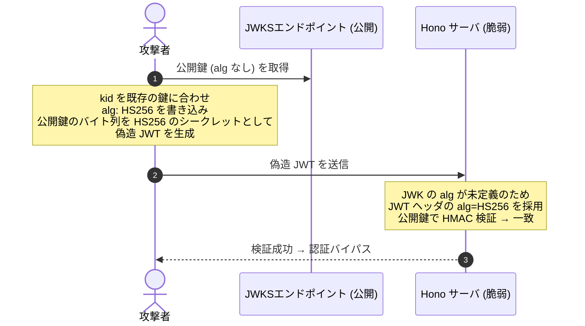

# はじめに

こんにちは。calloc134 です。
最近技術記事書けてなかったのでリハビリがてら書いております〜〜〜

実は昨年12月から1月にかけて、Honoの脆弱性を修正していました。

https://x.com/yusukebe/status/2010901972552163442

修正・報告を支えてくださったHono開発者の @yusukebe さん、コアメンテナの @usualoma さんには改めて感謝申し上げます！

今回は、自分が調査・修正検討に携わった HonoのJWT/JWKミドルウェアの脆弱性について、
どのように修正したか、どのようなことに気をつけたか・・・などを、
できるだけわかりやすく解説していきたいと思います。

:::message
現時点の最新バージョンでは両脆弱性とも修正済みです。影響を受けるバージョンをお使いの場合は速やかにアップデートしてください。
:::

# 脆弱性の概要

該当の脆弱性は、
2026 年 1 月に公開されたセキュリティアドバイザリ
GHSA-f67f-6cw9-8mq4 (JWT Middleware) と
GHSA-3vhc-576x-3qv4 (JWK Middleware) の 2 件です。

それぞれ、CVE-2026-22817 と CVE-2026-22818 として登録されています。

https://github.com/honojs/hono/security/advisories/GHSA-f67f-6cw9-8mq4
https://github.com/honojs/hono/security/advisories/GHSA-3vhc-576x-3qv4

どちらも「アルゴリズム混同攻撃 (Algorithm Confusion Attack)」に起因するものです。

この２つの脆弱性はどちらも、


**攻撃者が JWT ヘッダの `alg` フィールドを操作することで、**
**署名検証アルゴリズムを意図せず切り替えさせられる**
という根本的な問題に起因しています。

では、それぞれについてもう少し詳しく見ていきましょう。


## 簡単な概要

### GHSA-f67f-6cw9-8mq4: JWT ミドルウェア

`hono/jwt` において`alg` オプションが省略された場合、
`HS256` がデフォルトで使用される実装になっていました。

非対称鍵 (RS256 など) を使うつもりで公開鍵を公開しているにもかかわらず 
`alg` を指定しなかった場合、
攻撃者はその公開鍵を HS256 の HMAC シークレットとして流用することで、
JWT を偽造して検証を通過できてしまいます。

### GHSA-3vhc-576x-3qv4: JWK ミドルウェア

`hono/jwk` において取得した JWK に `alg` フィールドが存在しない場合、
JWT ヘッダに存在する `alg` をそのまま検証アルゴリズムとして使用する実装になっていました。

JWK の `alg` フィールドは RFC 上 Optional (任意) であるため、
実際の JWKS には `alg` がないキーも多く存在します。

そのため、攻撃者は JWT ヘッダに `HS256` を書き込むことで、
公開鍵を HMAC シークレットとして流用する攻撃が可能でした。

これら２つの問題は、攻撃者が`alg` を指定することで
攻撃者の意図どおりに署名検証アルゴリズムを切り替えられる、
という点で共通しています。

# JWT/JWK の基本知識

これらの脆弱性を理解するためには、
JWT と JWK の基本的な構造および`alg` フィールドの意味を理解しておく必要があります。

では、この脆弱性を更に詳しく解説する前に、JWT と JWK の基本的な構造を整理しておきましょう。

## JWT の構造 と `alg` フィールド

JWT (JSON Web Token) は、
JSON オブジェクトを安全に表現するためのフォーマットです。
ここでは簡単のため、JWT のうち署名された JWT である 
JWS (JSON Web Signature) を前提に説明します。

JWT は 3 つの部分から構成され、ドット (`.`) で区切られた文字列形式で表現されます。

```
Base64URL(Header).Base64URL(Payload).Base64URL(Signature)
```

ヘッダは JWT のメタデータを含む JSON オブジェクトです。
Base64URL エンコードされてトークンの最初の部分になります。

```json
{
  "alg": "RS256",
  "typ": "JWT",
  "kid": "key-id-1"
}
```

このJSONのうち、`alg` フィールドは署名アルゴリズムを指定します。
例えば `RS256` は RSA 署名 + SHA-256 を意味します。

具体的なアルゴリズムの種類と特徴は次の表の通りです。

| アルゴリズム | 種別 | 概要 |
| --- | --- | --- |
| HS256 / HS384 / HS512 | 対称鍵 | HMAC-SHA。秘密鍵と検証鍵が同一 |
| RS256 / RS384 / RS512 | 非対称鍵 | RSASSA-PKCS1-v1_5 + SHA |
| PS256 / PS384 / PS512 | 非対称鍵 | RSASSA-PSS + SHA |
| ES256 / ES384 / ES512 | 非対称鍵 | ECDSA + SHA |
| EdDSA | 非対称鍵 | Edwards 曲線署名 (JOSE では Ed25519 / Ed448) |

この中で、
**対称鍵アルゴリズム (HS256 など) は、署名と検証で同じシークレットを使う**のに対し、
**非対称鍵アルゴリズム (RS256 など) は、署名に秘密鍵、検証に公開鍵を使う**
という大きな違いがあります。

## JWK の構造と `alg` フィールド

JWK (JSON Web Key) は、暗号鍵をJSON形式で表現するための仕様(RFC 7517)です。

暗号鍵を表現するためのフォーマットであるため、
対称鍵、公開鍵、秘密鍵のいずれも表現できますが、**特に公開鍵を表現するため**に広く利用されています。

例として、OIDCやOAuth 2.0などのプロトコルにおいて、公開鍵を配布するためのフォーマットとして広く利用されています。
Auth0や Microsoft Entra ID などの JWKS エンドポイントも、
このフォーマットで公開鍵を提供しています。

JWK は次のような構造を持ちます。

```json
{
  "kty": "RSA",
  "use": "sig",
  "kid": "key-id-1",
  "alg": "RS256",
  "n": "...",
  "e": "AQAB"
}
```

各フィールドの意味は次の通りです。

| フィールド | 必須/任意 | 説明 |
| --- | --- | --- |
| `kty` | 必須 | 鍵の種類 (RSA, EC, OKP, oct) |
| `use` | 任意 | 用途 (sig: 署名, enc: 暗号化) |
| `key_ops` | 任意 | 操作 (sign, verify など) |
| `kid` | 任意 | 鍵の識別子 |
| `alg` | 任意 | 使用アルゴリズム |

ここで重要なのが、**`alg` フィールドが任意 (OPTIONAL) である**ことです。

RFC 7517 には次のように記されています。

> Use of this member is OPTIONAL.

実際に、Microsoft Entra ID / Azure AD の JWKS では `alg` が含まれないケースが存在します。
また Auth0 はデフォルトでは `alg` を含みますが、Advanced Tenant settings の
“Include Signing Algorithms in JSON Web Key Set” を無効化すると、
JWKS から `alg` を削除できます。

このように、実運用の JWKS では `alg` が常に存在するとは限りません。

`kty` や `use`、`key_ops` を見ることで、鍵の種類や用途はある程度把握できます。
ただし、それだけで検証アルゴリズムを自動決定するのは危険です。

## `kty` フィールドによるアルゴリズム推測

`alg` がない場合でも、`kty` フィールドや鍵パラメータからアルゴリズムファミリーをある程度推測できます。

| `kty` | 対応アルゴリズム |
| --- | --- |
| `RSA` | RS256, RS384, RS512, PS256, PS384, PS512 |
| `EC` | ES256, ES384, ES512 |
| `OKP` | EdDSA |
| `oct` | HS256, HS384, HS512 |

ただし、`kty: RSA` の場合でも RS256 なのか PS256 なのかまでは確定できません。
あくまでファミリーの確認に留まります。

## `use` と `key_ops` フィールド

JWK の `use` フィールドは鍵の利用目的 (`sig` or `enc`) を示します。
`key_ops` は操作の種類 (`sign`, `verify` など) を示します。

これらのフィールドが存在する場合、署名検証に使えない鍵を早期に拒否できます。
例えば `use: enc` の鍵は暗号化用であり、署名検証に使うべきではない、という判断が可能です。

# Hono の JWT/JWK ミドルウェアの概要

次に、今回の脆弱性の対象となった Hono の JWT/JWK ミドルウェアの概要を簡単に説明します。

ここでは、**現行の API** を前提に、
それぞれの役割と使い分けを整理します。
今回の脆弱性修正によって細かい API は変わっていますが、
**「どのような責務を持つミドルウェアなのか」** という大枠は共通です。

## まずは役割の違いを整理する

Honoには、JWTを検証するためのミドルウェアとして
`hono/jwt` と `hono/jwk` の 2 種類が提供されています。

両者の違いを整理すると、
以下のようになります。

| 項目 | `hono/jwt` | `hono/jwk` |
| --- | --- | --- |
| 想定ユースケース | **手元に検証鍵がある** <br />JWT の検証 | **外部の JWKS** を使う JWT の検証 |
| 鍵の渡し方 | `secret` に直接渡す | `keys` または `jwks_uri` で渡す |
| アルゴリズム指定 | 単一の `alg` を指定 | 許可する `alg` の配列を指定 |
| 鍵の選択 | 利用者が渡した鍵を<br />そのまま使う | JWT ヘッダの `kid` で JWK を選ぶ |
| 向いているケース | 自前発行の JWT固定鍵での検証 | Auth0 や Microsoft Entra ID など<br />外部 IdP の JWKS を使う検証 |

要するに、
`hono/jwt` は **「既に持っている鍵で検証するためのミドルウェア」** であり、
`hono/jwk` は **「JWK/JWKS から適切な公開鍵を選んで検証するためのミドルウェア」** です。

## `hono/jwt` ミドルウェア

`hono/jwt` は、
署名検証に必要な鍵をアプリケーション側が直接持っている場合に使う、
最もシンプルな JWT 認証ミドルウェアです。

例えば、共有シークレットで署名された JWT を検証したい場合や、
公開鍵をアプリケーション設定として既に持っている場合は、
こちらを使うことになります。

基本的な利用イメージは以下の通りです。

```ts
import { Hono } from 'hono'
import { jwt } from 'hono/jwt'

const app = new Hono()

app.use('/api/*', jwt({
  secret: 'it-is-very-secret',
  alg: 'HS256',
}))

app.get('/api/page', (c) => {
  const payload = c.get('jwtPayload')
  return c.json(payload)
})
```

このミドルウェアは、リクエストから JWT を取り出して署名検証を行い、
成功した場合はデコード済みのペイロードを `c.get('jwtPayload')` で参照できるようにします。

デフォルトでは `Authorization` ヘッダから Bearer トークンを読み取りますが、
`cookie` や `headerName` を指定することで、
トークンの受け取り元を変更することもできます。

ここでのポイントは、
**検証に使う鍵そのものはアプリケーションが直接与える** という点です。
そのため、`hono/jwt` では
「どの鍵を使うか」は既に決まっており、
ミドルウェアはその鍵で JWT を検証する責務を持ちます。

## `hono/jwk` ミドルウェア

一方の `hono/jwk` は、
JWK または JWKS を使って JWT を検証するためのミドルウェアです。

こちらは、
外部の IdP が公開している JWKS エンドポイントから公開鍵を取得し、
JWT ヘッダの `kid` を手がかりに
**どの鍵で検証するかを動的に選ぶ** ケースに向いています。

利用イメージは以下の通りです。

```ts
import { Hono } from 'hono'
import { jwk } from 'hono/jwk'

const app = new Hono()

app.use('/auth/*', jwk({
  jwks_uri: 'https://example.com/.well-known/jwks.json',
  alg: ['RS256'],
}))
```

`hono/jwk` は、大まかには次の流れで動作します。

1. リクエストから JWT を取り出す
2. JWT ヘッダを読み、`kid` を確認する
3. `keys` または `jwks_uri` から対応する JWK を探す
4. 許可されたアルゴリズムか確認したうえで、JWT を検証する
5. 成功した場合は `jwtPayload` を Context に保存する

つまり、`hono/jwk` は
**「公開鍵の配布元が別にある」** という前提に最適化されたミドルウェアです。
鍵のローテーションや複数鍵の共存が前提になるため、
`hono/jwt` よりも一段複雑な責務を持っています。


# JWT/JWK のセキュリティ上の注意点

ここからは、今回の脆弱性の前提となる `alg` の扱いとアルゴリズム混同攻撃について解説します。

## 典型的なアルゴリズム混同攻撃

今回のHonoの脆弱性を理解するためには、まずはアルゴリズム混同攻撃 (Algorithm Confusion Attack) について理解する必要があります。
まず先に、アルゴリズム混同攻撃の基礎を解説します。


アルゴリズム混同攻撃とは、
**攻撃者が JWT ヘッダの `alg` フィールドを書き換えることで、**
**署名検証アルゴリズムを意図せず切り替えさせる攻撃**です。

JWT検証を行う際の鉄則として、
**JWT ヘッダの `alg` フィールドを信用してはいけない**という決まりがあります。

検証側は事前に **「このシステムで許可するアルゴリズム」の集合** (ホワイトリスト)を定義し、
JWT ヘッダの `alg` が**その集合に含まれているかを確認**してからJWTの検証を行う必要があります。

この鉄則を守らず、JWT ヘッダの `alg` をそのまま受理してアルゴリズムを選択してしまうと、
攻撃者が `alg` を書き換えることの出来る**アルゴリズム混同攻撃**のリスクが生まれます。

JWT ヘッダは攻撃者が書き換え可能な外部入力であり、
その値をそのまま信用して検証アルゴリズムを選択することは、
攻撃者に検証アルゴリズムの選択権を与えることになり、アルゴリズム混同攻撃のリスクを生みます。


では、`alg` が選択可能だとどのように悪用できるのでしょうか。
ここで攻撃者は、
対称鍵アルゴリズム (HS256) と非対称鍵アルゴリズム (RS256) の
鍵の役割の違いを悪用することができます。


- **RS256**: 署名には **秘密鍵**、検証には **公開鍵** を利用
- **HS256**: 署名にも検証にも **同じシークレット** を利用

この「鍵」の役割の違いに目をつけ、
**一般公開されている公開鍵を「HS256 のシークレット」として扱うことで**、
有効な HS256 署名、つまり偽造 JWT を生成することが可能になります。

したがって、悪意のある攻撃者は、JWT ヘッダに `HS256` を書き込み、
更に公開されている公開鍵を **HMAC シークレットとして流用して**JWTを偽造することで、
認証バイパスを達成できてしまいます。



公開鍵は文字通り「公開」情報です。
攻撃者が必要なものはその公開鍵だけで、特別な権限や知識は不要です。


:::message

ここで、「アルゴリズムを選択できるとはいえ、
攻撃者が`alg`を書き換えるためには 正しい署名を攻撃者が用意する必要があるのでは？」
と思う方もいるかもしれません。

確かに、攻撃者が JWT を完全に偽造するためには、
正しい署名を生成してJWTを偽造する必要があります。

しかし、JWT検証の処理の流れを見てみると

1. JWT ヘッダから `alg` フィールドを読み取る
2. その `alg` を検証アルゴリズムとして使用し、JWTを検証する

という流れになります。

JWTの署名検証を行うには、アルゴリズムが分かっている必要があります。
つまり、`alg` フィールドが読み取られるのはJWTの検証前ということです。


そのため、アルゴリズムを攻撃者が指定した段階で、
署名の偽装への悪用のパスが成立するということです。

:::

## 今回Honoに存在した脆弱性

ここまで説明した典型的なアルゴリズム混同攻撃は、
「検証側が JWT ヘッダの `alg` をそのまま信用してしまう」実装を前提にしています。
一方で、今回 Hono で見つかった問題は、それとは少し違う形でした。


### `hono/jwt` の問題

`hono/jwt` の問題は、JWT ヘッダの `alg` を直接信用していたというより、
**ライブラリ利用者が検証アルゴリズムを明示しなかったときに、
Hono 側が `HS256` にフォールバックしてしまう**というものでした。

`hono/jwt` の `verify()` は、修正前はおおむね次のような挙動でした。

```typescript
const {
  alg = 'HS256',
  // ...
} = typeof algOrOptions === 'string'
  ? { alg: algOrOptions }
  : algOrOptions || {}
```

つまり、`alg` を省略した場合、内部的には `HS256` が選ばれる実装になっていました。

ミドルウェア側の `alg` オプションも任意だったため、
例えば次のような設定が成立していました。

```typescript
app.use('/api/*', jwt({ secret: publicKey }))
```

このコードを書いた利用者が、
`publicKey` に公開鍵を渡して RS256 で検証しているつもりだったとしても、
`alg` を指定し忘れた場合、`HS256` で検証されることになっていました。

その結果、
攻撃者が同じ公開鍵を HMAC のシークレットとして使って `HS256` の JWT を作ると、
Hono 側も同じ公開鍵を `HS256` のシークレットとして扱ってしまい、
署名検証を通過できる可能性がありました。

つまり JWT ミドルウェアの問題は、
「JWT ヘッダの `alg` を全面的に信用した」というよりも、
**アルゴリズム指定が省略可能** で、かつ省略時のデフォルトが `HS256` だったため、
**公開鍵を HMAC シークレットとして誤用できる状態になっていた**
という点にありました。

:::message

…と、ここまで語っておいて余談ですが、
個人的にはこの脆弱性は対策の必要性は高いものの、
**悪用可能性はそこまで高くないのではないか**と考えています。

HonoのJWT Middlewareは、
Auth0のような外部のIdPから公開鍵を取得してJWTを検証するというより、
自分でJWTを発行して検証するケースでの利用が多い印象です。

外部の公開鍵を参照するには
`jwks_uri` を用いて外部のJWKSエンドポイントを指定する必要がありますが、
その場合はJWT MiddlewareではなくJWK Middlewareを利用することになります。

Honoを利用する場合、アルゴリズムにRS256を利用してJWTを生成し、
更に開発者が`alg`を指定し忘れた場合のコード例は以下のとおりです。

```ts
// 発行側
const token = await sign(payload, privateKey, 'RS256')

// 検証側
app.use('/api/*', jwt({
  secret: publicKey,
  // alg 未指定
}))
```

しかし前提として、外部IdPを利用せず自身でJWTを発行する場合、
あえて**RS256を選択するインセンティブはそこまで大きくありません。**

更に、実際に攻撃が行われる流れについて検討すると
悪用シナリオもあまり現実的ではないということがわかります。

1. 攻撃者が 一般公開された公開鍵を入手する
2. 攻撃者がその公開鍵を HMAC シークレットとして使い、
`HS256` で署名された偽造 JWT を生成する
3. 攻撃者がその偽造 JWT を Hono サーバに送る
4. Hono サーバは `alg` 未指定時のフォールバックにより `HS256` で検証する
5. Hono サーバが攻撃者の偽造 JWT を有効なものとして受け入れてしまう

しかし、先程提示したコードを見れば分かる通り、
発行側では privateKeyを使って署名しており、
一方で検証側では publicKeyを使って検証しています。

ここで仮にJWT Middlewareが`alg`を省略した場合、
検証側は `HS256` で検証することになります。

しかし、正規のJWTは `RS256` を用いて秘密鍵で署名されているため、
`HS256` で検証しようとしても検証は失敗します。

そのため、脆弱な実装となっている場合、
そもそも**正常な動作も機能しない状態になっている可能性が高い**
のではないかと考えています。

この考察は、
今回のブログを執筆しているときに改めて攻撃の流れを整理していて気づいたことです。
よく考えたらあまり現実的な攻撃シナリオじゃないよな〜と、振り返って感じました…

:::


### `hono/jwk` の問題

もう一方の `hono/jwk` の問題は、
より古典的なアルゴリズム混同攻撃に近く、悪用可能性も高いものでした。

修正前の `verifyWithJwks()` では、JWKS から `kid` に一致する鍵を見つけたあと、
検証アルゴリズムを次のように決めていました。

```typescript
return await verify(token, matchingKey, {
  alg: (matchingKey.alg as SignatureAlgorithm) || header.alg,
  ...verifyOpts,
})
```

JWKの `alg` はRFC上任意であるため、実運用のJWKSには `alg` がない場合も存在します。

その場合修正前の実装では、`alg` がないキーの場合、
**JWT ヘッダの `alg` をそのまま検証アルゴリズムとして採用してしまう**
という実装になっていました。

JWK Middleware において `alg` を検証アルゴリズムとして採用してしまう実装の問題は、
攻撃者が JWT ヘッダに `HS256` を含めたJWTを作り、
JWKS エンドポイントの公開鍵を HMAC シークレットとして署名してJWTを偽造することで、
**古典的なアルゴリズム混同攻撃と同じメカニズムで認証バイパスができる**
という可能性があることです。




公開鍵は JWKSエンドポイントで公開されているため、
攻撃者が必要なものはその公開鍵と既存の `kid` だけで、特別な権限や内部情報は不要です。
そのため、攻撃者が攻撃を実行するためのハードルは非常に低いと言えます。

ここで視点を変えて、そもそもJWK Middlewareを利用するケースを考えてみましょう。

JWT検証にJWK Middlewareを利用するケースは、
外部のIdP (Identity Provider) などからJWKSを参照して公開鍵を取得し、
それをもとにJWTを検証するケースとなります。

つまり、JWKSで参照する鍵は**公開されている鍵**であるため、
非対称鍵アルゴリズム (RS256 など) を利用するケースになります。

しかし当初の実装では、
JWKS 検証に対称鍵アルゴリズムである `HS256` / `HS384` / `HS512` を使うことを
明示的に拒否していませんでした。

この設計は、攻撃者が `HS256` を悪用した偽造 JWT を作ることを許してしまうことになります。


### ２つの脆弱性のまとめ

まとめると、今回見つかった Hono の脆弱性は次の 2 点でした。

- `hono/jwt`: 
`alg` を省略でき、かつ省略時に `HS256` へフォールバックするため、
省略時に公開鍵を HMAC シークレットとして誤用できる
- `hono/jwk`: 
JWK に `alg` がない場合に JWT ヘッダの `alg` を採用し、
さらに HS 系アルゴリズムを拒否していなかった

どちらも表面上の実装は少し違いますが、
根本には **「検証に使うアルゴリズムを、信頼できる設定として固定できていなかった」**
という共通点があります。


# 想定される攻撃のリスクの大きさ

CVSS v3.1 スコアは両脆弱性とも **8.2 (High)** です。

```
CVSS:3.1/AV:N/AC:L/PR:N/UI:N/S:U/C:L/I:H/A:N
```

- **AV:N** — ネットワーク越しに攻撃できる
- **AC:L** — 攻撃の難易度は低い
- **PR:N** — 事前の認証が不要
- **UI:N** — 被害者の操作が不要
- **S:U** — 影響範囲は脆弱なコンポーネントのスコープ内に留まる
- **C:L** — 機密性への影響は低い
- **I:H** — 完全性への影響が大きい (認可バイパス)
- **A:N** — 可用性への影響はない


**影響を受けるアプリケーションの条件**

- `hono/jwt` を使用し、
`alg` を明示指定しておらず、
非対称鍵で検証するつもりで公開鍵などを `secret` に渡している
- `hono/jwk` を使用し、
JWKS のキーに `alg` フィールドが含まれていない

# 対策の選択肢

ここまでの説明では JWT ミドルウェアと JWK ミドルウェアをまとめて扱ってきましたが、
実際に検討した対策は少し異なります。

`hono/jwt` は、利用者が `secret` と `alg` を直接指定して検証するミドルウェアです。
一方で `hono/jwk` は、JWKS から `kid` に対応する鍵を探し、
その鍵で JWT を検証するミドルウェアです。
そのため、どちらも `alg` 混同の問題ではあるものの、
対策の選択肢は分けて考える必要がありました。

### `hono/jwt` ミドルウェアで検討した対策

JWT ミドルウェア側の問題は、
`alg` が省略されたときに `HS256` へフォールバックしていた点です。
そのため、主に次の対策が候補になりました。

#### ① `alg` 未指定時のデフォルトフォールバックを廃止する

`jwt({ secret })` のように `alg` を省略できる API をやめ、
`jwt({ secret, alg: 'HS256' })` のようにアルゴリズム指定を必須にする案です。

これはライブラリ利用者に変更を求めるため破壊的変更になります。
一方で、検証に使うアルゴリズムを利用者が明示的に選ぶ形になるため、
今回の問題に対するもっとも根本的な対策です。

実際の修正でも、この方針が採用されています。
`verify()` の `algOrOptions` と JWT ミドルウェアの `alg` オプションを必須にし、
暗黙の `HS256` フォールバックをなくしました。

#### ② JWT ヘッダの `alg` と `options.alg` の不一致を拒否する

利用者が `alg: 'RS256'` を指定しているのに、
JWT ヘッダ側が `alg: 'HS256'` になっているようなケースを拒否する案です。

これは `alg` 必須化と相性のよい補助的な対策です。
`alg` を必須にしただけでも暗黙のフォールバックはなくなりますが、
ヘッダと設定の食い違いを早い段階でエラーにできるため、
設定ミスや不自然なトークンを検出しやすくなります。

このチェックは、今回の修正で `verify()` に追加されました。
修正前の `verify()` は、検証に使うアルゴリズムとして
`algOrOptions` から得た値、またはデフォルトの `HS256` を使っていましたが、
JWT ヘッダの `alg` と一致するかは確認していませんでした。

#### ③ 鍵の形状からアルゴリズム混同を検出する (非採用)

`secret` として渡された値が公開鍵として解釈できる場合、
HS 系アルゴリズムでの検証を拒否する、というような案です。

この方法は、利用者の API 変更を小さくできる可能性があります。
しかし、鍵の形式や入力値のバリエーションを網羅する必要があり、
実装が複雑になりやすいです。
また対処療法的な実装になりやすく、根本的な解決にはなりません。

そのため、JWT ミドルウェアでは主軸にはせず、
`alg` 必須化と不一致チェックを中心にしました。


#### 最終的な対策の選択

最終的に `hono/jwt` で採用されたのは、①の `alg` 必須化と
②のヘッダ `alg` と指定 `alg` の不一致拒否です。
③のような Hono 側での鍵形状判定は、
対処療法的なものになりやすいと判断し、採用しませんでした。

### `hono/jwk` ミドルウェアで検討した対策

JWK ミドルウェア側の根本的な問題は、
JWK に `alg` がない場合に JWT ヘッダの `alg` へフォールバックしていた点です。
加えて、JWKS 検証で HS 系アルゴリズムを拒否していなかった点も重要でしょう。

JWT ミドルウェアと違い、JWK ミドルウェアは複数の JWK を含む JWKS を扱います。
そのため、単一の `alg` を指定するというより、
**「このミドルウェアで受け付けるアルゴリズムの集合」**、
つまり**許可するアルゴリズムのホワイトリスト**を指定できる形が必要でした。

#### ① `alg` ホワイトリスト方式を導入する

`jwk({ jwks_uri, alg: ['RS256'] })` のように、
ミドルウェアオプションで許可するアルゴリズムの一覧を明示する案です。

JWT ヘッダの `alg` は攻撃者が操作できる外部入力なので、
ヘッダに書かれた値をそのまま信用するのではなく、
アプリケーション側が許可した一覧に含まれるかを先に確認します。

この案は破壊的変更になりますが、
JWK に `alg` が含まれない場合でも安全に判断できるため、
JWK ミドルウェアにおける中心的な対策になります。
実際の修正でも、`jwk()` の `alg` オプションと
`verifyWithJwks()` の `allowedAlgorithms` を必須にしています。

#### ② HS 系の対称鍵アルゴリズムを JWK ミドルウェアでは拒否する

`HS256` / `HS384` / `HS512` は HMAC 系の対称鍵アルゴリズムです。
JWKS は一般に公開鍵を配布する仕組みとして使われるため、
JWK ミドルウェアで 対称鍵アルゴリズムを扱うことは文脈にそぐわないと考えられます。
そのため、JWK ミドルウェアでは HS 系アルゴリズムを拒否する案を提案しました。

実際の修正では、型レベルでも `AsymmetricAlgorithm` と `SymmetricAlgorithm` を分け、
`allowedAlgorithms` には非対称鍵アルゴリズムだけを指定できるようにしています。
さらに実行時にも HS 系アルゴリズムを検出して拒否します。

#### 修正前の処理フロー

修正前の `verifyWithJwks()` は、おおむね次の順序で検証していました。

1. JWT ヘッダをデコードし、`kid` を取り出す
2. `kid` に一致する JWK を JWKS から探す
3. 検証アルゴリズムとして **`matchingKey.alg || header.alg`** を使う
4. そのアルゴリズムで `verify()` を呼び出す

問題は 3 です。
JWK の `alg` が存在する場合はそれを使いますが、
存在しない場合は未検証の JWT ヘッダにある `alg` へフォールバックしていました。

JWK の `alg` は任意フィールドなので、実運用の JWKS では省略されることがあります。
これは仕様上避けられないものですが、その状態で `header.alg` を採用すると、
検証アルゴリズムの選択に攻撃者が関与できてしまうことになります。

また、`HS256` / `HS384` / `HS512` を拒否していないことは前述の通りです。

#### 修正後の処理フロー

修正後は、`jwk()` の `alg` オプションと
`verifyWithJwks()` の `allowedAlgorithms` が必須になり、
処理フローは次のように変わりました。

1. JWT ヘッダをデコードし、`kid` と `alg` を取り出す
2. **`header.alg` が HS 系であれば拒否する**
3. **`header.alg` が `allowedAlgorithms` に含まれなければ拒否する**
4. `kid` に一致する JWK を JWKS から探す
5. JWK に `alg` がある場合は、`header.alg` と一致しなければ拒否する
6. 検証アルゴリズムとして `header.alg` を使って `verify()` を呼び出す

一見すると、最後に `header.alg` を使っているため、
まだ JWT ヘッダを信用しているように見えるかもしれません。

しかし、修正後の `header.alg` はそのまま使われているわけではありません。
**先にアプリケーション設定由来の `allowedAlgorithms` で許可済みかを確認し、
HS 系を JWK/JWKS 検証から除外してから、**
さらに JWK 側に `alg` が明示されている場合は不一致を拒否しています。

つまり、`header.alg` は「攻撃者が自由に選べる値」ではなく、
「アプリケーションが許可した非対称鍵アルゴリズムの範囲内で、
実際のトークンがどのアルゴリズムを主張しているか」を表す値として扱われます。

JWK に `alg` がない場合でも allowlist によって判断でき、
JWK に `alg` がある場合はそれとの整合性も確認されます。
このため、修正前の `matchingKey.alg || header.alg` のような
未検証で安全でない値へのフォールバックはなくなっています。


#### ③ JWK の `kty` や鍵パラメータからアルゴリズムを推測する (非採用)

JWK の `kty` や鍵パラメータを見て、
鍵がどのアルゴリズムファミリーに属するかを推測する案もありました。
たとえば `kty: RSA` であれば RSA 系、
`kty: EC` であれば ECDSA 系、
`kty: oct` であれば HMAC 系、というような判定です。

ただし、`kty: RSA` から RS256 / RS384 / RS512 / PS256 などの
具体的なアルゴリズムまで一意に決めることはできません。
鍵パラメータから推測できるのは、多くの場合「鍵のファミリー」までです。

そのため、この案は補助的な防御としては考えられますが、
実装が複雑になりやすく、根本的な対策にはしづらいものです。
最終的な修正では、この推測方式は採用していません。


#### 最終的な対策の選択

最終的に `hono/jwk` で採用された中心的な対策は、
①の allowlist 必須化と②の HS 系拒否です。

JWK の `alg` と JWT ヘッダの `alg` の一致確認も実装されていますが、
これは独立した大きな対策というより、
修正後の検証フローに含まれる整合性チェックという位置づけになります。

ここまで、`hono/jwt` と `hono/jwk` の修正内容を説明してきました。

実際の署名検証では Web Crypto API の `importKey()` / `verify()` も通るため、
JWK や `CryptoKey` の種類とアルゴリズムが合わないケースは、
暗号 API 側で失敗する場合があります。

それでも今回の修正は、暗号 API の失敗に頼るのではなく、
Hono 側でアルゴリズムの不一致を検出して拒否するという形で価値があると考えています。


# 修正までの流れ

## GitHub の Private Vulnerability Reporting

Hono は GitHub の Private Vulnerability Reporting 機能を利用しています。

セキュリティ上の問題はリポジトリの Security タブから非公開で報告でき、
メンテナが確認・検証した後、修正版のリリースと GHSA の公開が同時に行われます。

Hono への具体的な脆弱性レポートの流れは、
以下のレポートと同じ形で行われています。

https://zenn.dev/okazu_dm/articles/ca4cb0c0969821

## JWT ミドルウェアの修正内容

修正の核心は `alg` の必須化です。

```typescript
// 修正後: alg が必須パラメータに変更
export const verify = async (
  token: string,
  publicKey: SignatureKey,
  algOrOptions: SignatureAlgorithm | VerifyOptionsWithAlg  // 必須に
): Promise<JWTPayload> => {
  const {
    alg,  // デフォルト値なし
    // ...
  } = typeof algOrOptions === 'string'
    ? { alg: algOrOptions }
    : algOrOptions

  if (!alg) {
    throw new JwtAlgorithmRequired()
  }
  // ...
  // JWT ヘッダの alg と options.alg の不一致を拒否するチェックも追加
  if (header.alg !== alg) {
    throw new JwtAlgorithmMismatch(alg, header.alg)
  }
}
```

ミドルウェア側でも同様に `alg` が必須になりました。

```typescript
// 修正後
export const jwt = (options: {
  secret: SignatureKey
  alg: SignatureAlgorithm  // 必須に変更
  // ...
}): MiddlewareHandler => {
  if (!options.alg) {
    throw new Error('JWT auth middleware requires options for "alg"')
  }
  // ...
}
```

これにより、**アルゴリズムを意識しないまま使うことが構造的にできなくなりました**。

```typescript
// 修正前 (動いたが脆弱)
app.use('/api/*', jwt({ secret: 'my-secret' }))

// 修正後 (alg 必須)
app.use('/api/*', jwt({ secret: 'my-secret', alg: 'HS256' }))
```

## JWK ミドルウェアの修正内容

JWK 側の修正は、JWT 側よりも対象が少し広くなります。
最終的に Hono 本体へ入った実装では、主に次の 5 点を行っています。

1. JWK ミドルウェアの `alg` オプションを必須にする
2. `verifyWithJwks()` の `allowedAlgorithms` を必須にする
3. `allowedAlgorithms` には非対称鍵アルゴリズムだけを指定できる型にする
4. JWK/JWKS 検証では HS256/HS384/HS512 を拒否する
5. JWK の `alg` が存在する場合、JWT ヘッダの `alg` と一致しなければ拒否する

### アルゴリズム分類の型定義

まず、対称鍵アルゴリズムと非対称鍵アルゴリズムを型として分けました。

```typescript
// src/utils/jwt/jwa.ts に追加
export type SymmetricAlgorithm = 'HS256' | 'HS384' | 'HS512'

export type AsymmetricAlgorithm =
  | 'RS256'
  | 'RS384'
  | 'RS512'
  | 'PS256'
  | 'PS384'
  | 'PS512'
  | 'ES256'
  | 'ES384'
  | 'ES512'
  | 'EdDSA'
```

これにより、`verifyWithJwks()` の `allowedAlgorithms` や JWK ミドルウェアの `alg` には、
`HS256` のような対称鍵アルゴリズムを TypeScript 上でも指定しづらくなりました。

### 検証フローの改善

`verifyWithJwks()` では、`allowedAlgorithms` が必須になりました。

```typescript
export const verifyWithJwks = async (
  token: string,
  options: {
    keys?: HonoJsonWebKey[]
    jwks_uri?: string
    verification?: VerifyOptions
    allowedAlgorithms: readonly AsymmetricAlgorithm[]
  },
  init?: RequestInit
): Promise<JWTPayload> => {
  // ...
}
```

検証フローを簡易的に示すと、おおむね次の順序です。

```typescript
// 1. JWT ヘッダを読む
const header = decodeHeader(token)

// 2. kid が存在することを確認する
if (!header.kid) {
  throw new JwtHeaderRequiresKid(header)
}

// 3. HS256/HS384/HS512 を拒否する
if (symmetricAlgorithms.includes(header.alg as SymmetricAlgorithm)) {
  throw new JwtSymmetricAlgorithmNotAllowed(header.alg)
}

// 4. 許可された非対称鍵アルゴリズムか確認する
if (!options.allowedAlgorithms.includes(header.alg as AsymmetricAlgorithm)) {
  throw new JwtAlgorithmNotAllowed(header.alg, options.allowedAlgorithms)
}

// ...JWKSから鍵を取得する処理...

// 5. kid で JWK を探す
const matchingKey = verifyKeys.find((key) => key.kid === header.kid)

// 6. JWK に alg があるなら、JWT ヘッダの alg と一致するか確認する
if (matchingKey.alg && matchingKey.alg !== header.alg) {
  throw new JwtAlgorithmMismatch(matchingKey.alg, header.alg)
}

// 7. 検証は header.algを用いて実行する
return await verify(token, matchingKey, {
  alg: header.alg,
  ...verifyOpts,
})
```

修正前は `matchingKey.alg || header.alg` という形で、
JWK に `alg` がなければ JWT ヘッダの `alg` にフォールバックしていました。

修正後は、まずアプリケーション側が明示した `allowedAlgorithms` に含まれるかを確認し、
さらに HS 系アルゴリズムを JWK/JWKS 検証では拒否します。
そのうえで、JWK に `alg` が存在する場合は JWT ヘッダの `alg` と一致することを確認します。

ポイントは、**JWT ヘッダの `alg` をそのまま信用しているわけではなく、
利用者が指定した allowlist と照合したうえで検証に使っている**ことです。

### ミドルウェアの変更

JWK ミドルウェア側では、`alg` オプションが必須になりました。

```typescript
// 修正前 (alg 未指定で動作)
app.use('/auth/*', jwk({ jwks_uri: 'https://example.com/.well-known/jwks.json' }))

// 修正後 (alg で許可アルゴリズムを明示)
app.use('/auth/*', jwk({
  jwks_uri: 'https://example.com/.well-known/jwks.json',
  alg: ['RS256'],
}))
```

内部では、この `alg` が `verifyWithJwks()` の `allowedAlgorithms` として渡されます。

```typescript
payload = await Jwt.verifyWithJwks(
  token,
  {
    keys,
    jwks_uri,
    verification: verifyOpts,
    allowedAlgorithms: options.alg,
  },
  init
)
```

つまり、`jwk()` ミドルウェアを使う側は `alg: ['RS256']` のように指定し、
`verifyWithJwks()` を直接使う側は 
`allowedAlgorithms: ['RS256']` のように指定する、という API になっています。

なお今までは`alg`を省略できる実装でしたが、
今回の修正により必須となったため、破壊的な変更となります。

# 自分で実装するときに気をつけるマインド

では仮に、JWT/JWK 検証のミドルウェアを実装することになったとき、
今回の問題を踏まえてどんな点に気をつけるべきなのでしょうか？
ベストプラクティスを見ていきましょう。

## アルゴリズムは必ず明示する設計にする

まず前提として、「デフォルトに任せる」実装を避けることが重要です。

アルゴリズムを明示していないと、ライブラリのデフォルト動作に依存することになります。
そのデフォルトが安全であれば問題ありませんが、今回の Hono のケースのように、
安全でないデフォルトが存在する可能性もあります。

```typescript
// 良くない: デフォルトに任せている
const payload = await verify(token, secret)

// 良い: 使うアルゴリズムを明示している
const payload = await verify(token, secret, 'RS256')
```

JWT 検証に関わるコードを書くときは、
「自分が今どのアルゴリズムを使っているか」を常に意識してください。

## 外部入力は信用しない

JWT ヘッダは攻撃者が書き換えられる外部入力です。
`alg` フィールドも例外ではありません。

「ヘッダに書いてある通りのアルゴリズムで検証する」という実装は、
**検証アルゴリズムの選択権を攻撃者に渡しているのと同じ**です。

アルゴリズムの決定はアプリケーション側で行い、
外部入力を利用する際も、許可されたアルゴリズムの範囲内であることを確認してから使うようにしてください。

## JWK の `alg` フィールドを予期しない

JWK の `alg` フィールドは、RFC 7517 では任意フィールドとして定義されています。
`alg` がない JWK も多く存在するため、JWK の `alg` に頼らず、
アプリケーション側で許可するアルゴリズムを明示的に指定することが重要です。

## 対称鍵と非対称鍵を混同しない

JWTの検証に対称鍵アルゴリズムを使う場合、鍵は公開されるべきではありません。

今回のJWK ミドルウェアは対称鍵も扱える設計となっていましたが、
公開されている JWKS から対称鍵を取得し、それを用いてJWTを検証するという処理は、
そもそも不自然であり、セキュリティ的にも好ましくありません。

JWK ミドルウェアでは非対称鍵アルゴリズムのみを許可する実装にするのが望ましいです。

このような設計にすることで、アルゴリズム混同攻撃のリスクを減らすことができます。


# 終わりに

今回は、JWT/JWK 検証の実装において、攻撃者が JWT ヘッダの `alg` を書き換えることで、
公開鍵を対称鍵のシークレットとして誤認させることができてしまう問題、
およびその対策について解説しました。

改めて、脆弱性の報告と修正にご協力いただいたメンテナの皆さん、ありがとうございました！


JWT/JWK 検証に限らず、**そもそも外界からの入力を信頼しないこと。**
これはセキュリティの基本ですが、意外と見落としがちなポイントです。

アプリケーション側で信頼出来る範囲を明示的に指定し、
信頼できる範囲内であるかを検証してから利用する、という設計が重要です。
今回の Hono の修正は、このベストプラクティスに沿った形になっています。


ここまで読んでいただきありがとうございました〜〜〜
