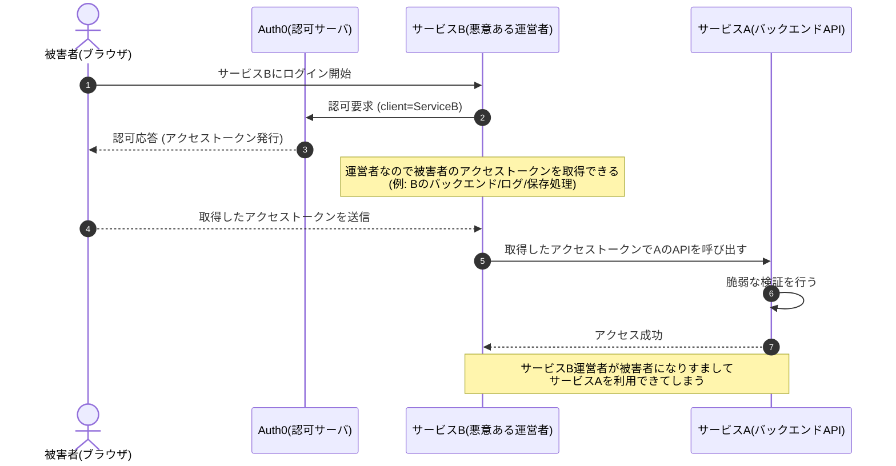
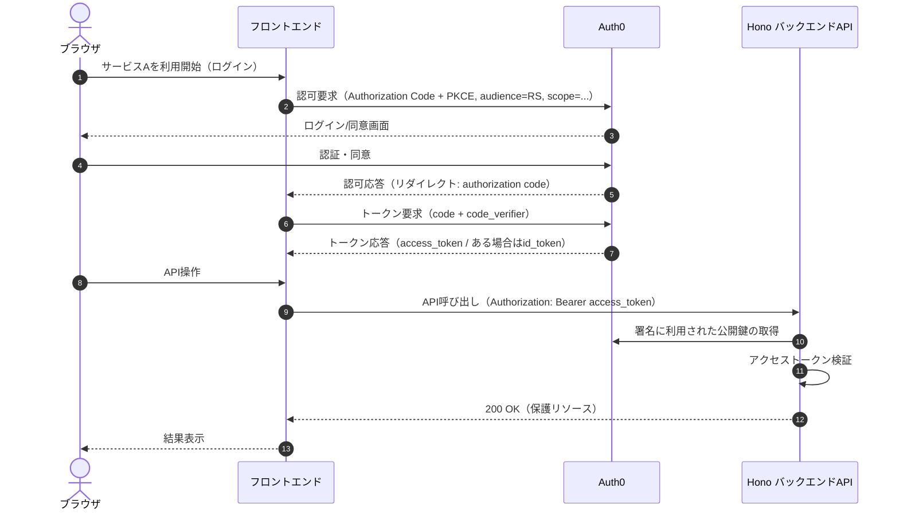
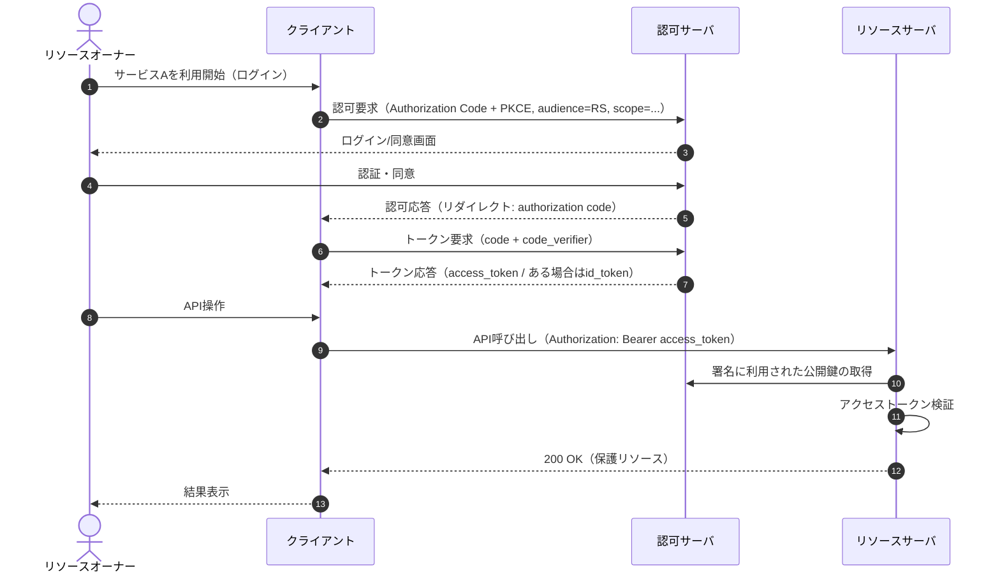

# はじめに

こんにちは。calloc134 です。

近年、Auth0 などの外部認証プロバイダを用いて、
OAuth/OIDC ベースでログインを実装するサービスが増えています。

その際、フロントエンドとバックエンド API を分けて実装し、
ログインをフロントエンドで済ませ、バックエンド API をアクセストークン付きで呼び出す形態を取ることが多いようです。

しかしそのアクセストークンの検証に不備がある場合、
**成りすまし攻撃が可能になること**があります。

今回の記事では、この脆弱性の根本的な問題はそもそも何なのか、
この実装のどこに問題があるのか、
そして OAuth 仕様から見てこの実装は果たして行儀が良いのか？

などを解説していきたいと思います。

:::message
当記事では、
Hono の提供するミドルウェアである

- JWT Auth Middleware
- JWK Auth Middleware

を、わかりやすさのため、まとめて 「JWT ミドルウェア」と呼称しています。

:::

# 想定シナリオ

今回の問題は、
**サービスがアクセストークンの検証処理を誤った場合に成りすまし攻撃が可能になる**
というものです。
具体的なシナリオを考えてみましょう。

まず、ブラウザでログインのできるサービス A があるとします。

サービス A はフロントエンドとバックエンドの API に分かれており、
Auth0 を用いてログインを実装しています。

フロントエンドからバックエンドにはアクセストークンを送信して API を呼び出し、
バックエンド API はそのアクセストークンを検証します。

また、同様にブラウザでログインのできるサービス B も存在します。
ここで前提として、**サービス B の開発者は悪意ある者である**という仮定を置きます。

攻撃の流れは以下のようになります。



1. 被害者が、サービス B にログインする
2. 悪意あるサービス B の開発者は、
   被害者がサービス B にログインしていることを利用して
   被害者のアクセストークンを入手する
   （サービス B の運営者なので、当然被害者のアクセストークンを入手できる）
3. サービス B の開発者は、
   被害者のアクセストークンをサービス A のバックエンド API に送信する
4. サービス A のバックエンドは**誤った検証をしているため**
   サービス B 向けのアクセストークンを受け入れてしまう
5. つまり、サービス B の開発者が被害者になりすまして、
   サービス A のバックエンド API を呼び出せる
6. **なりすましの完成！**

このように、サービス B の開発者は被害者になりすまして
サービス A を利用できてしまうのです。

文字で解説されても、分かりづらいですね。
では、実例をおみせしましょう。

# 今回の攻撃の概念実証を作った

この攻撃の概念実証を作成しました。


以下の URL から動作を確認できます。

**サービス A**
https://frontend-client-a.calloc134personal.workers.dev/

**サービス B**
https://frontend-client-b.calloc134personal.workers.dev/

今回の概念実証では Auth0 と Hono を利用しています。

サービス A とサービス B はそれぞれ、

- フロントエンド（React）
- 脆弱なバックエンド API （Hono）
- セキュアなバックエンド API （Hono）

を持っています。

:::message
サービス A とサービス B は同じ Auth0 テナントを利用する、という前提です。
別テナントの際の挙動については後述します。
:::

## 攻撃の流れ

今回の概念実証では、ユーザ自身が動作検証を行えるようにしています。

概念実証では簡単のため、
被害者と攻撃者を同一ユーザが演じる形式になっています。

概念実証の流れを整理すると以下のようになります。

1. ユーザがサービス B にログインし
   サービス B のアクセストークンを取得する
   
   _1. サービス B にログイン_
   
   _2. サービス B のアクセストークンを取得_

2. 概念実証サイトでは、
   サービス A のバックエンド API と サービス B のバックエンド API を
   両方呼び出せるようになっている
3. サービス B の脆弱なバックエンド API・セキュアなバックエンド API を呼び出す
   → もちろんどちらも成功（正規用途の動作確認）
   
   _3. サービス B のセキュアなバックエンド API を呼び出す → 成功_

4. サービス A の脆弱なバックエンド API・セキュアなバックエンド API を呼び出す
   - 脆弱なバックエンド API は成功 → **なりすまし成功**
     
     _4. サービス A の脆弱なバックエンド API を呼び出す → 成功_
   - セキュアなバックエンド API は失敗 → 成りすまし失敗
     
     _5. サービス A のセキュアなバックエンド API を呼び出す → 失敗_

脆弱なバックエンド API 側は検証不備により、アクセストークンが使い回せてしまいます。

もし攻撃者のサービス B が多くのユーザに使われていたら、
サービス B の管理人は**サービス B でアクセストークンを発行したすべてのユーザについて**
成りすまして サービス A を利用することができてしまいます。

# バックエンド API がアクセストークンを検証する実装

前提として、今回の実装を技術的にもう少し深掘りしてみましょう。

今回の例では、以下のような構成になっています。

- **フロントエンド**: Single Page Application（例: React）
- **バックエンド**: API サーバ（例: Hono）
- **OAuth/OIDC プロバイダ**: 任意の IDaaS プロバイダ（例: Auth0）

全体の流れは以下のようになります。



この内、簡単にまとめると以下のとおりになります。

1. フロントエンドは Auth0 で OAuth/OIDC ログインを行う
2. フロントエンドはアクセストークンを取得する
3. フロントエンドはバックエンド API にアクセストークンを送信する
4. バックエンド API はアクセストークンを検証する
5. **アクセストークンが正しければ** API を実行する

今回の問題は、
5 の「アクセストークンが正しければ」という検証に不備があったことに起因します。
アクセストークンの JWT の有効性の検証自体は行っていたものの、それだけでは十分ではなかったのです。

どのような検証が不足していたのか、以降で詳しく解説します。

# OAuth 仕様から見た今回の実装

まず、前提の基礎固めをしましょう。
OAuth 仕様に照らすと、
今回のフロントエンドとバックエンドは以下のように位置付けられます。

- **フロントエンド** = OAuth クライアント（Public Client といえる）
- **バックエンド API** = OAuth リソースサーバ

先程のフロー図を OAuth の登場人物で表現すると以下のようになります。



OAuth の登場人物については、以下の記事が参考になります。
https://zenn.dev/calloc134/books/sikkari-oauth-oidc/viewer/04-oauth-actors

:::message

フロントエンドを OAuth クライアント、
バックエンド API を OAuth リソースサーバとして実装すること自体の是非については
後ほど議論を行います。
:::

バックエンド API は OAuth リソースサーバとして動作するため、
OAuth 仕様に従ってアクセストークンを検証する責務があります。

ところで、OAuth 仕様では、リソースサーバはアクセストークンを受け取ったとき、
アクセストークンの発行元（OAuth 認可サーバ）を検証する責務があります。
また、**本当に自身宛てに発行されたアクセストークンなのか**を確かめるために、
どのリソースサーバ向けに発行されたアクセストークンなのかを検証する責務もあります。

先に結論を言うと、
**仕様通りに検証すれば**、アクセストークンの使いまわしによる成りすましは発生しません。

さらに仕様では、アクセストークンに紐づくスコープの検証も MUST とされています。

:::message
余談ですが、筆者の意見では、一般的なリソースサーバではなく、
バックエンド API の認可のみに OAuth アクセストークンを使う場合は
`scope` クレームまで検証する必要は流石になさそうだと考えています。
:::

# JWT 形式のアクセストークン

次に、アクセストークンについての基礎知識を整理しましょう。

OAuth はアクセストークンの形式を規定していませんが、
今回は Auth0 を採用したため、これに準拠して、
OAuth アクセストークンが JWT 形式で発行される場合を想定し解説します。

OAuth においてアクセストークンを JWT 形式にする仕様としては、
**RFC 9068 OAuth 2.0 JWT Access Tokens** があります。

Auth0 もほぼ同じような形式を利用しており、
デフォルトでは Auth0 独自形式ですが、RFC 9068 との差異は一部のみであり、
今回の問題には影響しません。

ここでは重要なポイントのみに絞るため、RFC 9068 に準拠した説明を行います。

アクセストークンは JWT 形式で発行され、JWT のクレームとして以下のものが含まれます。

- 発行元（issuer）を示す `iss` クレーム
- 対象者（audience）を示す `aud` クレーム
- スコープを示す `scope` クレーム

アクセストークンにおける `aud` クレームは、
アクセストークンがどのリソースサーバ向けに発行されたかを示します。

例えば、サービス A のバックエンド API 向けに発行されたアクセストークンは、
`aud` クレームにサービス A のバックエンド API の識別子が含まれます。
同様に、サービス B のバックエンド API 向けに発行されたアクセストークンは、
`aud` クレームにサービス B のバックエンド API の識別子が含まれます。

リソースサーバはアクセストークンの `aud` クレームを検証し、
自分自身の識別子が含まれていることを確認する責務があります。
これにより、他のリソースサーバ向けに発行されたアクセストークンを拒否できます。

**この検証の方法を誤ると、**
**他のリソースサーバ向けに発行されたアクセストークンを受け入れてしまい、**
**成りすまし攻撃が可能になってしまうのです。**

# Hono の JWT ミドルウェアに指摘された問題

今回の問題は、
Hono が提供する JWT ミドルウェアを開発者が誤って使ったことに起因します。

Hono の JWT ミドルウェアは 単なる JWT 検証ミドルウェアとして提供されており、
**OAuth リソースサーバ向けに特化していません**。
つまり、OAuth に関係ない JWT の検証 に利用することが想定されています。

:::message

OAuth に関係ない JWT の活用方法とは、
例えば バックエンド API が独自で発行し、
ログインを保持するセッションとして JWT を利用する、などが考えられます。
この JWT については後述します。

:::

OAuth リソースサーバ向けに使う場合は、

- 発行元（issuer）の検証
- **対象者（audience）の検証**
- scope クレームの検証（必要なら）

などを開発者が実装する必要があります。

しかし、今回の実装のように JWT ミドルウェアを用いてバックエンド API を認可する場合、

JWT の有効性検証に加えてオプションで`iss` 検証は行うことができるものの
**`aud` パラメータを検証するオプションが存在しませんでした**。

Hono 利用者が、`aud` パラメータのオプションがないという理由で
`aud` パラメータを検証せずそのまま利用すると、
他サービスのアクセストークンを受け入れてしまい
成りすまし攻撃が可能になります。

`aud` パラメータを検証するオプションがないという問題は
**CVE-2025-62610** として報告されました。

https://nvd.nist.gov/vuln/detail/CVE-2025-62610
https://github.com/honojs/hono/security/advisories/GHSA-m732-5p4w-x69g

## Hono 側の修正

この問題に対応し Hono 側で修正が行われ、
JWT ミドルウェアに対して `aud` 検証のオプションが追加されました。

https://github.com/honojs/hono/commit/45ba3bf9e3dff8e4bd85d6b47d4b71c8d6c66bef

これにより、バックエンド API を認可する場合でも
`aud` 検証をミドルウェアで行う設定にすれば安全に利用できるようになりました。

```ts
jwk({
  jwks_uri: `https://${auth0Domain}/.well-known/jwks.json`,
  verification: {
    aud,
    iss,
  },
});
```

## 注意点

重要なのは、**デフォルトで自動的に安全になるわけではない**ということです。
問題に対策するには 開発者が `aud` 検証を有効にし、正しく活用する必要があります。
開発者のリテラシー向上が求められるということです。

:::message
なお、ドキュメントにはまだ反映されていないようです。

筆者は Hono のコントリビューターではないので、
コントリビューターの方に修正をお願いできればベストかなと考えています。

ドキュメントに反映される見通しがない場合は自分が PR を出そうかなと考えています。
その場合、ミドルウェア利用者に対しどのように `aud` 検証の重要性を伝えるかが課題だな・・・と感じています。

:::

この問題に対応してくださった開発者さん本人がブログを公開されています。
コントリビュートありがとうございます！

https://zenn.dev/okazu_dm/articles/d72419e2431761

# フレームワークの責務と利用者の責務

筆者の意見では、今回の問題を
フレームワークの責務と利用者の責務の境界に関する問題と捉えています。

フレームワーク側の意図としては、
JWT 検証ミドルウェアは 単なる JWT の有効性を検証するための用法を提供するものであり、
OAuth リソースサーバ向けに特化したものではない、
という意図で設計されていると考えられます。

これは筆者の推測ですが、「JWT ミドルウェア」という名称からしてそのように読み取れます。

本来であれば、利用者は OAuth 認可の用途でアクセストークン検証を行う場合、
JWT ミドルウェアの利用で JWT の有効性検証と発行元（issuer）の検証を行うことを前提にとして
JWT ミドルウェアでは行われない対象者（audience）の検証を
**自分で実装する** 必要があります。
例えば、ペイロードをデコードして検証するミドルウェアのようなものです。

今回は CVE が降りましたが、
根本的原因は利用者のミドルウェア利用の用法ミスに起因するものであり、
Hono 自体の脆弱性、あるいは Hono の JWT ミドルウェアの脆弱性とは
考えづらいというのが筆者の意見です。

ただし、JWT ミドルウェアで`iss`検証ができるオプションが存在する以上、
`aud`検証も同様にオプションで提供されることは自然な方針です。

`aud` を検証できるオプションの追加という修正は
利用者のミドルウェア利用の用法ミスを防ぐための Hono 側の配慮であって
Hono の JWT ミドルウェア自体に存在した脆弱性ではないですし、
自動的に脆弱な実装が防がれるものでもありません。

:::details もう一つの解決策
もうひとつの解決策の世界線として。

バックエンド API の認可を行う用途であれば、
Hono が JWT ミドルウェアとは別に、
OAuth リソースサーバ用にアクセストークンを検証するためのミドルウェアを提供し、
そのミドルウェアを利用することを推奨するという手もあるかもしれません。

ただ筆者は、今回の解決策でも対応は十分できていると考えています。

他のフレームワークでも、
OAuth リソースサーバ向けに特化したアクセストークン検証ミドルウェアは
あまり提供されていないように思います（筆者の知る限りでは）。

逆に、JWT 検証ミドルウェアにおいて `aud` 検証をサポートしているものが多いです。

:::

# 他フレームワークの対応

Hono 以外のフレームワークではどのような対応がされているでしょうか。
他フレームワークも JWT 検証ミドルウェアに
`aud`検証を行うオプションを提供しているのでしょうか？
また、リソースサーバ用のミドルウェアを提供しているのでしょうか？

## Express.js

Express.js では、単なる JWT 検証ミドルウェアと OAuth リソースサーバ向けミドルウェアの両方が存在します。

まず、単なる JWT 検証ミドルウェアを紹介します。
Auth0 が提供する [express-jwt](https://github.com/auth0/express-jwt) があります。
`jose` をベースに開発されており
JWT の検証に加え、`iss`/`aud` 検証も行います。
`scope` 検証には未対応の模様です。

https://github.com/auth0/express-jwt

次に、OAuth リソースサーバ向けのミドルウェアを紹介します。
Auth0 が提供するミドルウェア [node-oauth2-jwt-bearer](https://github.com/auth0/node-oauth2-jwt-bearer/tree/main/packages/express-oauth2-jwt-bearer) があります。
`jose` をベースに開発されており、
JWT の検証に加え、`iss`/`aud` 検証も行います。
`scope` 検証にも対応しています。

https://github.com/auth0/node-oauth2-jwt-bearer/tree/main/packages/express-oauth2-jwt-bearer

## Fastify

Fastify でも、単なる JWT 検証ミドルウェアと OAuth リソースサーバ向けミドルウェアの両方が存在します。

まず、単なる JWT 検証ミドルウェアを紹介します。
サードパーティによるプラグイン [fastify-jwt-jwks](https://github.com/nearform/fastify-jwt-jwks) があります。
`@fastify/jwt` をベースに開発されており、
JWT の検証に加え、`iss`/`aud` 検証もサポートしています。
`scope` 検証には未対応の模様です。

https://github.com/nearform/fastify-jwt-jwks

次に、OAuth リソースサーバ向けのミドルウェアを紹介します。
Auth0 が提供するミドルウェア [auth0-fastify-api](https://github.com/auth0/auth0-fastify/tree/main/packages/auth0-fastify-api) があります。
`jose` をベースに開発されており、
JWT の検証に加え、`iss`/`aud` 検証も行います。
`scope` 検証にも対応しています。

https://github.com/auth0/auth0-fastify/tree/main/packages/auth0-fastify-api

## Elysia

Elysia でも、単なる JWT 検証ミドルウェアと OAuth リソースサーバ向けミドルウェアの両方が存在します。

まず、単なる JWT 検証ミドルウェアを紹介します。
公式プラグイン [@elysiajs/jwt](https://github.com/elysiajs/elysia-jwt) があります。
`jose` をベースに開発されており、
JWT の検証に加え、`iss`/`aud` 検証もサポートしています。
`scope` 検証には未対応の模様です。

https://github.com/elysiajs/elysia-jwt

次に、OAuth リソースサーバ向けのミドルウェアを紹介します。
公式ではありませんが、
有志によるプラグイン [elysia-oauth2-resource-server](https://github.com/ap-1/elysia-oauth2-resource-server) が存在しています。
`jose` をベースに開発されており、
JWT の検証に加え、`iss`/`aud` 検証もサポートしています。
`scope` 検証にも対応しています。
https://github.com/ap-1/elysia-oauth2-resource-server

## ミドルウェア調査のまとめ

Express.js、Fastify、Elysia の各フレームワークでは、
JWT 検証ミドルウェアにおいて `iss`/`aud` 検証をサポートしているものが多く存在します。
ただし JWT 検証ミドルウェアは基本的に OAuth リソースサーバ向けに特化していないため、
`scope` 検証には対応していないものが多いです。

一方で、OAuth リソースサーバ向けミドルウェアには
`iss`/`aud` 検証に加え、`scope` 検証にも対応しているものが多いです。

# できるならアクセストークンをセッションのように使わないでほしい

では、OAuth の仕組みを用いて

- フロントエンド = OAuth クライアント（Public Client）
- バックエンド API = OAuth リソースサーバ
- アクセストークンをクライアント・サーバ間のセッションとして利用

とする構成は、果たして行儀が良いのでしょうか？

筆者の意見では、
**この構成は基本的に避けるべきだと考えています。**

OAuth 2.0 を策定している RFC 6749 では、
リソースサーバ と関係のないアプリケーション、
つまり**サードパーティアプリケーション** に対して、
リソースオーナーが自分のリソースへのアクセスを許可するための仕組みである、
ということを前面に押し出しています。

今回の例では、
クライアント = フロントエンドアプリケーション
リソースサーバ = バックエンド API
となっており、
フロントエンドアプリケーションとバックエンド API は同一サービスに属しています。

したがってサードパーティアプリケーションとは言えず、
**OAuth の利用は本来の趣旨から外れているのではないか？** と考えます。

また、**アクセストークンをセッションとして利用するのは**
あまり提供されていないように思います。

セッション保持の用途であれば、
OAuth の仕組みを無理に流用して複雑化させてしまうよりも、
クライアント・サーバ間で別の仕組みを使うべきです。

具体的には、以下のような仕組みが考えられます。

- バックエンドの発行するクッキーを用いたセッション管理

セッションを管理したいのであれば
OAuth の仕組みを敢えて利用する必要はないと考えます。

OAuth アクセストークンは API 間の認可を行うためのトークンであり
**クライアント・サーバ間のセッションを管理するためのトークンではありません。**

更に、そもそも OAuth アクセストークンをクライアント・サーバ間のセッションとして使うと
OAuth クライアントを Public Client として実装する必要があります。
OAuth において Public Client の利用は
一般的にセキュリティリスクが高いとされています。

詳細は以下の記事が参考になります。
https://zenn.dev/calloc134/books/sikkari-oauth-oidc/viewer/15-client-types

以上の理由です。
フロントエンドを Public Client として動作させ
アクセストークンをセッションのように使う例は、実際のサービスでも頻繁に見られます。
しかし、**可能であれば避けるべき**というのが筆者の意見です。

そしてこの構成は、OAuth の仕様を正しく理解していない状態で実装すると
脆弱性の温床になりやすいです。
その代わり、
**バックエンドで発行するクッキーを用いたセッション管理**を推奨したいと思います。

# 結論

- そもそも OAuth アクセストークンをセッションのように使うのは避けるべき
- クライアント・サーバ間のセッション管理には以下を使うべき
  - バックエンドの発行するクッキーを用いたセッション
- それでも、もし OAuth アクセストークンをセッションとして使うなら
  - OAuth に対しての十分な理解を持ち
  - バックエンド API が OAuth リソースサーバとして動作することを踏まえ
  - その上で、提供されるミドルウェアの用法を誤らずに実装すること！

その場合、リソースサーバに必要な要件として、以下を必ず実装してください。

- 発行元（issuer）検証
- **対象者（audience）検証**
- scope クレーム検証（必要なら）

**これを怠ると成りすまし攻撃のリスクがあります！**

以上、しっかりと理解した上で、安全な実装を心がけましょう！

# 余談: 代わりに好まれる構成の実装例

先程の解説では、バックエンドの発行するクッキーを用いたセッション管理を推奨しました。
では、Hono をバックエンドに利用した際の、代わりの構成の例を紹介します。

今回のこの記事では、Auth0 を利用して外部の IDaaS プロバイダでログインを行っていました。
Auth0 を利用して IDaaS プロバイダでログインを行いながらも、
バックエンドの発行するクッキーを用いたセッション管理を行う例を示します。

:::details 自前での実装
自前でセッション管理を実装する場合、
`@hono/session` パッケージを利用すると便利です。
その際、`@hono/session`自体はログイン検証処理を提供しないため、
ログイン検証処理は自前で実装する必要があります。

参考となるコードについて提示します。
まずはバックエンド側、Hono のコードです。

```ts
// Cookie を送受信したいので credentials を true にする（origin は * ではなく明示）
app.use(
  "*",
  cors({
    origin: FRONT_ORIGIN,
    credentials: true,
  })
);

// Cookie 認証は CSRF 対策が必要になりやすいので、最低限 Origin ベースで保護（任意）
app.use(
  "*",
  csrf({
    origin: FRONT_ORIGIN,
  })
);

// セッションを有効化
app.use(
  "*",
  useSession<AppSessionData>({
    // 1h（秒）: 元記事の maxAge / exp と同等のイメージ
    duration: { absolute: 60 * 60 },
  })
);

const requireAuth: Parameters<typeof app.get>[1] = async (c, next) => {
  // セッションデータ取得（未ログインなら null）
  const data = await c.var.session.get();
  const user = data?.user;

  if (!user) return c.json({ message: "Unauthorized" }, 401);

  c.set("user", user);
  await next();
};

// 認証状態確認（フロントは HttpOnly Cookie を読めないので、この API を叩いて判断する）
app.get("/auth/me", requireAuth, (c) => {
  return c.json({ user: c.get("user") });
});
```

このコードでは、`requireAuth` ミドルウェアでセッションを読み取り
セッションが存在しない、かつユーザが存在しない場合は 401 エラーを返しています。
検証が正しければ認証成功とし、ユーザ情報をコンテキストにセットしています。

なお、クッキーを CORS ポリシーに引っかからずに送信するための設定を行い、
CSRF 対策を最低限実装しています。

次にフロントエンド側、React のコード例です。
React 自体のコードではなく、API 呼び出し部分のみ抜粋しています。

```ts
export async function me() {
  const res = await fetch(`${API_BASE}/auth/me`, {
    method: "GET",
    credentials: "include", // ← Cookie を送る
  });

  if (res.status === 401) return null;
  if (!res.ok) throw new Error(await res.text());
  return res.json() as Promise<{ user: { id: string } }>;
}
```

このコードでは、`fetch` のオプションで `credentials: "include"` を指定し、
クッキーを送信しています。
こうすることで、バックエンド側でクッキーを読み取れるようになります。

なお、`fetch`のオプションで`credentials: "include"` を指定する場合、
クッキーが`HttpOnly`であっても問題なく送信されます。
このようにすることで、
**クライアント側でクッキーを JavaScript から読めないように**し、
悪意のある JavaScript からの盗み見を防止できます。

なお、ログイン・ログアウト処理については
以下のように記述することができます。

バックエンド側コード:

```ts
// ログイン（JWT を発行して Cookie に保存）→ セッションに user を保存
app.post("/auth/login", async (c) => {
  // ログイン処理は省略（適宜実装してください）
  // パスワード認証でも良いし、ここで外部 IDaaS プロバイダを呼んでも良い

  await c.var.session.update({
    user: { id: "user_123" },
  });

  return c.json({ ok: true });
});

// ログアウト（Cookie を削除）→ セッション削除
app.post("/auth/logout", (c) => {
  c.var.session.delete();
  return c.json({ ok: true });
});
```

ログイン API では、
ユーザ認証に成功した場合に JWT を発行し、
`HttpOnly` 属性付きのクッキーに保存しています。
コメント部分では任意のユーザ認証処理を実装してください。

ログアウト API では単にクッキーを削除しています。

フロントエンド側コードは以下のようになります。

```ts
export async function login(email: string, password: string) {
  const res = await fetch(`${API_BASE}/auth/login`, {
    method: "POST",
    headers: { "Content-Type": "application/json" },
    credentials: "include", // ← Cookie を送る
    body: JSON.stringify({
      // 適宜変更してください
    }),
  });

  if (!res.ok) throw new Error(await res.text());
  return res.json() as Promise<{ ok: true }>;
}
export async function logout() {
  const res = await fetch(`${API_BASE}/auth/logout`, {
    method: "POST",
    credentials: "include",
  });
  if (!res.ok) throw new Error(await res.text());
}
```

フロントエンド側では、ログイン API とログアウト API を呼び出す際に
`credentials: "include"` を指定してクッキーを送信しています。
サーバ側でクッキーが操作されるため、これで問題ありません。

:::message
今回はクッキーの上に 情報を含んだトークンを載せる実装例を紹介しました。

クッキーの上にアサーション式トークンを載せるこの実装は
**ステートレスセッション** と呼称されることが多いです。
この特性のセッションには以下の特徴があります。

- 外部 DB が必要ないため
  - インフラ構成がシンプルになる
  - スケーラビリティが高い
  - データ変更が難しい（JWT 発行後は不変）
  - クッキーの失効が難しい（JWT の有効期限まで有効）

この特性上、今回のコードでは
クッキーを削除するのみにとどまっています。

これに対し、クッキーの上に handle 式トークンを載せる実装は
**ステートフルセッション** と呼称されることが多いです。
この特性のセッションには以下の特徴があります。

- 外部 DB が必要になるため
  - インフラ構成が複雑になる
  - スケーラビリティが低い
  - データ変更が容易（DB のデータを書き換えればよい）
  - クッキーの失効が容易（DB から削除すれば即座に無効化可能）

これらの違いも踏まえた上で、要件に応じて適切な方式を選択してください。
:::

# 余談: 対称鍵署名と非対称鍵署名の使い分け

バックエンドサーバが JWT を発行する場合、
対称鍵署名（HMAC）を用いることが多いです。
具体的には、`HS256` アルゴリズムがよく使われます。

これは、バックエンドサーバが唯一の署名者であり、
検証者でもあるためです。

では、OAuth の認可サーバの発行する
アクセストークンの場合はどうでしょうか？

アクセストークンの検証を行うのはリソースサーバであり、
認可サーバとは別の存在です。
したがって、非対称鍵署名（RSA や EC）を用いることが一般的です。
具体的には、`RS256` や `ES256` アルゴリズムがよく使われます。

この違いをしっかり理解しておきましょう。

# 余談: プロバイダごとのテナント分離機能と攻撃困難さ

実は、IDaaS プロバイダにはテナントという概念が存在します。

テナントとは、アプリケーションが所属する論理的なグループのことです。
同一テナント内では一般的に、同一 Issuer / 同一の JWT 署名鍵が使われます。

今まで解説したのは、
アプリケーション、つまり 2 つの OAuth クライアントが
同一テナントである前提でした。

もし Auth0 を利用している場合であれば、
サービス A とサービス B が異なるテナントに所属している場合は
JWT 署名検証で異なる署名鍵を使っているため攻撃不可能です。

また署名鍵が同じでも Issuer が異なるため、
検証時に 不一致となり攻撃不可能です
（ちなみに、Auth0 の場合は Issuer はテナントのドメインです）。
Auth0 の場合、テナントの違いが攻撃困難の要因となります。

では、Auth0 以外の IDaaS プロバイダではどうでしょうか？
具体的に調査してみると、プロバイダの設定によっては脆弱になる場合があります。

## 注意が必要なプロバイダ

**OneLogin（generic issuer 利用時）**

generic issuer を使うと
issuer が `https://openid-connect.onelogin.com/oidc` で固定されます。
また公開鍵も `https://openid-connect.onelogin.com/oidc/certs` で固定になります。

つまり、テナントが異なっても同一の issuer / 署名鍵になり、
同一テナントでなくても攻撃が可能となります。
ただし、敢えて generic issuer を設定するケースは少ないと思われます。

**Firebase Auth**

Firebase プロジェクトがテナントに相当しますが、署名鍵は共通です。
一方、Issuer はプロジェクトごとに異なります。

Issue 検証まで行っている場合は攻撃が不可能ですが、
Issuer 検証を行わず署名鍵のみで検証している場合は攻撃が可能です。

## 大半の場合は攻撃困難

しかし大半の場合、テナント分離が適切に行われていれば攻撃は困難になります。

**マネージド IDaaS プロバイダの例**

- **Okta**:
  Organization という概念がテナントに相当
  Issuer と署名鍵が Organization ごとに異なる
- **AWS Cognito**:
  User pool という概念がテナントに相当。
  Issuer と署名鍵が User pool ごとに異なる

**セルフホスト系 IDaaS プロバイダの例**

- **Keycloak**:
  Realm という概念がテナントに相当
  Issuer と署名鍵が Realm ごとに異なる
- **ZITADEL**:
  Instance という概念がテナントに相当
  Issuer と署名鍵が Instance ごとに異なる
- **Logto**:
  Logto tenant という概念がテナントに相当
  Issuer と署名鍵が Logto tenant ごとに異なる

このように、多くの IDaaS プロバイダではテナントで分離される機能が存在しており、
テナントによって署名鍵と Issuer が異なるため、
攻撃が困難になるように設計されています。

したがってテナントが別ならこの脆弱性は起こりづらいです。

とはいえ IDaaS プロバイダの設定によっては脆弱になる場合があるため、
どのような挙動になるかは各自で確認し、慢心しないようにしてください。

繰り返しですが、
**テナントが同一の場合は、**
**どのプロバイダであっても今回の脆弱性が発生する可能性を考慮しなければなりません**。

# 余談: Opaque トークンでもこの問題は発生するか？

Opaque トークン (handle 式) と JWT (Assertion 式) の違いについては、
以下の記事が参考にしてください。
https://zenn.dev/calloc134/books/sikkari-oauth-oidc/viewer/06-access-token-format

今回の問題は、Opaque トークン（非 JWT 形式のアクセストークン）でも発生する可能性があります。
リソースサーバは どのようなトークンであっても

- 誰が発行したか（発行元）
- どのリソースサーバ向けか（対象者）

を検証する責務があります。

Opaque トークンの場合はトークンの内容を直接検証できないため、
トークン情報を取得するために認可サーバに問い合わせる必要があります。
しかし、認可サーバに問い合わせる際に発行元や対象者の検証を怠ると
同様の成りすまし攻撃が可能になります。

Opaque トークンであっても、
リソースサーバは発行元と対象者に該当する情報の検証を必ず行う必要があります。

# おわりに

今回は、アクセストークン検証不備による成りすまし攻撃について解説しました。
OAuth 仕様というのは複雑です。
また、OAuth をセッション管理に使うのは、
本来の使い方から外れていると筆者は考えています。

それでも OAuth をセッション管理に使う場合は
ミドルウェアの用法を誤らないように、しっかりと公式ドキュメントや仕様を読み込む必要があります。

どちらにせよ、十分な理解のもとで、正しい実装を行うことが重要です。

皆さんも雰囲気 OAuth を避け、仕様をよく理解した上で安全な実装を心がけましょう！
