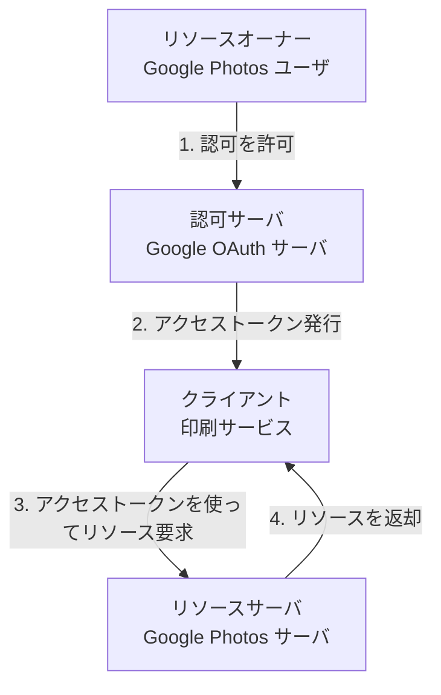

## 概要

OAuth には 4 つの登場人物（ロール）が存在します。リソース認可に関連する人物をまず列挙してみましょう。

- リソースの持ち主
- リソースを管理している保管庫
- 保管庫へのアクセスを管理している認可局
- リソースにアクセスする第三者

RFC 6749 では、以下のように説明されています。

> 例えば, あるユーザー (リソースオーナー) が, 印刷サービス (クライアント) に対して, 写真共有サービス上 (リソースサーバー) に保管されている彼女の保護された写真へのアクセス権を与えることを考える. OAuth では, その際彼女のユーザー名とパスワードを印刷サービスに与える必要はない. そのかわり, 彼女は写真共有サービスの信任を得たサービス (認可サーバー) に対して認証を行い, 印刷サービスへのアクセス権限委譲用クレデンシャル (アクセストークン) を発行させる
>
> — [RFC 6749 Section 1](https://www.rfc-editor.org/rfc/rfc6749#section-1)

ここでは、Google Photos を例に各登場人物を解説していきます。

## リソースオーナー（Resource Owner）

**リソースオーナー**は、リソースの持ち主です。

- Google Photos に画像を保存しているユーザ
- 認可サーバに「この第三者にリソースへのアクセスを許可します」と伝える主体

## リソースサーバ（Resource Server）

**リソースサーバ**は、リソースオーナーの持つリソースを管理している保管庫です。

- Google Photos で画像を保管しているサーバ
- アクセストークンを受け取り、それを検証し、成功すればリソースを返す

## 認可サーバ（Authorization Server）

**認可サーバ**は、保管庫へのアクセスを管理している認可局です。

- Google OAuth サーバ
- リソースオーナーからの許可を得て、アクセストークンを発行する

:::message
リソースサーバと認可サーバは、同じサーバであることも多いです。

> 認可サーバーとリソースサーバー間のやりとりについては本仕様書の範囲外である. 認可サーバーはリソースサーバーと同一のサーバーでも異なるサーバーでもよい
>
> — [RFC 6749 Section 1.1](https://www.rfc-editor.org/rfc/rfc6749#section-1.1)

:::

## クライアント（Client）

**クライアント**は、リソースにアクセスする第三者です。

- 印刷サービスなど、リソースオーナーに代わってリソースにアクセスするアプリケーション
- リソースオーナーから許可を得て、認可サーバからアクセストークンを取得し、リソースサーバのリソースにアクセスする

## まとめ：4 つの登場人物の関係

## 余談：OAuth「クライアント」という名前について

「クライアント」という名前から、スマートフォンやブラウザで動作するアプリを想像するかもしれません。

しかし、OAuth における「クライアント」は、**OAuth フローにおける役割（ロール）**を指す言葉です。サーバ・クライアントモデルにおけるクライアントとは異なる概念です。

OAuth クライアントがサーバサイドで動作することもありますし、むしろそちらの方がセキュリティ上望ましいケースも多いです。

### OAuth クライアントの種類

OAuth クライアントには、**Confidential Client** と **Public Client** の 2 種類があります。

| クライアントタイプ      | 説明                                             |
| ----------------------- | ------------------------------------------------ |
| **Confidential Client** | クレデンシャルの機密性を維持できるクライアント   |
| **Public Client**       | クレデンシャルの機密性を維持できないクライアント |

詳細は後の章で解説しますが、本書ではまず **Confidential Client** を前提に解説を進めます。

Confidential Client の場合、サーバサイドで動作することが一般的です。Ruby on Rails のような昔ながらの MPA（Multi Page Application）を想定してください。

Public Client については、Confidential Client の理解が十分に進んでから解説します。
