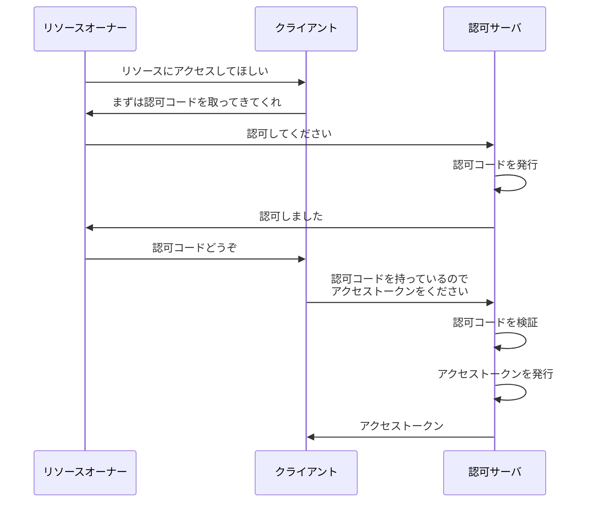

# OAuth のフロー

OAuth には、フローの種類がいくつか存在します。この種類のことを、**グラントタイプ**と呼びます。

最も有名なものとして、**認可コードフロー**があります。このフローが最も一般的であり、推奨されています。

:::message
**余談: インプリシットフロー**

他のフローとして**インプリシットフロー**というものが存在します。こちらは認可コードフローを単純にしたものなのですが、原理的にセキュリティ上の問題があります。現在ではこのフローを採用するメリットが存在しないため、非推奨とされています。

この本では、簡単のため、**認可コードフローで進めていきます**。インプリシットフローについては、セキュリティの章で改めて触れます。
:::

# ざっくりとしたフロー

まずはざっくりとした解説です。

OAuth の認可コードフローは、以下のような流れで行われます^[http://openid-foundation-japan.github.io/rfc6749.ja.html#grant-code]。

1. リソースオーナーがクライアントに対し、「リソースにアクセスしてほしい」とリクエストする
2. クライアントがリソースオーナーに対し、「まずは認可コードを取ってきてくれ」と言ってリソースオーナーをリダイレクトさせる
3. リソースオーナーが認可サーバにアクセスし、認可サーバに対して「認可してください」とリクエストする
4. 認可サーバがリソースオーナーに対して「認可しました」と言って認可コードをもたせ、リソースオーナーをクライアントにリダイレクトさせる
5. リソースオーナーはクライアントに対して認可コードを渡す
6. クライアントが認可コードを持って認可サーバにアクセスし、「認可コードを持っているのでアクセストークンをください」とリクエストを送る
7. 認可サーバが認可コードを検証し、成功すればアクセストークンを発行
8. 認可サーバがクライアントに対してアクセストークンを返す

最終的にクライアントがアクセストークンを取得して、フローは終了します。

# アクセストークンとは

**アクセストークン**は、リソースにアクセスするための鍵のようなものです。

アクセストークンを持っていると、リソースサーバにアクセスすることができます。

# 認可コードとは

**認可コード**は、言ってみれば一時トークンのようなものです。

アクセストークンと引き換えするための一時的なトークンであり、有効期限は短く、一度使うと無効になります。

直接アクセストークンを受け取るのではなく、認可コードを経由してアクセストークンを受け取ることで、セキュリティを向上させることができます。詳細は後ほど解説します。

# 例え話で理解する

フローについて、いまいちピンとこないかもしれないですね。では、例え話をしましょう。

登場人物を、以下のように例えてみましょう。

エルフの魔法使いであるフリーレンは、強い魔法使いです。
人間の魔法使いフェルンは、フリーレンの弟子であり、フリーレンに日々魔法を教わりながら、魔法使いとしての道を歩んでいます。

フリーレンは、魔法の使い方の書いてある本である魔導書を集めることが趣味です。自分のカバンに魔導書を入れています。しかし、セキュリティのため、自分以外の人間がカバンを開けるときは、特別な印をつけた鍵を使う必要があるようにしています。

そしてフリーレンは更に、セキュリティの万全を期すため、カバンを開ける様子を見張る門番として、精霊を雇っています。この精霊が、特別な印をつけた鍵を作ってくれます。また、鍵を作る際に必要な引き換え書も精霊が作ってくれます。

ある時、フリーレンは「フェルンに、私の魔導書を読ませたい」と思います。しかし、フェルンは鍵を持っていないため、カバンを開けることができません。

まずフリーレンが、精霊に頼みます。「私の許可を元に、鍵の引き換え書を作ってくれ」と。
精霊は、フリーレンの許可を元に、鍵の引き換え書を作ってフリーレンに手渡します。

フリーレンは、引き換え書を持ってフェルンに渡します。
フェルンは、引き換え書を持って精霊に行き、鍵を受け取ります。
フェルンは、鍵を持ってフリーレンのカバンを開け、魔導書を取り出すことに成功しました。
フェルンはこの魔導書を読み、魔法の使い方を学びます。

このような流れで、OAuth の認可コードフローが行われます。

以上の登場人物は、それぞれ以下のように対応します。

| 例え話             | OAuth の用語     |
| ------------------ | ---------------- |
| フリーレン         | リソースオーナー |
| フェルン           | クライアント     |
| 魔導書             | リソース         |
| カバン             | リソースサーバ   |
| 特別な印をつけた鍵 | アクセストークン |
| 鍵を作る精霊       | 認可サーバ       |
| 引き換え書         | 認可コード       |

認可コードフローに沿って、できるだけ適切に例え話をしてみました。上手く理解していただけると幸いです。

参考リンク:
https://openid-foundation-japan.github.io/rfc6749.ja.html#grant-code
https://booth.pm/ja/items/1550861
