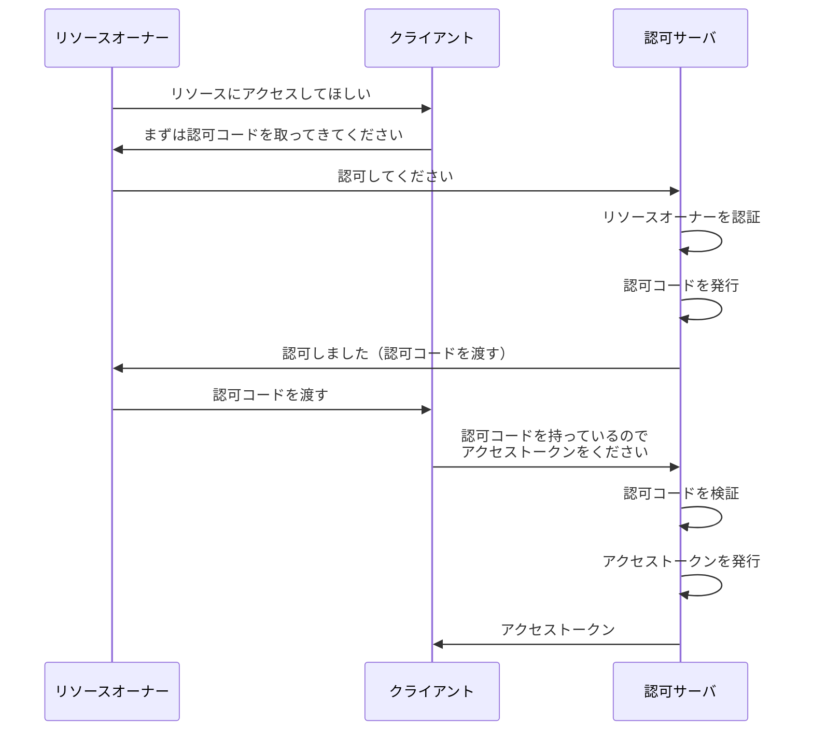

## 概要

この章では、OAuth の代表的なフローである**認可コードフロー**について簡易的に解説します。

ここでは **Confidential Client** を前提とします。セキュリティ機構（PKCE、state など）については後の章で解説するため、まずはフローの基本的な流れを理解しましょう。

## フローに登場するクレデンシャル

### アクセストークン

前章で解説した通り、アクセストークンはリソースアクセスのための「鍵」です。

### 認可コード

**認可コード**は、アクセストークンを引き換えるための一時的なトークンです。

- 一度使うと無効になる
- 有効期限は短い方が望ましい（一般的に数分程度）
- 直接アクセストークンを受け取るのではなく、認可コードを経由することでセキュリティが向上する

「なぜ認可コードを経由するのか？」という疑問については、後の章で詳しく解説します。

## フローの流れ

認可コードフローは、以下のような流れで行われます。

### ステップ 1：フロー開始

1. リソースオーナーがクライアントに対し、「リソースにアクセスしてほしい」とリクエストする
2. クライアントがリソースオーナーに対し、「まずは認可コードを取ってきてください」とリダイレクトさせる

### ステップ 2：認可コード取得

3. リソースオーナーが認可サーバにアクセスし、「認可してください」とリクエストする
4. 認可サーバがリソースオーナーを認証し、認可コードを発行する
5. 認可サーバがリソースオーナーに認可コードを持たせ、クライアントにリダイレクトさせる
6. リソースオーナーはクライアントに対して認可コードを渡す

### ステップ 3：アクセストークン取得

7. クライアントが認可コードを持って認可サーバにアクセスし、「アクセストークンをください」とリクエストする
8. 認可サーバが認可コードを検証し、成功すればアクセストークンを発行する
9. 認可サーバがクライアントに対してアクセストークンを返す

## まとめ

最終的にクライアントがアクセストークンを取得して、フローは終了します。

「認可コードを挟むことで煩雑になっている」と感じるかもしれませんが、これはセキュリティ向上のために必要なステップです。詳細は後の章で解説しますが、認可コードを経由することで：

- アクセストークンがリソースオーナー（ブラウザ）を経由しない
- 認可コードが漏洩しても、それだけではアクセストークンは取得できない

といったメリットがあります。

## 余談：認可コードフロー以外のフロー

OAuth には、認可コードフロー以外にも**インプリシットフロー**というものが存在します。

インプリシットフローは、認可コードを介さずに直接アクセストークンを取得するフローです。しかし、セキュリティ上の問題から**現在は非推奨**となっています。

インプリシットフローの詳細と非推奨の理由については、後の章で解説します。その際、「なぜ認可コードを挟むことが重要なのか」もより深く理解できるようになるでしょう。
