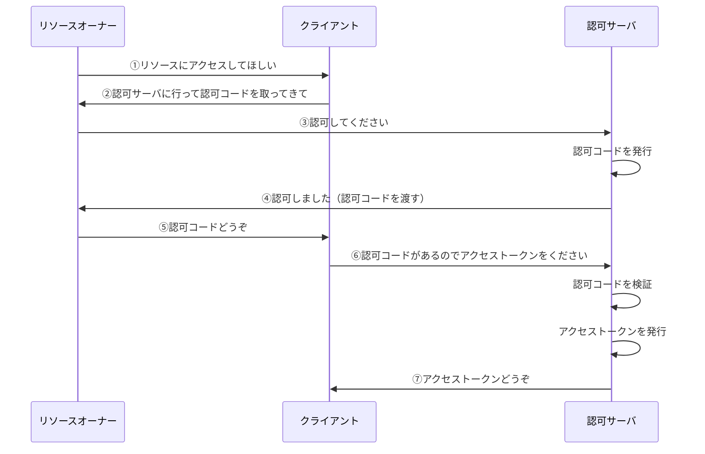

# OAuth コードフローの簡易的解説

この章では、OAuth の代表的なフローである**認可コードフロー**について、簡易的に解説していきます。

ここでは **Confidential Client** を前提とします。

## フローに登場するクレデンシャル

認可コードフローには、2 つの重要なクレデンシャルが登場します。

### アクセストークン

前章で解説した通り、リソースにアクセスするための「鍵」です。

### 認可コード

**認可コード**は、アクセストークンを引き換えるための**一時的なトークン**です。

認可コードには以下の特徴があります：

- **一度使うと無効になる** — 再利用はできません
- **有効期限が短い** — 多くの場合、数分程度です
- **アクセストークンへの引き換えに使う** — 認可コード単体ではリソースにアクセスできません

なぜ直接アクセストークンを渡さず、認可コードを経由するのでしょうか？

これは、**セキュリティを向上させるため**です。詳細は後の章で解説しますが、認可コードを挟むことで、アクセストークンが不正に取得されるリスクを大幅に減らすことができます。

## フローの流れ

認可コードフローは、以下のような流れで行われます：

### ステップごとの解説

1. **リソースオーナーがクライアントにリクエスト**

   - 「私の写真にアクセスして印刷してほしい」

2. **クライアントがリソースオーナーをリダイレクト**

   - 「まずは認可サーバに行って、認可コードを取ってきてください」
   - クライアントはリソースオーナーを認可サーバにリダイレクトさせます

3. **リソースオーナーが認可サーバにリクエスト**

   - 認可サーバでログインし、「このクライアントにアクセスを許可しますか？」という画面が表示されます

4. **認可サーバが認可コードを発行**

   - リソースオーナーが許可すると、認可サーバは認可コードを発行します
   - リソースオーナーをクライアントにリダイレクトさせ、認可コードを渡します

5. **リソースオーナーがクライアントに認可コードを渡す**

   - リダイレクトによって自動的に認可コードがクライアントに渡されます

6. **クライアントがアクセストークンをリクエスト**

   - クライアントは認可サーバに対して、認可コードを使ってアクセストークンをリクエストします

7. **認可サーバがアクセストークンを発行**
   - 認可サーバは認可コードを検証し、問題なければアクセストークンを発行します

## 例え話で理解する

登場人物を、以下のように例えてみましょう。

| 登場人物               | OAuth での対応   |
| ---------------------- | ---------------- |
| フリーレン（魔法使い） | リソースオーナー |
| フェルン（弟子）       | クライアント     |
| 魔導書                 | リソース         |
| カバン                 | リソースサーバ   |
| 精霊（門番）           | 認可サーバ       |
| 特別な鍵               | アクセストークン |
| 鍵の引き換え書         | 認可コード       |

フリーレンは魔導書を集めることが趣味で、自分のカバンに保管しています。セキュリティのため、自分以外がカバンを開けるときは特別な鍵が必要です。この鍵は精霊（門番）が作成します。

ある日、フリーレンは「フェルンに魔導書を読ませたい」と思いました：

1. フリーレンが精霊に「フェルンのために、鍵の引き換え書を作って」と頼む
2. 精霊が引き換え書を作成し、フリーレンに渡す
3. フリーレンが引き換え書をフェルンに渡す
4. フェルンが引き換え書を持って精霊のところに行き、鍵を受け取る
5. フェルンが鍵を使ってカバンを開け、魔導書を読む

このように、認可コード（引き換え書）を経由することで、鍵（アクセストークン）の受け渡しがより安全になっています。

## まとめ

認可コードフローのポイントをまとめます：

1. **最終的にクライアントがアクセストークンを取得して、フローは終了**
2. **認可コードを挟むことで、セキュリティが向上する**
   - 認可コードは一時的なトークンで、アクセストークンとは異なる
   - 認可コードだけではリソースにアクセスできない

認可コードを挟むことで煩雑になっていると感じるかもしれませんが、これはセキュリティ向上のために必要なステップです。

## 余談：認可コードフロー以外のフロー

OAuth には、認可コードフロー以外にも**インプリシットフロー**というフローが存在します。

インプリシットフローは、認可コードを使わず、認可サーバが直接アクセストークンを返すフローです。ステップが少なくシンプルですが、**セキュリティ上の理由で現在は非推奨**となっています。

> クライアントはインプリシットフローまたは認可サーバに認可レスポンスにおいてアクセストークンを発行させるレスポンスタイプを使用しないでください.
>
> — [RFC 9700 (OAuth 2.0 Security Best Current Practice)](https://www.rfc-editor.org/rfc/rfc9700)

インプリシットフローが非推奨となった理由については、後の章で攻撃手法と防御策を解説する際に詳しく説明します。認可コードを挟むことの重要性がより深く理解できるでしょう。

次の章では、アクセストークンの形式について解説していきます。
