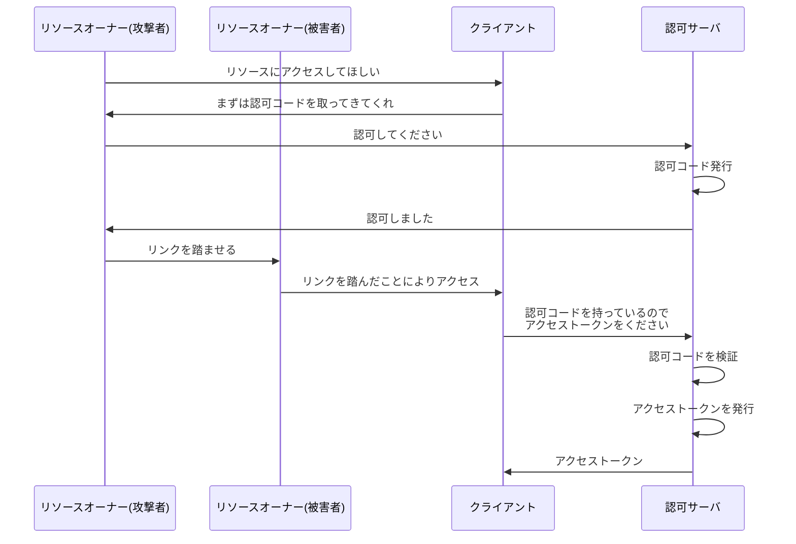
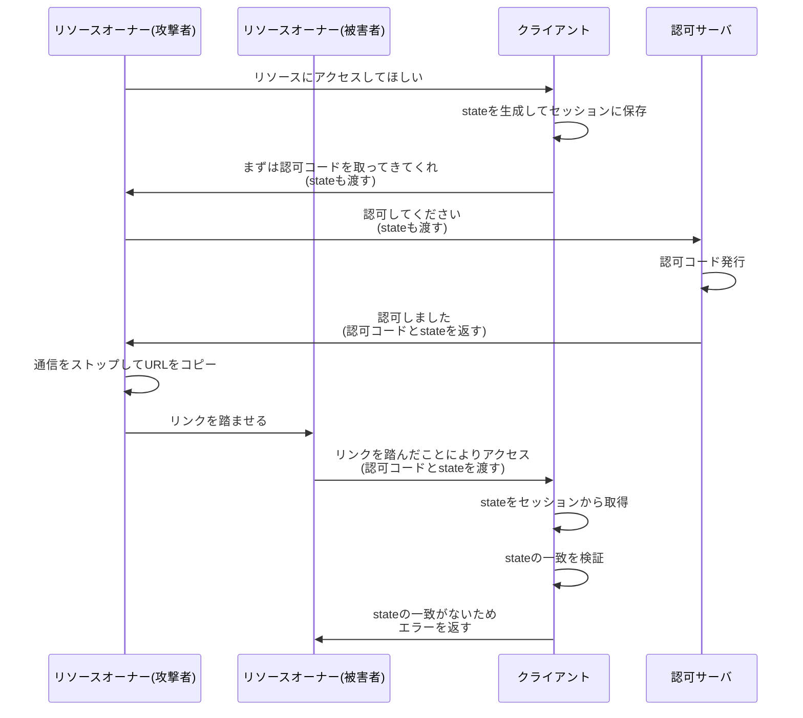

# OAuth における CSRF 攻撃

まず初めに、一般的な CSRF 攻撃について解説をします。

https://owasp.org/www-community/attacks/csrf

CSRF 攻撃とは、攻撃者ユーザが被害者のユーザを騙し、被害者ユーザに対して当人の意図しない操作をさせる攻撃手法です。

攻撃の手法としては、URL を踏ませる、JavaScript で自動送信される隠しフォームを設置する、などがあります。

# OAuth における CSRF は「リソース押し付け攻撃」

OAuth における CSRF は、一言で言うと **「リソース押し付け攻撃」** です。

攻撃者が被害者に対して、**攻撃者のリソースにアクセスさせる**ことが目的となります。

## 何が問題なのか？

被害者が攻撃者のリソースにアクセスすることの何が問題なのでしょうか？

被害者は攻撃者にリンクを踏まされたことに気が付かないため、攻撃者のリソースを自分のリソースだと勘違いしている可能性があります。

そのため、攻撃者のリソースに対して、攻撃者のリソースであると知らないまま、被害者の機密情報をアップロードしてしまうでしょう。

もし知られたくない免許証の写真やクレジットカード情報などを間違えて攻撃者のドライブにアップロードしてしまったら・・・と考えると、被害の大きさが実感できるかと思います。

# 攻撃の流れ

攻撃の流れは以下のとおりです。

1. 攻撃者は、既に攻撃者のリソースを持っているものとする
2. 攻撃者は OAuth で連携をはじめ、フローを開始
3. リソースオーナー（攻撃者）がクライアントに対し、「リソースにアクセスしてほしい」とリクエストする
4. クライアントがリソースオーナー（攻撃者）に対し、「まずは認可コードを取ってきてくれ」と言ってリソースオーナー（攻撃者）をリダイレクトさせる
5. リソースオーナー（攻撃者）が認可サーバにアクセスし、認可サーバに対して「認可してください」とリクエストする
6. 認可サーバがリソースオーナー（攻撃者）に対して「認可しました」と言って認可コードをもたせ、リソースオーナー（攻撃者）をクライアントにリダイレクトさせようとする

**ここまでは通常のフローと同じです。しかし、攻撃者ユーザはここで、リダイレクトをあえてストップし、リダイレクト URI を被害者ユーザに送ります。**

7. 被害者が URI を踏んでしまう
8. リソースオーナー（被害者）はクライアントに対して攻撃者の認可コードを渡す
9. クライアントが認可コードを持って認可サーバにアクセスし、「認可コードを持っているのでアクセストークンをください」とリクエストを送る
10. 認可サーバがクライアントに対してアクセストークンを返す
11. クライアントはアクセストークンが手に入ったので、リソースサーバにアクセスし、リソースを取得する

このように、**被害者は攻撃者の認可コードでアクセストークンを取得してしまい、攻撃者のリソースにアクセスしてしまう**ことになります。

# 対策: state パラメータ

では、これに対策を施すためにはどうすればよいでしょうか？

それには、まず通常の CSRF 攻撃ではどのような対策をしているかを振り返る必要があります。

## 一般的な CSRF 対策

一般的な Web アプリケーションにおける CSRF 攻撃の対策は、**CSRF トークン**というものを利用することが一般的です。

CSRF トークンとは、以下の仕様であることが一般的です。

- サーバに接続しているユーザのセッションに保存されている
- 接続ユーザごと（セッションごと）に一意である
- 十分に大きくてランダムな文字列であり、推測されにくい

## OAuth における CSRF 対策: state

OAuth における CSRF 攻撃に対しても、同様の対策を施すことができます。

つまり、クライアントがフローを開始する際に CSRF トークンのようなものを生成してセッションに保存し、リソースオーナーが認可コードをクライアントに返す際に CSRF トークンの一致を検証することで、攻撃者による CSRF 攻撃を防ぐことができます。

**OAuth における CSRF トークンのようなものを、`state` と呼びます。**

## state の利用方法

1. **フロー開始時**: クライアントは state を生成しセッションに保存する
2. **認可リクエスト**: リソースオーナーに対してリダイレクトさせる際に、state をリクエストパラメータとして付与する
3. **認可レスポンス**: リソースオーナーが認可コードをクライアントに返す際、state も一緒に渡す
4. **検証**: クライアントは、セッションから取り出した state と、リソースオーナーから渡された state の一致を検証する
5. **成功時**: 一致すれば state をセッションから削除し、アクセストークンの取得処理を続行する
6. **失敗時**: 一致しない場合はエラーを返し、処理を中断する

# state による防御の確認

これにより、CSRF 攻撃が防げるかを確認しましょう。

ポイントは以下の部分です。

**被害者のセッションに state が存在しないため、被害者のセッション内部の state と被害者から渡された state が一致しません。**

そのため、エラーを返すことができます。

このように、state を用いることで、CSRF 攻撃を防ぐことができています。

# state と CSRF トークンの比較

| 項目          | 生成タイミング | 保存先     | 検証タイミング   | 検証内容                                                         |
| ------------- | -------------- | ---------- | ---------------- | ---------------------------------------------------------------- |
| CSRF トークン | フォーム表示時 | セッション | フォーム送信時   | フォームにアクセスしたユーザとフォーム送信したユーザの一致       |
| state         | フロー開始時   | セッション | 認可コード取得時 | フローを開始しようとしたユーザと認可コードを返却したユーザの一致 |

# まとめ

- OAuth における CSRF 攻撃は「リソース押し付け攻撃」
- 攻撃者の認可コードを被害者に使わせることで、被害者を攻撃者のリソースにアクセスさせる
- **state** パラメータを使うことで、フローを開始したユーザと認可コードを返却するユーザの一致を検証できる

参考リンク
https://openid-foundation-japan.github.io/rfc6819.ja.html#section_csrf
https://booth.pm/ja/items/1877818
