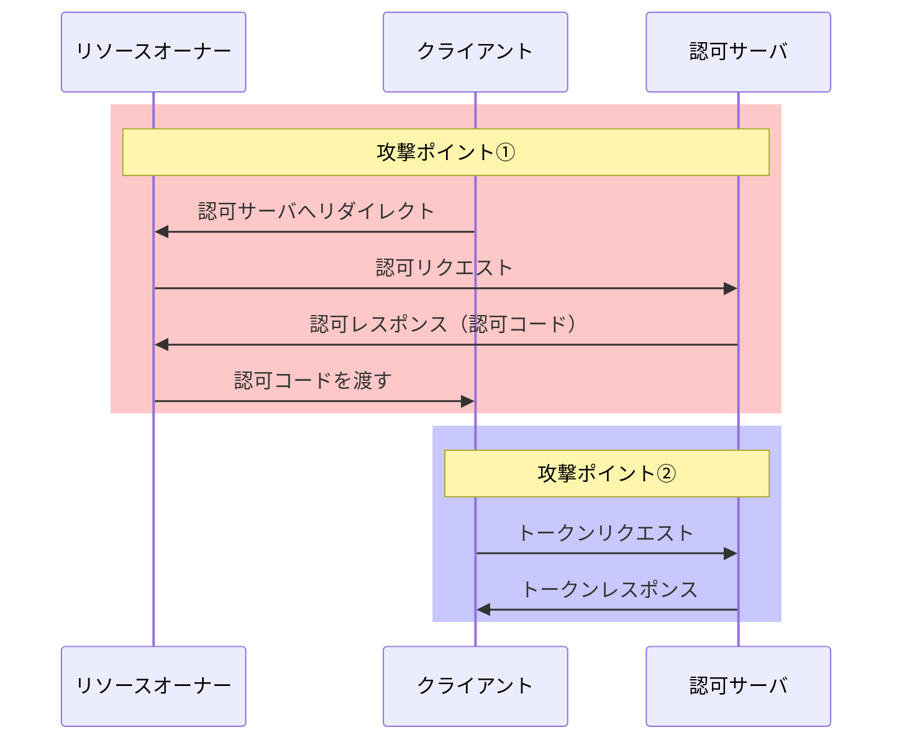

# OAuth フローに対する攻撃と防御

この章では、OAuth 認可コードフローに対する代表的な攻撃手法とその防御方法について、概要を解説します。

## 認可コードフローにおける攻撃ポイント

OAuth 認可コードフローでは、以下の 2 つのタイミングで攻撃が発生しうることを理解しておきましょう：

1. **認可コードリクエスト**（認可サーバ → リソースオーナー → クライアント）
2. **アクセストークンリクエスト**（クライアント → 認可サーバ）

## 攻撃のカテゴリ

これらの攻撃ポイントに対応する攻撃は、以下のように分類できます：

### 1. 認可コードを不正に取得する攻撃

攻撃者が、被害者の認可コードを横取りする攻撃です。

**例**：

- redirect_uri を改ざんして、認可コードを攻撃者のサーバに送らせる

### 2. 認可コードを用いてアクセストークンを不正に取得する攻撃

攻撃者が、取得した認可コードを使ってアクセストークンを取得する攻撃です。

**例**：

- 認可コードをすり替えて、被害者のクライアントに攻撃者の認可コードを処理させる

### 3. 認可コードを押し付ける攻撃（CSRF）

攻撃者が、被害者に対して攻撃者の認可コードを押し付け、被害者を攻撃者のリソースにアクセスさせる攻撃です。

## 防御のための主要なメカニズム

これらの攻撃に対抗するため、以下の防御メカニズムが用意されています：

| 防御メカニズム                | 防ぐ攻撃                             |
| ----------------------------- | ------------------------------------ |
| **redirect_uri 完全一致検証** | 認可コードの不正取得                 |
| **PKCE**                      | 認可コードのすり替え、不正な引き換え |
| **state パラメータ**          | CSRF 攻撃                            |

## 次の章以降の構成

次の章からは、それぞれの攻撃と防御について詳しく解説していきます：

- **第 10 章**：認可コードを不正に取得する攻撃と防御
- **第 11 章**：認可コードを用いてアクセストークンを不正に取得する攻撃と防御（PKCE）
- **第 12 章**：認可コードを押し付ける攻撃（CSRF）と防御（state パラメータ）

## まとめ

- OAuth フローには複数の攻撃ポイントが存在する
- 攻撃は「認可コードの取得」「アクセストークンの取得」「認可コードの押し付け」に分類できる
- それぞれの攻撃に対して、適切な防御メカニズムを導入することが重要

これらの攻撃手法と防御策を理解することで、より安全な OAuth 実装が可能になります。

次の章では、認可コードを不正に取得する攻撃とその防御について解説します。
