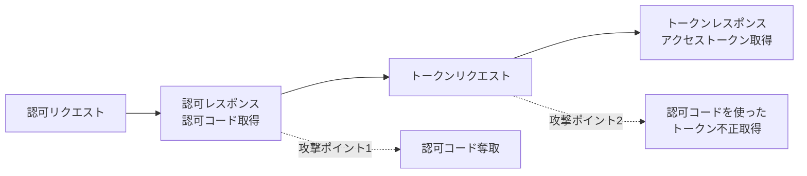

## 概要

この章では、OAuth 認可コードフローに対する代表的な攻撃手法とその防御方法について、概要を解説します。

## 認可コードフローにおける攻撃ポイント

OAuth 認可コードフローでは、大きく以下の 2 箇所で攻撃が発生し得ます。

1. **認可リクエスト〜認可レスポンス**: 認可コードを取得する部分
2. **トークンリクエスト〜トークンレスポンス**: アクセストークンを取得する部分

## 攻撃のカテゴリ

OAuth フローに対する攻撃は、以下の 3 つのカテゴリに分類できます。

### 1. 認可コードを不正に取得する攻撃

攻撃者が被害者の認可コードを奪取する攻撃です。

**代表的な攻撃**

- redirect_uri オープンリダイレクトによる認可コード奪取攻撃

**防御方法**

- redirect_uri の完全一致検証

### 2. 認可コードを用いてアクセストークンを不正に取得する攻撃

攻撃者が何らかの方法で認可コードを手に入れた後、それを使ってアクセストークンを取得する攻撃です。

**代表的な攻撃**

- 認可コードすり替え攻撃（認可コードインジェクション攻撃）

**防御方法**

- PKCE（Proof Key for Code Exchange）

### 3. 認可コードを押し付ける攻撃

攻撃者が被害者に対して、攻撃者の認可コードを押し付ける攻撃です。

**代表的な攻撃**

- OAuth CSRF 攻撃（リソース押し付け攻撃）

**防御方法**

- state パラメータ

## 攻撃と防御の対応表

| 攻撃カテゴリ       | 攻撃手法                          | 防御方法                  | 検証主体     |
| ------------------ | --------------------------------- | ------------------------- | ------------ |
| 認可コード奪取     | redirect_uri オープンリダイレクト | redirect_uri 完全一致検証 | 認可サーバ   |
| トークン不正取得   | 認可コードすり替え                | PKCE                      | 認可サーバ   |
| 認可コード押し付け | OAuth CSRF                        | state パラメータ          | クライアント |

## 次の章から

次の章以降で、それぞれの攻撃手法と防御方法について詳しく解説していきます。

これらの攻撃と防御を理解することで、より安全な OAuth 実装が可能になります。
