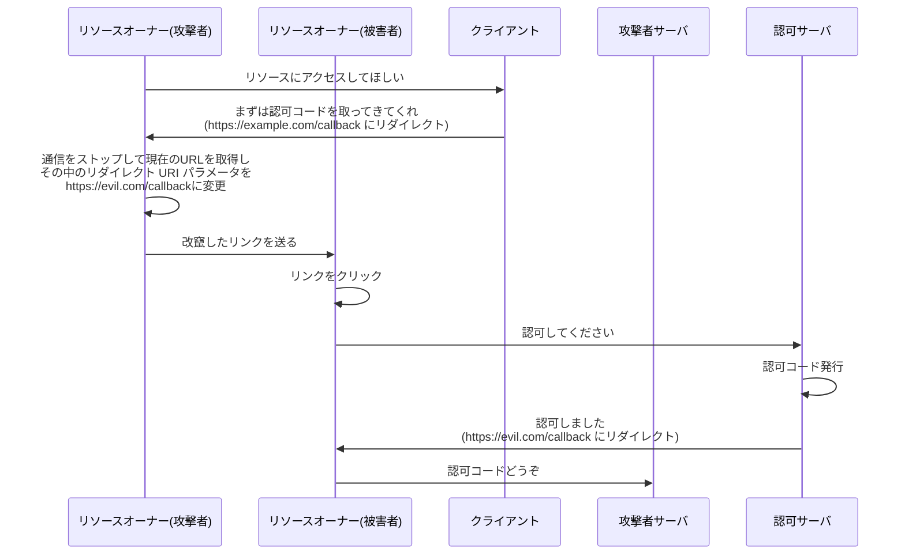
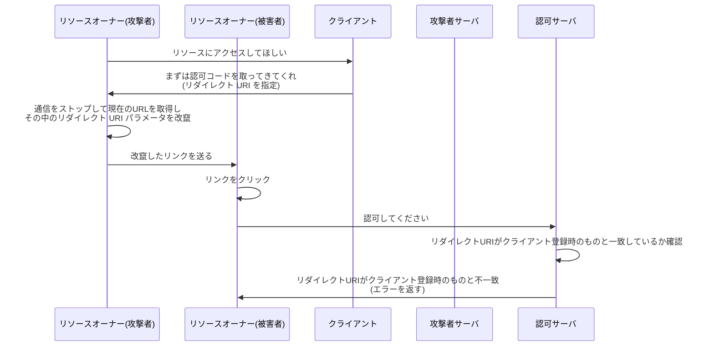

# 認可コード奪取攻撃

認可コードが奪われると、アクセストークンが取得され、ユーザのリソースが不正にアクセスされる可能性があります。

この章では、Confidential Client でも発生しうる認可コード奪取攻撃について解説します。

# リダイレクト URI の悪用

OAuth においてリソースオーナーが認可コードを取得したあと、リソースオーナーはクライアントにリダイレクトし、認可コードを渡します。

このときのリダイレクト先は、フロー開始時にクライアントが指示したリダイレクト URI です。

しかし、**リダイレクト URI の値自体はクライアントと認可サーバは直接やり取りせず、リソースオーナーのブラウザを通じてパラメータが渡されます**。

そのため、リダイレクト URI の値を変更することで、任意のサイトにリダイレクトを行い、結果的に認可コードを奪う攻撃が考えられます。

:::message
この攻撃は、**オープンリダイレクト攻撃**とも呼ばれます。
:::

# 攻撃の流れ

なおここで、リダイレクト URI について以下の値を利用して解説します。

| 特性                       | 値                           |
| -------------------------- | ---------------------------- |
| 正規のリダイレクト URI     | https://example.com/callback |
| 改竄されたリダイレクト URI | https://evil.com/callback    |

また、攻撃者サーバのホストは `https://evil.com` とします。

## 攻撃の手順

1. リソースオーナー（攻撃者）がクライアントに対し、「リソースにアクセスしてほしい」とリクエストする
2. クライアントがリソースオーナー（攻撃者）に対し、「まずは認可コードを取ってきてくれ」とリソースオーナーをリダイレクトさせる

**ここまでは通常のフローと同じです。しかし、攻撃者ユーザはここで、通信をあえてストップし、現在の URL を取得します。そして、リダイレクト URI を改竄したリンクを作成し、被害者ユーザに送ります。**

3. リソースオーナー（被害者）はリンクをクリックしてしまう
4. リソースオーナー（被害者）が認可サーバにアクセスし、認可サーバに対して「認可してください」とリクエストする
5. 認可サーバがリソースオーナー（被害者）に対して「認可しました」とリダイレクト URI にリダイレクト
6. **リソースオーナー（被害者）はここで、正規のクライアントではなく、攻撃者のサーバに認可コードを渡してしまう**

このようにして、攻撃者は被害者の認可コードを取得することができます。

# 対策: redirect_uri の完全一致検証

リダイレクト URI の悪用を防ぐためには、**リダイレクト先を信頼できる Web サイトに限定する**ことが有効です。

つまり、認可サーバがリダイレクト指示を行う前に、リソースオーナーから指定されたリダイレクト URI が、適切なリダイレクト先であるかどうかを確認することが重要です。

## クライアント登録時のホワイトリスト

以前、フローを開始する前に、クライアント登録というものが必要という話をしました。

このクライアント登録時に、**リダイレクト URI としての指定を許可する URI のホワイトリストを登録**しておき、そのホワイトリストに含まれていないリダイレクト URI に対してはリダイレクトを拒否することで、リダイレクト URI の悪用を防ぐことができます。

## 完全一致での検証

認可サーバは、指定されたリダイレクト URI がクライアント登録の際に登録されたリダイレクト URI と**完全に一致しているかどうか**を検証する必要があります。

**前方一致などの部分一致ではなく、完全一致である必要があるのが大きなポイントです。**

https://qiita.com/TakahikoKawasaki/items/9f284b7bc05734ec8cca#%E3%82%BB%E3%82%AD%E3%83%A5%E3%83%AA%E3%83%86%E3%82%A3%E5%B0%82%E9%96%80%E5%AE%B6%E3%81%AE%E6%84%8F%E8%A6%8B

# 防御の確認

これにより、リダイレクト URI の悪用攻撃が防げるかを確認しましょう。

ポイントは以下の部分です。

**認可サーバがリダイレクト URI がクライアント登録時のものと一致しているか確認し、不一致であることを検知してエラーを返しています。**

これにより、攻撃者の用意したサーバは認可コードを奪取できません。

# まとめ

- 認可コード奪取攻撃は、リダイレクト URI を改竄することで認可コードを攻撃者のサーバに送信させる攻撃
- **redirect_uri の完全一致検証**により、この攻撃を防ぐことができる
- クライアント登録時に許可するリダイレクト URI をホワイトリストとして登録しておく

参考リンク
https://webapppentestguidelines.github.io/newtechtestdoc/docs/oauth/#%e3%82%aa%e3%83%bc%e3%83%97%e3%83%b3%e3%83%aa%e3%83%80%e3%82%a4%e3%83%ac%e3%82%af%e3%82%bf
https://zenn.dev/ksrnnb/articles/697b34703a36a1#redirect_uri
https://qiita.com/TakahikoKawasaki/items/9f284b7bc05734ec8cca
https://zenn.dev/inabajunmr/articles/c46104af0ee253
