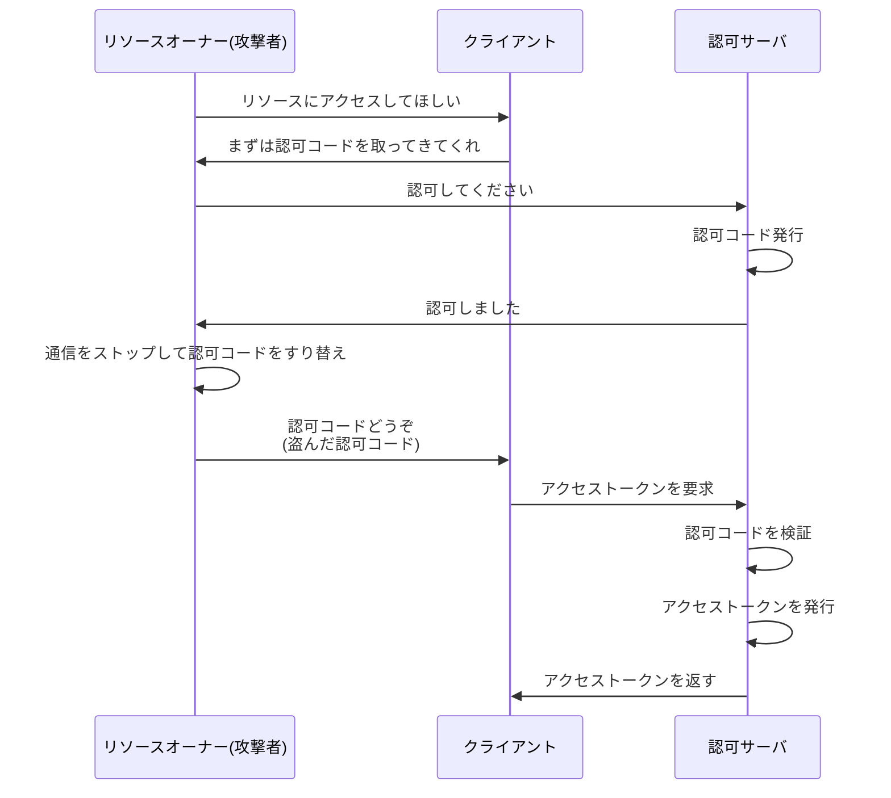
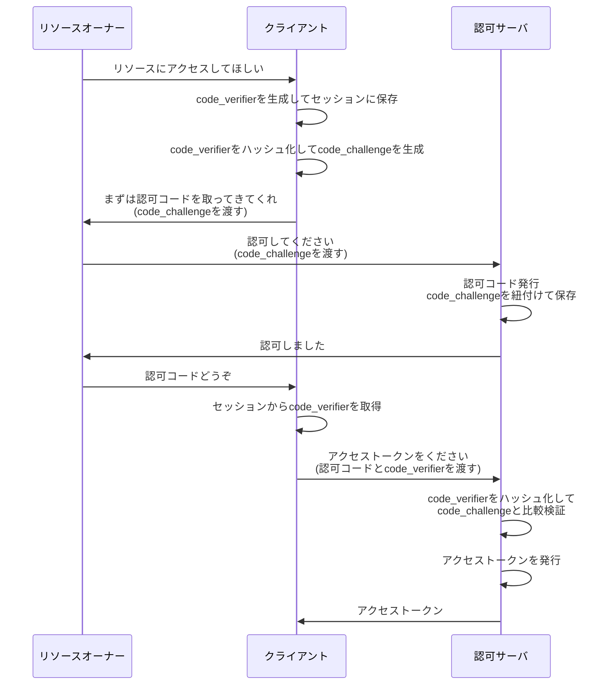
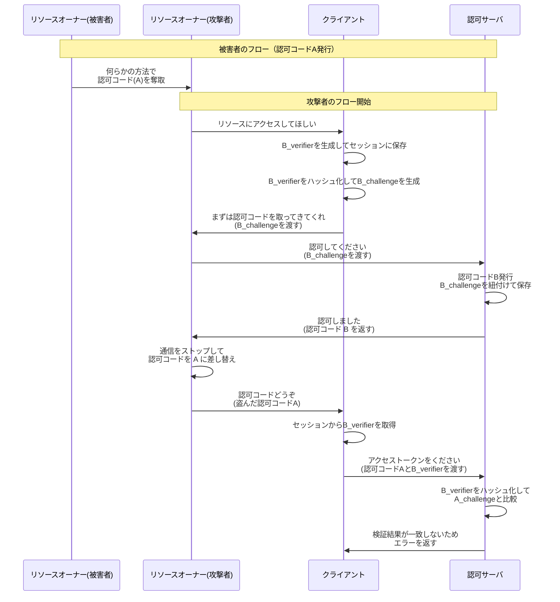

# 認可コードインジェクション攻撃

前章では、認可コードを奪取する攻撃について解説しました。

この章では、奪取した認可コードをどのように使ってアクセストークンを取得するか、そしてそれを防ぐための **PKCE** について解説します。

# 攻撃の概要

認可コードインジェクション攻撃は、**正規のクライアントでフローを途中まで進め、認可コードを渡す段階で盗んだ認可コードに差し替える攻撃**です。

この攻撃が成功すると、攻撃者は被害者のリソースにアクセスできるアクセストークンを取得できてしまいます。

# 対策: PKCE（Proof Key for Code Exchange）

PKCE とは、**フローを開始したクライアントが、アクセストークンを取得しようとするクライアントと同一であることを証明するための仕組み**です。

PKCE を導入することで、攻撃者が認可コードを奪取しても、その認可コードをアクセストークンに引き換えることができないようになります。

# PKCE の仕組み

PKCE は以下の仕組みで動作します。

## 1. code_verifier の生成

クライアントがフローを開始する際、ランダム文字列を生成します。この値を **code_verifier** と呼びます。

クライアントは code_verifier をセッションに保存します。

## 2. code_challenge の生成

code_verifier をハッシュ化した値を **code_challenge** として生成します。

## 3. 認可リクエスト

リソースオーナーが認可コードを取得する際、code_challenge を認可サーバに渡します。

認可サーバは認可コードを発行する際、発行した認可コードと同じ場所に code_challenge を紐付けて保存します。

## 4. トークンリクエスト

クライアントがアクセストークン引き換えリクエストを行う際、セッションから code_verifier を取り出し、認可コードと一緒に認可サーバに渡します。

## 5. 検証

認可サーバは、クライアントから渡された code_verifier をハッシュ化し、認可コードに紐付けられた code_challenge と比較します。

一致した場合、アクセストークンを発行します。一致しない場合、アクセストークンの発行を拒否します。

:::message alert
PKCE の仕様では、基本的にハッシュ化を行うことを推奨しています。平文の利用も考慮されていますが、非推奨とされています。また、ハッシュ化アルゴリズムとしては、SHA-256 が推奨されています。
:::

# PKCE を含むフロー

# PKCE による防御の確認

では、認可コードインジェクション攻撃に対して PKCE がどのように機能するかを確認しましょう。

解説のため、出てくる認可コード・code_verifier・code_challenge などの値を具体的な値に置き換えて説明します。

| 特性                       | 認可コード | code_verifier | code_challenge |
| -------------------------- | ---------- | ------------- | -------------- |
| 被害者クライアントのフロー | A          | A_verifier    | A_challenge    |
| 攻撃者クライアントのフロー | B          | B_verifier    | B_challenge    |

## 攻撃の試行

## なぜ防げるのか

最後の検証において、認可サーバは以下の 2 つの値の一致を検証します。

- 渡された code_verifier である **B_verifier** のハッシュ化した値である **B_challenge**
- 保存されている code_challenge である **A_challenge**

**B_challenge と A_challenge は異なるため、検証が一致せず、エラーを返すことができます。**

# PKCE と state の違い

| 項目  | 用途                                 | 生成・検証する登場人物                 | 一致検証する対象                                                                  |
| ----- | ------------------------------------ | -------------------------------------- | --------------------------------------------------------------------------------- |
| PKCE  | 認可コードインジェクション攻撃を防ぐ | クライアントが生成・認可サーバが検証   | 認可コードリクエストしたクライアント = アクセストークンリクエストしたクライアント |
| state | CSRF 攻撃を防ぐ                      | クライアントが生成・クライアントが検証 | フローを開始しようとしたユーザ = 認可コードを返却したユーザ                       |

それぞれの責務を混同しないように注意しましょう。

# まとめ

- **認可コードインジェクション攻撃**は、盗んだ認可コードを正規のクライアントに渡すことでアクセストークンを取得する攻撃
- **PKCE** は、フローを開始したクライアントとアクセストークンを取得しようとするクライアントが同一であることを証明する仕組み
- code_verifier と code_challenge の対応関係を検証することで、認可コードの不正利用を防ぐ

参考リンク
https://qiita.com/TakahikoKawasaki/items/63ed4a9d8d6e5109e401
