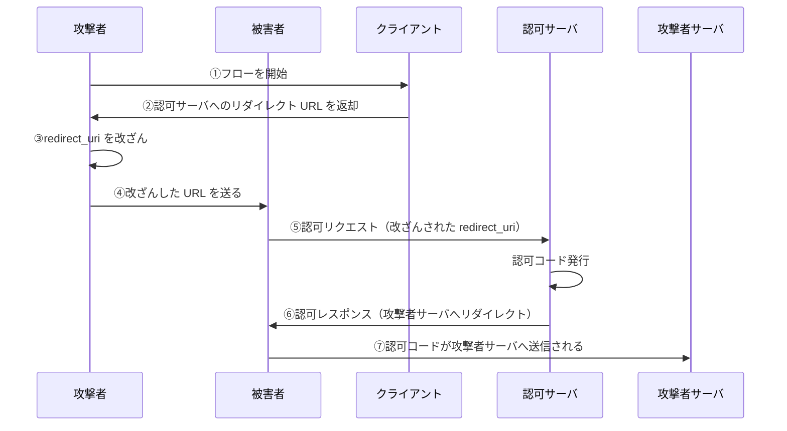
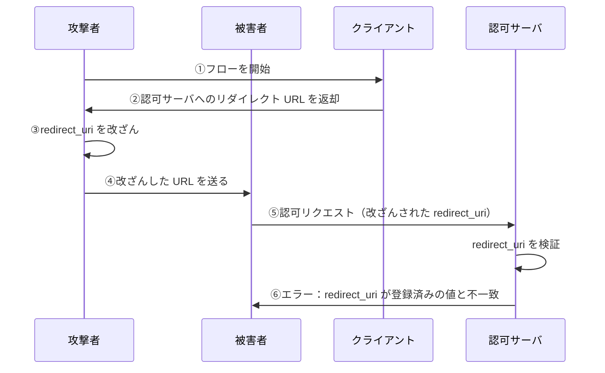

# 認可コードを不正に取得する攻撃と防御

この章では、認可コードを不正に取得する攻撃手法とその防御方法について解説します。

## redirect_uri オープンリダイレクトによる認可コード奪取攻撃

### 攻撃の概要

攻撃者が、**リダイレクト URI の値を書き換える**ことで、認可コードを攻撃者のサーバに送らせる攻撃です。

OAuth フローでは、リソースオーナーが認可コードを取得した後、クライアントにリダイレクトします。このリダイレクト先は `redirect_uri` パラメータで指定されますが、この値はリソースオーナーのブラウザを通じて渡されるため、改ざんの余地があります。

### 攻撃の流れ

| 正規の redirect_uri            | 改ざんされた redirect_uri   |
| ------------------------------ | --------------------------- |
| `https://example.com/callback` | `https://evil.com/callback` |

**攻撃のステップ**：

1. 攻撃者がクライアントに対してフローを開始
2. クライアントが認可サーバへのリダイレクト URL を返却
3. 攻撃者が URL 内の `redirect_uri` を `https://evil.com/callback` に改ざん
4. 攻撃者が被害者に改ざんした URL を送る（フィッシング等）
5. 被害者がその URL をクリックして認可サーバにアクセス
6. 認可サーバが認可コードを発行し、改ざんされた `redirect_uri` にリダイレクト
7. 被害者の認可コードが攻撃者のサーバに送信される

### 攻撃の対策：redirect_uri 完全一致検証

この攻撃を防ぐには、認可サーバが **redirect_uri の完全一致検証**を行う必要があります。

**対策の内容**：

1. クライアント登録時に、許可する `redirect_uri` をホワイトリストとして登録
2. 認可リクエスト時に、指定された `redirect_uri` がホワイトリストと**完全一致**するかを検証
3. 一致しない場合は、認可を拒否しエラーを返す

**重要なポイント**：

- **完全一致**であることが重要（前方一致やパターンマッチではない）
- 解釈の余地のある部分を排除することで、悪用を防止する

### 対策後の攻撃の失敗

認可サーバは、指定された `redirect_uri` がクライアント登録時のものと完全一致するかを確認し、不一致の場合はエラーを返します。これにより、攻撃者のサーバに認可コードが送信されることを防げます。

## まとめ

- **redirect_uri オープンリダイレクト攻撃**により、認可コードを奪取される可能性がある
- **対策**：認可サーバは、`redirect_uri` をクライアント登録時の値と**完全一致**で検証する
- 解釈の余地をなくすことで、攻撃を防止できる

## 余談：Public Client における他の攻撃

Public Client（特にネイティブアプリ）では、他にも認可コードを奪取する攻撃手法が存在します。

例えば、カスタム URL スキームを悪用した攻撃があります。これは、同じカスタム URL スキームに対応する悪意あるアプリがインストールされている場合、認可コードがそちらに送信されてしまう攻撃です。

これらの詳細については、Public Client の章で解説します。

次の章では、認可コードを用いてアクセストークンを不正に取得する攻撃と、その防御策である PKCE について解説します。
