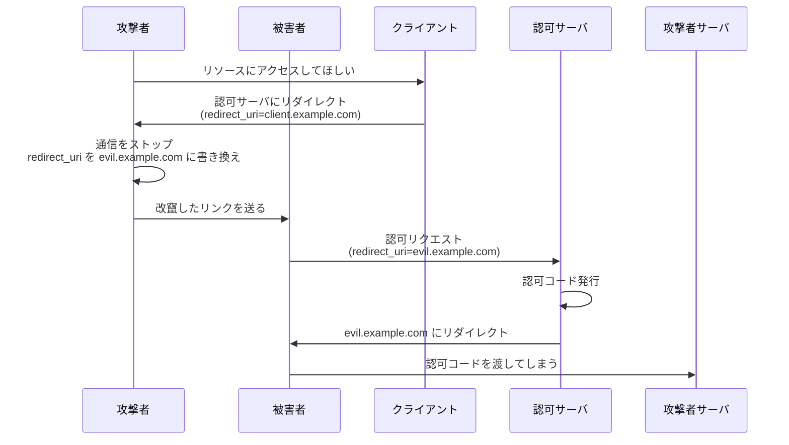
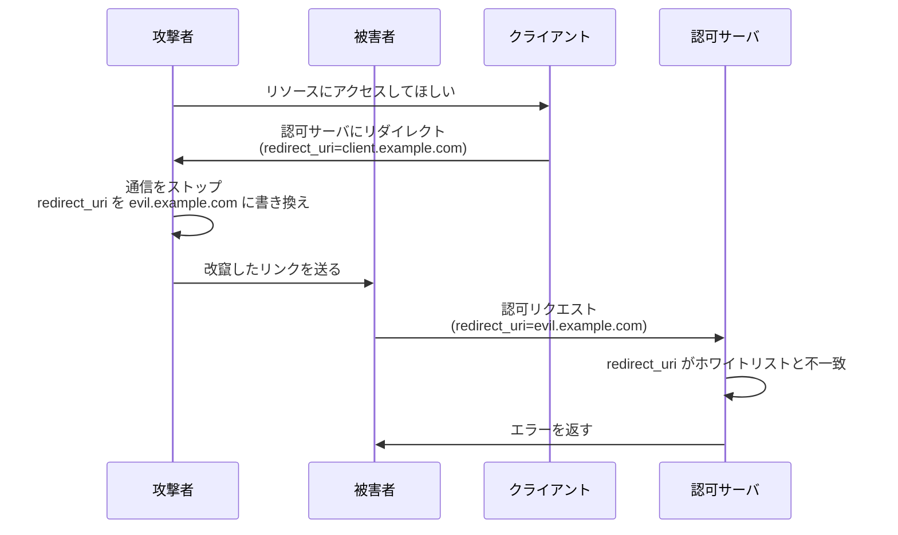

## 概要

この章では、認可コードを不正に取得する攻撃手法とその防御方法について解説します。

## redirect_uri オープンリダイレクトによる認可コード奪取攻撃

### 攻撃の概要

この攻撃は、
**リダイレクト URI の値を書き換えることで、**
**攻撃者が用意したリダイレクト先に認可コードを送らせる** という手法です。

OAuth フローでは、認可コードはリダイレクト URI に付与されてクライアントに渡されます。
もしこのリダイレクト URI を攻撃者が制御するサーバに書き換えることができれば、認可コードを奪取できてしまいます。

### 攻撃の流れ

解説のため、以下の値を使用します。

| 項目                     | 値                                    |
| ------------------------ | ------------------------------------- |
| 正規のリダイレクト URI   | `https://client.example.com/callback` |
| 攻撃者のリダイレクト URI | `https://evil.example.com/callback`   |

1. 攻撃者がクライアントに対してフローを開始
2. クライアントが攻撃者を認可サーバにリダイレクトしようとする
3. 攻撃者はこの通信をストップし、`redirect_uri` を攻撃者のサーバに書き換え
4. 攻撃者は改竄したリンクを被害者に送る
5. 被害者がリンクをクリックし、認可サーバにアクセス
6. 認可サーバは認可コードを発行し、`redirect_uri`（攻撃者のサーバ）にリダイレクト
7. 被害者のブラウザが攻撃者のサーバに認可コードを送ってしまう

このようにして、攻撃者は被害者の認可コードを奪取できます。

### 攻撃の対策：redirect_uri 完全一致検証

この攻撃を防ぐためには、**認可サーバがリダイレクト URI を厳密に検証する**必要があります。
つまり、事前に登録されたリダイレクト URI と、認可リクエストで指定されたリダイレクト URI が**完全に一致するか**を確認します。

具体的には、以下の対策を行います。

1. **クライアント登録時に、リダイレクト URI をホワイトリストとして登録**
2. **認可リクエスト時に、
   指定されたリダイレクト URI がホワイトリストと完全一致するかを検証**
3. **完全一致しない場合は、認可リクエストを拒否**

:::message alert
**完全一致が重要**

前方一致や部分一致ではなく、**完全一致**である必要があります。[^rfc9700-redirect-uri]

例えば、`https://client.example.com/callback` が登録されている場合：

- ✅ `https://client.example.com/callback` → 許可
- ❌ `https://client.example.com/callback?foo=bar` → 拒否
- ❌ `https://client.example.com/callback/../evil` → 拒否
- ❌ `https://evil.example.com/callback` → 拒否

解釈の余地のある部分を排除することで、悪用を防止します。
:::

[^rfc9700-redirect-uri]: RFC 9700 (OAuth 2.0 Security Best Current Practice) Section 4.1.3 において、redirect_uri の完全一致検証が必須とされています。https://www.rfc-editor.org/rfc/rfc9700.html#section-4.1.3

### 対策後のフロー

認可サーバが redirect_uri の完全一致検証を行うことで、攻撃を防止できます。

## まとめ

- **redirect_uri オープンリダイレクト攻撃**は
  リダイレクト URI を書き換えることで認可コードを奪取する攻撃
- **防御方法**は redirect_uri の完全一致検証
- **検証する主体**は認可サーバ

## 余談

Public Client では、他にも認可コードを奪取する攻撃手法が存在します。これについては、Public Client の章で解説します。
