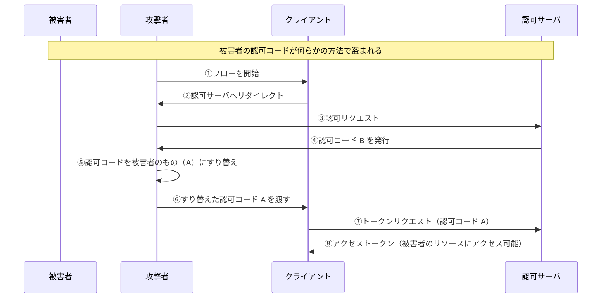
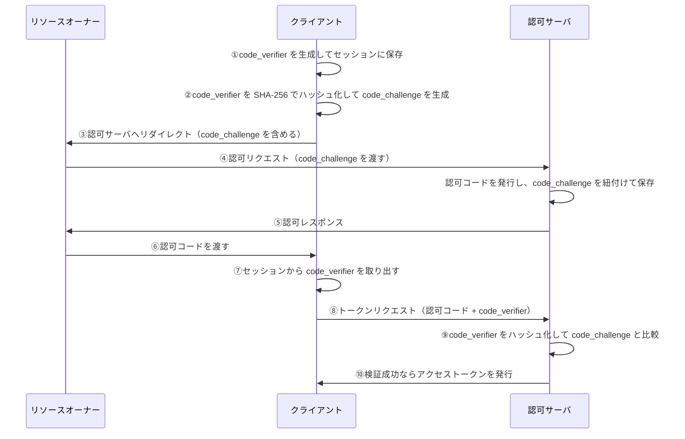

# 認可コードを用いてアクセストークンを不正に取得する攻撃と防御

この章では、認可コードを用いてアクセストークンを不正に取得する攻撃手法と、その防御策である **PKCE（Proof Key for Code Exchange）** について解説します。

## 認可コードすり替え攻撃

### 攻撃の概要

攻撃者が、正規クライアントのフロー中に**認可コードをすり替える**ことで、正規クライアントに攻撃者の認可コードを処理させる攻撃です。

これにより、正規クライアントが攻撃者の持つリソースにアクセスできてしまう可能性があります。

### 攻撃の流れ



**問題点**：

- 攻撃者は被害者の認可コードを使って、正規クライアント経由で被害者のリソースにアクセスできる
- クライアント認証だけでは、この攻撃を防げない

## 対策：PKCE（Proof Key for Code Exchange）

### PKCE とは

**PKCE（ピクシーと読みます）** は、フローにおける**クライアントの一貫性を検証する仕組み**です。

> **リソースオーナーに認可コードを取得させるよう指示したクライアント** と **アクセストークンを取得しようとするクライアント** に一貫性があることを、**認可サーバが検証する仕組み**

PKCE を導入することで、認可コードがすり替えられた場合でも、アクセストークンの取得を拒否できます。

### PKCE の仕組み

PKCE では、以下の 2 つの値を使用します：

| 値               | 説明                                               |
| ---------------- | -------------------------------------------------- |
| `code_verifier`  | クライアントが生成するランダム文字列（秘密の値）   |
| `code_challenge` | `code_verifier` をハッシュ化した値（公開される値） |

### PKCE の動作フロー



**ステップの詳細**：

1. **code_verifier 生成**：クライアントがランダム文字列を生成し、セッションに保存
2. **code_challenge 生成**：`code_verifier` を SHA-256 でハッシュ化
3. **認可リクエスト時**：`code_challenge` を認可サーバに渡す
4. **認可サーバ**：認可コードと `code_challenge` を紐付けて保存
5. **トークンリクエスト時**：セッションから `code_verifier` を取り出して送信
6. **認可サーバ**：`code_verifier` をハッシュ化し、保存していた `code_challenge` と比較

:::message
**セッションについて**

ここでいう「セッション」は OAuth 特有の概念ではなく、一般的な Web アプリケーションにおけるセッションです。

- Confidential Client の場合：Redis のようなサーバサイドストレージ
- Public Client の場合：sessionStorage などのクライアント側ストレージ
  :::

### なぜ PKCE で攻撃を防げるのか

**ポイント**：`code_verifier`（ハッシュ前の平文）を知っているのは、**フローを開始したクライアントだけ**です。

1. 攻撃者が認可コードをすり替えたとしても、すり替え先の認可コードに紐付いた `code_challenge` と、被害者のセッションにある `code_verifier` は一致しない
2. 認可サーバは `code_verifier` をハッシュ化して比較するが、一致しないためエラーになる
3. アクセストークンは発行されない

### PKCE による攻撃の防止

| 認可コード  | 紐付く code_challenge | 送信される code_verifier         | 結果                                          |
| ----------- | --------------------- | -------------------------------- | --------------------------------------------- |
| A（被害者） | A_challenge           | B_verifier（攻撃者のセッション） | 不一致 → 拒否                                 |
| B（攻撃者） | B_challenge           | B_verifier                       | 一致 → 成功（攻撃者自身のリソースにアクセス） |

攻撃者が認可コード A を使おうとしても、攻撃者のセッションにある `code_verifier` は B 用のものなので、検証に失敗します。

:::message alert
**ハッシュ化アルゴリズムについて**

PKCE では、`code_verifier` のハッシュ化に **SHA-256** を使うことが推奨されています。

平文（`plain` メソッド）の利用も仕様上は可能ですが、非推奨です。

```
code_challenge = BASE64URL(SHA256(code_verifier))
code_challenge_method = S256
```

:::

## まとめ

- **認可コードすり替え攻撃**により、攻撃者の認可コードを正規クライアントに処理させられる可能性がある
- **PKCE** は、フローにおけるクライアントの一貫性を検証する仕組み
- PKCE を導入することで、認可コードがすり替えられても攻撃を防止できる
- **PKCE の検証は認可サーバが行う**

## 余談：Public Client における PKCE の重要性

Public Client では、クライアント認証ができないため、PKCE は特に重要です。

- Confidential Client でも PKCE は推奨される
- Public Client では PKCE は**必須**と考えるべき
- OAuth 2.1 では、すべてのクライアントで PKCE が必須になる予定

次の章では、認可コードを押し付ける攻撃（CSRF）とその防御策である state パラメータについて解説します。
