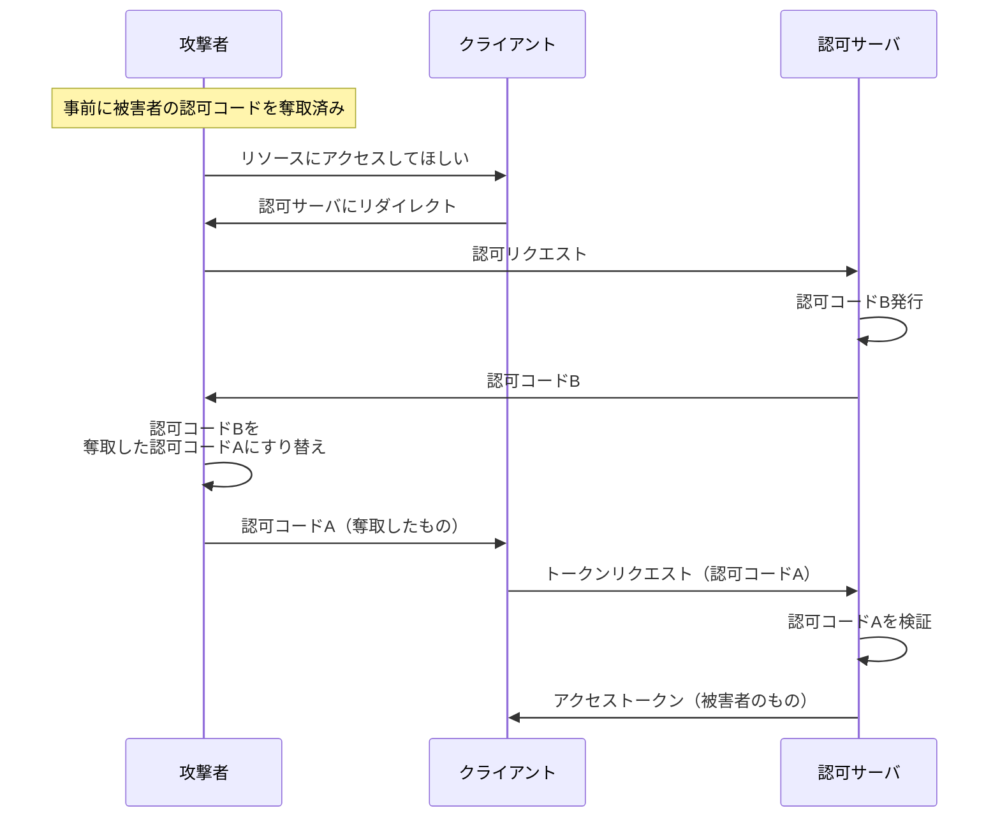
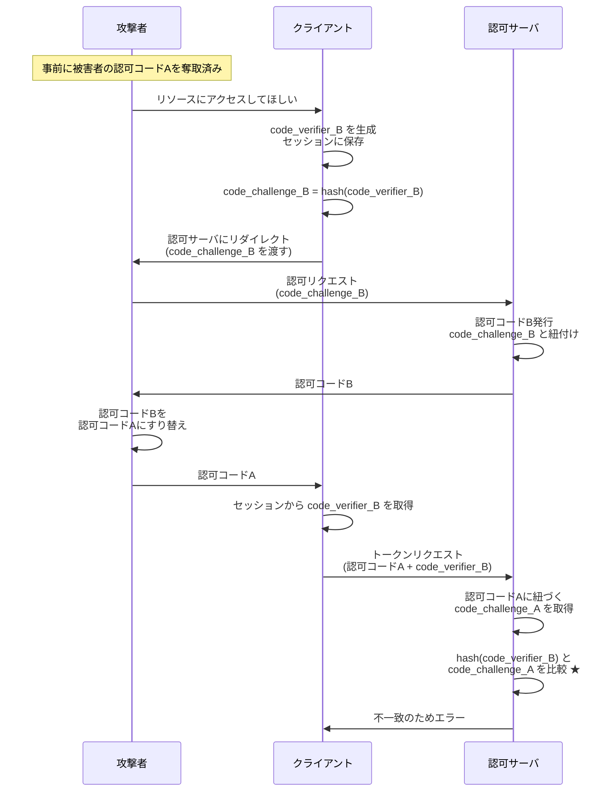

## 概要

この章では、認可コードを用いてアクセストークンを不正に取得する攻撃手法とその防御方法について解説します。

## 認可コードすり替え攻撃（認可コードインジェクション攻撃）

### 攻撃の概要

この攻撃は、
**攻撃者が正規クライアントのフロー中に、**
**認可コードを事前に奪取した認可コードにすり替える** という手法です。

攻撃者が何らかの方法で認可コードを奪取した後に行う攻撃であり、正規クライアントに攻撃者の持つ認可コードを使わせることで、アクセストークンを取得させます。

### 攻撃の流れ

1. 攻撃者は事前に被害者の認可コード（A）を何らかの方法で奪取
2. 攻撃者がクライアントに対してフローを開始
3. 認可サーバが攻撃者に認可コード（B）を発行
4. 攻撃者は認可コード B を認可コード A にすり替え
5. クライアントは認可コード A を使ってトークンリクエスト
6. 認可サーバは認可コード A を検証し、アクセストークンを発行
7. クライアントは、被害者の認可コード A を用いて
   被害者のアクセストークンを取得してしまう

このようにして、攻撃者は被害者から奪取した認可コードを用いて、
アクセストークンを不正に取得できます。

### 攻撃の対策：PKCE（Proof Key for Code Exchange）

**PKCE（ピクシー）** は、

- **リソースオーナーに認可コードを取得させるよう指示したクライアント**
- **アクセストークンを取得しようとするクライアント**

の 2 つに一貫性があることを、**認可サーバ**が検証する仕組みです。

<!--  -->

[RFC 7636](https://www.rfc-editor.org/rfc/rfc7636) で定義された仕組みです。
検証する主体は **認可サーバ** であることに留意してください。

#### PKCE の仕組み

1. **フロー開始時**

   - クライアントが `code_verifier`（ランダム文字列）を生成し、セッションに保存
   - `code_verifier` をハッシュ化して `code_challenge` を生成
   - リソースオーナーにフロー開始の指示をする際、`code_challenge` を付与
   - リソースオーナーは認可リクエスト時に `code_challenge` を認可サーバに渡す

2. **認可コード発行時**

   - 認可サーバは認可コードと `code_challenge` を紐付けて保存

3. **トークンリクエスト時**
   - クライアントはセッションから `code_verifier` を取り出す
   - トークンリクエスト時に `code_verifier` を認可サーバに渡す
   - 認可サーバは `code_verifier` をハッシュ化し
     保存した `code_challenge` と比較検証
   - 一致すればアクセストークンを発行、不一致ならエラー

:::message
**ハッシュ化について**

PKCE の仕様では、SHA-256 によるハッシュ化が推奨されています。平文での利用も仕様にありますが、非推奨です。
:::

:::message
**セッションについて**

ここでのセッションとは OAuth 特有の単語ではなく、一般的な Web アプリケーションにおけるセッションを指します。
ここでは Confidential Client を前提としているため、サーバサイドのセッション領域（Redis など）を想定しています。
:::

#### PKCE によって攻撃を防げる理由

PKCE は、**クライアントの一貫性を保証する**仕組みです。

- ハッシュ前の `code_verifier` を知っているのは、フローを開始したクライアントのみ
- 検証に成功した場合、フロー開始時と同じクライアントであることが保証される
- 認可コードをすり替えた場合
  別のフローの認可コードを流用することになる
- そのため、 **正当な認可コードに対応する `code_verifier` を知らず**、検証が失敗する

#### PKCE を導入したフロー

認可コード A に紐づいているのは `code_challenge_A` ですが、
クライアントが送るのは `code_verifier_B` です。

★ 部分の比較検証で、`hash(code_verifier_B) = code_challenge_B ≠ code_challenge_A` となります。
そのため検証が失敗し、攻撃を防止できます。

#### PKCE では何故ハッシュ化が強く推奨されるのか

PKCE では `code_verifier` をハッシュ化して `code_challenge` を生成する方法が強く推奨されています。
では、何故ハッシュ化が推奨されるのでしょうか。
ここまで読んで余裕のある方は、是非考えてみましょう。

PKCE における `code_verifier`は、
クライアントの一貫性を保証するため、クライアントしか知らない秘密の情報である必要があります。

逆にいえば、`code_verifier` が漏洩してしまうと、
それを知っている第三者が「私はフローを開始したクライアントです」と主張できてしまい、
PKCE の防御効果が失われてしまいます。

ところで、OAuth のフローの特性上、認可コードリクエストは
リソースオーナーを介して行われるため、
リソースオーナーのブラウザ、つまりフロントチャネルに`code_challenge` が渡されます。
つまり、`code_challenge` はフロントチャネルを通じて第三者に閲覧される可能性が大きく、
秘密の情報として扱うことができません。

もし `code_challenge` が平文、つまり
`code_challenge` = `code_verifier` の場合、
第三者はフロントチャネルを通じて `code_challenge` を閲覧した際に、
それを `code_verifier` としてトークンリクエストに利用できてしまいます。
そのため、PKCE の防御効果が失われてしまいます。

一方、`code_challenge` がハッシュ化されている場合、
第三者はフロントチャネルを通じて `code_challenge` を閲覧したとしても、
それを `code_verifier` としてトークンリクエストに利用することはできません。
そのため、PKCE の防御効果が維持されます。

ハッシュ化により、

- `code_verifier` はクライアントしか知らない秘密の情報という性質を維持できる
- `code_challenge` はフロントチャネルを通じて第三者に閲覧されても問題ない情報となる

という性質が実現されるのです。

## まとめ

- **認可コードすり替え攻撃**は、認可コードを奪取した後に行う攻撃
- **PKCE** はクライアントの一貫性を検証する仕組み
- **PKCE パラメータを検証する主体は認可サーバ**

## 余談

Public Client では、今回の認可コードすり替え攻撃の他にも、認可コードを用いてアクセストークンを不正に取得する攻撃手法が存在します。
これについては、Public Client の章で解説します。

## 余談 2：redirect_uri 検証による防御

PKCE ではなく、トークンリクエスト時の `redirect_uri` 検証でも、技術上は認可コードすり替え攻撃を防御可能です。
そのため OAuth 2.0 では、トークンリクエスト時に `redirect_uri` の一致を検証することが仕様に含まれています。

しかし、認可コードすり替え攻撃の防御においては PKCE の方がより本質的な防御策です。
より最新の OAuth 2.1 では PKCE が必須化されたため、`redirect_uri` 検証は必要ないと判断され、トークンリクエスト時のパラメータから省略されるようになりました。
