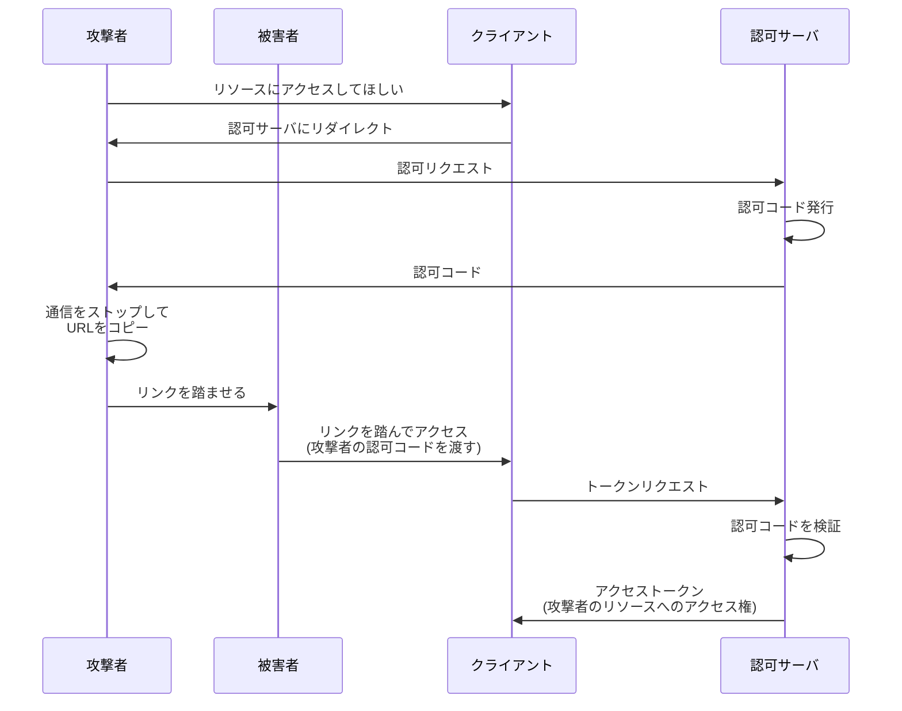
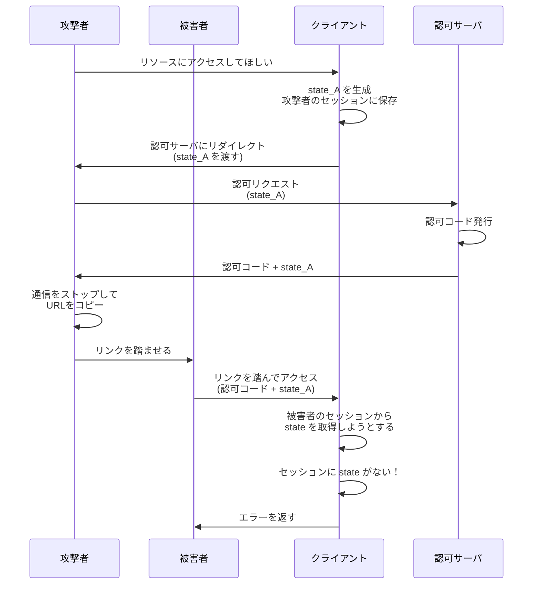

## 概要

この章では、認可コードを押し付ける攻撃手法（OAuth における CSRF 攻撃）とその防御方法について解説します。

## 認可コード押し付け攻撃（OAuth CSRF）

### 攻撃の概要

この攻撃は、一言でいうと **「リソース押し付け攻撃」** です。

攻撃者が、被害者のリソースオーナーに対して
攻撃者側で途中まで進めたフローを再開させることで
**被害者が、攻撃者の持つリソースに紐づいたアクセストークンを取得してしまう**攻撃です。

### 何が問題？

一見すると、「被害者が攻撃者のリソースにアクセスできる」ことは問題なさそうに思えます。
しかし、以下のような想定で被害が発生します。

- 被害者は攻撃者のリソースを**自分のリソースだと勘違いする**
- 被害者が機密情報を攻撃者のリソースにアップロードしてしまう

機密情報を免許証写真として、具体例を考えてみましょう。
攻撃者の Google Drive に、被害者が自分の免許証の写真をアップロードしてしまうケースです。
被害者は自分の Google Drive に免許証の写真をアップロードしたつもりですが、
実際には攻撃者の Google Drive にアップロードしてしまいました。

結果的に、攻撃者は被害者の免許証の写真を入手できてしまいます。

### 攻撃の流れ

1. 攻撃者がクライアントに対してフローを開始
2. 認可サーバが攻撃者に認可コードを発行
3. 攻撃者は通信をストップし、認可コードを含むリダイレクト URL をコピー
4. 攻撃者は被害者にこのリンクを踏ませる
5. 被害者がリンクを踏み、クライアントに攻撃者の認可コードを渡す
6. クライアントはこの認可コードでアクセストークンを取得
7. 被害者は攻撃者のリソースにアクセスできるアクセストークンを取得してしまう

このようにして、攻撃者は被害者に自分のリソースにアクセスできるアクセストークンを取得させられてしまいます。
攻撃者のリソースを押し付けられる形です。

## 対策：state パラメータ

### state パラメータとは

リソースオーナーの端末上でブラウザを利用し、OAuth フローを進める場合を想定します。
このとき、リソースオーナー(ブラウザ) と OAuth クライアント間 には、**セッション** が存在します。
セッションとは OAuth 特有の概念ではなく、一般的な Web アプリケーションにおけるクッキーに紐づくようなブラウザセッションを指します。

そして state パラメータは、
**リソースオーナーに認可コードを取得させるよう指示したセッション**と
**認可コードを受け取ったセッション**に一貫性があることを、
クライアント自身が検証するための仕組みです。

state パラメータ自体は、クライアントが任意に設定でき、推測困難なランダム文字列を利用します。
検証の主体は **クライアント** であることに留意してください。

### state パラメータの仕組み

1. **フロー開始時**

   - クライアントがランダム文字列（state）を生成し、セッションに保存
   - 認可リクエスト時に state を認可サーバに渡す

2. **認可レスポンス時**

   - 認可サーバは認可コードとともに state をそのまま返す

3. **認可コード受け取り時**
   - クライアントはセッションから state を取り出す
   - 認可サーバから返された state と比較検証
   - 一致すればフローを継続、不一致ならフローを中断

### state パラメータによって攻撃を防げる理由

state パラメータは、セッションの一貫性を検証する仕組みです。

- 被害者のフローは
  クライアントが state を生成せずに開始される
  （攻撃者がリンクを踏ませる形で開始するため）
- よって、被害者のセッションには state が存在しない
- つまり、**認可サーバから返された state** と **セッションの state** が一致しない
- そのため、検証に失敗し、攻撃を防止できる

### state パラメータを導入したフロー

被害者のセッションには state が存在しないため、
state 一致検証が失敗し、攻撃を防止できます。

## state パラメータは一般的な CSRF トークンと同じ

実は、state パラメータは一般的な CSRF トークンと等価な仕組みです。

### CSRF トークンとは

一般的な Web アプリケーションにおける CSRF 攻撃の対策として、**CSRF トークン**が使われます。

1. サーバがランダムなトークンを生成し、セッションに保存
2. フォームの hidden フィールドにトークンを埋め込む
3. フォーム送信時にトークンを検証
4. 一致しなければリクエストを拒否

### state パラメータの動作

一方、state パラメータも同様の動作をします。

1. クライアントがランダムな state を生成し、セッションに保存
2. 認可リクエストに state を埋め込む
3. 認可コード送信時に state を検証
4. 一致しなければフローを中断

### state パラメータと CSRF トークンの類似点

| 項目           | CSRF トークン                                              | state パラメータ                                                 |
| -------------- | ---------------------------------------------------------- | ---------------------------------------------------------------- |
| 生成タイミング | フォーム表示時                                             | フロー開始時                                                     |
| 保存先         | セッション                                                 | セッション                                                       |
| 検証タイミング | フォーム送信時                                             | 認可コード取得時                                                 |
| 検証内容       | フォームにアクセスしたユーザとフォーム送信したユーザの一致 | フローを開始しようとしたユーザと認可コードを返却したユーザの一致 |

どちらも**セッションの一貫性を検証**して CSRF 攻撃を防ぐ点で共通しています。
state パラメータは、**OAuth フローにおける CSRF トークン**であると言えます。

RFC 6749 でも、state について「ブラウザセッションに紐づく値」であることが強調されています。

## まとめ

- **認可コード押し付け攻撃（OAuth CSRF）** は、攻撃者の認可コードを被害者に使わせる攻撃
- **state パラメータ**はフローにおけるセッションの一貫性を検証する仕組み
- **state パラメータの検証はクライアントが行う**（PKCE は認可サーバが検証）

### PKCE と state の違い

ここで、PKCE と state パラメータの違いを整理しておきましょう。

| 項目             | PKCE                                                                     | state                                                             |
| ---------------- | ------------------------------------------------------------------------ | ----------------------------------------------------------------- |
| 用途             | フローにおけるクライアントの一貫性を検証                                 | フローにおけるブラウザ<->クライアント間のセッションの一貫性を検証 |
| 生成する登場人物 | クライアント                                                             | クライアント                                                      |
| 検証する登場人物 | **認可サーバ**                                                           | クライアント                                                      |
| 一致検証する対象 | 認可コードリクエストしたクライアント＝トークンリクエストしたクライアント | フローを開始したユーザ＝認可コードを返却されたユーザ              |

PKCE を検証する主体は認可サーバであるのに対し、
state パラメータを検証する主体はクライアントです。

それぞれの責務を混同しないように注意しましょう。
