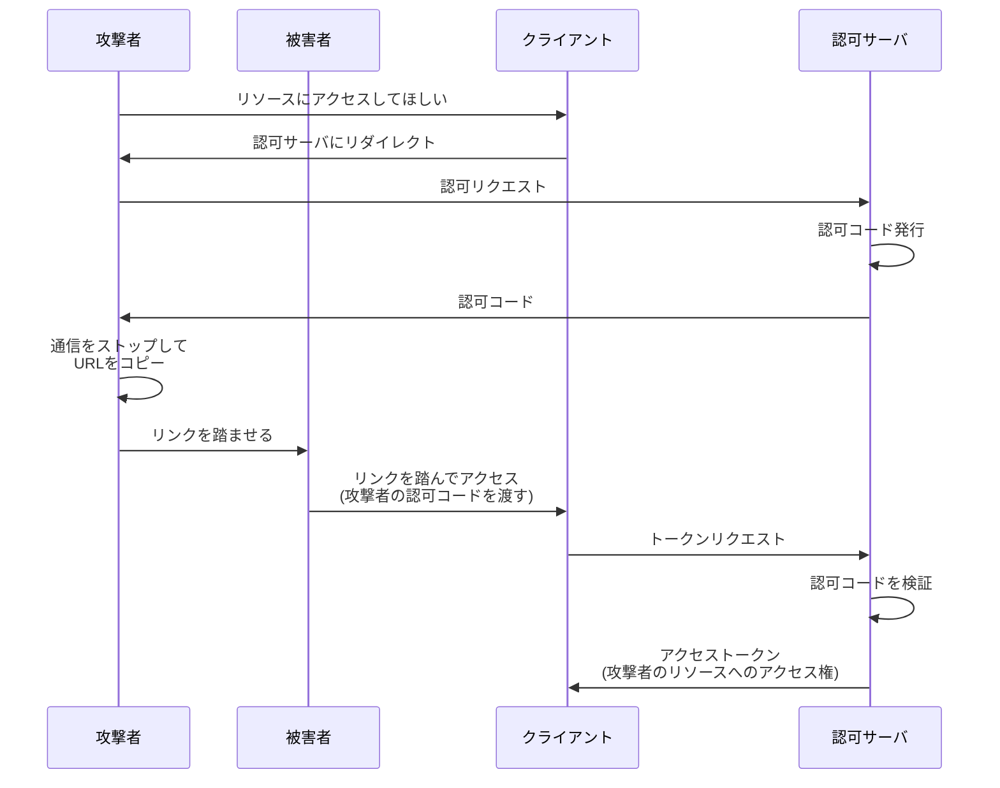
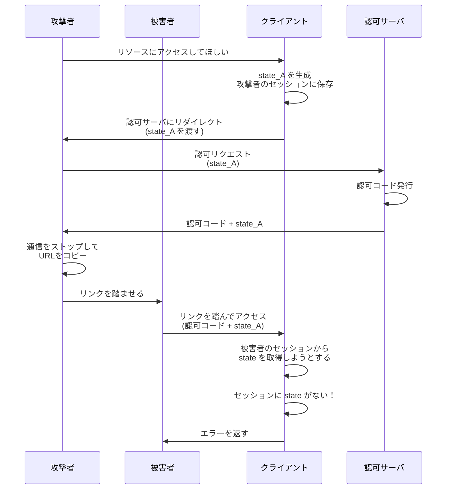

## 概要

この章では、認可コードを押し付ける攻撃手法（OAuth における CSRF 攻撃）とその防御方法について解説します。

## 認可コード押し付け攻撃（OAuth CSRF）

### 攻撃の概要

この攻撃は、一言でいうと **「リソース押し付け攻撃」** です。

攻撃者が被害者のリソースオーナーに対して、攻撃者が用意した認可コードを用いてフローを再開させることで、**被害者が攻撃者の持つリソースにアクセスできるアクセストークンを取得してしまう**攻撃です。

### 何が問題？

一見すると、「被害者が攻撃者のリソースにアクセスできる」ことは問題なさそうに思えます。しかし、以下のようなケースで被害が発生します。

- 被害者は攻撃者のリソースを**自分のリソースだと勘違いする**
- 被害者が機密情報を攻撃者のリソースにアップロードしてしまう

**具体例**：
攻撃者の Google Drive に、被害者が自分の免許証の写真をアップロードしてしまう。被害者は自分の Google Drive だと思っているが、実際は攻撃者の Google Drive。結果、攻撃者に機密情報が漏洩する。

### 攻撃の流れ

1. 攻撃者がクライアントに対してフローを開始
2. 認可サーバが攻撃者に認可コードを発行
3. 攻撃者は通信をストップし、認可コードを含むリダイレクト URL をコピー
4. 攻撃者は被害者にこのリンクを踏ませる
5. 被害者がリンクを踏み、クライアントに攻撃者の認可コードを渡す
6. クライアントはこの認可コードでアクセストークンを取得
7. 被害者は攻撃者のリソースにアクセスできるアクセストークンを取得してしまう

## 対策：state パラメータ

### state パラメータとは

**state パラメータ**は、クライアントが任意に設定できるランダム文字列です。

**リソースオーナーに認可コードを取得させるよう指示したクライアントのセッションと、認可コードを受け取ったクライアントのセッションに一貫性があることを、クライアント自身が検証する**ための仕組みです。

### state パラメータの仕組み

1. **フロー開始時**

   - クライアントがランダム文字列（state）を生成し、セッションに保存
   - 認可リクエスト時に state を認可サーバに渡す

2. **認可レスポンス時**

   - 認可サーバは認可コードとともに state をそのまま返す

3. **認可コード受け取り時**
   - クライアントはセッションから state を取り出す
   - 認可サーバから返された state と比較検証
   - 一致すればフローを継続、不一致ならフローを中断

:::message
**セッションについて**

ここでのセッションとは、一般的な Web アプリケーションにおけるセッションを指します。Confidential Client を前提としているため、サーバサイドのセッション領域を想定しています。
:::

### state パラメータによって攻撃を防げる理由

- 被害者のフローは、クライアントが state を生成せずに開始される（攻撃者がリンクを踏ませる形で開始）
- よって、被害者のセッションには state が存在しない
- 認可サーバから返された state とセッションの state が一致しない
- フローが中断され、攻撃を防止できる

### state パラメータを導入したフロー

被害者のセッションには state が存在しないため、検証が失敗し、攻撃を防止できます。

## state パラメータは一般的な CSRF トークンと同じ

### CSRF トークンとは

一般的な Web アプリケーションにおける CSRF 攻撃の対策として、**CSRF トークン**が使われます。

1. サーバがランダムなトークンを生成し、セッションに保存
2. フォームの hidden フィールドにトークンを埋め込む
3. フォーム送信時にトークンを検証
4. 一致しなければリクエストを拒否

### state パラメータと CSRF トークンの類似点

| 項目           | CSRF トークン                                              | state パラメータ                                                 |
| -------------- | ---------------------------------------------------------- | ---------------------------------------------------------------- |
| 生成タイミング | フォーム表示時                                             | フロー開始時                                                     |
| 保存先         | セッション                                                 | セッション                                                       |
| 検証タイミング | フォーム送信時                                             | 認可コード取得時                                                 |
| 検証内容       | フォームにアクセスしたユーザとフォーム送信したユーザの一致 | フローを開始しようとしたユーザと認可コードを返却したユーザの一致 |

どちらも**セッションの一貫性を検証する仕組み**です。state パラメータは、**OAuth フローにおける CSRF トークン**であると言えます。

RFC 6749 でも、state について「ブラウザセッションに紐づく値」であることが強調されています。

## まとめ

- **認可コード押し付け攻撃（OAuth CSRF）**は、攻撃者の認可コードを被害者に使わせる攻撃
- **state パラメータ**はフローにおけるセッションの一貫性を検証する仕組み
- **state パラメータの検証はクライアントが行う**（PKCE は認可サーバが検証）

### PKCE と state の違い

| 項目                   | PKCE                                                                     | state                                                |
| ---------------------- | ------------------------------------------------------------------------ | ---------------------------------------------------- |
| 用途                   | 認可コードすり替え攻撃を防ぐ                                             | CSRF 攻撃を防ぐ                                      |
| 生成・検証する登場人物 | クライアントが生成・認可サーバが検証                                     | クライアントが生成・クライアントが検証               |
| 一致検証する対象       | 認可コードリクエストしたクライアント＝トークンリクエストしたクライアント | フローを開始したユーザ＝認可コードを返却されたユーザ |

それぞれの責務を混同しないように注意しましょう。
