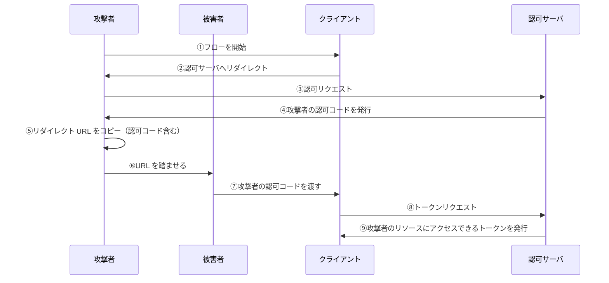
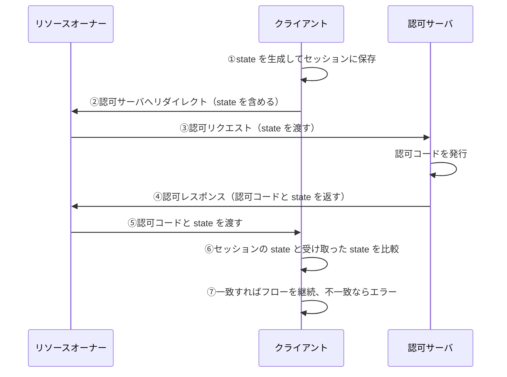
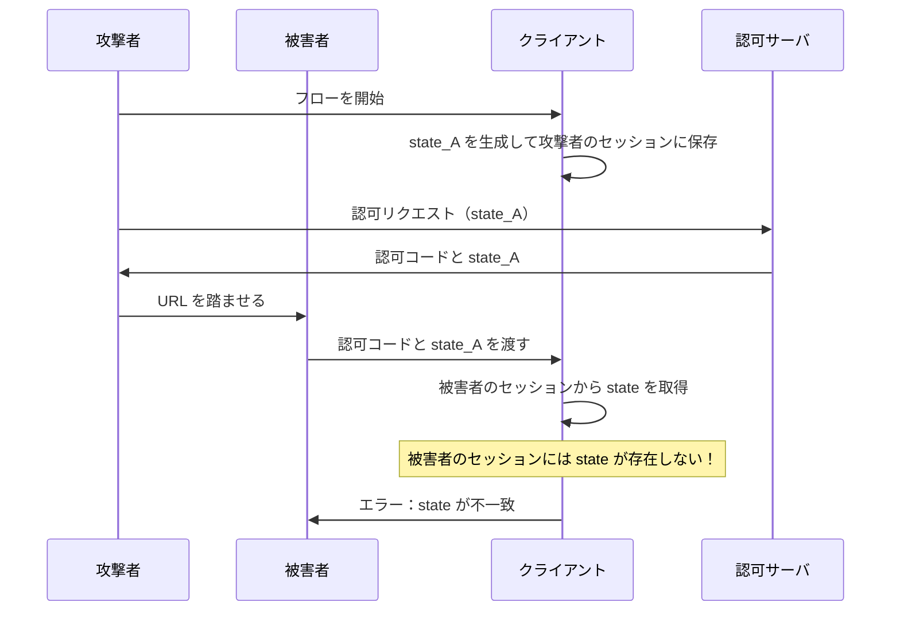

# 認可コードを押し付ける攻撃（CSRF）と防御

この章では、認可コードを押し付ける攻撃（CSRF）とその防御方法である **state パラメータ**について解説します。

## 認可コード押し付け攻撃（CSRF）

### 攻撃の概要

OAuth における CSRF 攻撃は、一言で言うと「**リソース押し付け攻撃**」です。

攻撃者が被害者に対して、**攻撃者の認可コード**を用いてフローを再開させることで、被害者が攻撃者のリソースにアクセスできるアクセストークンを取得してしまう攻撃です。

### 何が問題なのか

一見すると、「被害者が攻撃者のリソースにアクセスできる」だけで、大した問題ではないように思えるかもしれません。

しかし、被害者はこの状況に気づかないことが問題です：

- 被害者は自分のリソースだと思い込んでいる
- 被害者が機密情報を「自分のストレージ」にアップロードしてしまう
- 実際には攻撃者のストレージにアップロードされている

**具体例**：

- 被害者が「自分の Google Drive」だと思って、免許証の写真をアップロード
- 実際には攻撃者の Google Drive にアップロードされる
- 攻撃者が被害者の機密情報を入手

### 攻撃の流れ

**ステップの詳細**：

1. 攻撃者がクライアントに対してフローを開始
2. クライアントが認可サーバへのリダイレクト URL を返却
3. 攻撃者が認可サーバにアクセスして認可
4. 認可サーバが攻撃者の認可コードを発行
5. 攻撃者がリダイレクト URL（認可コード含む）をコピー
6. 攻撃者が被害者にこの URL を踏ませる
7. 被害者のブラウザがクライアントにアクセスし、攻撃者の認可コードを渡す
8. クライアントが認可コードを使ってアクセストークンを取得
9. 被害者は攻撃者のリソースにアクセスできるようになってしまう

## 対策：state パラメータ

### state パラメータとは

**state パラメータ**は、OAuth フローにおける**クライアントセッションの一貫性を検証する仕組み**です。

> **フローを開始したクライアントのセッション** と **認可コードを受け取ったクライアントのセッション** に一貫性があることを、**クライアント自身が検証する仕組み**

state パラメータは、クライアントが任意に設定できるランダム文字列です。

### state パラメータの動作フロー

**ステップの詳細**：

1. **state 生成**：クライアントがランダム文字列を生成し、セッションに保存
2. **認可リクエスト時**：`state` を認可サーバに渡す
3. **認可サーバ**：`state` をそのまま認可レスポンスに含める
4. **認可コード受け取り時**：セッションの `state` と受け取った `state` を比較
5. **一致すれば**フローを継続、**不一致ならば**エラーを返す

### なぜ state で攻撃を防げるのか

CSRF 攻撃では、被害者のフローは「攻撃者が用意した認可コード」から突然始まります。

**ポイント**：

1. 被害者は自分でフローを開始していない → 被害者のセッションには `state` が保存されていない
2. クライアントがセッションから `state` を取り出そうとしても存在しない
3. 受け取った `state` との比較ができず、不一致と判断される
4. フローが中断され、攻撃が失敗する

## state パラメータと一般的な CSRF トークンの比較

state パラメータは、実は**一般的な CSRF トークンと同じ役割**を持っています。

### 一般的な Web アプリケーションの CSRF 対策

1. サーバがランダムなトークンを生成し、セッションに保存
2. フォームの hidden フィールドにトークンを埋め込む
3. フォーム送信時にトークンを検証
4. 一致しなければリクエストを拒否

### OAuth における state パラメータ

1. クライアントがランダム文字列を生成し、セッションに保存
2. 認可リクエスト時に `state` を渡す
3. 認可コード受け取り時に `state` を検証
4. 一致しなければフローを中断

### 比較表

| 項目           | CSRF トークン                                 | state パラメータ                                    |
| -------------- | --------------------------------------------- | --------------------------------------------------- |
| 生成タイミング | フォーム表示時                                | フロー開始時                                        |
| 保存先         | セッション                                    | セッション                                          |
| 検証タイミング | フォーム送信時                                | 認可コード取得時                                    |
| 検証内容       | フォームにアクセスしたユーザ = 送信したユーザ | フローを開始したユーザ = 認可コードを返却したユーザ |

state パラメータは、**OAuth フローにおける CSRF トークン**であると言えます。

そのため、仕様でも state は「ブラウザセッションに紐づく値」であるべきと強調されています。

## PKCE と state の違い

PKCE と state は似ているように見えますが、役割が異なります。

| 項目               | PKCE                                                                                      | state                                                       |
| ------------------ | ----------------------------------------------------------------------------------------- | ----------------------------------------------------------- |
| **用途**           | 認可コードインジェクション攻撃を防ぐ                                                      | CSRF 攻撃を防ぐ                                             |
| **生成する主体**   | クライアント                                                                              | クライアント                                                |
| **検証する主体**   | 認可サーバ                                                                                | クライアント                                                |
| **検証する一貫性** | 認可コードリクエストした**クライアント** = アクセストークンリクエストした**クライアント** | フローを開始した**ユーザ** = 認可コードを返却した**ユーザ** |

両者の責務を混同しないように注意しましょう。

## まとめ

- **OAuth における CSRF 攻撃**は、攻撃者のリソースを被害者に押し付ける「リソース押し付け攻撃」
- **state パラメータ**は、フローにおけるセッションの一貫性を検証する仕組み
- state パラメータを導入することで、CSRF 攻撃を防止できる
- **state パラメータの検証はクライアントが行う**（PKCE は認可サーバが検証）

次の章では、ここまでの防御機構を含めた完全版のフローを解説します。
