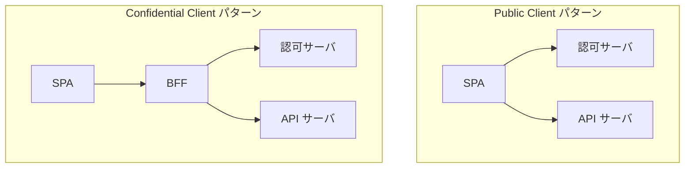

## 概要

この章では、OAuth クライアントの種類の違いについて解説します。
この章から、今まで解説を後回しとしていた **Public Client** についても解説していきます。

## Confidential Client と Public Client の違い

RFC 6749 では、クライアントを以下の 2 種類に分類しています。

| クライアントタイプ      | 説明                                                       |
| ----------------------- | ---------------------------------------------------------- |
| **Confidential Client** | クレデンシャルの機密性を維持することができるクライアント   |
| **Public Client**       | クレデンシャルの機密性を維持することができないクライアント |

### 本来の定義

- **Confidential Client**

  - クライアントシークレットを安全に保管できるクライアント
  - クライアント認証が可能

- **Public Client**
  - クライアントシークレットを安全に保管できないクライアント
  - クライアント認証が不可能

### 技術的な判断基準

技術的には、**アクセストークン引き換えリクエスト時にどこで動作しているか**で判断できます。

- **Confidential Client**: サーバサイドで動作

  - クライアントシークレットをサーバに安全に保管できる
  - ユーザがシークレットにアクセスできない

- **Public Client**: ユーザーデバイス上で動作
  - ソースコードの解析でシークレットを取り出せる可能性がある
  - ユーザがシークレットにアクセスできてしまう

## どのようなアプリケーションが該当するか

では、どのようなアプリケーションが Confidential Client、Public Client に該当するのでしょうか。
普段みかけるアプリケーションを分類してみましょう。

### MPA (Multi-Page Application) の場合

ここで言う MPA とは、サーバサイドで HTML をレンダリングして配信する従来型のウェブアプリケーションを指します。

- MPA (例: Ruby on Rails、Django、Laravel など)
- サーバサイドで HTML をレンダリングし、ブラウザに配信する特徴を持つ

この場合、アクセストークンリクエストはサーバサイドで行われるため、**Confidential Client** に該当します。

### サーバ API のない SPA(Single-Page Application) / ネイティブアプリの場合

SPA やモバイルアプリのように、アクセストークンリクエストがユーザーデバイス上で行われる場合、**Public Client** に該当します。

- SPA (React、Vue、Angular など)
- ネイティブアプリ (iOS、Android、デスクトップアプリなど)
- サーバ API を持たず、アプリケーションが直接 リソースにアクセスする

### サーバ API のある SPA / ネイティブアプリの場合

SPA + バックエンド API サーバ のような構成の場合、少し複雑になります。

**判断基準は、アクセストークンリクエストをどこで行うか**です。

| パターン                                      | クライアントタイプ  |
| --------------------------------------------- | ------------------- |
| SPA 側でトークンリクエスト                    | Public Client       |
| バックエンド API サーバ側でトークンリクエスト | Confidential Client |



### 推奨：可能な限り Confidential Client

Confidential Client の場合、アクセストークンはサーバ間通信（バックチャネル）でやり取りされ、ユーザーデバイス上（フロントチャネル）に露出しません。

SPA やモバイルアプリの開発を行う場合でも、サーバ API が利用可能なのであれば、
可能な限りアクセストークンリクエストをサーバサイドで行い、
アクセストークンをユーザデバイス上に露出しないように気をつけ、Confidential Client として実装することを推奨します。

## Public Client の特徴

### クライアント認証ができない

Public Client では、クライアントシークレットを安全に保管できません。
例えば、Public Client の場合、以下のようにすることでアプリ内部のシークレットを抽出することができます。

- アクセストークンリクエストの通信を傍受し、`client_secret` を取得
- アプリケーションのバイナリやソースコードを解析し、`client_secret` を取得

手元にクライアントがあるため、リバースエンジニアリングが容易であることが問題です。

手元にクライアントがある仕組み上、シークレットを安全に保管することができないため、
そもそもクライアント認証を行っても信頼性が担保されません。

そのため、Public Client は最初からクライアント認証を諦め、行わないことが前提となっています。
トークンリクエスト時に `client_id` のみを送信し、`client_secret` は送信しません。

```http
POST /oauth2/token HTTP/1.1
Host: authorization-server.example.com
Content-Type: application/x-www-form-urlencoded

grant_type=authorization_code
&code=SplxlOBeZQQYbYS6WxSbIA
&redirect_uri=https://client.example.com/callback
&client_id=s6BhdRkqt3
&code_verifier=dBjftJeZ4CVP-mB92K27uhbUJU1p1r_wW1gFWFOEjXk
```

### PKCE が必須

Public Client ではクライアント認証ができないため、PKCE による保護がより重要になります。

近年の仕様である OAuth 2.1 では、Public Client に対して PKCE が必須とされています。

## まとめ

- OAuth クライアントには **Confidential Client** と **Public Client** の 2 種類がある
- 判断基準は、クライアントシークレットを安全に保管できるかどうか
- 技術的には、トークンリクエスト時にサーバサイドで動作するかどうかで判断できる
- 可能な限り Confidential Client として実装することを推奨
- Public Client ではクライアント認証ができないため、PKCE が必須

次の章からは、Public Client 特有の攻撃と防御について解説します。
