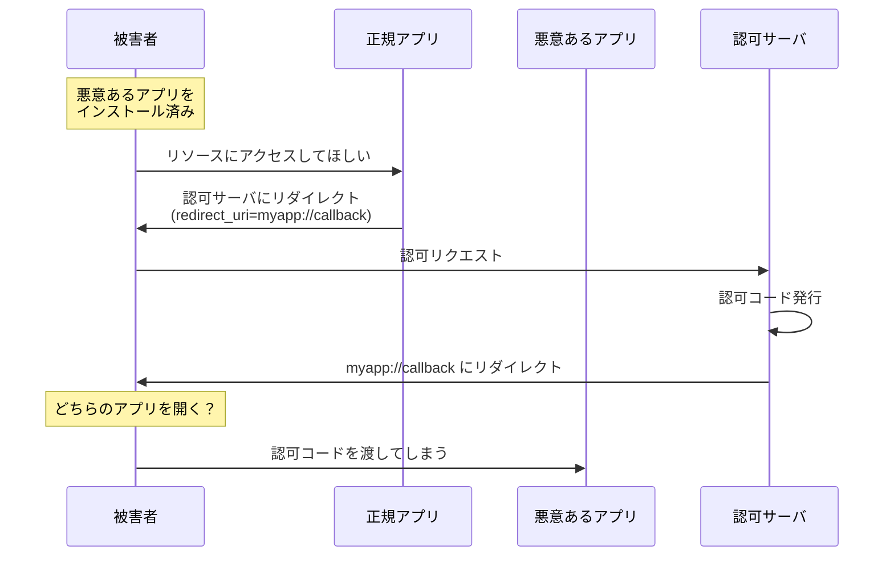

## 概要

この章では、Public Client における認可コード奪取攻撃とその防御方法について解説します。

## カスタム URI スキームの悪用

### 攻撃の概要

この攻撃は、
**悪意あるアプリケーションがリダイレクト URI を横取りする**ことで
攻撃者アプリケーションが認可コードを奪取する手法です。

Public Client がネイティブアプリ（iOS、Android）の場合、リダイレクト後に開かれるアプリが複数存在する可能性があります。

ネイティブアプリでは、**カスタム URI スキーム**（例：`myapp://callback`）を使ってリダイレクトを受け取ることがあります。

しかし、同じカスタム URI スキームに対応する悪意あるアプリがインストールされている場合、認可コードが悪意あるアプリに渡ってしまう可能性があります。

### 攻撃の流れ

1. 攻撃者が悪意あるアプリを作成し、被害者にインストールさせる
2. 悪意あるアプリは、正規アプリと同じカスタム URI スキームに対応している
3. 被害者が正規アプリで OAuth フローを開始
4. 認可サーバが認可コードを発行し、カスタム URI スキームにリダイレクト
5. 被害者の端末で、悪意あるアプリが起動してしまう
6. 認可コードが攻撃者に渡る

:::message
**そもそもの問題**

被害者の端末に悪意あるアプリがインストールされている時点で、かなり深刻な状況です。
この攻撃は、悪意あるアプリがインストールされた想定で、横展開による被害拡大の一つとして捉えることができます。
:::

### 対策

#### 1. カスタム URI スキームの使用を避ける

ネイティブアプリの場合、カスタム URI スキームではなく、
**App-Claimed HTTPS URI** を使用することを推奨します。

- **iOS**: Universal Links
- **Android**: App Links

これらは、HTTPS の URL に対して、
OS レベルでドメイン所有者がホワイトリストしたアプリだけがその URL を受け取れるように検証する仕組みです。

#### 2. 認可コードが奪取されても、アクセストークンに交換できないようにする

認可コードの奪取を完全に防ぐことは、往々にして難しい場合もあります。
その場合は後手に回る防御ではありますが、
**PKCE** を用いて認可コードが奪取されてもアクセストークンに交換できないようにします。

これについては次の章で解説します。

#### 3. ユーザ教育

不審なアプリのインストールを避けるよう、ユーザに注意喚起することも重要です。

## まとめ

- Public Client（ネイティブアプリ）では
  カスタム URI スキームの悪用による認可コード奪取のリスクがある
- **App-Claimed HTTPS URI**（Universal Links、App Links）の使用を推奨
- 認可コードが奪取されても、PKCE によって後手で防御することが可能

## 参考

カスタム URI スキームと App-Claimed HTTPS URI の詳細については、各プラットフォームのドキュメントを参照してください。

- [iOS Universal Links](https://developer.apple.com/ios/universal-links/)
- [Android App Links](https://developer.android.com/training/app-links)
