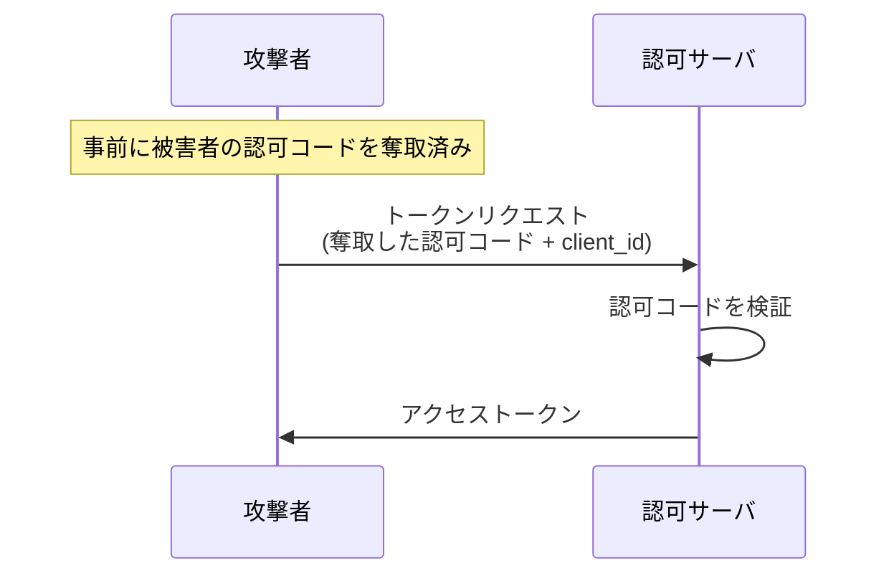
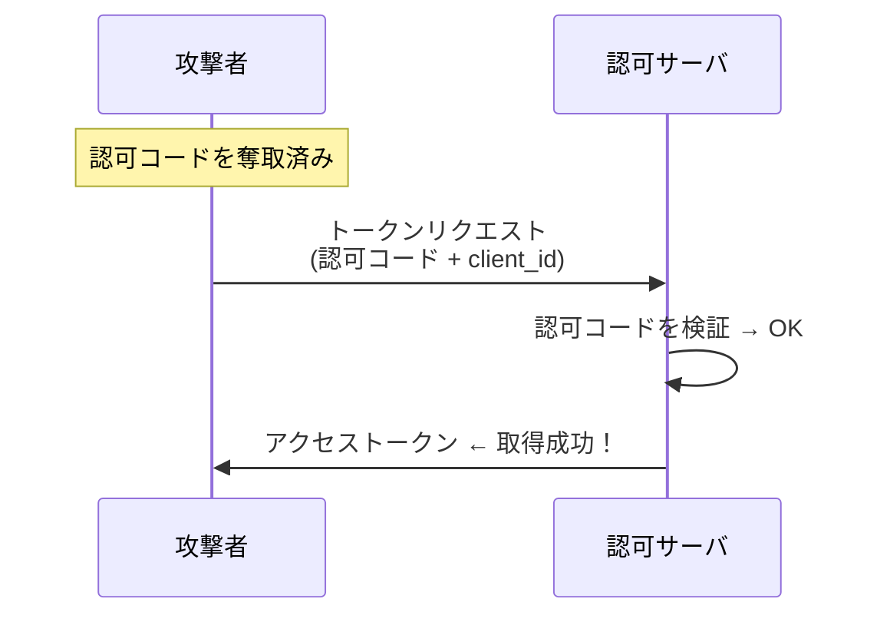
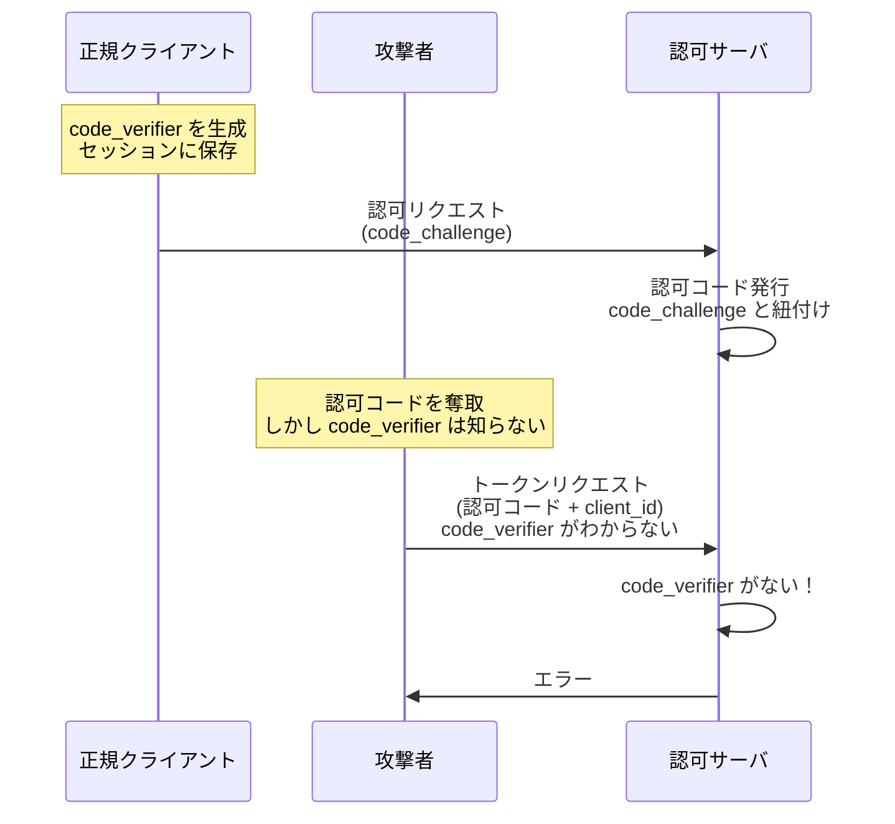

## 概要

この章では、Public Client において認可コードを用いてアクセストークンを不正に取得する攻撃とその防御について解説します。

## 偽装クライアントによるアクセストークン取得攻撃

### 攻撃の概要

攻撃者が何らかの方法で認可コードを奪取した後、Public Client では**クライアント認証がない**ため、攻撃者は簡単にアクセストークンを取得できてしまいます。

Confidential Client の場合、認可コードを奪取しても、`client_secret` を知らなければアクセストークンを取得できません。しかし、Public Client ではこの防御がありません。

### 攻撃の流れ

1. 攻撃者が何らかの方法で被害者の認可コードを奪取
2. 攻撃者が認可コードと `client_id` を使ってトークンリクエスト
3. Public Client ではクライアント認証がないため、認可サーバは認可コードの検証のみ実施
4. 検証が成功し、攻撃者がアクセストークンを取得

### なぜこれが可能か

Public Client では：

- `client_id` は公開情報（誰でも知っている）
- `client_secret` は存在しない（クライアント認証がない）
- 認可コードさえあれば、誰でもトークンリクエストが可能

## 対策：PKCE の重要性

Confidential Client でも PKCE は有効ですが、**Public Client では PKCE がより重要**です。

### PKCE がない場合

### PKCE がある場合

### なぜ PKCE で防げるのか

PKCE は**クライアントの一貫性を保証する仕組み**です。

- `code_verifier` を知っているのは、フローを開始した正規クライアントのみ
- 攻撃者は認可コードを奪取できても、`code_verifier` は知らない
- `code_verifier` なしではトークンリクエストが成功しない

これにより、クライアント認証の代わりとして機能します。

## Public Client における PKCE の必須化

OAuth 2.1 では、Public Client に対して PKCE が必須とされています。

> パブリッククライアントは、PKCE（RFC 7636）を使用して認可コードをアクセストークンに交換する必要があります
>
> — [OAuth 2.1 Draft](https://datatracker.ietf.org/doc/html/draft-ietf-oauth-v2-1)

## まとめ

- Public Client ではクライアント認証ができないため、認可コードが奪取されるとアクセストークンも取得されてしまう
- **PKCE** がこの問題を解決する
- PKCE はクライアントの一貫性を保証し、クライアント認証の代わりとして機能する
- OAuth 2.1 では Public Client に対して PKCE が必須

### Confidential Client と Public Client の防御の違い

| 項目                   | Confidential Client    | Public Client |
| ---------------------- | ---------------------- | ------------- |
| クライアント認証       | ○（client_secret）     | ×             |
| PKCE                   | 推奨                   | **必須**      |
| 認可コード奪取時の防御 | クライアント認証で防御 | PKCE で防御   |
