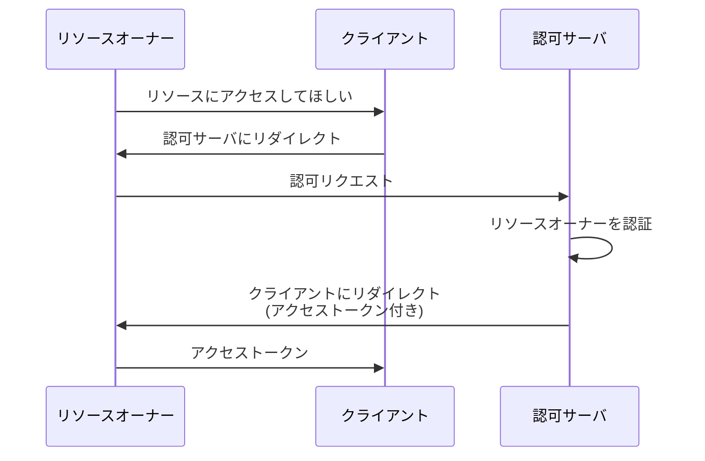

## 概要

この章では、認可コードフロー以外のフローの一つ、**インプリシットフロー（Implicit Flow）** について解説します。
そして、なぜ非推奨とされているのかを説明します。

## インプリシットフローとは

インプリシットフローは、
認可コードを介さずに**認可レスポンスで直接アクセストークンを受け取る**フローです。
現在ではセキュリティ問題が指摘されており、新規実装では使用が推奨されていません。
ここでは、危険性がわかりやすいよう、クライアントがサーバサイドで動作する Confidential Client で説明します。



認可コードフローと比べて 1 ステップ少なく、フローが簡略化されていることを確認できます。

### 認可コードフローとの比較

では、認可コードフローとインプリシットフローを比較してみましょう。

| フロー               | ステップ数                                                                | アクセストークンの受け渡し           |
| -------------------- | ------------------------------------------------------------------------- | ------------------------------------ |
| 認可コードフロー     | 認可リクエスト → 認可レスポンス → トークンリクエスト → トークンレスポンス | バックチャネル（サーバ間通信）       |
| インプリシットフロー | 認可リクエスト → 認可レスポンス（トークン付き）                           | **フロントチャネル（ブラウザ経由）** |

認可コードフローは、サーバ間通信でアクセストークンを受け渡します。
ブラウザにアクセストークンが露出しない、バックチャネルでの受け渡しです。

一方インプリシットフローは、認可レスポンスで直接アクセストークンを受け取り、ブラウザを経由してクライアントに渡します。
**アクセストークンがブラウザに露出** する、フロントチャネルでの受け渡しです。
この違いが、セキュリティ上の大きな問題となります。

### 認可リクエスト

```http
GET /oauth2/authorize
  ?response_type=token
  &client_id=s6BhdRkqt3
  &redirect_uri=https://client.example.com/callback
  &scope=read%20write
  &state=xyz123
```

`response_type=token` がインプリシットフローを示します。

### 認可レスポンス

```http
HTTP/1.1 302 Found
Location: https://client.example.com/callback
  #access_token=2YotnFZFEjr1zCsicMWpAA
  &token_type=Bearer
  &expires_in=3600
  &state=xyz123
```

アクセストークンが **URL フラグメント（`#` 以降）** に含まれます。

## インプリシットフローの問題点

### 1. アクセストークンがフロントチャネルに露出する

認可コードフローでは、アクセストークンはバックチャネル（サーバ間通信）で受け渡されるため、ブラウザ上に露出しません。

一方、インプリシットフローでは、アクセストークンが URL フラグメントとして**ブラウザに直接渡される**という大きな問題があります。

アクセストークンの漏洩の危険性は、これまで十分に説明してきました。
アクセストークンがブラウザに露出することで、以下のような攻撃が可能になります。

- ブラウザ履歴への記録
- リファラーヘッダでの漏洩
- ブラウザ拡張機能による盗聴
- XSS 攻撃による奪取

攻撃の可能性を増やすことは、セキュリティ上非常に好ましくありません。

### 2. 攻撃のハードルが低い

認可コードフローではアクセストークンを直接取得しないため、
攻撃者がアクセストークンを奪取するには以下の 2 ステップが必要となります。

1. 認可コードを奪取する
2. 奪取した認可コードを用いてアクセストークンを取得する

しかしインプリシットフローでは、いきなり**1 ステップでアクセストークンを奪取可能**です。

1. アクセストークンを奪取する

攻撃者のアクションの回数が減ることで、攻撃のハードルが低くなってしまいます。

### 3. セキュリティ強化機構を埋め込めない

ここまで、Confidential Client を前提に解説してきました。
Public Client であっても、インプリシットフローの問題点は同様です。

インプリシットフローはトークンリクエストのステップがないため、
近年考案されているセキュリティ機構が軒並み **利用できない** という大きな問題があります。

| 機構                     | 認可コードフロー | インプリシットフロー |
| ------------------------ | ---------------- | -------------------- |
| PKCE                     | ○                | ×                    |
| クライアント認証         | ○                | ×                    |
| リフレッシュトークン     | ○                | ×                    |
| Sender-Constrained Token | ○                | ×                    |

フローが簡略化されている分、**セキュリティ強化の余地がない**のです。
またインプリシットフローでは、リフレッシュトークンの発行が**禁止**されています。
リフレッシュトークンの利用はセキュリティ上の利点が多く、
広く使われているという点を踏まえても、インプリシットフローの欠点と言えます。

## 歴史的経緯

では、インプリシットフローが産まれた背景には、どのような理由があったのでしょうか。

### なぜインプリシットフローが生まれたのか

実は、インプリシットフローは**歴史的経緯**から誕生しました。

ブラウザにまだ CORS（Cross-Origin Resource Sharing）が普及していなかった時代に、
昔のブラウザでは、同一オリジン制約により、
JavaScript からクロスオリジンのトークンエンドポイントに直接リクエストを送れませんでした。

そこでトークンリクエストを省略し、リダイレクトのみでアクセストークンを取得できるようにしたのが、インプリシットフローです。

### 現在は CORS で解決

しかし現在では CORS（Cross-Origin Resource Sharing）が普及し、
ブラウザ上の JavaScript からクロスオリジンのトークンエンドポイントにリクエストを送信できるようになりました。

そのため、**インプリシットフローを使う技術的な必然性がなくなった**のです。

## 近年の評価

インプリシットフローは、以下の仕様で明確に非推奨または削除とされています。

### OAuth 2.0 Security Best Current Practice (RFC 9700)

> The implicit grant (response type "token") MUST NOT be used.

インプリシットフローは使用してはならない、と明記されています。

### OAuth 2.1

OAuth 2.1 では、インプリシットフローは**仕様自体から削除**されています。

## まとめ

インプリシットフローについてまとめます。

- インプリシットフローは、認可コードを介さずにアクセストークンを直接取得するフロー
- フロントチャネルにアクセストークンが露出する問題がある
- PKCE、クライアント認証、リフレッシュトークンなどが利用できない
- 歴史的経緯で誕生したが、CORS の普及により不要になった
- **近年の仕様では非推奨・削除されている**

:::message alert
新規実装では、インプリシットフローを使用しないでください。
代わりに、クライアントの種類を問わず、PKCE 付きの認可コードフローを使用してください。
:::

## 余談：OAuth を認証に転用した場合

インプリシットフローの危険性は、OAuth を認証に転用した場合にさらに拡大します。

詳細は OIDC の章で説明しますが、インプリシットフローでアクセストークンを認証に使用すると、**アクセストークンの差し替え攻撃**が可能になります。

これは OIDC で「OAuth 認証」が禁止されている理由のひとつでもあります。
