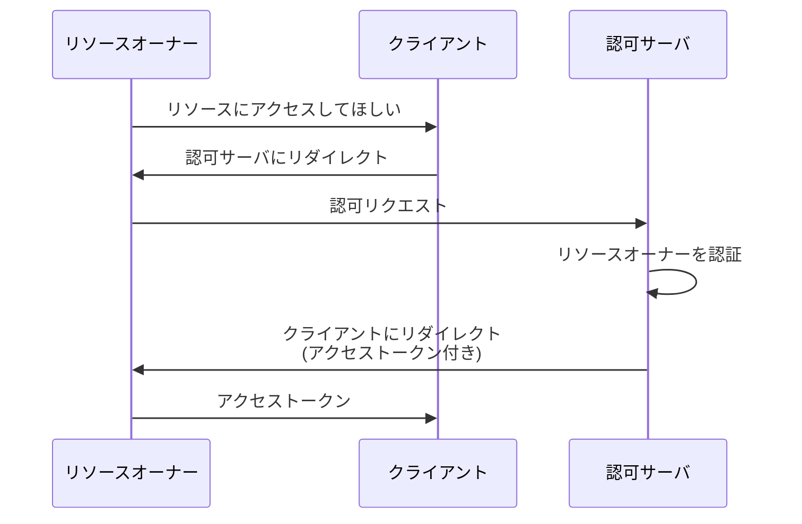

## 概要

この章では、**インプリシットフロー（Implicit Flow）** について解説し、なぜ非推奨とされているのかを説明します。

## インプリシットフローとは

インプリシットフローは、認可コードを介さずに、**認可レスポンスで直接アクセストークンを受け取る**フローです。



### 認可コードフローとの比較

| フロー               | ステップ数                                                                | アクセストークンの受け渡し           |
| -------------------- | ------------------------------------------------------------------------- | ------------------------------------ |
| 認可コードフロー     | 認可リクエスト → 認可レスポンス → トークンリクエスト → トークンレスポンス | バックチャネル（サーバ間通信）       |
| インプリシットフロー | 認可リクエスト → 認可レスポンス（トークン付き）                           | **フロントチャネル（ブラウザ経由）** |

### 認可リクエスト

```http
GET /oauth2/authorize
  ?response_type=token
  &client_id=s6BhdRkqt3
  &redirect_uri=https://client.example.com/callback
  &scope=read%20write
  &state=xyz123
```

`response_type=token` がインプリシットフローを示します。

### 認可レスポンス

```http
HTTP/1.1 302 Found
Location: https://client.example.com/callback
  #access_token=2YotnFZFEjr1zCsicMWpAA
  &token_type=Bearer
  &expires_in=3600
  &state=xyz123
```

アクセストークンが **URL フラグメント（`#` 以降）** に含まれます。

## インプリシットフローの問題点

### 1. アクセストークンがフロントチャネルに露出する

認可コードフローでは、アクセストークンはバックチャネル（サーバ間通信）で受け渡されるため、ブラウザ上に露出しません。

一方、インプリシットフローでは、アクセストークンが URL フラグメントとして**ブラウザに直接渡される**ため、以下のリスクがあります：

- ブラウザ履歴への記録
- リファラーヘッダでの漏洩
- ブラウザ拡張機能による盗聴
- XSS 攻撃による奪取

### 2. 攻撃のハードルが低い

認可コードフローに対する攻撃は、以下の 2 ステップが必要です：

1. 認可コードを奪取する
2. 奪取した認可コードを用いてアクセストークンを取得する

インプリシットフローでは、**1 ステップでアクセストークンを奪取可能**です：

1. アクセストークンを奪取する

### 3. セキュリティ強化機構を埋め込めない

インプリシットフローはトークンリクエストのステップがないため、以下の機構が利用できません：

| 機構                     | 認可コードフロー | インプリシットフロー |
| ------------------------ | ---------------- | -------------------- |
| PKCE                     | ○                | ×                    |
| クライアント認証         | ○                | ×                    |
| リフレッシュトークン     | ○                | ×                    |
| Sender-Constrained Token | ○                | ×                    |

フローが簡略化されている分、**セキュリティ強化の余地がない**のです。

### 4. リフレッシュトークンが使えない

インプリシットフローでは、リフレッシュトークンの発行が**禁止**されています。

これは、アクセストークンがフロントチャネルに露出する状況で、長期間有効なリフレッシュトークンを発行することがセキュリティ上許容できないためです。

## 歴史的経緯

### なぜインプリシットフローが生まれたのか

インプリシットフローは**歴史的経緯**から誕生しました。

- **CORS がなかった時代**: 昔のブラウザでは、同一オリジン制約により、JavaScript からクロスオリジンのトークンエンドポイントに直接リクエストを送れませんでした
- **解決策としてのインプリシットフロー**: トークンリクエストを省略し、リダイレクトのみでアクセストークンを取得できるようにしました

### 現在は CORS で解決

現在では、CORS（Cross-Origin Resource Sharing）が普及し、ブラウザ上の JavaScript からクロスオリジンのトークンエンドポイントにリクエストを送信できるようになりました。

そのため、**インプリシットフローを使う技術的な必然性がなくなった**のです。

## 近年の評価

インプリシットフローは、以下の仕様で明確に非推奨または削除とされています。

### OAuth 2.0 Security Best Current Practice (RFC 9700)

> The implicit grant (response type "token") MUST NOT be used.

インプリシットフローは使用してはならない、と明記されています。

### OAuth 2.1

OAuth 2.1 では、インプリシットフローは**仕様自体から削除**されています。

## まとめ

- インプリシットフローは、認可コードを介さずにアクセストークンを直接取得するフロー
- フロントチャネルにアクセストークンが露出する問題がある
- PKCE、クライアント認証、リフレッシュトークンなどが利用できない
- 歴史的経緯で誕生したが、CORS の普及により不要になった
- **近年の仕様では非推奨・削除されている**

:::message alert
新規実装では、インプリシットフローを使用しないでください。代わりに、PKCE 付きの認可コードフローを使用してください。
:::

## 余談：OAuth を認証に転用した場合

インプリシットフローの危険性は、OAuth を認証に転用した場合にさらに拡大します。

詳細は OIDC の章で説明しますが、インプリシットフローでアクセストークンを認証に使用すると、**アクセストークンの差し替え攻撃**が可能になります。

これは OIDC で「OAuth 認証」が禁止されている理由のひとつでもあります。
