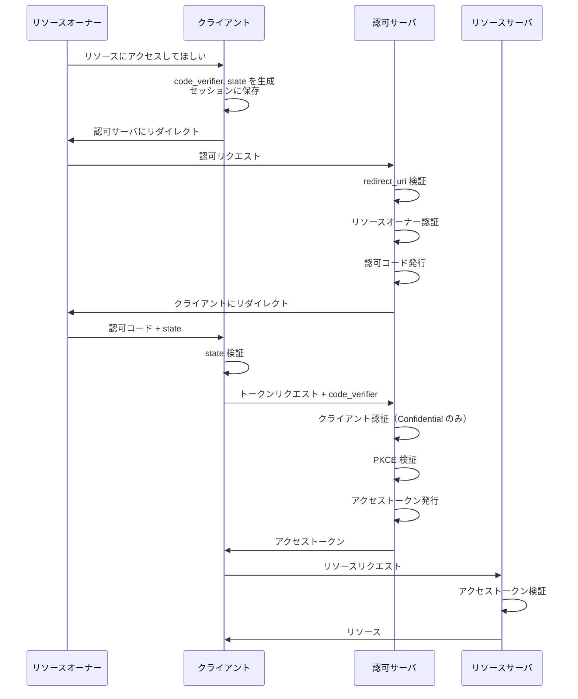

## OAuth まとめ

ここまでの章で、OAuth 2.0 の基本的な仕組みとセキュリティ対策について学びました。

### 学んだこと

#### 基本概念

- **OAuth とは**: リソースの所有者がリソースへのアクセス権を第三者に与える仕組み
- **アクセストークン**: リソースにアクセスするための鍵
- **認可コード**: アクセストークンと引き換えるための一時的なトークン
- **スコープ**: アクセス権の範囲を指定する仕組み

#### 登場人物

| ロール           | 役割                           |
| ---------------- | ------------------------------ |
| リソースオーナー | リソースの持ち主               |
| クライアント     | リソースにアクセスしたい第三者 |
| 認可サーバ       | アクセストークンを発行する     |
| リソースサーバ   | リソースを管理する             |

#### 認可コードフローと攻撃・防御

| 攻撃                                  | 防御機構                  | 検証主体     |
| ------------------------------------- | ------------------------- | ------------ |
| 認可コード奪取（redirect_uri 改ざん） | redirect_uri 完全一致検証 | 認可サーバ   |
| 認可コードすり替え                    | PKCE                      | 認可サーバ   |
| CSRF（認可コード押し付け）            | state パラメータ          | クライアント |

#### クライアントの種類

| 種類                | 特徴                                       | クライアント認証 |
| ------------------- | ------------------------------------------ | ---------------- |
| Confidential Client | クライアントシークレットを安全に保管可能   | ○                |
| Public Client       | クライアントシークレットを安全に保管不可能 | ×                |

### 完全版認可コードフロー

## OAuth 2.1 の紹介

### OAuth 2.1 とは

OAuth 2.1 は、IETF OAuth WG が策定中の仕様で、以下の特徴があります：

- OAuth 2.0 本体（RFC 6749）とその拡張仕様群を**統合**
- 最新の**ベストプラクティス**を反映
- **危険な選択肢を削除**し、安全なやり方を必須化

### 主な変更点

| 項目                                       | OAuth 2.0          | OAuth 2.1                                       |
| ------------------------------------------ | ------------------ | ----------------------------------------------- |
| インプリシットフロー                       | 使用可能（非推奨） | **削除**                                        |
| Resource Owner Password Credentials フロー | 使用可能           | **削除**                                        |
| PKCE                                       | 任意               | **必須**                                        |
| redirect_uri 完全一致検証                  | 推奨               | **必須**                                        |
| トークンリクエスト時の redirect_uri        | 必須               | **削除**（PKCE で代替）                         |
| Public Client のリフレッシュトークン       | 制約なし           | **Sender-Constrained またはローテーション必須** |

### PKCE の必須化

OAuth 2.0 では PKCE は拡張仕様（RFC 7636）でしたが、OAuth 2.1 では**必須**となりました。

- Confidential Client でも PKCE が必須
- これにより、すべてのクライアントで認可コードすり替え攻撃を防止

### インプリシットフローの削除

OAuth 2.1 では、インプリシットフローが仕様から**完全に削除**されました。

- セキュリティ上の問題が多すぎる
- CORS の普及により技術的な必要性がなくなった

### その他のフローの削除

以下のフローも削除されました：

- **Resource Owner Password Credentials Grant**: ユーザーのパスワードをクライアントに渡す必要があり、セキュリティ上問題
- **その他**: 認可コードフローと Client Credentials フローのみが残存

### トークンリクエスト時の redirect_uri 削除

OAuth 2.0 では、トークンリクエスト時に redirect_uri を再送信し、認可リクエスト時の値と一致するか検証することで、認可コードすり替え攻撃を防止していました。

OAuth 2.1 では PKCE が必須化されたため、この検証は**冗長**となり、削除されました。

## OAuth 2.1 への移行

### 新規実装の場合

新規実装では、OAuth 2.1 に準拠することを**強く推奨**します。

1. 認可コードフロー + PKCE を必須で実装
2. インプリシットフローは実装しない
3. redirect_uri 完全一致検証を実装
4. state パラメータを実装

### 既存実装の更新

既存の OAuth 2.0 実装を更新する場合：

1. PKCE のサポートを追加
2. インプリシットフローを非推奨化し、段階的に削除
3. redirect_uri 完全一致検証を強化
4. 危険な設定オプションを削除

## まとめ

- OAuth の基本的な仕組みとフローを理解した
- 認可コードフローの詳細な流れとセキュリティ対策を理解した
- OAuth 2.1 は OAuth 2.0 の最新のベストプラクティスを反映した仕様
- 新規実装や既存実装の更新時には OAuth 2.1 を参考にすることを推奨

:::message
次の章からは、OAuth の上に構築された **OIDC（OpenID Connect）** について解説します。
:::
